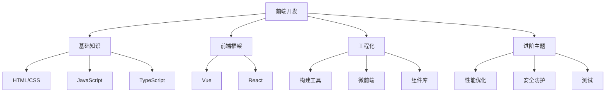

# 前端开发

欢迎来到前端开发模块！这里包含从基础到进阶的完整前端知识体系。

## 📚 学习内容

### 基础知识
- [HTML完全指南](./基础/HTML完全指南.mdx) - HTML5完整教程
- [CSS完全指南](./基础/CSS完全指南.mdx) - CSS3与现代布局
- [JavaScript核心](./基础/JavaScript核心.mdx) - ES6+现代特性
- [TypeScript完全指南](./基础/TypeScript完全指南.mdx) - 类型系统与最佳实践

### 前端框架
- [Vue完全指南](./框架/Vue完全指南.mdx) - Vue3完整教程
- [Vue3响应式原理](./框架/Vue3响应式原理.mdx) - 深入理解响应式系统
- [React性能优化](./框架/React性能优化.mdx) - React性能优化技巧

### 前端工程化
- [Webpack完整指南](./工程化/Webpack完整指南.mdx) - Webpack深度配置
- [Vite深度配置](./工程化/Vite深度配置.mdx) - 下一代构建工具
- [前端工程化完全指南](./工程化/前端工程化完全指南.mdx) - 工程化最佳实践
- [微前端架构实战](./工程化/微前端架构实战.mdx) - qiankun与Module Federation
- [组件库开发指南](./工程化/组件库开发指南.mdx) - Monorepo与Storybook

### 进阶主题
- [前端安全防护](./进阶/前端安全防护.mdx) - XSS、CSRF防护
- [前端测试指南](./进阶/前端测试指南.mdx) - 单元测试与E2E测试
- [前端安全](./进阶/前端安全.mdx) - 安全最佳实践

## 🎯 学习目标

完成本模块学习后，你将能够：

- ✅ 掌握HTML/CSS/JavaScript核心知识
- ✅ 熟练使用Vue/React等主流框架
- ✅ 理解前端工程化体系
- ✅ 掌握微前端架构设计
- ✅ 具备组件库开发能力
- ✅ 了解前端安全与性能优化

## 📖 推荐学习路径

### 初学者路径
```
基础/HTML完全指南 
  → 基础/CSS完全指南 
  → 基础/JavaScript核心
  → 框架/Vue完全指南 或 React教程
```

### 进阶路径
```
基础知识巩固
  → 框架/Vue3响应式原理
  → 框架/React性能优化
  → 工程化/前端工程化完全指南
```

### 高级路径
```
工程化/Webpack完整指南
  → 工程化/微前端架构实战
  → 工程化/组件库开发指南
  → 进阶/前端安全防护
```

## 💡 学习建议

1. **循序渐进**：从基础开始，不要跳过基础知识
2. **动手实践**：每个知识点都要写代码验证
3. **项目驱动**：通过实战项目巩固所学知识
4. **深入原理**：不仅要知道怎么用，还要知道为什么
5. **持续学习**：前端技术更新快，保持学习热情

## 🔗 相关资源

- [实战项目](../10-实战项目/) - 完整的前端项目实战
- [面试题库](../11-面试题库/前端面试题/) - 前端面试题精选
- [JavaScript深入](../04-编程语言/JavaScript/) - JavaScript高级特性

## 📊 技能树



开始你的前端学习之旅吧！🚀
