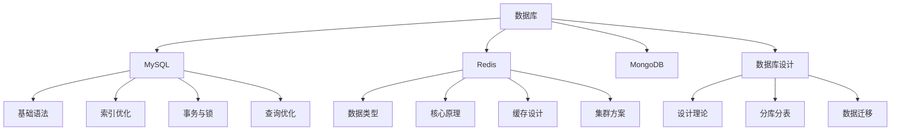

# 数据库

欢迎来到数据库模块！这里包含MySQL、Redis、MongoDB等主流数据库的完整教程。

## 📚 学习内容

### MySQL
- [MySQL基础](./MySQL/MySQL基础.mdx) - SQL语法与基础操作
- [MySQL索引深度解析](./MySQL/MySQL索引深度解析.mdx) - B+树、索引优化
- [MySQL事务与锁机制](./MySQL/MySQL事务与锁机制.mdx) - ACID、隔离级别、锁
- [MySQL查询优化实战](./MySQL/MySQL查询优化实战.mdx) - Explain、慢查询优化
- [MySQL优化](./MySQL/MySQL优化.mdx) - 性能调优完整指南

### Redis
- [Redis基础](./Redis/Redis基础.mdx) - 数据类型与基本操作
- [Redis核心原理](./Redis/Redis核心原理.mdx) - 数据结构底层实现
- [Redis实战](./Redis/Redis实战.mdx) - 缓存设计模式
- [Redis持久化与集群](./Redis/Redis持久化与集群.mdx) - RDB、AOF、主从、哨兵、集群

### MongoDB
- [MongoDB基础](./MongoDB/MongoDB基础.mdx) - 文档数据库入门
- [MongoDB实战指南](./MongoDB/MongoDB实战指南.mdx) - 实际应用场景

### 数据库设计
- [数据库设计理论](./数据库设计/数据库设计理论.mdx) - 范式、ER建模
- [分库分表实战](./数据库设计/分库分表实战.mdx) - ShardingSphere实战
- [数据库迁移方案](./数据库设计/数据库迁移方案.mdx) - 双写、灰度发布

## 🎯 学习目标

完成本模块学习后，你将能够：

- ✅ 掌握MySQL核心知识和优化技巧
- ✅ 理解Redis原理和应用场景
- ✅ 熟悉MongoDB文档数据库
- ✅ 掌握数据库设计理论
- ✅ 具备分库分表实战能力
- ✅ 了解数据库迁移方案

## 📖 推荐学习路径

### MySQL学习路径
```
MySQL基础
  → MySQL索引深度解析
  → MySQL事务与锁机制
  → MySQL查询优化实战
  → MySQL优化
```

### Redis学习路径
```
Redis基础
  → Redis核心原理
  → Redis实战
  → Redis持久化与集群
```

### 数据库设计路径
```
数据库设计理论
  → 分库分表实战
  → 数据库迁移方案
```

## 💡 学习建议

1. **理论与实践结合**：每个知识点都要动手实践
2. **理解原理**：不仅要会用，还要理解底层原理
3. **性能优化**：关注性能，学会使用Explain分析
4. **实战项目**：通过项目巩固数据库知识
5. **持续学习**：关注数据库新特性和最佳实践

## 🔗 相关资源

- [后端开发](../02-后端开发/) - 后端与数据库结合
- [系统设计](../06-系统设计/) - 数据库在系统设计中的应用
- [实战项目](../10-实战项目/) - 数据库实战应用

## 📊 数据库对比

| 特性 | MySQL | Redis | MongoDB |
|------|-------|-------|---------|
| 类型 | 关系型 | KV存储 | 文档型 |
| 持久化 | 是 | 可选 | 是 |
| 事务 | 完整支持 | 有限支持 | 支持 |
| 查询 | SQL | 命令 | 类SQL |
| 适用场景 | 结构化数据 | 缓存、会话 | 半结构化数据 |

## 🎓 技能树



开始你的数据库学习之旅吧！🚀
