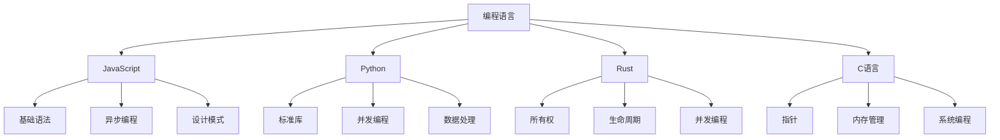

# 编程语言

欢迎来到编程语言模块！这里深入讲解JavaScript、Python、Rust、C等主流编程语言。

## 📚 学习内容

### JavaScript
**从基础到高级的完整体系**

- **基础知识**
  - 数据类型与类型转换
  - 运算符与表达式
  - 函数与作用域
  - 对象与数组

- **进阶内容**
  - 原型与继承
  - 异步编程（Promise、async/await）
  - DOM操作与事件
  - BOM操作

- **高级特性**
  - [JavaScript高级特性](./JavaScript/JavaScript高级特性.mdx) - 闭包、原型链、Event Loop
  - [JavaScript设计模式](./JavaScript/JavaScript设计模式.mdx) - 23种设计模式完整实现

---

### Python
**Python标准库与实战应用**

- [Python标准库实战应用](./Python/Python标准库实战应用.mdx)
  - 文件I/O实战（CSV、JSON、二进制）
  - 网络编程（HTTP服务器、WebSocket）
  - 并发编程（多线程、多进程、asyncio）
  - 常用标准库详解

---

### Rust
**系统编程语言**

- [Rust进阶](./Rust/Rust进阶.mdx)
  - 所有权系统深度讲解
  - 生命周期详解
  - 并发编程实战

- [Rust实战项目](./Rust/Rust实战项目.mdx)
  - CLI工具开发
  - Web服务器实现
  - 系统编程案例

---

### C语言
**底层编程基础**

- C语言基础语法
- 指针与内存管理
- 数据结构实现
- 系统编程

## 🎯 学习目标

完成本模块学习后，你将能够：

- ✅ 深入理解JavaScript核心机制
- ✅ 掌握Python标准库实战应用
- ✅ 理解Rust所有权系统
- ✅ 具备多语言开发能力
- ✅ 理解不同语言的设计哲学

## 📖 推荐学习路径

### JavaScript深入学习
```
JavaScript基础
  → JavaScript进阶
  → JavaScript高级特性
  → JavaScript设计模式
```

### Python实战应用
```
Python基础
  → Python标准库实战应用
  → Python高级特性
```

### Rust系统编程
```
Rust基础
  → Rust进阶
  → Rust实战项目
```

## 💡 学习建议

1. **对比学习**：对比不同语言的特性和设计理念
2. **深入原理**：理解语言底层实现机制
3. **实战应用**：通过项目巩固语言特性
4. **阅读源码**：阅读优秀开源项目源码
5. **持续练习**：保持编码习惯

## 📊 语言特性对比

| 特性 | JavaScript | Python | Rust | C |
|------|-----------|--------|------|---|
| 类型系统 | 动态 | 动态 | 静态 | 静态 |
| 内存管理 | GC | GC | 所有权 | 手动 |
| 并发模型 | 事件循环 | GIL | 无畏并发 | 线程 |
| 适用场景 | Web开发 | 数据科学/Web | 系统编程 | 底层开发 |
| 学习难度 | ⭐⭐ | ⭐⭐ | ⭐⭐⭐⭐ | ⭐⭐⭐⭐ |

## 🛠️ 语言生态

### JavaScript生态
- **运行时**：Node.js、Deno、Bun
- **框架**：React、Vue、Angular
- **工具**：Webpack、Vite、ESLint
- **包管理**：npm、yarn、pnpm

### Python生态
- **Web框架**：Django、Flask、FastAPI
- **数据科学**：NumPy、Pandas、Scikit-learn
- **深度学习**：PyTorch、TensorFlow
- **包管理**：pip、conda

### Rust生态
- **Web框架**：Actix、Rocket、Axum
- **异步运行时**：Tokio、async-std
- **工具**：Cargo、rustfmt、clippy
- **应用领域**：系统编程、WebAssembly

### C语言生态
- **编译器**：GCC、Clang
- **标准库**：glibc
- **应用领域**：操作系统、嵌入式

## 🎓 技能树



## 🔗 相关资源

### 实战应用
- [前端开发](../01-前端开发/) - JavaScript在前端的应用
- [后端开发](../02-后端开发/) - 后端语言应用
- [人工智能](../05-人工智能/) - Python在AI中的应用
- [实战项目](../10-实战项目/) - 语言实战项目

### 面试准备
- [面试题库](../11-面试题库/) - 语言相关面试题

## 📚 学习资源

### JavaScript
- **书籍**：《JavaScript高级程序设计》、《你不知道的JavaScript》
- **文档**：MDN、ECMAScript规范
- **社区**：Stack Overflow、GitHub

### Python
- **书籍**：《流畅的Python》、《Python Cookbook》
- **文档**：Python官方文档
- **社区**：PyPI、Python.org

### Rust
- **书籍**：《Rust程序设计语言》、《Rust编程之道》
- **文档**：Rust Book、Rust by Example
- **社区**：crates.io、Rust论坛

### C语言
- **书籍**：《C程序设计语言》、《C Primer Plus》
- **文档**：C标准文档
- **社区**：Stack Overflow

## 💪 进阶方向

### JavaScript进阶
- TypeScript类型系统
- V8引擎原理
- 前端框架源码

### Python进阶
- CPython源码
- 性能优化
- 异步编程

### Rust进阶
- 宏编程
- unsafe Rust
- 编译器原理

### C语言进阶
- 操作系统开发
- 嵌入式编程
- 性能优化

开始你的编程语言深度学习之旅吧！🚀
