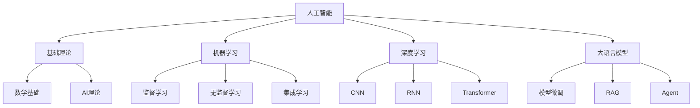

# 人工智能

欢迎来到人工智能模块！这里包含从基础理论到实战项目的完整AI/ML学习体系。

## 📚 学习内容

### 基础理论
- **数学基础**：线性代数、概率统计、微积分、信息论
- **AI基础理论**：机器学习基本概念
- **神经网络基础**：感知机、反向传播

### 机器学习
- **分类算法**：逻辑回归、决策树、SVM
- **回归算法**：线性回归、多项式回归
- **聚类算法**：K-means、层次聚类
- **降维算法**：PCA、t-SNE
- **集成学习**：随机森林、GBDT、XGBoost

### 深度学习
- **CNN（卷积神经网络）**
  - LeNet-5：手写数字识别
  - AlexNet：ImageNet冠军
  - ResNet：残差网络
  - YOLO：目标检测
  
- **RNN（循环神经网络）**
  - LSTM：长短期记忆网络
  - Transformer：注意力机制
  
- **优化技术**
  - Adam优化器
  - Batch Normalization

### 大语言模型
- **模型基础**：GPT、BERT、LLaMA
- **模型微调**：LoRA、QLoRA
- **检索增强**：RAG系统
- **Agent开发**：LangChain、AutoGPT
- **本地部署**：Ollama、llama.cpp

### 计算机视觉
- 图像分类、目标检测、图像分割
- Vision Transformer

### 自然语言处理
- 文本分类、情感分析、命名实体识别
- 多模态大模型

### AI实战项目
- [AI实战项目-图像分类](./AI实战项目/AI实战项目-图像分类.mdx) - PyTorch + ResNet完整实现
- [AI实战项目-NLP情感分析](./AI实战项目/AI实战项目-NLP情感分析.mdx) - BERT + Transformers实战

## 🎯 学习目标

完成本模块学习后，你将能够：

- ✅ 掌握AI/ML的数学基础
- ✅ 理解机器学习核心算法
- ✅ 熟练使用PyTorch/TensorFlow
- ✅ 掌握CNN、RNN、Transformer
- ✅ 了解大语言模型应用
- ✅ 具备AI项目实战能力

## 📖 推荐学习路径

### 初学者路径
```
基础理论/数学基础
  → 机器学习/分类算法
  → 机器学习/回归算法
  → 深度学习/CNN基础
  → AI实战项目/图像分类
```

### 深度学习路径
```
深度学习/CNN
  → 深度学习/RNN
  → 深度学习/Transformer
  → 计算机视觉
  → 自然语言处理
```

### 大模型应用路径
```
大语言模型/模型基础
  → 大语言模型/模型微调
  → 大语言模型/检索增强
  → 大语言模型/Agent开发
```

## 💡 学习建议

1. **数学基础很重要**：先打好数学基础
2. **动手实践**：每个算法都要自己实现
3. **理解原理**：不要只调用API，要理解背后原理
4. **项目驱动**：通过完整项目巩固知识
5. **关注前沿**：AI发展快，保持学习

## 🔗 相关资源

- [编程语言/Python](../04-编程语言/Python/) - Python是AI的主要语言
- [实战项目](../10-实战项目/) - 更多AI实战项目
- [面试题库](../11-面试题库/) - AI相关面试题

## 📊 AI技术栈



## 🛠️ 常用工具

- **深度学习框架**：PyTorch、TensorFlow、Keras
- **数据处理**：NumPy、Pandas、Scikit-learn
- **可视化**：Matplotlib、Seaborn、TensorBoard
- **大模型工具**：Transformers、LangChain、LlamaIndex
- **部署工具**：ONNX、TensorRT、FastAPI

## 📈 学习资源

- **在线课程**：吴恩达机器学习、CS231n、CS224n
- **书籍**：《深度学习》（花书）、《动手学深度学习》
- **论文**：arXiv、Papers with Code
- **社区**：Hugging Face、Kaggle

开始你的AI学习之旅吧！🚀
