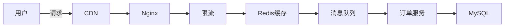
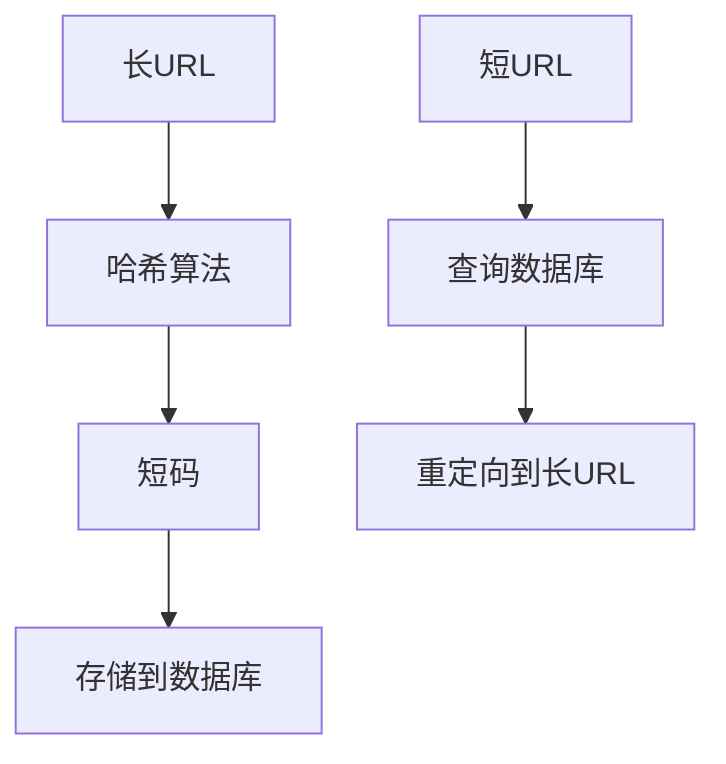
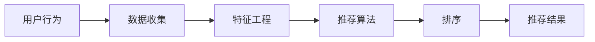

# 系统设计

欢迎来到系统设计模块！这里包含系统设计面试必备知识和经典系统设计案例。

## 📚 学习内容

### 系统设计基础
- **系统设计面试指南** - 面试流程与答题技巧
- **大规模系统设计案例** - 真实系统设计案例分析

### 经典系统设计
- **秒杀系统设计** - 高并发、限流、降级
- **短链接系统设计** - 哈希算法、分布式ID
- **实时通讯系统设计** - WebSocket、消息推送
- **推荐系统设计** - 协同过滤、内容推荐
- **搜索引擎架构** - 倒排索引、分词、排序

### 设计原则
- **数据库设计最佳实践** - 范式、索引、分库分表
- **API设计最佳实践** - RESTful、GraphQL
- **消息队列设计** - Kafka、RabbitMQ选型

## 🎯 学习目标

完成本模块学习后，你将能够：

- ✅ 掌握系统设计面试技巧
- ✅ 理解大规模系统设计原则
- ✅ 熟悉常见系统设计模式
- ✅ 具备架构设计能力
- ✅ 了解分布式系统设计

## 📖 推荐学习路径

### 初学者路径
```
系统设计面试指南
  → 短链接系统设计
  → 实时通讯系统设计
```

### 进阶路径
```
大规模系统设计案例
  → 秒杀系统设计
  → 推荐系统设计
  → 搜索引擎架构
```

### 高级路径
```
数据库设计最佳实践
  → API设计最佳实践
  → 消息队列设计
  → 分布式系统设计
```

## 💡 系统设计原则

### CAP理论
- **C**onsistency：一致性
- **A**vailability：可用性
- **P**artition tolerance：分区容错性

**权衡**：在分布式系统中，只能同时满足两个

### BASE理论
- **B**asically Available：基本可用
- **S**oft state：软状态
- **E**ventually consistent：最终一致性

### 设计模式
- **负载均衡**：轮询、随机、一致性哈希
- **缓存策略**：Cache Aside、Read/Write Through
- **限流算法**：令牌桶、漏桶
- **降级熔断**：Hystrix、Sentinel

## 📊 系统设计要素

### 1. 功能需求
- 核心功能
- 用户规模
- 数据规模
- QPS/TPS

### 2. 非功能需求
- **性能**：响应时间、吞吐量
- **可用性**：SLA、容灾
- **可扩展性**：水平扩展、垂直扩展
- **安全性**：认证、授权、加密

### 3. 技术选型
- **数据库**：MySQL、Redis、MongoDB
- **缓存**：Redis、Memcached
- **消息队列**：Kafka、RabbitMQ
- **搜索**：Elasticsearch
- **存储**：OSS、CDN

## 🛠️ 系统设计流程

### 1. 需求澄清（5分钟）
- 明确功能需求
- 确认非功能需求
- 估算规模

### 2. 高层设计（10-15分钟）
- 画出系统架构图
- 说明核心组件
- 数据流向

### 3. 详细设计（15-20分钟）
- 数据库设计
- API设计
- 关键算法
- 优化方案

### 4. 总结与权衡（5分钟）
- 系统优缺点
- 可能的瓶颈
- 优化方向

## 📈 经典系统设计案例

### 秒杀系统


**关键点**：
- 前端限流：按钮置灰、验证码
- 后端限流：令牌桶、漏桶
- 缓存预热：提前加载商品信息
- 异步处理：消息队列削峰
- 数据库优化：读写分离、分库分表

### 短链接系统


**关键点**：
- 短码生成：Base62编码、哈希算法
- 分布式ID：雪花算法
- 缓存策略：热点数据缓存
- 重定向：301永久、302临时

### 推荐系统


**关键点**：
- 协同过滤：用户CF、物品CF
- 内容推荐：标签匹配
- 混合推荐：多策略融合
- 实时推荐：流式计算

## 🔗 相关资源

### 基础知识
- [数据库](../03-数据库/) - 数据库设计
- [后端开发](../02-后端开发/) - 后端架构
- [DevOps](../07-DevOps/) - 部署运维

### 实战应用
- [实战项目](../10-实战项目/) - 完整系统实现
- [面试题库](../11-面试题库/) - 系统设计面试题

## 📚 学习资源

### 书籍
- 《系统设计面试》
- 《大规模分布式存储系统》
- 《高性能MySQL》
- 《Redis设计与实现》

### 在线资源
- System Design Primer
- Grokking the System Design Interview
- ByteByteGo

### 实践平台
- LeetCode系统设计题
- 实际项目经验

## 💪 面试技巧

### 1. 沟通能力
- 主动提问澄清需求
- 说明设计思路
- 讨论权衡取舍

### 2. 系统思维
- 从整体到局部
- 考虑扩展性
- 关注瓶颈

### 3. 技术深度
- 了解技术原理
- 知道优缺点
- 能够对比选型

### 4. 实战经验
- 结合项目经验
- 说明遇到的问题
- 展示解决方案

## 🎓 进阶方向

- 微服务架构
- 分布式系统
- 高并发系统
- 大数据架构
- 云原生架构

开始你的系统设计学习之旅吧！🚀
