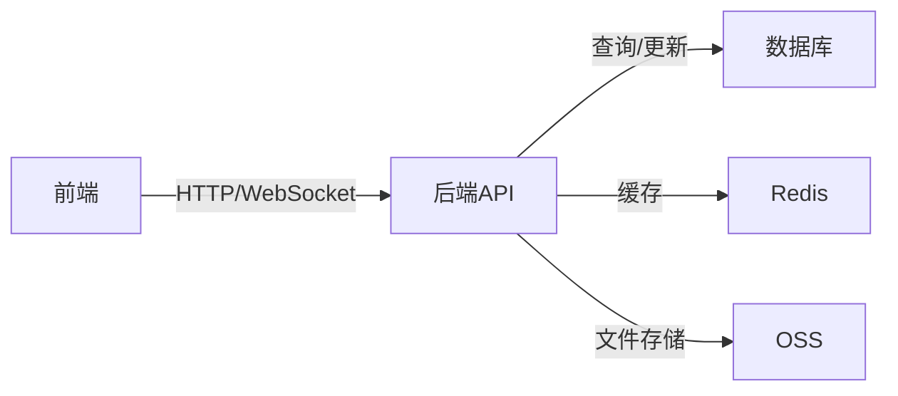
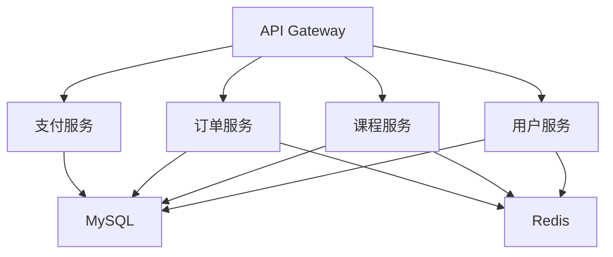

# 实战项目

欢迎来到实战项目模块！这里包含完整的全栈项目，从需求分析到部署上线。

## 📚 项目列表

### 1. 全栈博客系统
**技术栈**：Next.js + Node.js + MongoDB

**项目特点**：
- ✅ SSR服务端渲染
- ✅ Markdown编辑器
- ✅ 用户认证与授权
- ✅ 评论系统
- ✅ 文章分类与标签
- ✅ SEO优化

[查看详情 →](./全栈博客系统.mdx)

---

### 2. 在线教育平台
**技术栈**：React + Spring Boot + MySQL + Redis

**项目特点**：
- ✅ 视频播放与进度记录
- ✅ 实时聊天功能
- ✅ 支付集成
- ✅ 课程管理系统
- ✅ 用户学习数据分析
- ✅ 微服务架构

[查看详情 →](./在线教育平台.mdx)

---

### 3. 全栈电商项目
**技术栈**：Vue3 + Node.js + MySQL + Redis

**项目特点**：
- ✅ 商品管理
- ✅ 购物车与订单
- ✅ 支付系统
- ✅ 秒杀功能
- ✅ 优惠券系统
- ✅ 分布式架构

[查看详情 →](./全栈电商项目.mdx)

---

### 4. 实时聊天应用
**技术栈**：React + Node.js + WebSocket + MongoDB

**项目特点**：
- ✅ 实时消息推送
- ✅ 群聊与私聊
- ✅ 文件传输
- ✅ 消息已读未读
- ✅ 在线状态显示
- ✅ 消息持久化

[查看详情 →](./实时聊天应用.mdx)

## 🎯 学习目标

通过这些实战项目，你将：

- ✅ 掌握完整的项目开发流程
- ✅ 理解前后端分离架构
- ✅ 熟悉常见业务场景实现
- ✅ 掌握数据库设计技巧
- ✅ 了解系统部署与运维
- ✅ 积累项目经验

## 📖 推荐学习顺序

### 初学者
```
全栈博客系统（难度：⭐⭐）
  → 实时聊天应用（难度：⭐⭐⭐）
```

### 进阶者
```
在线教育平台（难度：⭐⭐⭐⭐）
  → 全栈电商项目（难度：⭐⭐⭐⭐⭐）
```

## 💡 学习建议

1. **完整实现**：不要只看代码，要自己从零实现
2. **理解业务**：理解每个功能的业务逻辑
3. **注重细节**：关注错误处理、边界情况
4. **优化性能**：思考如何优化性能
5. **部署上线**：完整走一遍部署流程

## 🛠️ 技术栈对比

| 项目 | 前端 | 后端 | 数据库 | 特色技术 |
|------|------|------|--------|----------|
| 博客系统 | Next.js | Node.js | MongoDB | SSR、SEO |
| 教育平台 | React | Spring Boot | MySQL+Redis | 微服务、视频 |
| 电商项目 | Vue3 | Node.js | MySQL+Redis | 秒杀、分布式 |
| 聊天应用 | React | Node.js | MongoDB | WebSocket |

## 📊 项目架构

### 前后端分离架构


### 微服务架构


## 🔗 相关资源

### 前置知识
- [前端开发](../01-前端开发/) - 前端技术栈
- [后端开发](../02-后端开发/) - 后端技术栈
- [数据库](../03-数据库/) - 数据库知识
- [系统设计](../06-系统设计/) - 架构设计

### 进阶学习
- [DevOps](../07-DevOps/) - 部署与运维
- [面试题库](../11-面试题库/) - 项目相关面试题

## 📝 项目开发流程

1. **需求分析**
   - 功能需求梳理
   - 技术选型
   - 架构设计

2. **数据库设计**
   - ER图设计
   - 表结构设计
   - 索引优化

3. **接口设计**
   - RESTful API设计
   - 接口文档编写
   - 接口测试

4. **前端开发**
   - 页面开发
   - 组件封装
   - 状态管理

5. **后端开发**
   - 业务逻辑实现
   - 数据库操作
   - 接口开发

6. **测试**
   - 单元测试
   - 集成测试
   - E2E测试

7. **部署上线**
   - 服务器配置
   - CI/CD配置
   - 监控告警

## 🎓 项目亮点

### 博客系统
- SSR优化首屏加载
- Markdown实时预览
- SEO友好

### 教育平台
- 视频断点续播
- 实时互动聊天
- 微服务架构

### 电商项目
- 秒杀系统设计
- 分布式事务
- 高并发优化

### 聊天应用
- WebSocket实时通信
- 消息可靠传输
- 离线消息推送

开始你的项目实战之旅吧！🚀
