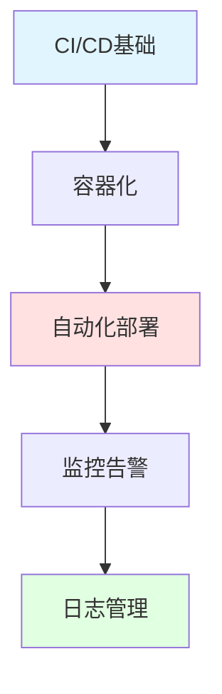

import DocCardList from '@theme/DocCardList';

# DevOps实践

DevOps是开发和运维的结合，通过自动化和协作提高软件交付效率。

## 学习路径

## 核心内容

### CI/CD
- **持续集成**: 自动化构建和测试
- **持续交付**: 自动化部署到测试环境
- **持续部署**: 自动化部署到生产环境
- **工具**: Jenkins、GitLab CI、GitHub Actions

### 容器化
- **Docker**: 容器化应用
- **Kubernetes**: 容器编排
- **Helm**: K8s包管理
- **镜像仓库**: Docker Hub、Harbor

### 基础设施即代码
- **Terraform**: 基础设施管理
- **Ansible**: 配置管理
- **CloudFormation**: AWS资源管理

### 监控告警
- **Prometheus**: 指标收集
- **Grafana**: 可视化
- **Alertmanager**: 告警管理
- **APM**: 应用性能监控

### 日志管理
- **ELK**: Elasticsearch + Logstash + Kibana
- **Loki**: 轻量级日志系统
- **Fluentd**: 日志收集

## 开始学习

<DocCardList />

记住：**DevOps是文化，不仅仅是工具！**

