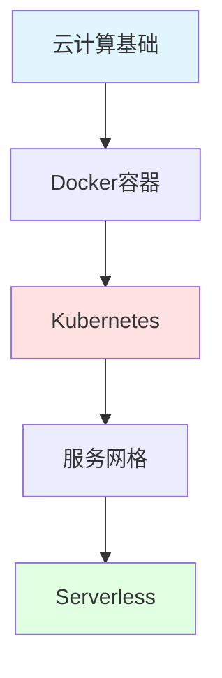

import DocCardList from '@theme/DocCardList';

# 云计算与云原生

云计算和云原生技术是现代应用开发和部署的核心，掌握这些技术对于构建可扩展、高可用的系统至关重要。

## 学习路径

## 核心内容

### 云计算基础
- **IaaS**: 基础设施即服务（AWS EC2、阿里云ECS）
- **PaaS**: 平台即服务（Heroku、Google App Engine）
- **SaaS**: 软件即服务（Gmail、Salesforce）
- **云服务商**: AWS、Azure、GCP、阿里云、腾讯云

### Docker容器化
- **镜像管理**: 构建、推送、拉取
- **容器操作**: 运行、停止、日志
- **网络配置**: bridge、host、overlay
- **数据持久化**: Volume、Bind Mount
- **Docker Compose**: 多容器编排

### Kubernetes
- **核心概念**: Pod、Service、Deployment
- **配置管理**: ConfigMap、Secret
- **网络**: Ingress、Service Mesh
- **存储**: PV、PVC、StorageClass
- **自动扩缩容**: HPA、VPA
- **实战部署**: 微服务部署

### 服务网格
- **Istio**: 流量管理、安全、可观测性
- **Linkerd**: 轻量级服务网格
- **Envoy**: 高性能代理
- **服务治理**: 熔断、限流、重试

### Serverless
- **FaaS**: 函数即服务
- **AWS Lambda**: 事件驱动计算
- **应用场景**: API后端、数据处理
- **最佳实践**: 冷启动优化

## 开始学习

<DocCardList />

记住：**云原生不仅是技术，更是一种思维方式！**

