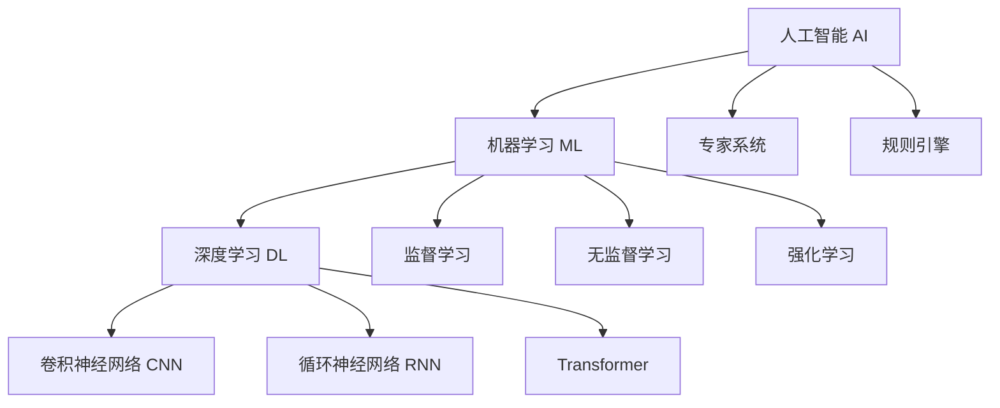
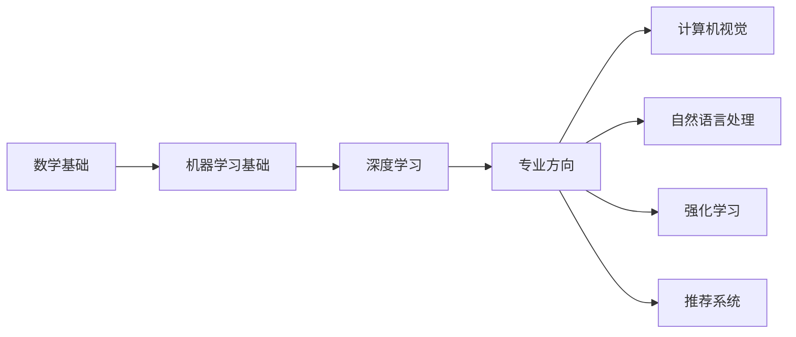

# 人工智能基础理论

:::info 章节概述
本章节系统介绍人工智能的基础理论，包括AI的发展历程、核心概念、数学基础以及基本原理。
:::

## 什么是人工智能

**人工智能（Artificial Intelligence, AI）** 是计算机科学的一个分支，致力于创建能够模拟、延伸和扩展人类智能的系统。

### AI的三个层次



**1. 人工智能（AI）**
- 最广泛的概念
- 包括任何让机器表现出"智能"行为的技术
- 例如：规则引擎、专家系统、机器学习等

**2. 机器学习（ML）**
- AI的一个子集
- 让机器从数据中学习，而不是显式编程
- 例如：决策树、SVM、神经网络等

**3. 深度学习（DL）**
- 机器学习的一个子集
- 使用多层神经网络学习数据的层次化表示
- 例如：CNN、RNN、Transformer等

## AI发展简史

### 第一阶段：符号主义时代（1956-1980s）

**1956年 - AI诞生**
- 达特茅斯会议，"人工智能"一词首次提出
- 核心思想：智能可以通过符号操作实现

**代表成果**：
- 逻辑推理程序
- 专家系统（如MYCIN医疗诊断系统）
- 国际象棋程序

**局限性**：
- 知识获取瓶颈
- 无法处理不确定性
- 计算能力限制

### 第二阶段：连接主义兴起（1980s-2000s）

**1986年 - 反向传播算法**
- Rumelhart等人提出BP算法
- 使多层神经网络训练成为可能

**代表成果**：
- LeNet-5（1998）：手写数字识别
- 支持向量机（SVM）
- 决策树、随机森林

**AI寒冬**：
- 1990s末期，神经网络遇到瓶颈
- 计算能力不足
- 数据量有限

### 第三阶段：深度学习革命（2006-至今）

**2006年 - 深度学习突破**
- Hinton提出深度信念网络（DBN）
- 解决了深层网络训练问题

**2012年 - ImageNet突破**
- AlexNet在ImageNet竞赛中大幅领先
- 标志着深度学习时代的到来

**关键里程碑**：

| 年份 | 事件 | 意义 |
|------|------|------|
| 2014 | GAN生成对抗网络 | 开启生成式AI时代 |
| 2014 | Seq2Seq模型 | 机器翻译重大突破 |
| 2017 | Transformer架构 | 彻底改变NLP领域 |
| 2018 | BERT预训练模型 | NLP性能大幅提升 |
| 2020 | GPT-3发布 | 大语言模型展现惊人能力 |
| 2022 | ChatGPT发布 | AI进入大众视野 |
| 2023 | GPT-4、Claude等 | 多模态大模型时代 |

### 第四阶段：AGI探索（未来）

**通用人工智能（AGI）**
- 目标：创建能够理解、学习和应用知识的通用智能系统
- 当前状态：仍在探索阶段
- 挑战：常识推理、因果理解、迁移学习

## AI的核心概念

### 1. 智能体（Agent）

智能体是能够感知环境并采取行动以实现目标的系统。

```python
class Agent:
    def __init__(self):
        self.state = None
    
    def perceive(self, environment):
        """感知环境"""
        self.state = environment.get_state()
    
    def decide(self):
        """决策"""
        action = self.policy(self.state)
        return action
    
    def act(self, action, environment):
        """执行动作"""
        environment.apply_action(action)
```

**智能体的类型**：
- **简单反射型**：基于当前感知直接反应
- **基于模型**：维护内部世界模型
- **基于目标**：追求特定目标
- **基于效用**：最大化效用函数
- **学习型**：从经验中学习改进

### 2. 搜索与规划

**搜索问题的组成**：
- 初始状态
- 可能的动作
- 转移模型
- 目标测试
- 路径代价

**常见搜索算法**：

```python
# 广度优先搜索（BFS）
def bfs(start, goal):
    queue = [start]
    visited = {start}
    
    while queue:
        node = queue.pop(0)
        if node == goal:
            return True
        
        for neighbor in node.neighbors:
            if neighbor not in visited:
                visited.add(neighbor)
                queue.append(neighbor)
    
    return False

# 深度优先搜索（DFS）
def dfs(node, goal, visited=None):
    if visited is None:
        visited = set()
    
    if node == goal:
        return True
    
    visited.add(node)
    for neighbor in node.neighbors:
        if neighbor not in visited:
            if dfs(neighbor, goal, visited):
                return True
    
    return False

# A*搜索
import heapq

def a_star(start, goal, heuristic):
    open_set = [(0, start)]
    came_from = {}
    g_score = {start: 0}
    
    while open_set:
        _, current = heapq.heappop(open_set)
        
        if current == goal:
            return reconstruct_path(came_from, current)
        
        for neighbor in current.neighbors:
            tentative_g = g_score[current] + cost(current, neighbor)
            
            if neighbor not in g_score or tentative_g < g_score[neighbor]:
                came_from[neighbor] = current
                g_score[neighbor] = tentative_g
                f_score = tentative_g + heuristic(neighbor, goal)
                heapq.heappush(open_set, (f_score, neighbor))
    
    return None
```

### 3. 知识表示与推理

**知识表示方法**：

**命题逻辑**：
```python
# 命题逻辑示例
# P: 今天下雨
# Q: 地面湿
# 规则: P → Q (如果下雨，则地面湿)

class PropositionalLogic:
    def __init__(self):
        self.facts = set()
        self.rules = []
    
    def add_fact(self, fact):
        self.facts.add(fact)
    
    def add_rule(self, premise, conclusion):
        self.rules.append((premise, conclusion))
    
    def infer(self):
        """前向推理"""
        changed = True
        while changed:
            changed = False
            for premise, conclusion in self.rules:
                if premise in self.facts and conclusion not in self.facts:
                    self.facts.add(conclusion)
                    changed = True
```

**一阶逻辑**：
```prolog
% Prolog示例
% 事实
parent(tom, bob).
parent(tom, liz).
parent(bob, ann).

% 规则
grandparent(X, Z) :- parent(X, Y), parent(Y, Z).

% 查询
?- grandparent(tom, ann).
% 输出: true
```

### 4. 不确定性推理

**贝叶斯网络**：

```python
import numpy as np

class BayesianNetwork:
    """简单的贝叶斯网络实现"""
    
    def __init__(self):
        # P(Rain) = 0.2
        self.p_rain = 0.2
        
        # P(Sprinkler|Rain)
        self.p_sprinkler_given_rain = {
            True: 0.01,   # 下雨时开洒水器的概率
            False: 0.4    # 不下雨时开洒水器的概率
        }
        
        # P(GrassWet|Rain, Sprinkler)
        self.p_grass_wet = {
            (True, True): 0.99,
            (True, False): 0.8,
            (False, True): 0.9,
            (False, False): 0.0
        }
    
    def query(self, grass_wet=True):
        """查询：已知草地湿了，下雨的概率是多少？"""
        # P(Rain|GrassWet) = P(GrassWet|Rain) * P(Rain) / P(GrassWet)
        
        # 计算 P(GrassWet|Rain)
        p_wet_given_rain = 0
        for sprinkler in [True, False]:
            p_sprinkler = self.p_sprinkler_given_rain[True]
            if not sprinkler:
                p_sprinkler = 1 - p_sprinkler
            p_wet_given_rain += (
                self.p_grass_wet[(True, sprinkler)] * p_sprinkler
            )
        
        # 计算 P(GrassWet|NoRain)
        p_wet_given_no_rain = 0
        for sprinkler in [True, False]:
            p_sprinkler = self.p_sprinkler_given_rain[False]
            if not sprinkler:
                p_sprinkler = 1 - p_sprinkler
            p_wet_given_no_rain += (
                self.p_grass_wet[(False, sprinkler)] * p_sprinkler
            )
        
        # 计算 P(GrassWet)
        p_grass_wet = (
            p_wet_given_rain * self.p_rain +
            p_wet_given_no_rain * (1 - self.p_rain)
        )
        
        # 贝叶斯公式
        p_rain_given_wet = (
            p_wet_given_rain * self.p_rain / p_grass_wet
        )
        
        return p_rain_given_wet

# 使用示例
bn = BayesianNetwork()
prob = bn.query(grass_wet=True)
print(f"已知草地湿了，下雨的概率: {prob:.2%}")
```

## AI的数学基础

### 1. 线性代数

**向量与矩阵**：

```python
import numpy as np

# 向量
v1 = np.array([1, 2, 3])
v2 = np.array([4, 5, 6])

# 向量加法
print(v1 + v2)  # [5 7 9]

# 点积（内积）
print(np.dot(v1, v2))  # 32

# 矩阵
A = np.array([[1, 2], [3, 4]])
B = np.array([[5, 6], [7, 8]])

# 矩阵乘法
print(A @ B)
# [[19 22]
#  [43 50]]

# 矩阵转置
print(A.T)
# [[1 3]
#  [2 4]]

# 特征值和特征向量
eigenvalues, eigenvectors = np.linalg.eig(A)
print("特征值:", eigenvalues)
print("特征向量:\n", eigenvectors)
```

**为什么重要**：
- 神经网络的权重是矩阵
- 数据表示为向量
- 变换操作是矩阵乘法

### 2. 概率论

**基本概念**：

```python
import numpy as np
from scipy import stats

# 概率分布
# 正态分布
mu, sigma = 0, 1
x = np.linspace(-3, 3, 100)
pdf = stats.norm.pdf(x, mu, sigma)

# 期望和方差
data = np.random.randn(1000)
mean = np.mean(data)
variance = np.var(data)
std = np.std(data)

print(f"均值: {mean:.2f}")
print(f"方差: {variance:.2f}")
print(f"标准差: {std:.2f}")

# 条件概率
# P(A|B) = P(A∩B) / P(B)
def conditional_probability(p_a_and_b, p_b):
    return p_a_and_b / p_b

# 贝叶斯定理
# P(A|B) = P(B|A) * P(A) / P(B)
def bayes_theorem(p_b_given_a, p_a, p_b):
    return (p_b_given_a * p_a) / p_b
```

**为什么重要**：
- 机器学习本质是概率推断
- 不确定性建模
- 贝叶斯方法

### 3. 微积分

**导数与梯度**：

```python
import numpy as np

# 数值求导
def numerical_gradient(f, x, h=1e-5):
    """计算函数f在点x处的数值梯度"""
    grad = np.zeros_like(x)
    
    for i in range(x.size):
        tmp = x[i]
        
        # f(x+h)
        x[i] = tmp + h
        fxh1 = f(x)
        
        # f(x-h)
        x[i] = tmp - h
        fxh2 = f(x)
        
        # 中心差分
        grad[i] = (fxh1 - fxh2) / (2 * h)
        x[i] = tmp
    
    return grad

# 示例：计算 f(x,y) = x^2 + y^2 在点(3,4)的梯度
def f(x):
    return x[0]**2 + x[1]**2

x = np.array([3.0, 4.0])
grad = numerical_gradient(f, x)
print(f"梯度: {grad}")  # [6. 8.]
```

**链式法则**：

$$
\frac{dy}{dx} = \frac{dy}{du} \cdot \frac{du}{dx}
$$

```python
# 链式法则示例
# y = (x^2 + 1)^3
# 令 u = x^2 + 1, 则 y = u^3
# dy/dx = dy/du * du/dx = 3u^2 * 2x = 6x(x^2 + 1)^2

def chain_rule_example(x):
    u = x**2 + 1
    y = u**3
    
    # 反向传播
    dy_du = 3 * u**2
    du_dx = 2 * x
    dy_dx = dy_du * du_dx
    
    return dy_dx

x = 2.0
gradient = chain_rule_example(x)
print(f"在x={x}处的导数: {gradient}")
```

**为什么重要**：
- 梯度下降优化
- 反向传播算法
- 损失函数最小化

### 4. 信息论

**熵（Entropy）**：

```python
import numpy as np

def entropy(probabilities):
    """计算熵 H(X) = -Σ p(x) log p(x)"""
    # 过滤掉0概率（避免log(0)）
    p = probabilities[probabilities > 0]
    return -np.sum(p * np.log2(p))

# 示例：抛硬币
p_fair = np.array([0.5, 0.5])  # 公平硬币
p_biased = np.array([0.9, 0.1])  # 有偏硬币

print(f"公平硬币的熵: {entropy(p_fair):.2f} bits")  # 1.00
print(f"有偏硬币的熵: {entropy(p_biased):.2f} bits")  # 0.47
```

**交叉熵（Cross Entropy）**：

```python
def cross_entropy(p, q):
    """
    计算交叉熵 H(p,q) = -Σ p(x) log q(x)
    p: 真实分布
    q: 预测分布
    """
    return -np.sum(p * np.log(q + 1e-10))  # 加小值避免log(0)

# 示例：分类问题
y_true = np.array([1, 0, 0])  # 真实标签（one-hot）
y_pred = np.array([0.7, 0.2, 0.1])  # 预测概率

loss = cross_entropy(y_true, y_pred)
print(f"交叉熵损失: {loss:.4f}")
```

**KL散度（Kullback-Leibler Divergence）**：

```python
def kl_divergence(p, q):
    """
    计算KL散度 D_KL(p||q) = Σ p(x) log(p(x)/q(x))
    衡量两个概率分布的差异
    """
    return np.sum(p * np.log((p + 1e-10) / (q + 1e-10)))

p = np.array([0.5, 0.3, 0.2])
q = np.array([0.4, 0.4, 0.2])

kl = kl_divergence(p, q)
print(f"KL散度: {kl:.4f}")
```

**为什么重要**：
- 交叉熵是分类任务的标准损失函数
- 信息增益用于决策树
- KL散度用于分布匹配

## AI的基本原理

### 1. 学习范式

**监督学习（Supervised Learning）**：
- 有标注数据
- 学习输入到输出的映射
- 例如：分类、回归

**无监督学习（Unsupervised Learning）**：
- 无标注数据
- 发现数据的内在结构
- 例如：聚类、降维

**强化学习（Reinforcement Learning）**：
- 通过与环境交互学习
- 最大化累积奖励
- 例如：游戏AI、机器人控制

**半监督学习（Semi-Supervised Learning）**：
- 少量标注数据 + 大量无标注数据
- 利用无标注数据改进模型

**自监督学习（Self-Supervised Learning）**：
- 从数据本身生成监督信号
- 例如：BERT的掩码语言模型

### 2. 偏差-方差权衡

```python
import numpy as np
import matplotlib.pyplot as plt
from sklearn.model_selection import learning_curve
from sklearn.tree import DecisionTreeRegressor

# 生成数据
np.random.seed(0)
X = np.sort(np.random.rand(100, 1) * 10, axis=0)
y = np.sin(X).ravel() + np.random.randn(100) * 0.1

# 不同复杂度的模型
models = {
    '欠拟合（高偏差）': DecisionTreeRegressor(max_depth=1),
    '适度拟合': DecisionTreeRegressor(max_depth=3),
    '过拟合（高方差）': DecisionTreeRegressor(max_depth=10)
}

# 可视化
fig, axes = plt.subplots(1, 3, figsize=(15, 4))

for ax, (title, model) in zip(axes, models.items()):
    model.fit(X, y)
    X_test = np.linspace(0, 10, 100).reshape(-1, 1)
    y_pred = model.predict(X_test)
    
    ax.scatter(X, y, alpha=0.5)
    ax.plot(X_test, y_pred, 'r-', linewidth=2)
    ax.set_title(title)
    ax.set_xlabel('X')
    ax.set_ylabel('y')

plt.tight_layout()
plt.show()
```

**关键概念**：
- **偏差（Bias）**：模型的预测值与真实值的偏离程度
- **方差（Variance）**：模型对训练数据的敏感程度
- **目标**：找到偏差和方差的最佳平衡点

### 3. 正则化

**L1正则化（Lasso）**：

$$
Loss = MSE + \lambda \sum_{i=1}^{n} |w_i|
$$

**L2正则化（Ridge）**：

$$
Loss = MSE + \lambda \sum_{i=1}^{n} w_i^2
$$

```python
from sklearn.linear_model import Ridge, Lasso
from sklearn.datasets import make_regression
from sklearn.model_selection import train_test_split

# 生成数据
X, y = make_regression(n_samples=100, n_features=20, noise=10)
X_train, X_test, y_train, y_test = train_test_split(X, y, test_size=0.2)

# L2正则化
ridge = Ridge(alpha=1.0)
ridge.fit(X_train, y_train)
print(f"Ridge R²: {ridge.score(X_test, y_test):.4f}")

# L1正则化
lasso = Lasso(alpha=0.1)
lasso.fit(X_train, y_train)
print(f"Lasso R²: {lasso.score(X_test, y_test):.4f}")

# 查看特征选择效果
print(f"非零系数数量: {np.sum(lasso.coef_ != 0)}")
```

### 4. 交叉验证

```python
from sklearn.model_selection import cross_val_score, KFold
from sklearn.ensemble import RandomForestClassifier
from sklearn.datasets import load_iris

# 加载数据
iris = load_iris()
X, y = iris.data, iris.target

# 创建模型
model = RandomForestClassifier(n_estimators=100)

# K折交叉验证
kfold = KFold(n_splits=5, shuffle=True, random_state=42)
scores = cross_val_score(model, X, y, cv=kfold, scoring='accuracy')

print(f"交叉验证得分: {scores}")
print(f"平均准确率: {scores.mean():.4f} (+/- {scores.std():.4f})")
```

## 实践建议

### 1. 学习路径



### 2. 动手实践

**从简单开始**：
1. 实现线性回归
2. 实现逻辑回归
3. 实现简单神经网络
4. 使用框架（PyTorch/TensorFlow）
5. 参加Kaggle竞赛

### 3. 推荐资源

**书籍**：
- 《机器学习》- 周志华
- 《深度学习》- Ian Goodfellow
- 《统计学习方法》- 李航
- 《Pattern Recognition and Machine Learning》- Christopher Bishop

**在线课程**：
- Andrew Ng的机器学习课程（Coursera）
- 李宏毅的机器学习课程
- Fast.ai深度学习课程
- Stanford CS229/CS230

**论文阅读**：
- arXiv.org
- Papers with Code
- Google Scholar

## 总结

人工智能是一个快速发展的领域，需要扎实的数学基础和大量的实践经验。本章介绍了AI的基本概念、发展历史和核心原理，为后续深入学习打下基础。

**关键要点**：
1. AI包含机器学习和深度学习
2. 数学是AI的基础（线性代数、概率论、微积分）
3. 理解偏差-方差权衡
4. 掌握正则化和交叉验证
5. 多动手实践

**下一步**：
- 深入学习机器学习算法
- 掌握深度学习框架
- 选择感兴趣的专业方向
- 参与实际项目

<DocCardList />

