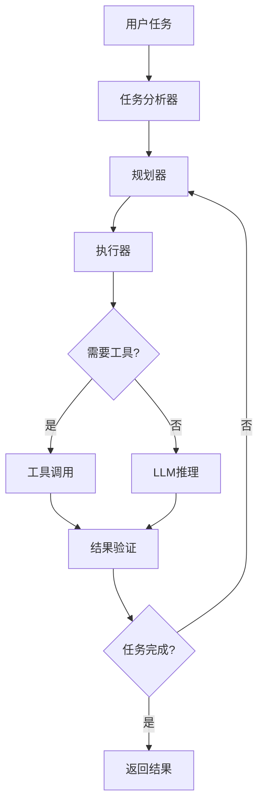

# OpenClaw实战指南

:::info 学习目标
掌握OpenClaw框架，构建能够自主规划和执行复杂任务的AI Agent。
:::

## OpenClaw技术文档

### 架构概览



### 核心组件

#### 1. Agent基础类

```python
from typing import List, Dict, Any, Optional, Callable
from dataclasses import dataclass
import asyncio
from openai import AsyncOpenAI

@dataclass
class AgentConfig:
    """Agent配置"""
    name: str
    model: str = "gpt-4"
    temperature: float = 0.7
    max_iterations: int = 10
    max_tokens: int = 4000
    timeout: int = 300  # 秒


class BaseAgent:
    """OpenClaw基础Agent"""
    
    def __init__(self, config: AgentConfig):
        self.config = config
        self.client = AsyncOpenAI()
        self.tools: Dict[str, Callable] = {}
        self.memory: List[Dict] = []
        self.iteration_count = 0
    
    def register_tool(self, name: str, description: str, parameters: Dict):
        """注册工具"""
        def decorator(func: Callable):
            self.tools[name] = {
                "function": func,
                "schema": {
                    "type": "function",
                    "function": {
                        "name": name,
                        "description": description,
                        "parameters": parameters
                    }
                }
            }
            return func
        return decorator
    
    async def think(self, prompt: str) -> str:
        """思考（调用LLM）"""
        response = await self.client.chat.completions.create(
            model=self.config.model,
            messages=[
                {"role": "system", "content": self._get_system_prompt()},
                *self.memory,
                {"role": "user", "content": prompt}
            ],
            temperature=self.config.temperature,
            max_tokens=self.config.max_tokens
        )
        
        return response.choices[0].message.content
    
    async def think_with_tools(self, prompt: str) -> Dict[str, Any]:
        """带工具的思考"""
        tools_schema = [tool["schema"] for tool in self.tools.values()]
        
        response = await self.client.chat.completions.create(
            model=self.config.model,
            messages=[
                {"role": "system", "content": self._get_system_prompt()},
                *self.memory,
                {"role": "user", "content": prompt}
            ],
            tools=tools_schema,
            tool_choice="auto",
            temperature=self.config.temperature
        )
        
        return response.choices[0].message
    
    async def execute_tool(self, tool_name: str, arguments: Dict) -> Any:
        """执行工具"""
        if tool_name not in self.tools:
            raise ValueError(f"Tool {tool_name} not found")
        
        func = self.tools[tool_name]["function"]
        
        # 异步或同步执行
        if asyncio.iscoroutinefunction(func):
            return await func(**arguments)
        else:
            return func(**arguments)
    
    def _get_system_prompt(self) -> str:
        """获取系统提示"""
        return f"""You are {self.config.name}, an AI agent capable of:
1. Breaking down complex tasks into steps
2. Using available tools to accomplish tasks
3. Reasoning about results and adjusting plans
4. Providing clear explanations of your actions

Available tools: {', '.join(self.tools.keys())}

Always think step by step and explain your reasoning."""
    
    def add_to_memory(self, role: str, content: str):
        """添加到记忆"""
        self.memory.append({"role": role, "content": content})
        
        # 限制记忆长度
        if len(self.memory) > 20:
            self.memory = self.memory[-20:]
```

#### 2. 任务规划器

```python
from typing import List, Dict, Any
from dataclasses import dataclass
import json

@dataclass
class Task:
    """任务定义"""
    id: str
    description: str
    dependencies: List[str] = None
    status: str = "pending"  # pending, in_progress, completed, failed
    result: Any = None
    
    def __post_init__(self):
        if self.dependencies is None:
            self.dependencies = []


class TaskPlanner:
    """任务规划器"""
    
    def __init__(self, agent: BaseAgent):
        self.agent = agent
    
    async def plan(self, goal: str) -> List[Task]:
        """制定任务计划"""
        planning_prompt = f"""
Goal: {goal}

Create a detailed execution plan by breaking down the goal into specific tasks.

For each task, specify:
1. Task description (what needs to be done)
2. Dependencies (which tasks must be completed first)
3. Required tools (if any)

Output format (JSON):
{{
    "tasks": [
        {{
            "id": "task_1",
            "description": "...",
            "dependencies": [],
            "tools": ["tool_name"]
        }},
        ...
    ]
}}
"""
        
        response = await self.agent.think(planning_prompt)
        
        # 解析计划
        try:
            plan_data = json.loads(response)
            tasks = [
                Task(
                    id=task["id"],
                    description=task["description"],
                    dependencies=task.get("dependencies", [])
                )
                for task in plan_data["tasks"]
            ]
            return tasks
        except json.JSONDecodeError:
            # 如果解析失败，创建单个任务
            return [Task(id="task_1", description=goal)]
    
    def get_executable_tasks(self, tasks: List[Task]) -> List[Task]:
        """获取可执行的任务（依赖已完成）"""
        completed_ids = {t.id for t in tasks if t.status == "completed"}
        
        executable = []
        for task in tasks:
            if task.status == "pending":
                deps_met = all(dep in completed_ids for dep in task.dependencies)
                if deps_met:
                    executable.append(task)
        
        return executable
    
    def is_plan_complete(self, tasks: List[Task]) -> bool:
        """检查计划是否完成"""
        return all(t.status in ["completed", "failed"] for t in tasks)


class TaskExecutor:
    """任务执行器"""
    
    def __init__(self, agent: BaseAgent):
        self.agent = agent
    
    async def execute(self, task: Task) -> Any:
        """执行单个任务"""
        task.status = "in_progress"
        
        execution_prompt = f"""
Task: {task.description}

Execute this task using available tools if needed.
Provide a clear explanation of your actions and the result.
"""
        
        try:
            # 使用工具执行
            message = await self.agent.think_with_tools(execution_prompt)
            
            # 处理工具调用
            if message.tool_calls:
                results = []
                for tool_call in message.tool_calls:
                    tool_name = tool_call.function.name
                    arguments = json.loads(tool_call.function.arguments)
                    
                    result = await self.agent.execute_tool(tool_name, arguments)
                    results.append(result)
                
                task.result = results
            else:
                task.result = message.content
            
            task.status = "completed"
            return task.result
            
        except Exception as e:
            task.status = "failed"
            task.result = f"Error: {str(e)}"
            return task.result
```

#### 3. 完整的OpenClaw Agent

```python
class OpenClawAgent(BaseAgent):
    """完整的OpenClaw Agent实现"""
    
    def __init__(self, config: AgentConfig):
        super().__init__(config)
        self.planner = TaskPlanner(self)
        self.executor = TaskExecutor(self)
    
    async def run(self, goal: str) -> Dict[str, Any]:
        """运行Agent完成目标"""
        print(f"🎯 Goal: {goal}\n")
        
        # 1. 制定计划
        print("📋 Planning...")
        tasks = await self.planner.plan(goal)
        
        print(f"Created {len(tasks)} tasks:")
        for task in tasks:
            print(f"  - {task.id}: {task.description}")
        print()
        
        # 2. 执行计划
        print("🚀 Executing...\n")
        
        while not self.planner.is_plan_complete(tasks):
            # 获取可执行的任务
            executable = self.planner.get_executable_tasks(tasks)
            
            if not executable:
                print("⚠️ No executable tasks, plan may have circular dependencies")
                break
            
            # 执行任务
            for task in executable:
                print(f"▶️ Executing: {task.description}")
                result = await self.executor.execute(task)
                print(f"✅ Result: {result}\n")
                
                self.iteration_count += 1
                if self.iteration_count >= self.config.max_iterations:
                    print("⚠️ Max iterations reached")
                    break
        
        # 3. 总结结果
        completed = [t for t in tasks if t.status == "completed"]
        failed = [t for t in tasks if t.status == "failed"]
        
        return {
            "goal": goal,
            "total_tasks": len(tasks),
            "completed": len(completed),
            "failed": len(failed),
            "tasks": tasks,
            "success": len(failed) == 0
        }
```

## 实战案例1：自动化研究助手

```python
class ResearchAgent(OpenClawAgent):
    """研究助手Agent"""
    
    def __init__(self):
        config = AgentConfig(
            name="Research Assistant",
            model="gpt-4",
            max_iterations=20
        )
        super().__init__(config)
        self._register_research_tools()
    
    def _register_research_tools(self):
        """注册研究工具"""
        
        @self.register_tool(
            name="web_search",
            description="Search the web for information",
            parameters={
                "type": "object",
                "properties": {
                    "query": {
                        "type": "string",
                        "description": "Search query"
                    },
                    "num_results": {
                        "type": "integer",
                        "description": "Number of results to return",
                        "default": 5
                    }
                },
                "required": ["query"]
            }
        )
        async def web_search(query: str, num_results: int = 5):
            """网络搜索"""
            import aiohttp
            
            # 使用DuckDuckGo API
            async with aiohttp.ClientSession() as session:
                async with session.get(
                    "https://api.duckduckgo.com/",
                    params={"q": query, "format": "json"}
                ) as response:
                    data = await response.json()
                    
                    results = []
                    for item in data.get("RelatedTopics", [])[:num_results]:
                        if "Text" in item:
                            results.append(item["Text"])
                    
                    return "\n".join(results)
        
        @self.register_tool(
            name="extract_key_points",
            description="Extract key points from text",
            parameters={
                "type": "object",
                "properties": {
                    "text": {
                        "type": "string",
                        "description": "Text to analyze"
                    }
                },
                "required": ["text"]
            }
        )
        async def extract_key_points(text: str):
            """提取关键点"""
            prompt = f"""Extract the key points from the following text:

{text}

List the main points in bullet format."""
            
            return await self.think(prompt)
        
        @self.register_tool(
            name="save_report",
            description="Save research report to file",
            parameters={
                "type": "object",
                "properties": {
                    "filename": {
                        "type": "string",
                        "description": "Output filename"
                    },
                    "content": {
                        "type": "string",
                        "description": "Report content"
                    }
                },
                "required": ["filename", "content"]
            }
        )
        async def save_report(filename: str, content: str):
            """保存报告"""
            import aiofiles
            
            async with aiofiles.open(filename, 'w') as f:
                await f.write(content)
            
            return f"Report saved to {filename}"

# 使用示例
async def research_example():
    agent = ResearchAgent()
    
    result = await agent.run(
        "Research the latest developments in liquid neural networks "
        "and create a comprehensive report"
    )
    
    print("\n📊 Summary:")
    print(f"Total tasks: {result['total_tasks']}")
    print(f"Completed: {result['completed']}")
    print(f"Success: {result['success']}")

asyncio.run(research_example())
```

## 实战案例2：代码生成Agent

```python
class CodingAgent(OpenClawAgent):
    """代码生成Agent"""
    
    def __init__(self):
        config = AgentConfig(
            name="Coding Assistant",
            model="gpt-4",
            temperature=0.3  # 更低的温度以获得更确定的代码
        )
        super().__init__(config)
        self._register_coding_tools()
    
    def _register_coding_tools(self):
        """注册编程工具"""
        
        @self.register_tool(
            name="write_code",
            description="Write code based on requirements",
            parameters={
                "type": "object",
                "properties": {
                    "language": {
                        "type": "string",
                        "description": "Programming language"
                    },
                    "requirements": {
                        "type": "string",
                        "description": "Code requirements"
                    }
                },
                "required": ["language", "requirements"]
            }
        )
        async def write_code(language: str, requirements: str):
            """编写代码"""
            prompt = f"""Write {language} code for the following requirements:

{requirements}

Provide clean, well-documented code with comments."""
            
            return await self.think(prompt)
        
        @self.register_tool(
            name="test_code",
            description="Test code execution",
            parameters={
                "type": "object",
                "properties": {
                    "code": {
                        "type": "string",
                        "description": "Code to test"
                    },
                    "language": {
                        "type": "string",
                        "description": "Programming language"
                    }
                },
                "required": ["code", "language"]
            }
        )
        async def test_code(code_str: str, language: str):
            """测试代码"""
            if language.lower() == "python":
                try:
                    # 在受限环境中执行
                    exec_globals = {}
                    exec(code_str, exec_globals)
                    return "✅ Code executed successfully"
                except Exception as e:
                    return f"❌ Error: {str(e)}"
            else:
                return "Testing not supported for this language"
        
        @self.register_tool(
            name="review_code",
            description="Review code for issues",
            parameters={
                "type": "object",
                "properties": {
                    "code": {
                        "type": "string",
                        "description": "Code to review"
                    }
                },
                "required": ["code"]
            }
        )
        async def review_code(code_str: str):
            """代码审查"""
            prompt = f"""Review the following code for:
1. Bugs and errors
2. Performance issues
3. Best practices
4. Security concerns

Code:
{code_str}

Provide specific feedback and suggestions."""
            
            return await self.think(prompt)
        
        @self.register_tool(
            name="save_code",
            description="Save code to file",
            parameters={
                "type": "object",
                "properties": {
                    "filename": {
                        "type": "string",
                        "description": "Output filename"
                    },
                    "code": {
                        "type": "string",
                        "description": "Code content"
                    }
                },
                "required": ["filename", "code"]
            }
        )
        async def save_code(filename: str, code_content: str):
            """保存代码"""
            import aiofiles
            
            async with aiofiles.open(filename, 'w') as f:
                await f.write(code_content)
            
            return f"Code saved to {filename}"

# 使用示例
async def coding_example():
    agent = CodingAgent()
    
    result = await agent.run(
        "Create a Python class for a binary search tree with insert, "
        "search, and delete methods. Include unit tests and save to file."
    )
    
    print(f"\n✅ Task completed: {result['success']}")

asyncio.run(coding_example())
```

## 实战案例3：数据分析Agent

```python
class DataAnalysisAgent(OpenClawAgent):
    """数据分析Agent"""
    
    def __init__(self):
        config = AgentConfig(
            name="Data Analyst",
            model="gpt-4"
        )
        super().__init__(config)
        self._register_analysis_tools()
    
    def _register_analysis_tools(self):
        """注册数据分析工具"""
        
        @self.register_tool(
            name="load_data",
            description="Load data from file",
            parameters={
                "type": "object",
                "properties": {
                    "filepath": {
                        "type": "string",
                        "description": "Path to data file"
                    },
                    "format": {
                        "type": "string",
                        "description": "File format (csv, json, excel)",
                        "enum": ["csv", "json", "excel"]
                    }
                },
                "required": ["filepath", "format"]
            }
        )
        async def load_data(filepath: str, format: str):
            """加载数据"""
            import pandas as pd
            
            if format == "csv":
                df = pd.read_csv(filepath)
            elif format == "json":
                df = pd.read_json(filepath)
            elif format == "excel":
                df = pd.read_excel(filepath)
            else:
                raise ValueError(f"Unsupported format: {format}")
            
            return f"Loaded {len(df)} rows, {len(df.columns)} columns\n" + \
                   f"Columns: {', '.join(df.columns)}"
        
        @self.register_tool(
            name="analyze_data",
            description="Perform statistical analysis",
            parameters={
                "type": "object",
                "properties": {
                    "analysis_type": {
                        "type": "string",
                        "description": "Type of analysis",
                        "enum": ["summary", "correlation", "distribution"]
                    }
                },
                "required": ["analysis_type"]
            }
        )
        async def analyze_data(analysis_type: str):
            """分析数据"""
            # 这里简化处理，实际应该维护数据状态
            return f"Performed {analysis_type} analysis"
        
        @self.register_tool(
            name="create_visualization",
            description="Create data visualization",
            parameters={
                "type": "object",
                "properties": {
                    "chart_type": {
                        "type": "string",
                        "description": "Type of chart",
                        "enum": ["bar", "line", "scatter", "histogram"]
                    },
                    "title": {
                        "type": "string",
                        "description": "Chart title"
                    }
                },
                "required": ["chart_type", "title"]
            }
        )
        async def create_visualization(chart_type: str, title: str):
            """创建可视化"""
            return f"Created {chart_type} chart: {title}"
        
        @self.register_tool(
            name="generate_report",
            description="Generate analysis report",
            parameters={
                "type": "object",
                "properties": {
                    "findings": {
                        "type": "string",
                        "description": "Analysis findings"
                    }
                },
                "required": ["findings"]
            }
        )
        async def generate_report(findings: str):
            """生成报告"""
            report = f"""
# Data Analysis Report

## Findings
{findings}

## Recommendations
Based on the analysis, we recommend...
"""
            return report
```

## 高级特性

### 1. 自我反思

```python
class ReflectiveAgent(OpenClawAgent):
    """具有自我反思能力的Agent"""
    
    async def reflect(self, task: Task, result: Any) -> Dict[str, Any]:
        """反思任务执行"""
        reflection_prompt = f"""
Task: {task.description}
Result: {result}

Reflect on:
1. Was the task completed successfully?
2. Could it have been done better?
3. What did you learn?
4. What would you do differently next time?
"""
        
        reflection = await self.think(reflection_prompt)
        
        return {
            "task_id": task.id,
            "reflection": reflection,
            "timestamp": datetime.now().isoformat()
        }
```

### 2. 多Agent协作

```python
class AgentTeam:
    """Agent团队"""
    
    def __init__(self, agents: List[OpenClawAgent]):
        self.agents = {agent.config.name: agent for agent in agents}
        self.coordinator = self._create_coordinator()
    
    def _create_coordinator(self) -> OpenClawAgent:
        """创建协调者"""
        config = AgentConfig(name="Coordinator", model="gpt-4")
        return OpenClawAgent(config)
    
    async def collaborate(self, goal: str) -> Dict[str, Any]:
        """协作完成目标"""
        # 1. 协调者分配任务
        assignment_prompt = f"""
Goal: {goal}

Available agents: {', '.join(self.agents.keys())}

Assign subtasks to appropriate agents.
"""
        
        assignments = await self.coordinator.think(assignment_prompt)
        
        # 2. 并行执行
        tasks = []
        for agent_name, subtask in self._parse_assignments(assignments):
            agent = self.agents[agent_name]
            tasks.append(agent.run(subtask))
        
        results = await asyncio.gather(*tasks)
        
        # 3. 整合结果
        return {
            "goal": goal,
            "results": results,
            "success": all(r["success"] for r in results)
        }
```

## 学习资源

### 官方资源
- GitHub: https://github.com/openclaw/openclaw
- 文档: https://docs.openclaw.ai
- 示例: https://github.com/openclaw/examples

### 社区资源
- Discord社区
- 教程和博客
- 开源项目

## 总结

**OpenClaw的核心优势**：
1. 强大的任务规划能力
2. 灵活的工具集成
3. 自主决策和执行
4. 适合复杂任务自动化

**学习路径**：
1. 理解Agent、Task、Tool的概念
2. 实现简单的Agent
3. 添加工具和规划能力
4. 构建实际应用

<DocCardList />

