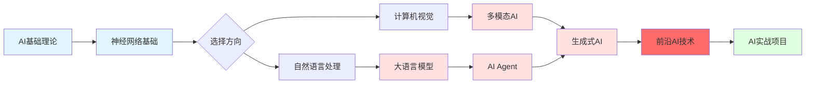

# 人工智能

:::info 章节概述
本章节系统介绍人工智能的完整知识体系，从基础理论到最前沿的技术应用。
:::

## 🗺️ 学习路径



## 📚 本章内容

### 🎯 基础篇（入门必学）

- **[AI基础理论](./AI基础理论)** - AI概述、发展史、数学基础、核心概念
- **[神经网络基础](./神经网络基础)** - 从感知机到深度网络、反向传播、优化算法

### 🚀 前沿技术篇（最新AI技术）

- **[大语言模型](./大语言模型)** - GPT、BERT、LLaMA、RLHF、Prompt工程
- **[多模态AI](./多模态AI)** - CLIP、GPT-4V、视觉-语言模型、跨模态学习
- **[AI Agent](./AI-Agent)** - ReAct、工具调用、记忆系统、多Agent协作
- **[生成式AI](./生成式AI)** - GAN、Diffusion、Stable Diffusion、AIGC应用
- **[前沿AI技术](./前沿AI技术)** - 🔥 MCP、OpenClaw、液态神经网络（2024-2025最新）

### 💼 应用实践篇（实战项目）

- **[计算机视觉](./计算机视觉)** - 图像分类、目标检测、图像分割、人脸识别
- **[自然语言处理](./自然语言处理)** - 文本分类、NER、机器翻译、问答系统
- **[AI实战项目](./AI实战项目)** - 完整项目案例、从数据到部署的全流程

## 🎯 学习建议

### 🌱 初学者路径（0-3个月）
1. **第1周**: 学习**AI基础理论**，理解AI、ML、DL的关系和核心概念
2. **第2-4周**: 掌握**神经网络基础**，手写反向传播，理解梯度下降
3. **第5-8周**: 选择一个方向深入：
   - 喜欢图像 → **计算机视觉**
   - 喜欢文本 → **自然语言处理**
4. **第9-12周**: 完成**AI实战项目**，构建完整应用

### 🚀 进阶路径（3-6个月）
1. **深入Transformer**: 理解注意力机制，实现mini-GPT
2. **大语言模型**: 学习Prompt工程，微调开源模型（LLaMA、Qwen）
3. **多模态AI**: 实践CLIP、图像生成（Stable Diffusion）
4. **AI Agent**: 构建能调用工具的智能助手

### 💡 实战建议
- ✅ **每天编码**: 每个概念都要动手实现，不要只看不练
- ✅ **项目驱动**: 带着问题学习，做出能用的东西
- ✅ **参与竞赛**: Kaggle、天池等平台实战
- ✅ **阅读论文**: 关注arXiv最新研究
- ✅ **开源贡献**: 参与Hugging Face、LangChain等项目

### ⚡ 快速上手技巧
```python
# 1. 先用现成的库快速实现
from transformers import pipeline
classifier = pipeline("sentiment-analysis")
result = classifier("I love AI!")

# 2. 再深入理解原理
# 3. 最后尝试从零实现
```

## 🔥 2024-2025 AI前沿趋势

### 🌟 革命性技术（重中之重）

**MCP (Model Context Protocol)**
- Anthropic推出的开放协议
- 标准化AI应用与数据源连接
- 统一的资源、工具、提示接口
- 将成为AI应用开发的新标准

**OpenClaw**
- 最新的开源AI Agent框架
- 强大的任务规划和自主执行能力
- 多工具集成和复杂推理
- 适合构建生产级AI应用

**液态神经网络 (Liquid Neural Networks)**
- MIT CSAIL的突破性架构
- 参数量减少100-1000倍
- 动态适应、高度可解释
- 适合边缘设备和实时系统
- 自动驾驶、机器人控制的未来

### 🤖 大语言模型（LLM）
- **超长上下文**: 从4K到1M+ tokens（Gemini 1.5 Pro）
- **多模态原生**: GPT-4V、Claude 3、Gemini统一处理文本/图像/音频
- **开源爆发**: LLaMA 3、Qwen 2.5、DeepSeek性能逼近闭源模型
- **小模型崛起**: Phi-3、Gemma等小而强的模型

### 🎨 生成式AI（AIGC）
- **文本生成**: ChatGPT、Claude、Gemini对话能力持续提升
- **图像生成**: DALL-E 3、Midjourney V6、Stable Diffusion 3
- **视频生成**: Sora、Runway Gen-3、Pika 1.0实现文本生成视频
- **音乐生成**: Suno、Udio生成完整歌曲
- **3D生成**: 从文本/图像生成3D模型

### 🤝 AI Agent智能体
- **自主决策**: Agent能独立规划和执行复杂任务
- **工具调用**: 集成搜索、计算器、API等外部工具
- **多Agent协作**: 多个Agent分工合作完成任务
- **实际应用**: 代码助手（Cursor、GitHub Copilot）、自动化工作流

### 🔒 AI安全与对齐
- **RLHF优化**: 通过人类反馈持续改进模型
- **Constitutional AI**: 让AI遵循道德准则
- **可解释性**: 理解AI的决策过程
- **防御攻击**: 对抗prompt注入、越狱等攻击

### 💼 AI工程化
- **模型压缩**: 量化、剪枝、蒸馏降低部署成本
- **边缘部署**: 在手机、IoT设备上运行AI
- **RAG应用**: 检索增强生成成为标配
- **向量数据库**: Pinecone、Weaviate、Milvus快速发展

## 📖 推荐资源

### 经典书籍
- 《深度学习》- Ian Goodfellow
- 《动手学深度学习》- 李沐
- 《机器学习》- 周志华
- 《统计学习方法》- 李航

### 在线课程
- Andrew Ng - 机器学习/深度学习专项课程
- 李宏毅 - 机器学习/深度学习课程
- Fast.ai - 实用深度学习
- Stanford CS224N - NLP
- Stanford CS231N - CV

### 论文资源
- arXiv.org - 最新论文
- Papers with Code - 论文+代码
- Hugging Face - 模型和数据集
- GitHub - 开源项目

### 社区与工具
- Kaggle - 竞赛和数据集
- Hugging Face - Transformers库
- PyTorch/TensorFlow - 深度学习框架
- LangChain - LLM应用开发

## 🚀 快速开始

### 环境配置

```bash
# 安装PyTorch
pip install torch torchvision torchaudio

# 安装Transformers
pip install transformers

# 安装常用库
pip install numpy pandas matplotlib scikit-learn

# 安装Jupyter
pip install jupyter
```

### 第一个神经网络

```python
import torch
import torch.nn as nn

# 定义简单的神经网络
class SimpleNet(nn.Module):
    def __init__(self):
        super().__init__()
        self.fc1 = nn.Linear(784, 128)
        self.fc2 = nn.Linear(128, 10)
        self.relu = nn.ReLU()
    
    def forward(self, x):
        x = x.view(-1, 784)
        x = self.relu(self.fc1(x))
        x = self.fc2(x)
        return x

# 创建模型
model = SimpleNet()
print(model)
```

### 使用预训练模型

```python
from transformers import pipeline

# 文本分类
classifier = pipeline("sentiment-analysis")
result = classifier("I love this!")
print(result)

# 文本生成
generator = pipeline("text-generation", model="gpt2")
result = generator("Once upon a time", max_length=50)
print(result)
```

## 💡 学习技巧

1. **理论与实践结合**：每学一个概念就动手实现
2. **从简单到复杂**：先掌握基础，再学习前沿
3. **阅读论文**：了解最新研究进展
4. **参与项目**：实际应用中学习
5. **持续学习**：AI领域发展迅速，保持学习

<DocCardList />

