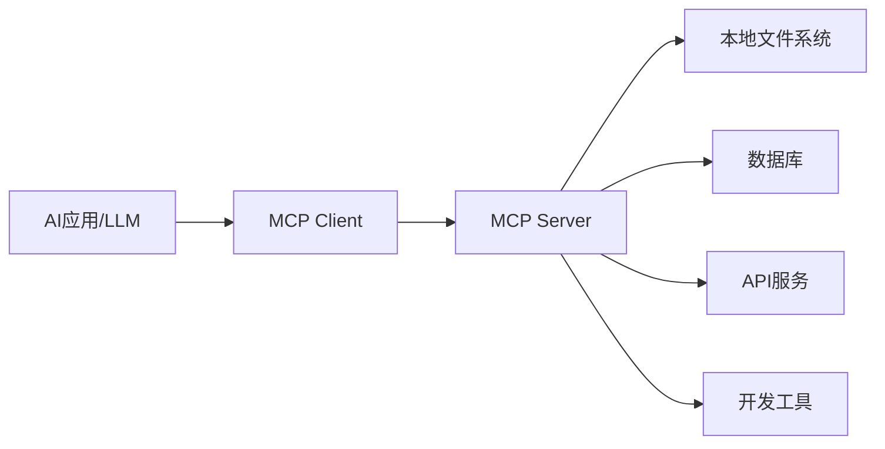

# 前沿AI技术

:::info 章节概述
本章节介绍2024-2025年最前沿的AI技术，包括MCP、OpenClaw、液态神经网络等突破性进展。
:::

## MCP (Model Context Protocol)

### 什么是MCP

**MCP（Model Context Protocol）** 是Anthropic在2024年11月推出的开放协议，旨在标准化AI应用与数据源之间的连接方式。

### 核心概念



**三大核心组件**：
1. **Resources（资源）**：AI可以读取的数据源
2. **Tools（工具）**：AI可以调用的功能
3. **Prompts（提示）**：预定义的提示模板

### MCP架构

```python
# MCP Server 基础实现
from mcp import Server, Resource, Tool
import json

class MCPServer:
    """MCP服务器实现"""
    
    def __init__(self, name: str):
        self.server = Server(name)
        self._register_resources()
        self._register_tools()
        self._register_prompts()
    
    def _register_resources(self):
        """注册资源"""
        @self.server.resource("file://documents")
        async def get_documents():
            """提供文档资源"""
            return {
                "uri": "file://documents",
                "mimeType": "application/json",
                "text": json.dumps({
                    "documents": ["doc1.txt", "doc2.txt"]
                })
            }
    
    def _register_tools(self):
        """注册工具"""
        @self.server.tool("search")
        async def search_tool(query: str):
            """搜索工具"""
            # 实现搜索逻辑
            results = await self._search(query)
            return {
                "content": [
                    {
                        "type": "text",
                        "text": f"搜索结果: {results}"
                    }
                ]
            }
        
        @self.server.tool("calculator")
        async def calculator_tool(expression: str):
            """计算器工具"""
            try:
                result = eval(expression)
                return {
                    "content": [
                        {
                            "type": "text",
                            "text": f"计算结果: {result}"
                        }
                    ]
                }
            except Exception as e:
                return {"error": str(e)}
    
    def _register_prompts(self):
        """注册提示模板"""
        @self.server.prompt("code-review")
        async def code_review_prompt(code: str):
            """代码审查提示"""
            return {
                "messages": [
                    {
                        "role": "user",
                        "content": f"请审查以下代码:\n\n{code}"
                    }
                ]
            }
    
    async def _search(self, query: str):
        """搜索实现"""
        # 实际搜索逻辑
        return f"关于'{query}'的搜索结果"
    
    async def run(self):
        """运行服务器"""
        await self.server.run()

# 使用示例
if __name__ == "__main__":
    import asyncio
    
    server = MCPServer("my-mcp-server")
    asyncio.run(server.run())
```

### MCP Client实现

```python
from mcp import Client
import asyncio

class MCPClient:
    """MCP客户端"""
    
    def __init__(self, server_url: str):
        self.client = Client(server_url)
    
    async def connect(self):
        """连接到MCP服务器"""
        await self.client.connect()
    
    async def list_resources(self):
        """列出所有资源"""
        resources = await self.client.list_resources()
        return resources
    
    async def read_resource(self, uri: str):
        """读取资源"""
        resource = await self.client.read_resource(uri)
        return resource
    
    async def call_tool(self, tool_name: str, arguments: dict):
        """调用工具"""
        result = await self.client.call_tool(tool_name, arguments)
        return result
    
    async def get_prompt(self, prompt_name: str, arguments: dict):
        """获取提示"""
        prompt = await self.client.get_prompt(prompt_name, arguments)
        return prompt

# 使用示例
async def main():
    client = MCPClient("http://localhost:8000")
    await client.connect()
    
    # 列出资源
    resources = await client.list_resources()
    print("可用资源:", resources)
    
    # 调用工具
    result = await client.call_tool("search", {"query": "AI技术"})
    print("搜索结果:", result)
    
    # 使用提示
    prompt = await client.get_prompt("code-review", {"code": "def hello(): pass"})
    print("提示:", prompt)

asyncio.run(main())
```

### MCP实战：文件系统服务器

```python
import os
from pathlib import Path
from mcp import Server

class FileSystemMCPServer:
    """文件系统MCP服务器"""
    
    def __init__(self, root_path: str):
        self.root_path = Path(root_path)
        self.server = Server("filesystem")
        self._setup()
    
    def _setup(self):
        """设置服务器"""
        
        @self.server.resource("file://list")
        async def list_files():
            """列出所有文件"""
            files = []
            for file in self.root_path.rglob("*"):
                if file.is_file():
                    files.append(str(file.relative_to(self.root_path)))
            
            return {
                "uri": "file://list",
                "mimeType": "application/json",
                "text": json.dumps({"files": files})
            }
        
        @self.server.tool("read_file")
        async def read_file(path: str):
            """读取文件内容"""
            file_path = self.root_path / path
            
            if not file_path.exists():
                return {"error": "文件不存在"}
            
            try:
                content = file_path.read_text()
                return {
                    "content": [
                        {
                            "type": "text",
                            "text": content
                        }
                    ]
                }
            except Exception as e:
                return {"error": str(e)}
        
        @self.server.tool("write_file")
        async def write_file(path: str, content: str):
            """写入文件"""
            file_path = self.root_path / path
            
            try:
                file_path.parent.mkdir(parents=True, exist_ok=True)
                file_path.write_text(content)
                return {
                    "content": [
                        {
                            "type": "text",
                            "text": f"成功写入文件: {path}"
                        }
                    ]
                }
            except Exception as e:
                return {"error": str(e)}
        
        @self.server.tool("search_files")
        async def search_files(pattern: str):
            """搜索文件"""
            matches = list(self.root_path.rglob(pattern))
            files = [str(f.relative_to(self.root_path)) for f in matches if f.is_file()]
            
            return {
                "content": [
                    {
                        "type": "text",
                        "text": f"找到 {len(files)} 个文件:\n" + "\n".join(files)
                    }
                ]
            }
```

### MCP的优势

**统一接口**：
- 一次实现，到处使用
- 标准化的协议
- 易于集成

**安全性**：
- 细粒度权限控制
- 资源隔离
- 审计日志

**可扩展性**：
- 插件化架构
- 支持自定义工具
- 社区生态

## OpenClaw

### 什么是OpenClaw

**OpenClaw** 是2024年底推出的开源AI Agent框架，专注于复杂任务的自主执行和多步骤推理。

### 核心特性

```python
from openclaw import Agent, Task, Tool
import asyncio

class OpenClawAgent:
    """OpenClaw Agent实现"""
    
    def __init__(self, name: str, model: str = "gpt-4"):
        self.agent = Agent(
            name=name,
            model=model,
            temperature=0.7,
            max_iterations=10
        )
        self._register_tools()
    
    def _register_tools(self):
        """注册工具"""
        
        @Tool(name="web_search")
        async def web_search(query: str) -> str:
            """网络搜索工具"""
            # 实现搜索逻辑
            return f"搜索结果: {query}"
        
        @Tool(name="code_executor")
        async def code_executor(code: str, language: str = "python") -> str:
            """代码执行工具"""
            # 安全执行代码
            try:
                if language == "python":
                    result = exec(code)
                    return f"执行成功: {result}"
            except Exception as e:
                return f"执行失败: {str(e)}"
        
        @Tool(name="file_manager")
        async def file_manager(action: str, path: str, content: str = None) -> str:
            """文件管理工具"""
            if action == "read":
                with open(path, 'r') as f:
                    return f.read()
            elif action == "write":
                with open(path, 'w') as f:
                    f.write(content)
                return f"写入成功: {path}"
        
        self.agent.register_tool(web_search)
        self.agent.register_tool(code_executor)
        self.agent.register_tool(file_manager)
    
    async def execute_task(self, task_description: str):
        """执行任务"""
        task = Task(
            description=task_description,
            agent=self.agent
        )
        
        result = await task.execute()
        return result

# 使用示例
async def main():
    agent = OpenClawAgent("research-agent")
    
    # 复杂任务：研究并总结
    task = """
    1. 搜索关于液态神经网络的最新研究
    2. 总结关键发现
    3. 生成一份研究报告
    4. 保存到文件
    """
    
    result = await agent.execute_task(task)
    print("任务结果:", result)

asyncio.run(main())
```

### OpenClaw的规划能力

```python
class OpenClawPlanner:
    """OpenClaw规划器"""
    
    def __init__(self, agent):
        self.agent = agent
    
    async def plan(self, goal: str):
        """制定计划"""
        planning_prompt = f"""
        目标: {goal}
        
        请制定详细的执行计划，包括：
        1. 分解为子任务
        2. 确定每个子任务需要的工具
        3. 识别依赖关系
        4. 估计执行时间
        
        输出格式：
        - 任务1: [描述] (工具: [工具名], 依赖: [依赖任务], 时间: [估计])
        - 任务2: ...
        """
        
        plan = await self.agent.generate(planning_prompt)
        return self._parse_plan(plan)
    
    def _parse_plan(self, plan_text: str):
        """解析计划"""
        tasks = []
        for line in plan_text.split('\n'):
            if line.strip().startswith('-'):
                # 解析任务信息
                task_info = self._extract_task_info(line)
                tasks.append(task_info)
        return tasks
    
    async def execute_plan(self, tasks):
        """执行计划"""
        results = []
        completed = set()
        
        while len(completed) < len(tasks):
            for i, task in enumerate(tasks):
                if i in completed:
                    continue
                
                # 检查依赖是否完成
                if self._dependencies_met(task, completed):
                    result = await self._execute_task(task)
                    results.append(result)
                    completed.add(i)
        
        return results
```

### OpenClaw实战：自动化研究助手

```python
class ResearchAssistant:
    """自动化研究助手"""
    
    def __init__(self):
        self.agent = OpenClawAgent("research-assistant")
    
    async def research_topic(self, topic: str):
        """研究主题"""
        workflow = f"""
        研究主题: {topic}
        
        执行步骤:
        1. 使用web_search搜索最新论文和文章
        2. 提取关键信息和数据
        3. 分析趋势和发现
        4. 生成结构化报告
        5. 创建可视化图表
        6. 保存完整报告
        """
        
        result = await self.agent.execute_task(workflow)
        return result
    
    async def compare_technologies(self, tech1: str, tech2: str):
        """比较技术"""
        workflow = f"""
        比较 {tech1} 和 {tech2}:
        
        1. 分别搜索两种技术的信息
        2. 提取关键特性和优缺点
        3. 创建对比表格
        4. 生成推荐建议
        """
        
        result = await self.agent.execute_task(workflow)
        return result
```

## 液态神经网络 (Liquid Neural Networks)

### 什么是液态神经网络

**液态神经网络（LNN）** 是MIT CSAIL在2020年提出的革命性神经网络架构，灵感来自线虫的神经系统。

### 核心特性

**动态性**：
- 权重在推理时持续变化
- 适应输入的时间特性
- 不需要重新训练

**紧凑性**：
- 参数量极少（19个神经元可完成复杂任务）
- 比传统网络小100-1000倍
- 更高的可解释性

**因果性**：
- 理解时间因果关系
- 更好的泛化能力
- 适合时间序列任务

### 液态神经网络实现

```python
import torch
import torch.nn as nn
import numpy as np

class LiquidNeuron(nn.Module):
    """液态神经元"""
    
    def __init__(self, input_size, hidden_size):
        super().__init__()
        
        # 时间常数（可学习）
        self.tau = nn.Parameter(torch.rand(hidden_size))
        
        # 输入权重
        self.W_in = nn.Parameter(torch.randn(input_size, hidden_size))
        
        # 循环权重
        self.W_rec = nn.Parameter(torch.randn(hidden_size, hidden_size))
        
        # 偏置
        self.bias = nn.Parameter(torch.zeros(hidden_size))
    
    def forward(self, x, h, dt=0.1):
        """
        前向传播
        x: 输入 (batch, input_size)
        h: 隐藏状态 (batch, hidden_size)
        dt: 时间步长
        """
        # 计算输入贡献
        input_contrib = torch.matmul(x, self.W_in)
        
        # 计算循环贡献
        recurrent_contrib = torch.matmul(h, self.W_rec)
        
        # 液态动力学方程
        # dh/dt = (-h + f(W_in*x + W_rec*h + b)) / tau
        f = torch.tanh(input_contrib + recurrent_contrib + self.bias)
        
        # 欧拉方法更新
        dh = (-h + f) / self.tau
        h_new = h + dt * dh
        
        return h_new


class LiquidNeuralNetwork(nn.Module):
    """液态神经网络"""
    
    def __init__(self, input_size, hidden_size, output_size, num_layers=1):
        super().__init__()
        
        self.hidden_size = hidden_size
        self.num_layers = num_layers
        
        # 液态层
        self.liquid_layers = nn.ModuleList([
            LiquidNeuron(
                input_size if i == 0 else hidden_size,
                hidden_size
            )
            for i in range(num_layers)
        ])
        
        # 输出层
        self.output_layer = nn.Linear(hidden_size, output_size)
    
    def forward(self, x, h=None, dt=0.1):
        """
        前向传播
        x: (batch, seq_len, input_size)
        """
        batch_size, seq_len, _ = x.shape
        
        # 初始化隐藏状态
        if h is None:
            h = [torch.zeros(batch_size, self.hidden_size, device=x.device)
                 for _ in range(self.num_layers)]
        
        outputs = []
        
        # 处理序列
        for t in range(seq_len):
            x_t = x[:, t, :]
            
            # 通过液态层
            for i, layer in enumerate(self.liquid_layers):
                h[i] = layer(x_t if i == 0 else h[i-1], h[i], dt)
            
            # 输出
            out = self.output_layer(h[-1])
            outputs.append(out)
        
        return torch.stack(outputs, dim=1), h


# 训练示例
def train_liquid_network():
    """训练液态神经网络"""
    
    # 创建模型
    model = LiquidNeuralNetwork(
        input_size=10,
        hidden_size=32,
        output_size=1,
        num_layers=2
    )
    
    # 优化器
    optimizer = torch.optim.Adam(model.parameters(), lr=0.001)
    criterion = nn.MSELoss()
    
    # 训练数据（时间序列）
    X = torch.randn(64, 100, 10)  # (batch, seq_len, input_size)
    y = torch.randn(64, 100, 1)   # (batch, seq_len, output_size)
    
    # 训练循环
    for epoch in range(100):
        optimizer.zero_grad()
        
        # 前向传播
        outputs, _ = model(X)
        
        # 计算损失
        loss = criterion(outputs, y)
        
        # 反向传播
        loss.backward()
        optimizer.step()
        
        if (epoch + 1) % 10 == 0:
            print(f'Epoch [{epoch+1}/100], Loss: {loss.item():.4f}')
    
    return model

# 使用
model = train_liquid_network()
```

### 液态神经网络的应用

**1. 自动驾驶**

```python
class AutonomousDrivingLNN:
    """自动驾驶液态神经网络"""
    
    def __init__(self):
        self.model = LiquidNeuralNetwork(
            input_size=128,  # 传感器输入
            hidden_size=64,
            output_size=4,   # 转向、加速、刹车、档位
            num_layers=3
        )
    
    def process_sensor_data(self, camera, lidar, radar):
        """处理传感器数据"""
        # 融合多传感器数据
        features = self._extract_features(camera, lidar, radar)
        return features
    
    def predict_action(self, sensor_data, hidden_state=None):
        """预测驾驶动作"""
        # 前向传播
        actions, new_hidden = self.model(sensor_data, hidden_state)
        
        return {
            'steering': actions[:, :, 0],
            'throttle': actions[:, :, 1],
            'brake': actions[:, :, 2],
            'gear': actions[:, :, 3]
        }, new_hidden
```

**2. 机器人控制**

```python
class RobotControlLNN:
    """机器人控制液态神经网络"""
    
    def __init__(self, num_joints):
        self.model = LiquidNeuralNetwork(
            input_size=num_joints * 3,  # 位置、速度、力矩
            hidden_size=128,
            output_size=num_joints,     # 关节控制信号
            num_layers=2
        )
    
    def control(self, joint_states, target_pose):
        """生成控制信号"""
        # 计算误差
        error = target_pose - joint_states
        
        # 生成控制信号
        control_signals, _ = self.model(error)
        
        return control_signals
```

**3. 时间序列预测**

```python
class TimeSeriesLNN:
    """时间序列预测"""
    
    def __init__(self, input_dim, forecast_horizon):
        self.model = LiquidNeuralNetwork(
            input_size=input_dim,
            hidden_size=64,
            output_size=input_dim,
            num_layers=2
        )
        self.forecast_horizon = forecast_horizon
    
    def forecast(self, history):
        """预测未来值"""
        predictions = []
        hidden = None
        
        # 使用历史数据初始化
        _, hidden = self.model(history, hidden)
        
        # 自回归预测
        last_value = history[:, -1:, :]
        
        for _ in range(self.forecast_horizon):
            pred, hidden = self.model(last_value, hidden)
            predictions.append(pred)
            last_value = pred
        
        return torch.cat(predictions, dim=1)
```

### 液态神经网络的优势

**参数效率**：
```python
# 传统LSTM
lstm = nn.LSTM(input_size=10, hidden_size=128, num_layers=2)
lstm_params = sum(p.numel() for p in lstm.parameters())
print(f"LSTM参数量: {lstm_params}")  # ~200K

# 液态神经网络
lnn = LiquidNeuralNetwork(input_size=10, hidden_size=32, output_size=1)
lnn_params = sum(p.numel() for p in lnn.parameters())
print(f"LNN参数量: {lnn_params}")  # ~2K

print(f"参数减少: {lstm_params / lnn_params:.1f}x")
```

**可解释性**：
```python
def visualize_liquid_dynamics(model, input_sequence):
    """可视化液态动力学"""
    import matplotlib.pyplot as plt
    
    # 记录隐藏状态
    hidden_states = []
    h = None
    
    for t in range(input_sequence.shape[1]):
        x_t = input_sequence[:, t:t+1, :]
        _, h = model(x_t, h)
        hidden_states.append(h[0].detach().numpy())
    
    # 绘制神经元活动
    hidden_states = np.array(hidden_states).squeeze()
    
    plt.figure(figsize=(12, 6))
    plt.imshow(hidden_states.T, aspect='auto', cmap='viridis')
    plt.colorbar(label='Activation')
    plt.xlabel('Time Step')
    plt.ylabel('Neuron')
    plt.title('Liquid Neural Network Dynamics')
    plt.show()
```

## 总结

### MCP
- ✅ 标准化AI应用与数据源连接
- ✅ 统一的资源、工具、提示接口
- ✅ 安全、可扩展的架构

### OpenClaw
- ✅ 强大的任务规划和执行能力
- ✅ 多工具集成
- ✅ 自主决策和推理

### 液态神经网络
- ✅ 极致的参数效率
- ✅ 动态适应能力
- ✅ 更好的可解释性
- ✅ 适合边缘设备和实时系统

**学习建议**：
1. 从MCP开始，理解标准化协议的重要性
2. 实践OpenClaw，构建复杂的AI Agent
3. 研究液态神经网络，探索新型架构
4. 关注这些技术的最新进展

<DocCardList />

