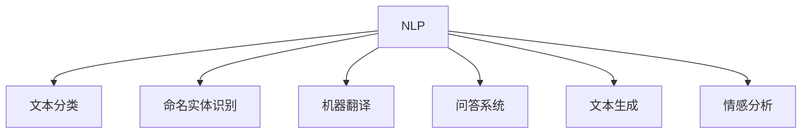

# 自然语言处理（NLP）

:::info 章节概述
本章节介绍自然语言处理的核心技术，包括文本分类、命名实体识别、机器翻译等任务。
:::

## 什么是NLP

**自然语言处理（NLP）** 是让计算机理解和生成人类语言的技术。

### 核心任务



## 文本预处理

```python
import re
import jieba
from collections import Counter

class TextPreprocessor:
    """文本预处理器"""
    
    def __init__(self):
        self.stopwords = self._load_stopwords()
    
    def clean_text(self, text):
        """清洗文本"""
        # 去除特殊字符
        text = re.sub(r'[^\w\s]', '', text)
        # 转小写
        text = text.lower()
        # 去除多余空格
        text = ' '.join(text.split())
        return text
    
    def tokenize_chinese(self, text):
        """中文分词"""
        return list(jieba.cut(text))
    
    def remove_stopwords(self, tokens):
        """去除停用词"""
        return [t for t in tokens if t not in self.stopwords]
    
    def _load_stopwords(self):
        """加载停用词"""
        # 实际应该从文件加载
        return set(['的', '了', '在', '是', '我', '有', '和'])

# 使用
preprocessor = TextPreprocessor()
text = "自然语言处理是人工智能的重要分支！"
tokens = preprocessor.tokenize_chinese(text)
print(tokens)
```

## 词向量（Word Embeddings）

### Word2Vec

```python
from gensim.models import Word2Vec

class WordEmbedding:
    """词向量模型"""
    
    def __init__(self, sentences, vector_size=100):
        # 训练Word2Vec模型
        self.model = Word2Vec(
            sentences=sentences,
            vector_size=vector_size,
            window=5,
            min_count=1,
            workers=4
        )
    
    def get_vector(self, word):
        """获取词向量"""
        return self.model.wv[word]
    
    def most_similar(self, word, topn=10):
        """找最相似的词"""
        return self.model.wv.most_similar(word, topn=topn)
    
    def similarity(self, word1, word2):
        """计算词相似度"""
        return self.model.wv.similarity(word1, word2)

# 使用
sentences = [['我', '爱', '自然语言处理'], ['深度学习', '很', '有趣']]
embedding = WordEmbedding(sentences)
similar_words = embedding.most_similar('自然语言处理')
```

## 文本分类

### 使用Transformers

```python
from transformers import AutoTokenizer, AutoModelForSequenceClassification
import torch

class TextClassifier:
    """文本分类器"""
    
    def __init__(self, model_name='bert-base-chinese'):
        self.tokenizer = AutoTokenizer.from_pretrained(model_name)
        self.model = AutoModelForSequenceClassification.from_pretrained(
            model_name,
            num_labels=2
        )
    
    def predict(self, text):
        """预测文本类别"""
        # 编码
        inputs = self.tokenizer(
            text,
            return_tensors='pt',
            padding=True,
            truncation=True,
            max_length=512
        )
        
        # 预测
        with torch.no_grad():
            outputs = self.model(**inputs)
            logits = outputs.logits
            probs = torch.softmax(logits, dim=-1)
        
        # 获取预测结果
        pred_label = torch.argmax(probs, dim=-1).item()
        confidence = probs[0][pred_label].item()
        
        return {
            'label': pred_label,
            'confidence': confidence
        }
    
    def train(self, train_texts, train_labels, epochs=3):
        """训练模型"""
        from torch.utils.data import DataLoader, TensorDataset
        
        # 编码数据
        encodings = self.tokenizer(
            train_texts,
            padding=True,
            truncation=True,
            return_tensors='pt'
        )
        
        # 创建数据集
        dataset = TensorDataset(
            encodings['input_ids'],
            encodings['attention_mask'],
            torch.tensor(train_labels)
        )
        dataloader = DataLoader(dataset, batch_size=16, shuffle=True)
        
        # 优化器
        optimizer = torch.optim.AdamW(self.model.parameters(), lr=2e-5)
        
        # 训练
        self.model.train()
        for epoch in range(epochs):
            for batch in dataloader:
                input_ids, attention_mask, labels = batch
                
                outputs = self.model(
                    input_ids=input_ids,
                    attention_mask=attention_mask,
                    labels=labels
                )
                
                loss = outputs.loss
                loss.backward()
                optimizer.step()
                optimizer.zero_grad()
            
            print(f"Epoch {epoch+1}, Loss: {loss.item():.4f}")

# 使用
classifier = TextClassifier()
result = classifier.predict("这部电影非常精彩！")
print(f"类别: {result['label']}, 置信度: {result['confidence']:.2%}")
```

## 命名实体识别（NER）

```python
from transformers import pipeline

class NERSystem:
    """命名实体识别系统"""
    
    def __init__(self):
        self.ner = pipeline(
            "ner",
            model="ckiplab/bert-base-chinese-ner",
            aggregation_strategy="simple"
        )
    
    def extract_entities(self, text):
        """提取实体"""
        results = self.ner(text)
        
        entities = []
        for entity in results:
            entities.append({
                'text': entity['word'],
                'type': entity['entity_group'],
                'score': entity['score']
            })
        
        return entities

# 使用
ner = NERSystem()
text = "苹果公司的CEO蒂姆·库克在加州宣布了新产品"
entities = ner.extract_entities(text)
for e in entities:
    print(f"{e['text']} ({e['type']}): {e['score']:.2f}")
```

## 机器翻译

```python
from transformers import MarianMTModel, MarianTokenizer

class Translator:
    """机器翻译"""
    
    def __init__(self, src_lang='zh', tgt_lang='en'):
        model_name = f'Helsinki-NLP/opus-mt-{src_lang}-{tgt_lang}'
        self.tokenizer = MarianTokenizer.from_pretrained(model_name)
        self.model = MarianMTModel.from_pretrained(model_name)
    
    def translate(self, text):
        """翻译文本"""
        # 编码
        inputs = self.tokenizer(text, return_tensors='pt', padding=True)
        
        # 生成翻译
        translated = self.model.generate(**inputs)
        
        # 解码
        result = self.tokenizer.decode(translated[0], skip_special_tokens=True)
        
        return result

# 使用
translator = Translator(src_lang='zh', tgt_lang='en')
result = translator.translate("你好，世界！")
print(result)
```

## 问答系统

```python
from transformers import pipeline

class QASystem:
    """问答系统"""
    
    def __init__(self):
        self.qa = pipeline(
            "question-answering",
            model="uer/roberta-base-chinese-extractive-qa"
        )
    
    def answer(self, question, context):
        """回答问题"""
        result = self.qa(question=question, context=context)
        
        return {
            'answer': result['answer'],
            'score': result['score'],
            'start': result['start'],
            'end': result['end']
        }

# 使用
qa = QASystem()
context = "自然语言处理是人工智能的一个重要分支，它研究如何让计算机理解和生成人类语言。"
question = "什么是自然语言处理？"
answer = qa.answer(question, context)
print(f"答案: {answer['answer']}")
```

## 情感分析

```python
class SentimentAnalyzer:
    """情感分析"""
    
    def __init__(self):
        self.classifier = pipeline(
            "sentiment-analysis",
            model="uer/roberta-base-finetuned-chinanews-chinese"
        )
    
    def analyze(self, text):
        """分析情感"""
        result = self.classifier(text)[0]
        
        return {
            'sentiment': result['label'],
            'score': result['score']
        }
    
    def batch_analyze(self, texts):
        """批量分析"""
        results = self.classifier(texts)
        return results

# 使用
analyzer = SentimentAnalyzer()
result = analyzer.analyze("这个产品质量很好，我很满意！")
print(f"情感: {result['sentiment']}, 得分: {result['score']:.2%}")
```

## 实战项目

### 项目1：智能客服

```python
class CustomerServiceBot:
    """智能客服机器人"""
    
    def __init__(self):
        self.classifier = TextClassifier()
        self.qa = QASystem()
        self.knowledge_base = self._load_knowledge_base()
    
    def handle_query(self, query):
        """处理用户查询"""
        # 1. 意图识别
        intent = self.classifier.predict(query)
        
        # 2. 根据意图处理
        if intent['label'] == 'question':
            # 问答
            context = self.knowledge_base.get(query, "")
            answer = self.qa.answer(query, context)
            return answer['answer']
        
        elif intent['label'] == 'complaint':
            # 投诉处理
            return "非常抱歉给您带来不便，我们会尽快处理。"
        
        else:
            return "您好，请问有什么可以帮助您的？"
    
    def _load_knowledge_base(self):
        """加载知识库"""
        return {
            "退货": "您可以在购买后7天内申请退货...",
            "物流": "您的订单正在配送中..."
        }

# 使用
bot = CustomerServiceBot()
response = bot.handle_query("如何退货？")
print(response)
```

### 项目2：文本摘要

```python
from transformers import pipeline

class TextSummarizer:
    """文本摘要"""
    
    def __init__(self):
        self.summarizer = pipeline(
            "summarization",
            model="csebuetnlp/mT5_multilingual_XLSum"
        )
    
    def summarize(self, text, max_length=150, min_length=50):
        """生成摘要"""
        summary = self.summarizer(
            text,
            max_length=max_length,
            min_length=min_length,
            do_sample=False
        )
        
        return summary[0]['summary_text']

# 使用
summarizer = TextSummarizer()
long_text = """
人工智能是计算机科学的一个分支，它企图了解智能的实质，
并生产出一种新的能以人类智能相似的方式做出反应的智能机器。
该领域的研究包括机器人、语言识别、图像识别、自然语言处理和专家系统等。
"""
summary = summarizer.summarize(long_text)
print(summary)
```

## 最佳实践

### 数据增强

```python
import nlpaug.augmenter.word as naw

# 同义词替换
aug = naw.SynonymAug(aug_src='wordnet')
augmented_text = aug.augment("这是一个很好的例子")

# 回译增强
from transformers import MarianMTModel, MarianTokenizer

def back_translation(text, src='zh', pivot='en'):
    """回译数据增强"""
    # 翻译到中间语言
    translator1 = Translator(src, pivot)
    intermediate = translator1.translate(text)
    
    # 翻译回原语言
    translator2 = Translator(pivot, src)
    result = translator2.translate(intermediate)
    
    return result
```

### 模型微调

```python
from transformers import Trainer, TrainingArguments

def fine_tune_model(model, train_dataset, eval_dataset):
    """微调模型"""
    training_args = TrainingArguments(
        output_dir='./results',
        num_train_epochs=3,
        per_device_train_batch_size=16,
        per_device_eval_batch_size=64,
        warmup_steps=500,
        weight_decay=0.01,
        logging_dir='./logs',
        logging_steps=10,
        evaluation_strategy="epoch"
    )
    
    trainer = Trainer(
        model=model,
        args=training_args,
        train_dataset=train_dataset,
        eval_dataset=eval_dataset
    )
    
    trainer.train()
    return trainer
```

## 总结

**关键要点**:
1. Transformer是现代NLP的基础
2. 预训练模型大幅提升性能
3. 微调适配特定任务
4. 数据质量决定效果

**学习建议**:
- 掌握文本预处理技术
- 理解Transformer原理
- 实践各类NLP任务
- 关注最新的语言模型

<DocCardList />

