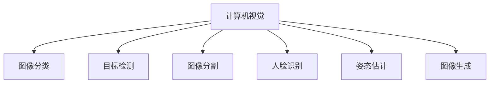

# 计算机视觉（Computer Vision）

:::info 章节概述
本章节介绍计算机视觉的核心技术，包括图像分类、目标检测、图像分割等经典任务。
:::

## 什么是计算机视觉

**计算机视觉（CV）** 是让计算机能够"看懂"图像和视频的技术，是人工智能的重要分支。

### 核心任务



## 卷积神经网络（CNN）

### CNN基础架构

```python
import torch
import torch.nn as nn

class SimpleCNN(nn.Module):
    """简单的CNN分类器"""
    def __init__(self, num_classes=10):
        super().__init__()
        
        # 卷积层
        self.conv1 = nn.Conv2d(3, 32, kernel_size=3, padding=1)
        self.conv2 = nn.Conv2d(32, 64, kernel_size=3, padding=1)
        self.conv3 = nn.Conv2d(64, 128, kernel_size=3, padding=1)
        
        # 池化层
        self.pool = nn.MaxPool2d(2, 2)
        
        # 全连接层
        self.fc1 = nn.Linear(128 * 4 * 4, 512)
        self.fc2 = nn.Linear(512, num_classes)
        
        # 激活和Dropout
        self.relu = nn.ReLU()
        self.dropout = nn.Dropout(0.5)
    
    def forward(self, x):
        # 卷积块1: 32x32 -> 16x16
        x = self.pool(self.relu(self.conv1(x)))
        
        # 卷积块2: 16x16 -> 8x8
        x = self.pool(self.relu(self.conv2(x)))
        
        # 卷积块3: 8x8 -> 4x4
        x = self.pool(self.relu(self.conv3(x)))
        
        # 展平
        x = x.view(-1, 128 * 4 * 4)
        
        # 全连接层
        x = self.dropout(self.relu(self.fc1(x)))
        x = self.fc2(x)
        
        return x

# 使用示例
model = SimpleCNN(num_classes=10)
x = torch.randn(1, 3, 32, 32)  # batch_size=1, channels=3, height=32, width=32
output = model(x)
print(f"输出形状: {output.shape}")  # [1, 10]
```

### 经典CNN架构

**ResNet（残差网络）**

```python
class ResidualBlock(nn.Module):
    """残差块"""
    def __init__(self, in_channels, out_channels, stride=1):
        super().__init__()
        
        self.conv1 = nn.Conv2d(in_channels, out_channels, 3, stride, 1)
        self.bn1 = nn.BatchNorm2d(out_channels)
        self.conv2 = nn.Conv2d(out_channels, out_channels, 3, 1, 1)
        self.bn2 = nn.BatchNorm2d(out_channels)
        
        # 快捷连接
        self.shortcut = nn.Sequential()
        if stride != 1 or in_channels != out_channels:
            self.shortcut = nn.Sequential(
                nn.Conv2d(in_channels, out_channels, 1, stride),
                nn.BatchNorm2d(out_channels)
            )
    
    def forward(self, x):
        out = torch.relu(self.bn1(self.conv1(x)))
        out = self.bn2(self.conv2(out))
        out += self.shortcut(x)  # 残差连接
        out = torch.relu(out)
        return out
```

## 图像分类

### 使用预训练模型

```python
from torchvision import models, transforms
from PIL import Image

class ImageClassifier:
    """图像分类器"""
    def __init__(self, model_name='resnet50'):
        # 加载预训练模型
        self.model = models.resnet50(pretrained=True)
        self.model.eval()
        
        # 图像预处理
        self.transform = transforms.Compose([
            transforms.Resize(256),
            transforms.CenterCrop(224),
            transforms.ToTensor(),
            transforms.Normalize(
                mean=[0.485, 0.456, 0.406],
                std=[0.229, 0.224, 0.225]
            )
        ])
        
        # 加载类别标签
        self.labels = self._load_labels()
    
    def predict(self, image_path, top_k=5):
        """预测图像类别"""
        # 加载和预处理图像
        image = Image.open(image_path).convert('RGB')
        input_tensor = self.transform(image).unsqueeze(0)
        
        # 预测
        with torch.no_grad():
            output = self.model(input_tensor)
            probabilities = torch.softmax(output[0], dim=0)
        
        # 获取top-k结果
        top_probs, top_indices = torch.topk(probabilities, top_k)
        
        results = []
        for prob, idx in zip(top_probs, top_indices):
            results.append({
                'label': self.labels[idx],
                'probability': prob.item()
            })
        
        return results
    
    def _load_labels(self):
        """加载ImageNet标签"""
        # 实际应该从文件加载
        return [f"class_{i}" for i in range(1000)]

# 使用
classifier = ImageClassifier()
results = classifier.predict('cat.jpg')
for r in results:
    print(f"{r['label']}: {r['probability']:.2%}")
```

## 目标检测

### YOLO实现

```python
from ultralytics import YOLO

class ObjectDetector:
    """目标检测器"""
    def __init__(self, model_path='yolov8n.pt'):
        self.model = YOLO(model_path)
    
    def detect(self, image_path, conf_threshold=0.5):
        """检测图像中的物体"""
        results = self.model(image_path, conf=conf_threshold)
        
        detections = []
        for result in results:
            boxes = result.boxes
            for box in boxes:
                detections.append({
                    'class': result.names[int(box.cls)],
                    'confidence': float(box.conf),
                    'bbox': box.xyxy[0].tolist()  # [x1, y1, x2, y2]
                })
        
        return detections
    
    def detect_video(self, video_path, output_path):
        """检测视频中的物体"""
        results = self.model(video_path, stream=True)
        
        for result in results:
            # 处理每一帧
            annotated_frame = result.plot()
            # 保存或显示帧
            pass

# 使用
detector = ObjectDetector()
detections = detector.detect('street.jpg')
for det in detections:
    print(f"{det['class']}: {det['confidence']:.2f} at {det['bbox']}")
```

## 图像分割

### 语义分割

```python
import torch
import torchvision.models.segmentation as segmentation

class SemanticSegmentation:
    """语义分割"""
    def __init__(self):
        self.model = segmentation.deeplabv3_resnet50(pretrained=True)
        self.model.eval()
    
    def segment(self, image):
        """分割图像"""
        with torch.no_grad():
            output = self.model(image)['out']
            # 获取每个像素的类别
            segmentation_map = output.argmax(1)
        
        return segmentation_map
    
    def visualize(self, image, segmentation_map):
        """可视化分割结果"""
        import matplotlib.pyplot as plt
        
        plt.figure(figsize=(12, 4))
        plt.subplot(1, 2, 1)
        plt.imshow(image.permute(1, 2, 0))
        plt.title('Original')
        
        plt.subplot(1, 2, 2)
        plt.imshow(segmentation_map.squeeze())
        plt.title('Segmentation')
        plt.show()
```

## 人脸识别

```python
import face_recognition

class FaceRecognizer:
    """人脸识别系统"""
    def __init__(self):
        self.known_faces = {}
    
    def add_face(self, name, image_path):
        """添加已知人脸"""
        image = face_recognition.load_image_file(image_path)
        encoding = face_recognition.face_encodings(image)[0]
        self.known_faces[name] = encoding
    
    def recognize(self, image_path):
        """识别图像中的人脸"""
        # 加载图像
        image = face_recognition.load_image_file(image_path)
        
        # 检测人脸位置
        face_locations = face_recognition.face_locations(image)
        
        # 编码人脸
        face_encodings = face_recognition.face_encodings(image, face_locations)
        
        results = []
        for face_encoding, face_location in zip(face_encodings, face_locations):
            # 比对已知人脸
            matches = face_recognition.compare_faces(
                list(self.known_faces.values()),
                face_encoding
            )
            
            name = "Unknown"
            if True in matches:
                match_index = matches.index(True)
                name = list(self.known_faces.keys())[match_index]
            
            results.append({
                'name': name,
                'location': face_location
            })
        
        return results

# 使用
recognizer = FaceRecognizer()
recognizer.add_face("Alice", "alice.jpg")
recognizer.add_face("Bob", "bob.jpg")

results = recognizer.recognize("group.jpg")
for r in results:
    print(f"Found {r['name']} at {r['location']}")
```

## 实战项目

### 项目1：图像分类应用

```python
import streamlit as st
from PIL import Image

def main():
    st.title("图像分类应用")
    
    # 上传图像
    uploaded_file = st.file_uploader("选择图像", type=['jpg', 'png'])
    
    if uploaded_file:
        # 显示图像
        image = Image.open(uploaded_file)
        st.image(image, caption='上传的图像')
        
        # 分类
        if st.button('分类'):
            classifier = ImageClassifier()
            results = classifier.predict(uploaded_file)
            
            st.write("预测结果：")
            for r in results:
                st.write(f"- {r['label']}: {r['probability']:.2%}")

if __name__ == '__main__':
    main()
```

### 项目2：实时目标检测

```python
import cv2

def real_time_detection():
    """实时目标检测"""
    detector = ObjectDetector()
    cap = cv2.VideoCapture(0)  # 打开摄像头
    
    while True:
        ret, frame = cap.read()
        if not ret:
            break
        
        # 检测
        detections = detector.detect(frame)
        
        # 绘制边界框
        for det in detections:
            x1, y1, x2, y2 = map(int, det['bbox'])
            cv2.rectangle(frame, (x1, y1), (x2, y2), (0, 255, 0), 2)
            cv2.putText(frame, f"{det['class']} {det['confidence']:.2f}",
                       (x1, y1-10), cv2.FONT_HERSHEY_SIMPLEX, 0.5, (0, 255, 0), 2)
        
        # 显示
        cv2.imshow('Detection', frame)
        
        if cv2.waitKey(1) & 0xFF == ord('q'):
            break
    
    cap.release()
    cv2.destroyAllWindows()
```

## 最佳实践

### 数据增强

```python
from torchvision import transforms

# 训练时的数据增强
train_transform = transforms.Compose([
    transforms.RandomResizedCrop(224),
    transforms.RandomHorizontalFlip(),
    transforms.ColorJitter(brightness=0.2, contrast=0.2),
    transforms.RandomRotation(10),
    transforms.ToTensor(),
    transforms.Normalize(mean=[0.485, 0.456, 0.406],
                       std=[0.229, 0.224, 0.225])
])

# 测试时的预处理
test_transform = transforms.Compose([
    transforms.Resize(256),
    transforms.CenterCrop(224),
    transforms.ToTensor(),
    transforms.Normalize(mean=[0.485, 0.456, 0.406],
                       std=[0.229, 0.224, 0.225])
])
```

### 迁移学习

```python
def create_transfer_model(num_classes):
    """创建迁移学习模型"""
    # 加载预训练模型
    model = models.resnet50(pretrained=True)
    
    # 冻结前面的层
    for param in model.parameters():
        param.requires_grad = False
    
    # 替换最后的全连接层
    num_features = model.fc.in_features
    model.fc = nn.Linear(num_features, num_classes)
    
    return model
```

## 总结

**关键要点**:
1. CNN是计算机视觉的基础
2. 预训练模型可以快速上手
3. 数据增强提升模型性能
4. 迁移学习节省训练时间

**学习建议**:
- 从经典CNN架构开始
- 实践图像分类任务
- 学习目标检测和分割
- 关注最新的视觉模型

<DocCardList />

