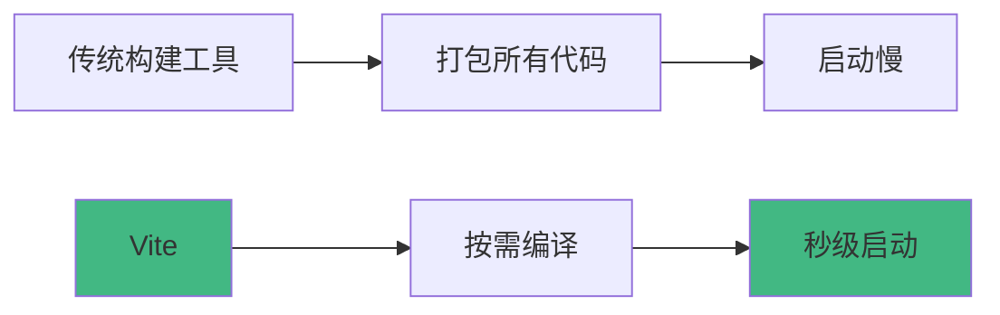

# Vite深度配置与优化

Vite是新一代前端构建工具，基于ES模块提供极速的开发体验。本文将深入探讨Vite的配置和优化技巧。

## 为什么选择Vite？

### 优势对比



**Vite vs Webpack**:
- ⚡ **开发启动**: Vite秒级 vs Webpack分钟级
- 🔥 **热更新**: Vite毫秒级 vs Webpack秒级
- 📦 **生产构建**: 都使用Rollup，性能相近
- 🎯 **配置复杂度**: Vite简单 vs Webpack复杂

## 基础配置

### vite.config.ts

```typescript
import { defineConfig } from 'vite';
import react from '@vitejs/plugin-react';
import path from 'path';

export default defineConfig({
  // 插件配置
  plugins: [
    react({
      // 启用React Fast Refresh
      fastRefresh: true,
      // Babel配置
      babel: {
        plugins: [
          ['@babel/plugin-proposal-decorators', { legacy: true }]
        ]
      }
    })
  ],
  
  // 路径解析
  resolve: {
    alias: {
      '@': path.resolve(__dirname, 'src'),
      '@components': path.resolve(__dirname, 'src/components'),
      '@utils': path.resolve(__dirname, 'src/utils'),
      '@assets': path.resolve(__dirname, 'src/assets')
    },
    // 省略的扩展名
    extensions: ['.js', '.ts', '.jsx', '.tsx', '.json']
  },
  
  // 开发服务器配置
  server: {
    port: 3000,
    host: true, // 监听所有地址
    open: true, // 自动打开浏览器
    cors: true, // 允许跨域
    
    // 代理配置
    proxy: {
      '/api': {
        target: 'http://localhost:8080',
        changeOrigin: true,
        rewrite: (path) => path.replace(/^\/api/, '')
      },
      '/ws': {
        target: 'ws://localhost:8080',
        ws: true
      }
    },
    
    // HMR配置
    hmr: {
      overlay: true // 显示错误覆盖层
    }
  },
  
  // 构建配置
  build: {
    // 输出目录
    outDir: 'dist',
    // 静态资源目录
    assetsDir: 'assets',
    // 小于此阈值的资源将内联为base64
    assetsInlineLimit: 4096,
    // 启用CSS代码拆分
    cssCodeSplit: true,
    // 生成sourcemap
    sourcemap: false,
    
    // Rollup配置
    rollupOptions: {
      output: {
        // 分包策略
        manualChunks: {
          'react-vendor': ['react', 'react-dom'],
          'router': ['react-router-dom'],
          'ui': ['antd', '@ant-design/icons']
        },
        // 输出文件名
        chunkFileNames: 'js/[name]-[hash].js',
        entryFileNames: 'js/[name]-[hash].js',
        assetFileNames: '[ext]/[name]-[hash].[ext]'
      }
    },
    
    // 压缩配置
    minify: 'terser',
    terserOptions: {
      compress: {
        drop_console: true, // 删除console
        drop_debugger: true // 删除debugger
      }
    },
    
    // 块大小警告限制
    chunkSizeWarningLimit: 1000
  },
  
  // CSS配置
  css: {
    // CSS预处理器配置
    preprocessorOptions: {
      scss: {
        additionalData: `@import "@/styles/variables.scss";`
      },
      less: {
        javascriptEnabled: true,
        modifyVars: {
          '@primary-color': '#1890ff'
        }
      }
    },
    // CSS模块化
    modules: {
      localsConvention: 'camelCase',
      scopeBehaviour: 'local'
    }
  },
  
  // 环境变量
  envPrefix: 'VITE_',
  
  // 依赖优化
  optimizeDeps: {
    include: ['react', 'react-dom', 'react-router-dom'],
    exclude: ['your-local-package']
  }
});
```

## 环境变量

### 配置文件

```bash
# .env - 所有环境
VITE_APP_TITLE=My App

# .env.development - 开发环境
VITE_API_URL=http://localhost:8080
VITE_DEBUG=true

# .env.production - 生产环境
VITE_API_URL=https://api.example.com
VITE_DEBUG=false

# .env.local - 本地环境（不提交到git）
VITE_SECRET_KEY=your-secret-key
```

### 使用环境变量

```typescript
// 在代码中使用
const apiUrl = import.meta.env.VITE_API_URL;
const isDebug = import.meta.env.VITE_DEBUG === 'true';
const mode = import.meta.env.MODE; // 'development' | 'production'
const isDev = import.meta.env.DEV; // boolean
const isProd = import.meta.env.PROD; // boolean

// TypeScript类型定义
/// <reference types="vite/client" />

interface ImportMetaEnv {
  readonly VITE_API_URL: string;
  readonly VITE_DEBUG: string;
  readonly VITE_APP_TITLE: string;
}

interface ImportMeta {
  readonly env: ImportMetaEnv;
}
```

## 插件生态

### 常用插件

```typescript
import { defineConfig } from 'vite';
import react from '@vitejs/plugin-react';
import vue from '@vitejs/plugin-vue';
import legacy from '@vitejs/plugin-legacy';
import { visualizer } from 'rollup-plugin-visualizer';
import viteCompression from 'vite-plugin-compression';
import { createHtmlPlugin } from 'vite-plugin-html';
import { VitePWA } from 'vite-plugin-pwa';

export default defineConfig({
  plugins: [
    // React支持
    react(),
    
    // Vue支持
    vue(),
    
    // 传统浏览器支持
    legacy({
      targets: ['defaults', 'not IE 11']
    }),
    
    // 打包分析
    visualizer({
      open: true,
      gzipSize: true,
      brotliSize: true
    }),
    
    // Gzip压缩
    viteCompression({
      algorithm: 'gzip',
      ext: '.gz'
    }),
    
    // HTML模板
    createHtmlPlugin({
      minify: true,
      inject: {
        data: {
          title: 'My App',
          injectScript: '<script src="./inject.js"></script>'
        }
      }
    }),
    
    // PWA支持
    VitePWA({
      registerType: 'autoUpdate',
      manifest: {
        name: 'My App',
        short_name: 'App',
        theme_color: '#ffffff',
        icons: [
          {
            src: '/icon-192.png',
            sizes: '192x192',
            type: 'image/png'
          }
        ]
      }
    })
  ]
});
```

### 自定义插件

```typescript
// 自定义插件：自动导入组件
import type { Plugin } from 'vite';

function autoImportComponents(): Plugin {
  return {
    name: 'auto-import-components',
    
    // 转换代码
    transform(code, id) {
      if (!id.endsWith('.tsx') && !id.endsWith('.jsx')) {
        return null;
      }
      
      // 自动添加import语句
      const imports = `
        import Button from '@/components/Button';
        import Input from '@/components/Input';
      `;
      
      return {
        code: imports + code,
        map: null
      };
    }
  };
}

// 使用插件
export default defineConfig({
  plugins: [autoImportComponents()]
});
```

## 性能优化

### 1. 依赖预构建

```typescript
export default defineConfig({
  optimizeDeps: {
    // 强制预构建
    include: [
      'react',
      'react-dom',
      'react-router-dom',
      'axios',
      'lodash-es'
    ],
    
    // 排除预构建
    exclude: ['your-local-package'],
    
    // 自定义esbuild配置
    esbuildOptions: {
      target: 'es2020',
      supported: {
        bigint: true
      }
    }
  }
});
```

### 2. 代码分割

```typescript
export default defineConfig({
  build: {
    rollupOptions: {
      output: {
        manualChunks(id) {
          // node_modules分包
          if (id.includes('node_modules')) {
            // React相关
            if (id.includes('react') || id.includes('react-dom')) {
              return 'react-vendor';
            }
            // UI库
            if (id.includes('antd') || id.includes('@ant-design')) {
              return 'ui-vendor';
            }
            // 工具库
            if (id.includes('lodash') || id.includes('dayjs')) {
              return 'utils-vendor';
            }
            // 其他第三方库
            return 'vendor';
          }
          
          // 按路由分包
          if (id.includes('src/pages/')) {
            const match = id.match(/src\/pages\/([^/]+)/);
            if (match) {
              return `page-${match[1]}`;
            }
          }
        }
      }
    }
  }
});
```

### 3. 图片优化

```typescript
import viteImagemin from 'vite-plugin-imagemin';

export default defineConfig({
  plugins: [
    viteImagemin({
      gifsicle: {
        optimizationLevel: 7,
        interlaced: false
      },
      optipng: {
        optimizationLevel: 7
      },
      mozjpeg: {
        quality: 80
      },
      pngquant: {
        quality: [0.8, 0.9],
        speed: 4
      },
      svgo: {
        plugins: [
          {
            name: 'removeViewBox'
          },
          {
            name: 'removeEmptyAttrs',
            active: false
          }
        ]
      }
    })
  ]
});
```

### 4. CDN加速

```typescript
export default defineConfig({
  build: {
    rollupOptions: {
      external: ['react', 'react-dom'],
      output: {
        globals: {
          react: 'React',
          'react-dom': 'ReactDOM'
        }
      }
    }
  },
  
  // 在HTML中引入CDN
  plugins: [
    createHtmlPlugin({
      inject: {
        data: {
          injectScript: `
            <script src="https://cdn.jsdelivr.net/npm/react@18/umd/react.production.min.js"></script>
            <script src="https://cdn.jsdelivr.net/npm/react-dom@18/umd/react-dom.production.min.js"></script>
          `
        }
      }
    })
  ]
});
```

## 多页面应用

```typescript
import { resolve } from 'path';

export default defineConfig({
  build: {
    rollupOptions: {
      input: {
        main: resolve(__dirname, 'index.html'),
        admin: resolve(__dirname, 'admin/index.html'),
        mobile: resolve(__dirname, 'mobile/index.html')
      }
    }
  }
});
```

## SSR配置

```typescript
// vite.config.ts
export default defineConfig({
  ssr: {
    // SSR外部化依赖
    external: ['react', 'react-dom'],
    // 不外部化的依赖
    noExternal: ['@your/package']
  }
});

// server.js
import express from 'express';
import { createServer as createViteServer } from 'vite';

async function createServer() {
  const app = express();
  
  // 创建Vite服务器
  const vite = await createViteServer({
    server: { middlewareMode: true },
    appType: 'custom'
  });
  
  app.use(vite.middlewares);
  
  app.use('*', async (req, res) => {
    const url = req.originalUrl;
    
    try {
      // 加载HTML模板
      let template = await vite.transformIndexHtml(
        url,
        fs.readFileSync('index.html', 'utf-8')
      );
      
      // 加载服务端入口
      const { render } = await vite.ssrLoadModule('/src/entry-server.tsx');
      
      // 渲染应用
      const appHtml = await render(url);
      
      // 注入HTML
      const html = template.replace('<!--ssr-outlet-->', appHtml);
      
      res.status(200).set({ 'Content-Type': 'text/html' }).end(html);
    } catch (e) {
      vite.ssrFixStacktrace(e);
      console.error(e);
      res.status(500).end(e.message);
    }
  });
  
  app.listen(3000);
}

createServer();
```

## 调试技巧

### 1. 查看依赖预构建

```bash
# 清除缓存
rm -rf node_modules/.vite

# 查看预构建日志
vite --debug
```

### 2. 分析打包结果

```typescript
import { visualizer } from 'rollup-plugin-visualizer';

export default defineConfig({
  plugins: [
    visualizer({
      open: true,
      filename: 'dist/stats.html',
      gzipSize: true,
      brotliSize: true
    })
  ]
});
```

### 3. 性能分析

```typescript
export default defineConfig({
  build: {
    // 生成报告
    reportCompressedSize: true,
    
    rollupOptions: {
      // 输出详细信息
      output: {
        // 查看每个chunk的大小
        experimentalMinChunkSize: 1000
      }
    }
  }
});
```

## 最佳实践

### 1. 项目结构

```
project/
├── public/              # 静态资源
│   ├── favicon.ico
│   └── robots.txt
├── src/
│   ├── assets/         # 需要处理的资源
│   ├── components/     # 组件
│   ├── pages/          # 页面
│   ├── utils/          # 工具函数
│   ├── styles/         # 样式
│   ├── App.tsx
│   └── main.tsx
├── .env                # 环境变量
├── .env.development
├── .env.production
├── index.html
├── package.json
├── tsconfig.json
└── vite.config.ts
```

### 2. 导入优化

```typescript
// ❌ 错误：导入整个库
import _ from 'lodash';

// ✅ 正确：按需导入
import debounce from 'lodash-es/debounce';

// ❌ 错误：导入所有图标
import * as Icons from '@ant-design/icons';

// ✅ 正确：按需导入
import { UserOutlined, SettingOutlined } from '@ant-design/icons';
```

### 3. 动态导入

```typescript
// 路由懒加载
const Home = lazy(() => import('./pages/Home'));
const About = lazy(() => import('./pages/About'));

// 条件导入
if (import.meta.env.DEV) {
  import('./debug-tools').then(module => {
    module.init();
  });
}
```

### 4. 资源处理

```typescript
// 导入图片
import logo from './logo.png'; // 返回URL

// 导入为字符串
import styles from './style.css?inline';

// 导入为URL
import workerUrl from './worker.js?url';

// 导入为原始内容
import raw from './data.txt?raw';
```

## 常见问题

### 1. 依赖预构建失败

```typescript
// 解决方案：手动指定需要预构建的依赖
export default defineConfig({
  optimizeDeps: {
    include: ['problematic-package']
  }
});
```

### 2. HMR不工作

```typescript
// 检查HMR配置
export default defineConfig({
  server: {
    hmr: {
      overlay: true,
      // 如果使用Docker，需要配置
      host: '0.0.0.0',
      port: 3000
    }
  }
});
```

### 3. 构建后路径错误

```typescript
// 配置base路径
export default defineConfig({
  base: '/my-app/', // 部署到子路径
  // 或
  base: './', // 相对路径
});
```

## 总结

Vite的核心优势：
- ⚡ **极速启动**：基于ES模块的按需编译
- 🔥 **快速HMR**：毫秒级的热更新
- 📦 **优化构建**：基于Rollup的生产构建
- 🎯 **简单配置**：开箱即用，配置简单
- 🔌 **丰富插件**：强大的插件生态

掌握Vite是现代前端开发的必备技能！

