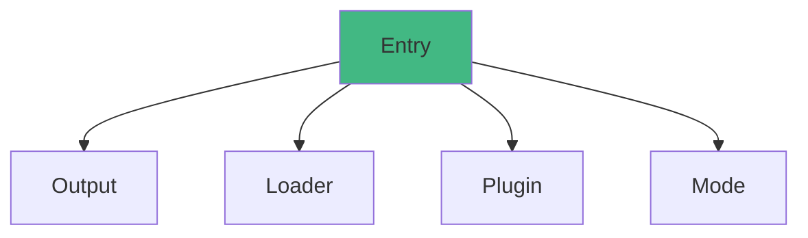

# Webpack

WebpackWebpack

## 

### 



1. **Entry**: 
2. **Output**: 
3. **Loader**: 
4. **Plugin**: 
5. **Mode**: /

## 

### webpack.config.js

```javascript
const path = require('path');
const HtmlWebpackPlugin = require('html-webpack-plugin');
const MiniCssExtractPlugin = require('mini-css-extract-plugin');
const { CleanWebpackPlugin } = require('clean-webpack-plugin');

module.exports = {
  // 
  entry: {
    main: './src/index.js',
    vendor: './src/vendor.js'
  },
  
  // 
  output: {
    path: path.resolve(__dirname, 'dist'),
    filename: '[name].[contenthash:8].js',
    chunkFilename: '[name].[contenthash:8].chunk.js',
    publicPath: '/',
    clean: true // Webpack 5
  },
  
  // 
  mode: 'production', // 'development' | 'production' | 'none'
  
  // 
  module: {
    rules: [
      // JavaScript/JSX
      {
        test: /\.(js|jsx)$/,
        exclude: /node_modules/,
        use: {
          loader: 'babel-loader',
          options: {
            presets: [
              ['@babel/preset-env', { useBuiltIns: 'usage', corejs: 3 }],
              '@babel/preset-react'
            ],
            plugins: ['@babel/plugin-transform-runtime']
          }
        }
      },
      
      // TypeScript
      {
        test: /\.(ts|tsx)$/,
        exclude: /node_modules/,
        use: 'ts-loader'
      },
      
      // CSS
      {
        test: /\.css$/,
        use: [
          MiniCssExtractPlugin.loader,
          'css-loader',
          'postcss-loader'
        ]
      },
      
      // SCSS
      {
        test: /\.scss$/,
        use: [
          MiniCssExtractPlugin.loader,
          'css-loader',
          'postcss-loader',
          'sass-loader'
        ]
      },
      
      // 
      {
        test: /\.(png|jpg|jpeg|gif|svg)$/,
        type: 'asset',
        parser: {
          dataUrlCondition: {
            maxSize: 8 * 1024 // 8kb
          }
        },
        generator: {
          filename: 'images/[name].[hash:8][ext]'
        }
      },
      
      // 
      {
        test: /\.(woff|woff2|eot|ttf|otf)$/,
        type: 'asset/resource',
        generator: {
          filename: 'fonts/[name].[hash:8][ext]'
        }
      }
    ]
  },
  
  // 
  plugins: [
    // 
    new CleanWebpackPlugin(),
    
    // HTML
    new HtmlWebpackPlugin({
      template: './public/index.html',
      filename: 'index.html',
      minify: {
        removeComments: true,
        collapseWhitespace: true,
        removeAttributeQuotes: true
      }
    }),
    
    // CSS
    new MiniCssExtractPlugin({
      filename: 'css/[name].[contenthash:8].css',
      chunkFilename: 'css/[name].[contenthash:8].chunk.css'
    })
  ],
  
  // 
  resolve: {
    extensions: ['.js', '.jsx', '.ts', '.tsx', '.json'],
    alias: {
      '@': path.resolve(__dirname, 'src'),
      '@components': path.resolve(__dirname, 'src/components'),
      '@utils': path.resolve(__dirname, 'src/utils')
    }
  },
  
  // 
  optimization: {
    // 
    splitChunks: {
      chunks: 'all',
      cacheGroups: {
        vendor: {
          test: /[\\/]node_modules[\\/]/,
          name: 'vendors',
          priority: 10
        },
        common: {
          minChunks: 2,
          priority: 5,
          reuseExistingChunk: true
        }
      }
    },
    // 
    runtimeChunk: 'single'
  },
  
  // 
  devServer: {
    static: {
      directory: path.join(__dirname, 'public')
    },
    port: 3000,
    hot: true,
    open: true,
    compress: true,
    historyApiFallback: true,
    proxy: {
      '/api': {
        target: 'http://localhost:8080',
        changeOrigin: true,
        pathRewrite: { '^/api': '' }
      }
    }
  },
  
  // Source Map
  devtool: 'source-map'
};
```

## 

### 

```javascript
// webpack.common.js - 
const path = require('path');
const HtmlWebpackPlugin = require('html-webpack-plugin');

module.exports = {
  entry: './src/index.js',
  output: {
    path: path.resolve(__dirname, 'dist'),
    filename: '[name].[contenthash:8].js'
  },
  module: {
    rules: [
      {
        test: /\.(js|jsx)$/,
        exclude: /node_modules/,
        use: 'babel-loader'
      }
    ]
  },
  plugins: [
    new HtmlWebpackPlugin({
      template: './public/index.html'
    })
  ]
};

// webpack.dev.js - 
const { merge } = require('webpack-merge');
const common = require('./webpack.common.js');

module.exports = merge(common, {
  mode: 'development',
  devtool: 'eval-source-map',
  devServer: {
    hot: true,
    port: 3000
  },
  module: {
    rules: [
      {
        test: /\.css$/,
        use: ['style-loader', 'css-loader']
      }
    ]
  }
});

// webpack.prod.js - 
const { merge } = require('webpack-merge');
const common = require('./webpack.common.js');
const MiniCssExtractPlugin = require('mini-css-extract-plugin');
const CssMinimizerPlugin = require('css-minimizer-webpack-plugin');
const TerserPlugin = require('terser-webpack-plugin');

module.exports = merge(common, {
  mode: 'production',
  devtool: 'source-map',
  module: {
    rules: [
      {
        test: /\.css$/,
        use: [MiniCssExtractPlugin.loader, 'css-loader']
      }
    ]
  },
  plugins: [
    new MiniCssExtractPlugin({
      filename: 'css/[name].[contenthash:8].css'
    })
  ],
  optimization: {
    minimizer: [
      new TerserPlugin({
        terserOptions: {
          compress: {
            drop_console: true
          }
        }
      }),
      new CssMinimizerPlugin()
    ]
  }
});
```

### package.json

```json
{
  "scripts": {
    "dev": "webpack serve --config webpack.dev.js",
    "build": "webpack --config webpack.prod.js",
    "analyze": "webpack --config webpack.prod.js --env analyze"
  }
}
```

## 

### 1. 

```javascript
module.exports = {
  optimization: {
    splitChunks: {
      chunks: 'all',
      minSize: 20000,
      maxSize: 244000,
      minChunks: 1,
      maxAsyncRequests: 30,
      maxInitialRequests: 30,
      cacheGroups: {
        // React
        react: {
          test: /[\\/]node_modules[\\/](react|react-dom)[\\/]/,
          name: 'react',
          priority: 20
        },
        // UI
        antd: {
          test: /[\\/]node_modules[\\/]antd[\\/]/,
          name: 'antd',
          priority: 15
        },
        // 
        vendor: {
          test: /[\\/]node_modules[\\/]/,
          name: 'vendors',
          priority: 10
        },
        // 
        common: {
          minChunks: 2,
          priority: 5,
          reuseExistingChunk: true
        }
      }
    }
  }
};
```

### 2. Tree Shaking

```javascript
// package.json
{
  "sideEffects": [
    "*.css",
    "*.scss"
  ]
}

// webpack.config.js
module.exports = {
  mode: 'production',
  optimization: {
    usedExports: true, // 
    minimize: true     // 
  }
};
```

### 3. 

```javascript
module.exports = {
  output: {
    filename: '[name].[contenthash:8].js',
    chunkFilename: '[name].[contenthash:8].chunk.js'
  },
  
  optimization: {
    moduleIds: 'deterministic',
    runtimeChunk: 'single',
    splitChunks: {
      cacheGroups: {
        vendor: {
          test: /[\\/]node_modules[\\/]/,
          name: 'vendors',
          chunks: 'all'
        }
      }
    }
  },
  
  cache: {
    type: 'filesystem',
    buildDependencies: {
      config: [__filename]
    }
  }
};
```

### 4. 

```javascript
const TerserPlugin = require('terser-webpack-plugin');
const CssMinimizerPlugin = require('css-minimizer-webpack-plugin');

module.exports = {
  optimization: {
    minimizer: [
      new TerserPlugin({
        parallel: true // 
      }),
      new CssMinimizerPlugin({
        parallel: true
      })
    ]
  },
  
  module: {
    rules: [
      {
        test: /\.(js|jsx)$/,
        use: {
          loader: 'babel-loader',
          options: {
            cacheDirectory: true // 
          }
        }
      }
    ]
  }
};
```

### 5. DLL

```javascript
// webpack.dll.js
const path = require('path');
const webpack = require('webpack');

module.exports = {
  mode: 'production',
  entry: {
    vendor: ['react', 'react-dom', 'react-router-dom']
  },
  output: {
    path: path.resolve(__dirname, 'dll'),
    filename: '[name].dll.js',
    library: '[name]_library'
  },
  plugins: [
    new webpack.DllPlugin({
      name: '[name]_library',
      path: path.resolve(__dirname, 'dll/[name].manifest.json')
    })
  ]
};

// webpack.config.js
const webpack = require('webpack');
const AddAssetHtmlPlugin = require('add-asset-html-webpack-plugin');

module.exports = {
  plugins: [
    new webpack.DllReferencePlugin({
      manifest: require('./dll/vendor.manifest.json')
    }),
    new AddAssetHtmlPlugin({
      filepath: path.resolve(__dirname, 'dll/vendor.dll.js')
    })
  ]
};
```

## Loader

### 

```javascript
module.exports = {
  module: {
    rules: [
      // PostCSS
      {
        test: /\.css$/,
        use: [
          'style-loader',
          'css-loader',
          {
            loader: 'postcss-loader',
            options: {
              postcssOptions: {
                plugins: [
                  'autoprefixer',
                  'postcss-preset-env'
                ]
              }
            }
          }
        ]
      },
      
      // CSS Modules
      {
        test: /\.module\.css$/,
        use: [
          'style-loader',
          {
            loader: 'css-loader',
            options: {
              modules: {
                localIdentName: '[name]__[local]--[hash:base64:5]'
              }
            }
          }
        ]
      }
    ]
  }
};
```

### 

```javascript
module.exports = {
  module: {
    rules: [
      // 
      {
        test: /\.(png|jpg|jpeg|gif)$/,
        use: [
          {
            loader: 'image-webpack-loader',
            options: {
              mozjpeg: { quality: 80 },
              pngquant: { quality: [0.8, 0.9] }
            }
          }
        ],
        type: 'asset'
      },
      
      // SVG
      {
        test: /\.svg$/,
        use: ['@svgr/webpack', 'url-loader']
      }
    ]
  }
};
```

## Plugin

### 

```javascript
const webpack = require('webpack');
const { BundleAnalyzerPlugin } = require('webpack-bundle-analyzer');
const CompressionPlugin = require('compression-webpack-plugin');
const CopyPlugin = require('copy-webpack-plugin');

module.exports = {
  plugins: [
    // 
    new webpack.DefinePlugin({
      'process.env.NODE_ENV': JSON.stringify('production'),
      'process.env.API_URL': JSON.stringify('https://api.example.com')
    }),
    
    // 
    new BundleAnalyzerPlugin({
      analyzerMode: 'static',
      openAnalyzer: false
    }),
    
    // Gzip
    new CompressionPlugin({
      algorithm: 'gzip',
      test: /\.(js|css|html|svg)$/,
      threshold: 10240,
      minRatio: 0.8
    }),
    
    // 
    new CopyPlugin({
      patterns: [
        { from: 'public', to: 'public' }
      ]
    }),
    
    // 
    new webpack.ProgressPlugin()
  ]
};
```

## Module Federation

```javascript
// app1/webpack.config.js
const ModuleFederationPlugin = require('webpack/lib/container/ModuleFederationPlugin');

module.exports = {
  plugins: [
    new ModuleFederationPlugin({
      name: 'app1',
      filename: 'remoteEntry.js',
      exposes: {
        './Button': './src/components/Button',
        './Header': './src/components/Header'
      },
      shared: {
        react: { singleton: true },
        'react-dom': { singleton: true }
      }
    })
  ]
};

// app2/webpack.config.js
module.exports = {
  plugins: [
    new ModuleFederationPlugin({
      name: 'app2',
      remotes: {
        app1: 'app1@http://localhost:3001/remoteEntry.js'
      },
      shared: {
        react: { singleton: true },
        'react-dom': { singleton: true }
      }
    })
  ]
};

// 
import React from 'react';
const RemoteButton = React.lazy(() => import('app1/Button'));

function App() {
  return (
    <React.Suspense fallback="Loading...">
      <RemoteButton />
    </React.Suspense>
  );
}
```

## 

### Source Map

```javascript
module.exports = {
  // 
  devtool: 'eval-source-map', // 
  
  // 
  devtool: 'source-map', // 
  // 
  devtool: 'hidden-source-map', // 
  // 
  devtool: false // source map
};
```

### 

```bash
# stats.json
webpack --profile --json > stats.json

# webpack-bundle-analyzer
npm run build -- --env analyze

# webpack-visualizer
webpack-visualizer stats.json
```

## 

### 1. 

```javascript
module.exports = {
  // 
  resolve: {
    modules: [path.resolve(__dirname, 'node_modules')],
    extensions: ['.js', '.jsx'],
    alias: {
      '@': path.resolve(__dirname, 'src')
    }
  },
  
  // 
  module: {
    noParse: /jquery|lodash/,
    rules: [
      {
        test: /\.js$/,
        include: path.resolve(__dirname, 'src'),
        exclude: /node_modules/
      }
    ]
  }
};
```

### 2. 

```javascript
module.exports = {
  mode: 'production',
  
  optimization: {
    minimize: true,
    minimizer: [
      new TerserPlugin({
        terserOptions: {
          compress: {
            drop_console: true,
            drop_debugger: true,
            pure_funcs: ['console.log']
          }
        }
      })
    ],
    
    splitChunks: {
      chunks: 'all',
      cacheGroups: {
        vendor: {
          test: /[\\/]node_modules[\\/]/,
          priority: 10
        }
      }
    }
  },
  
  performance: {
    hints: 'warning',
    maxAssetSize: 250000,
    maxEntrypointSize: 250000
  }
};
```

## 

Webpack
-  ****
-  ****Loader
-  ****Plugin
-  ****Tree Shaking
-  ****

Webpack

