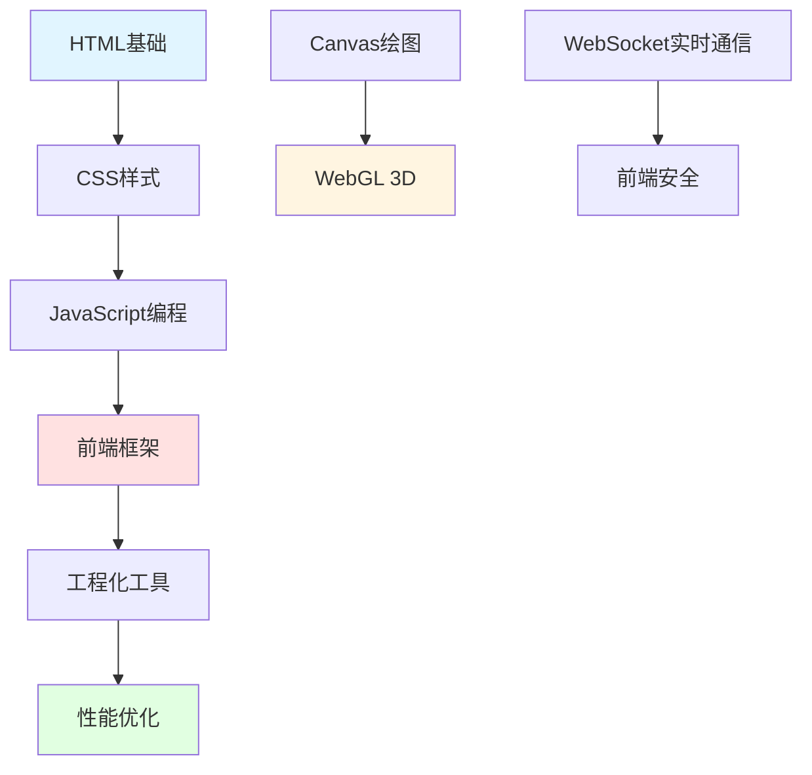

import DocCardList from '@theme/DocCardList';

# 前端开发 - 从零到精通

前端开发是构建用户界面和用户体验的核心技能。这个模块将带你从基础到进阶，掌握现代前端开发的全栈技能。

## 学习路径



## 核心内容

### 基础三剑客

#### HTML - 网页结构
- **语义化标签**：header、nav、main、article、section
- **表单元素**：input、select、textarea、button
- **多媒体**：video、audio、canvas、svg
- **SEO优化**：meta标签、结构化数据
- **实战**：响应式网页布局

#### CSS - 样式设计
- **选择器**：基础、组合、伪类、伪元素
- **布局**：Flexbox、Grid、定位、浮动
- **响应式**：媒体查询、移动端适配
- **动画**：transition、animation、transform
- **预处理器**：Sass、Less、PostCSS
- **实战**：现代UI组件库

#### JavaScript - 交互逻辑
- **基础语法**：变量、类型、运算符、控制流
- **函数**：闭包、高阶函数、箭头函数
- **对象**：原型链、继承、this绑定
- **异步**：Promise、async/await、事件循环
- **DOM操作**：选择器、事件、动态内容
- **实战**：交互式Web应用

### 现代框架

#### React - 组件化开发
- **核心概念**：组件、Props、State
- **Hooks**：useState、useEffect、useContext
- **路由**：React Router
- **状态管理**：Redux、Zustand、Jotai
- **实战**：企业级管理系统

#### Vue - 渐进式框架
- **核心特性**：响应式、模板语法、指令
- **组合式API**：setup、ref、reactive
- **路由**：Vue Router
- **状态管理**：Pinia、Vuex
- **实战**：电商平台前端

### 工程化工具

#### 构建工具
- **Webpack**：模块打包、代码分割、优化
- **Vite**：快速开发、HMR、构建优化
- **Rollup**：库打包、Tree Shaking

#### 代码质量
- **ESLint**：代码规范检查
- **Prettier**：代码格式化
- **TypeScript**：类型安全

#### 测试
- **Jest**：单元测试
- **React Testing Library**：组件测试
- **Cypress**：端到端测试

### 图形与动画

#### Canvas - 2D绘图
- **基础绘制**：矩形、圆形、路径
- **图像处理**：滤镜、变换、合成
- **动画**：requestAnimationFrame
- **实战**：数据可视化、小游戏

#### WebGL - 3D渲染
- **Three.js**：3D场景、材质、光照
- **着色器**：顶点着色器、片段着色器
- **实战**：3D产品展示、虚拟场景

### 前端安全

#### 常见攻击
- **XSS**：跨站脚本攻击防护
- **CSRF**：跨站请求伪造防护
- **点击劫持**：X-Frame-Options
- **SQL注入**：参数化查询

#### 安全实践
- **内容安全策略（CSP）**
- **HTTPS**：SSL/TLS加密
- **身份认证**：JWT、OAuth
- **实战**：安全的用户系统

### 性能优化

#### 加载优化
- **代码分割**：动态导入、懒加载
- **资源优化**：压缩、CDN、缓存
- **图片优化**：WebP、懒加载、响应式图片

#### 渲染优化
- **虚拟滚动**：大列表优化
- **防抖节流**：事件优化
- **Web Workers**：多线程计算

#### 监控与分析
- **性能指标**：FCP、LCP、CLS、FID
- **性能监控**：Lighthouse、WebPageTest
- **实战**：性能优化方案

## 学习建议

### 初学者路径（3-4个月）

**第1-2周**：HTML基础
- 学习常用标签
- 理解语义化
- 练习表单制作
- 项目：个人简历页面

**第3-4周**：CSS基础
- 掌握选择器
- 学习盒模型
- 练习布局技巧
- 项目：响应式导航栏

**第5-8周**：JavaScript基础
- 学习基础语法
- 理解DOM操作
- 掌握事件处理
- 项目：待办事项应用

**第9-12周**：框架入门
- 选择React或Vue
- 学习组件开发
- 理解状态管理
- 项目：博客系统

### 进阶路径（4-6个月）

**阶段1**：深入框架
- 高级特性
- 性能优化
- 最佳实践
- 项目：企业级应用

**阶段2**：工程化
- 构建工具配置
- 代码质量保证
- 自动化测试
- 项目：组件库开发

**阶段3**：全栈能力
- Node.js后端
- 数据库操作
- API设计
- 项目：全栈应用

## 实用技巧

### HTML最佳实践

```html
<!-- 语义化标签 -->
<header>
  <nav>
    <ul>
      <li><a href="#home">首页</a></li>
      <li><a href="#about">关于</a></li>
    </ul>
  </nav>
</header>

<main>
  <article>
    <h1>文章标题</h1>
    <p>文章内容...</p>
  </article>
</main>

<footer>
  <p>&copy; 2024 版权所有</p>
</footer>

<!-- SEO优化 -->
<head>
  <meta charset="UTF-8">
  <meta name="viewport" content="width=device-width, initial-scale=1.0">
  <meta name="description" content="网站描述">
  <meta name="keywords" content="关键词1, 关键词2">
  <title>页面标题</title>
</head>
```

### CSS布局技巧

```css
/* Flexbox布局 */
.container {
  display: flex;
  justify-content: space-between;
  align-items: center;
  gap: 20px;
}

/* Grid布局 */
.grid {
  display: grid;
  grid-template-columns: repeat(auto-fit, minmax(250px, 1fr));
  gap: 20px;
}

/* 响应式设计 */
@media (max-width: 768px) {
  .container {
    flex-direction: column;
  }
}

/* CSS变量 */
:root {
  --primary-color: #007bff;
  --spacing: 20px;
}

.button {
  background: var(--primary-color);
  padding: var(--spacing);
}
```

### JavaScript常用模式

```javascript
// 防抖
function debounce(fn, delay) {
  let timer = null;
  return function(...args) {
    clearTimeout(timer);
    timer = setTimeout(() => fn.apply(this, args), delay);
  };
}

// 节流
function throttle(fn, delay) {
  let lastTime = 0;
  return function(...args) {
    const now = Date.now();
    if (now - lastTime >= delay) {
      fn.apply(this, args);
      lastTime = now;
    }
  };
}

// 深拷贝
function deepClone(obj) {
  if (obj === null || typeof obj !== 'object') return obj;
  const clone = Array.isArray(obj) ? [] : {};
  for (let key in obj) {
    if (obj.hasOwnProperty(key)) {
      clone[key] = deepClone(obj[key]);
    }
  }
  return clone;
}

// Promise封装
function request(url, options = {}) {
  return new Promise((resolve, reject) => {
    fetch(url, options)
      .then(res => res.json())
      .then(data => resolve(data))
      .catch(err => reject(err));
  });
}
```

## 实战项目

### 项目1：响应式个人网站

```html
<!DOCTYPE html>
<html lang="zh-CN">
<head>
  <meta charset="UTF-8">
  <meta name="viewport" content="width=device-width, initial-scale=1.0">
  <title>个人网站</title>
  <style>
    * {
      margin: 0;
      padding: 0;
      box-sizing: border-box;
    }
    
    body {
      font-family: -apple-system, BlinkMacSystemFont, 'Segoe UI', sans-serif;
      line-height: 1.6;
    }
    
    header {
      background: linear-gradient(135deg, #667eea 0%, #764ba2 100%);
      color: white;
      padding: 2rem;
      text-align: center;
    }
    
    nav {
      background: #333;
      padding: 1rem;
    }
    
    nav ul {
      list-style: none;
      display: flex;
      justify-content: center;
      gap: 2rem;
    }
    
    nav a {
      color: white;
      text-decoration: none;
      transition: color 0.3s;
    }
    
    nav a:hover {
      color: #667eea;
    }
    
    main {
      max-width: 1200px;
      margin: 2rem auto;
      padding: 0 2rem;
    }
    
    .grid {
      display: grid;
      grid-template-columns: repeat(auto-fit, minmax(300px, 1fr));
      gap: 2rem;
      margin: 2rem 0;
    }
    
    .card {
      background: white;
      border-radius: 8px;
      box-shadow: 0 2px 10px rgba(0,0,0,0.1);
      padding: 2rem;
      transition: transform 0.3s;
    }
    
    .card:hover {
      transform: translateY(-5px);
    }
    
    footer {
      background: #333;
      color: white;
      text-align: center;
      padding: 2rem;
      margin-top: 4rem;
    }
    
    @media (max-width: 768px) {
      nav ul {
        flex-direction: column;
        gap: 1rem;
      }
      
      .grid {
        grid-template-columns: 1fr;
      }
    }
  </style>
</head>
<body>
  <header>
    <h1>欢迎来到我的网站</h1>
    <p>前端开发工程师</p>
  </header>
  
  <nav>
    <ul>
      <li><a href="#home">首页</a></li>
      <li><a href="#projects">项目</a></li>
      <li><a href="#about">关于</a></li>
      <li><a href="#contact">联系</a></li>
    </ul>
  </nav>
  
  <main>
    <section id="projects">
      <h2>我的项目</h2>
      <div class="grid">
        <div class="card">
          <h3>项目1</h3>
          <p>项目描述...</p>
        </div>
        <div class="card">
          <h3>项目2</h3>
          <p>项目描述...</p>
        </div>
        <div class="card">
          <h3>项目3</h3>
          <p>项目描述...</p>
        </div>
      </div>
    </section>
  </main>
  
  <footer>
    <p>&copy; 2024 版权所有</p>
  </footer>
</body>
</html>
```

### 项目2：React待办事项

```jsx
import React, { useState } from 'react';

function TodoApp() {
  const [todos, setTodos] = useState([]);
  const [input, setInput] = useState('');
  
  const addTodo = () => {
    if (input.trim()) {
      setTodos([...todos, { id: Date.now(), text: input, done: false }]);
      setInput('');
    }
  };
  
  const toggleTodo = (id) => {
    setTodos(todos.map(todo => 
      todo.id === id ? { ...todo, done: !todo.done } : todo
    ));
  };
  
  const deleteTodo = (id) => {
    setTodos(todos.filter(todo => todo.id !== id));
  };
  
  return (
    <div className="todo-app">
      <h1>待办事项</h1>
      
      <div className="input-group">
        <input
          type="text"
          value={input}
          onChange={(e) => setInput(e.target.value)}
          onKeyPress={(e) => e.key === 'Enter' && addTodo()}
          placeholder="添加新任务..."
        />
        <button onClick={addTodo}>添加</button>
      </div>
      
      <ul className="todo-list">
        {todos.map(todo => (
          <li key={todo.id} className={todo.done ? 'done' : ''}>
            <input
              type="checkbox"
              checked={todo.done}
              onChange={() => toggleTodo(todo.id)}
            />
            <span>{todo.text}</span>
            <button onClick={() => deleteTodo(todo.id)}>删除</button>
          </li>
        ))}
      </ul>
      
      <div className="stats">
        <span>总计: {todos.length}</span>
        <span>已完成: {todos.filter(t => t.done).length}</span>
      </div>
    </div>
  );
}

export default TodoApp;
```

### 项目3：Vue电商商品列表

```vue
<template>
  <div class="product-list">
    <h1>商品列表</h1>
    
    <div class="filters">
      <input 
        v-model="searchQuery" 
        placeholder="搜索商品..."
      />
      <select v-model="sortBy">
        <option value="name">按名称</option>
        <option value="price">按价格</option>
      </select>
    </div>
    
    <div class="grid">
      <div 
        v-for="product in filteredProducts" 
        :key="product.id"
        class="product-card"
      >
        
        <h3>{{ product.name }}</h3>
        <p class="price">¥{{ product.price }}</p>
        <button @click="addToCart(product)">加入购物车</button>
      </div>
    </div>
    
    <div class="cart">
      <h2>购物车 ({{ cartCount }})</h2>
    </div>
  </div>
</template>

<script setup>
import { ref, computed } from 'vue';

const products = ref([
  { id: 1, name: '商品1', price: 99, image: '/img1.jpg' },
  { id: 2, name: '商品2', price: 199, image: '/img2.jpg' },
  { id: 3, name: '商品3', price: 299, image: '/img3.jpg' },
]);

const searchQuery = ref('');
const sortBy = ref('name');
const cart = ref([]);

const filteredProducts = computed(() => {
  let result = products.value.filter(p => 
    p.name.toLowerCase().includes(searchQuery.value.toLowerCase())
  );
  
  if (sortBy.value === 'price') {
    result.sort((a, b) => a.price - b.price);
  } else {
    result.sort((a, b) => a.name.localeCompare(b.name));
  }
  
  return result;
});

const cartCount = computed(() => cart.value.length);

const addToCart = (product) => {
  cart.value.push(product);
  alert(`${product.name} 已加入购物车`);
};
</script>

<style scoped>
.product-list {
  max-width: 1200px;
  margin: 0 auto;
  padding: 2rem;
}

.filters {
  display: flex;
  gap: 1rem;
  margin: 2rem 0;
}

.filters input,
.filters select {
  padding: 0.5rem;
  border: 1px solid #ddd;
  border-radius: 4px;
}

.grid {
  display: grid;
  grid-template-columns: repeat(auto-fill, minmax(250px, 1fr));
  gap: 2rem;
}

.product-card {
  border: 1px solid #ddd;
  border-radius: 8px;
  padding: 1rem;
  text-align: center;
}

.product-card img {
  width: 100%;
  height: 200px;
  object-fit: cover;
  border-radius: 4px;
}

.price {
  color: #e74c3c;
  font-size: 1.5rem;
  font-weight: bold;
}

button {
  background: #3498db;
  color: white;
  border: none;
  padding: 0.5rem 1rem;
  border-radius: 4px;
  cursor: pointer;
}

button:hover {
  background: #2980b9;
}
</style>
```

## 学习资源

### 在线文档
- **MDN Web Docs**：最权威的Web技术文档
- **React官方文档**：https://react.dev
- **Vue官方文档**：https://vuejs.org
- **CSS-Tricks**：CSS技巧和教程

### 书籍推荐
- 《JavaScript高级程序设计》
- 《你不知道的JavaScript》
- 《CSS揭秘》
- 《深入浅出React和Redux》

### 实践平台
- **CodePen**：在线代码编辑器
- **CodeSandbox**：在线开发环境
- **LeetCode**：算法练习
- **Frontend Mentor**：前端挑战

## 职业发展

### 技能树

```
基础技能
├── HTML5
├── CSS3
├── JavaScript ES6+
└── 响应式设计

核心技能
├── React/Vue
├── TypeScript
├── 状态管理
└── 前端工程化

进阶技能
├── 性能优化
├── 前端安全
├── 微前端
└── Node.js全栈
```

### 职业路径

1. **初级前端工程师**：掌握HTML/CSS/JS基础
2. **中级前端工程师**：精通框架，能独立开发
3. **高级前端工程师**：架构设计，性能优化
4. **前端架构师**：技术选型，团队管理

## 开始学习

选择一个章节开始你的前端开发之旅：

<DocCardList />

记住：**前端开发是一个不断学习的过程，保持好奇心和实践精神！**
