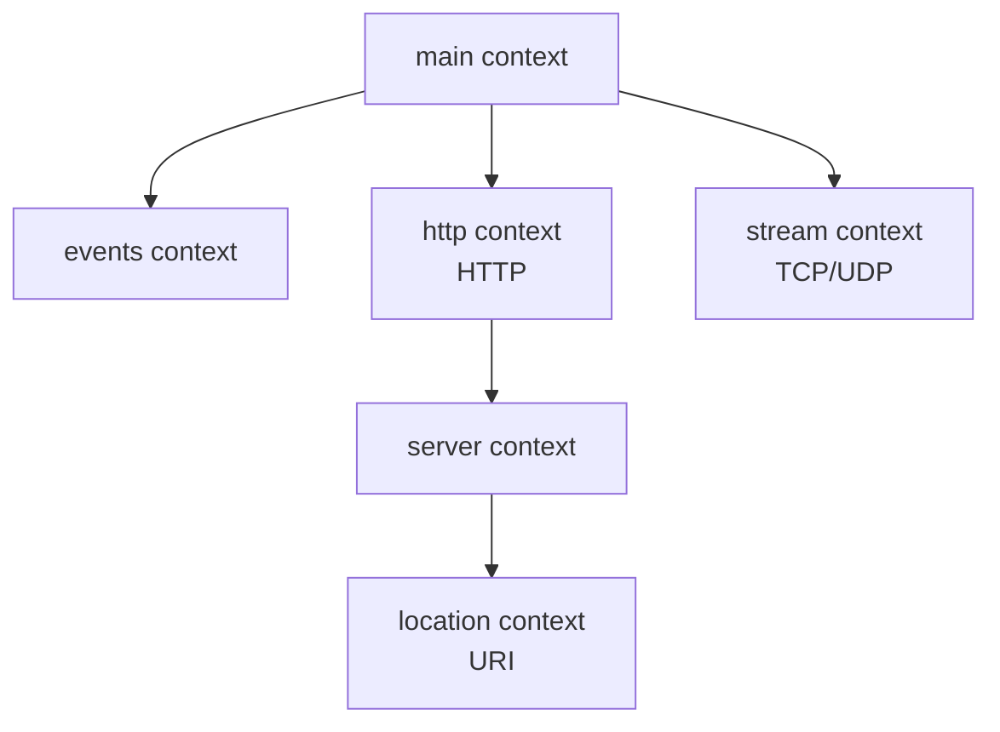

import Tabs from '@theme/Tabs';
import TabItem from '@theme/TabItem';

##  Nginx

Nginx (engine x)  HTTP Nginx  50,000 

:::info Nginx 
- ****
- ****
- ****
- ****
:::

## 

###  Nginx

<Tabs>
  <TabItem value="docker" label="Docker" default>

```bash
# 
docker pull nginx:latest

# 
docker run -d \
  --name mynginx \
  -p 80:80 \
  -v /path/to/html:/usr/share/nginx/html:ro \
  -v /path/to/nginx.conf:/etc/nginx/nginx.conf:ro \
  nginx
```

  </TabItem>
  <TabItem value="ubuntu" label="Ubuntu/Debian">

```bash
# 
sudo apt update

#  Nginx
sudo apt install nginx

#  Nginx 
sudo systemctl start nginx

# 
sudo systemctl enable nginx
```

  </TabItem>
  <TabItem value="centos" label="CentOS/RHEL">

```bash
#  Nginx
sudo yum install nginx

#  Nginx 
sudo systemctl start nginx

# 
sudo systemctl enable nginx
```

  </TabItem>
</Tabs>

### 

```bash
# 
nginx -t

# 
nginx -s reload

#  worker 
nginx -s quit

# 
nginx -s stop

#  Nginx 
nginx -v

# 
nginx -V
```

## 

Nginx **directives**********

### 

****

```nginx
worker_processes  4;          #  worker 
pid        /var/run/nginx.pid; #  pid 
```

**** `{}` 

```nginx
events {
    worker_connections  1024;
}

http {
    server {
        location / {
            # 
        }
    }
}
```

### Context 

Nginx context



:::tip 
 context  context  context  context 
:::

### 

```nginx title="/etc/nginx/nginx.conf" showLineNumbers
# ====================  ====================
user  nginx;                    # worker 
worker_processes  auto;         # worker auto  CPU 

error_log  /var/log/nginx/error.log notice;  # 
pid        /var/run/nginx.pid;               # pid 

# ====================  ====================
events {
    worker_connections  1024;   #  worker 
    use epoll;                  #  epoll Linux 
}

# ==================== HTTP ====================
http {
    # MIME
    include       /etc/nginx/mime.types;
    default_type  application/octet-stream;

    # 
    log_format  main  '$remote_addr - $remote_user [$time_local] "$request" '
                      '$status $body_bytes_sent "$http_referer" '
                      '"$http_user_agent" "$http_x_forwarded_for"';

    access_log  /var/log/nginx/access.log  main;

    # 
    sendfile        on;         # 
    tcp_nopush      on;         # 
    tcp_nodelay     on;         #  Nagle 
    keepalive_timeout  65;      # 

    # Gzip 
    gzip  on;
    gzip_vary on;
    gzip_comp_level 6;
    gzip_types text/plain text/css text/xml text/javascript 
               application/json application/javascript application/xml+rss;

    # 
    include /etc/nginx/conf.d/*.conf;
    include /etc/nginx/sites-enabled/*;
}
```

## 

### Core Module ()

Nginx

|  |  |  |
| :---- | :---- | :---- |
| `worker_processes` | worker | `worker_processes auto;` |
| `worker_connections` | worker | `worker_connections 1024;` |
| `error_log` |  | `error_log logs/error.log warn;` |
| `pid` | PID | `pid /var/run/nginx.pid;` |
| `include` |  | `include /etc/nginx/conf.d/*.conf;` |

:::warning 
- `worker_processes`  CPU  `auto`
- `worker_connections`  1024 4096 
-  `ulimit -n` 
:::

### HTTP ModuleHTTP 

HTTP  Nginx  HTTP/HTTPS 

#### server  - 

`server` 

```nginx title="" {2,3,5-7}
server {
    listen       80;                    # 
    server_name  example.com www.example.com;  # 

    # 
    access_log  /var/log/nginx/example.access.log  main;
    error_log   /var/log/nginx/example.error.log   warn;

    location / {
        root   /usr/share/nginx/html;
        index  index.html index.htm;
    }
}
```

#### location  - URI 

`location`  URI 

|  |  |  |  |
| :---- | :---- | :----: | :---- |
|  | `location = /path` | 1 | URI |
|  | `location ^~ /path` | 2 |  |
|  | `location ~ pattern` | 3 |  |
|  | `location ~* pattern` | 3 |  |
|  | `location /path` | 4 |  |

```nginx title="location"
server {
    listen 80;
    server_name example.com;

    #  /
    location = / {
        return 200 "";
    }

    #  /api/ 
    location ^~ /api/ {
        proxy_pass http://backend:8080;
    }

    # 
    location ~* \.(gif|jpg|jpeg|png|webp)$ {
        root /data/images;
        expires 30d;  # 30
    }

    # 
    location ~ \.(css|js)$ {
        root /data/static;
        expires 7d;
    }

    #  /docs/ 
    location /docs/ {
        root /usr/share/nginx;
    }

    # 
    location / {
        root /usr/share/nginx/html;
        index index.html;
    }
}
```

## 

### 

```nginx title="/etc/nginx/conf.d/static.conf" showLineNumbers
server {
    listen       80;
    server_name  static.example.com;

    # 
    access_log  /var/log/nginx/static.access.log  main;

    # 
    root /data/www;

    # 
    location / {
        index  index.html index.htm;
        try_files $uri $uri/ =404;
    }

    # 
    location /images/ {
        alias /data/images/;           # alias
        
        # 
        expires 30d;                   # 30
        add_header Cache-Control "public, immutable";
        
        # 
        add_header Access-Control-Allow-Origin *;
    }

    # 
    location ~* \.(gif|jpg|jpeg|png|webp|svg|ico)$ {
        root /data/images;
        expires 30d;
        access_log off;                # 
    }

    # CSSJS
    location ~* \.(css|js)$ {
        root /data/www;
        expires 7d;
        add_header Cache-Control "public";
    }

    # 
    location ~* \.(woff|woff2|ttf|otf|eot)$ {
        root /data/fonts;
        expires 1y;
        add_header Access-Control-Allow-Origin *;
    }

    # 
    location ~ /\. {
        deny all;
        access_log off;
        log_not_found off;
    }
}
```

### (SPA)

React/Vue/Angular

```nginx title="/etc/nginx/conf.d/spa.conf" showLineNumbers
server {
    listen       80;
    server_name  app.example.com;

    root /usr/share/nginx/html;
    index index.html;

    #  index.html
    location / {
        try_files $uri $uri/ /index.html;
    }

    # API
    location /api/ {
        proxy_pass http://backend:8080/;
        proxy_set_header Host $host;
        proxy_set_header X-Real-IP $remote_addr;
        proxy_set_header X-Forwarded-For $proxy_add_x_forwarded_for;
        proxy_set_header X-Forwarded-Proto $scheme;
    }

    # 
    location ~* \.(js|css|png|jpg|jpeg|gif|ico|svg|woff|woff2)$ {
        expires 1y;
        add_header Cache-Control "public, immutable";
    }

    # Service Worker
    location = /service-worker.js {
        expires off;
        add_header Cache-Control "no-cache, no-store, must-revalidate";
    }

    # 
    add_header X-Frame-Options "SAMEORIGIN" always;
    add_header X-Content-Type-Options "nosniff" always;
    add_header X-XSS-Protection "1; mode=block" always;
}
```

:::tip SPA
`try_files $uri $uri/ /index.html;` 
1.  `$uri` 
2.  `$uri/` 
3.  `index.html`
:::

### 

```nginx title="/etc/nginx/conf.d/proxy.conf" showLineNumbers
server {
    listen       80;
    server_name  api.example.com;

    # 
    location /api/ {
        #  /  /api/
        proxy_pass http://localhost:8080/;

        # ===  ===
        proxy_set_header Host $host;                      # Host
        proxy_set_header X-Real-IP $remote_addr;          # IP
        proxy_set_header X-Forwarded-For $proxy_add_x_forwarded_for;  # IP
        proxy_set_header X-Forwarded-Proto $scheme;       # (http/https)

        # ===  ===
        proxy_connect_timeout 60s;   # 
        proxy_send_timeout 60s;      # 
        proxy_read_timeout 60s;      # 

        # ===  ===
        proxy_buffering on;              # 
        proxy_buffer_size 4k;            # 
        proxy_buffers 8 4k;              # 
        proxy_busy_buffers_size 8k;      # 

        # ===  ===
        proxy_redirect off;              # 
        proxy_http_version 1.1;          # HTTP/1.1
        proxy_set_header Connection ""; # 
    }

    # WebSocket
    location /ws/ {
        proxy_pass http://localhost:8080/ws/;
        
        # WebSocket
        proxy_http_version 1.1;
        proxy_set_header Upgrade $http_upgrade;
        proxy_set_header Connection "upgrade";
        proxy_set_header Host $host;
        
        # WebSocket
        proxy_read_timeout 3600s;
        proxy_send_timeout 3600s;
    }
}
```

:::warning proxy_pass
- `proxy_pass http://backend;` - location
- `proxy_pass http://backend/;` - location
- `proxy_pass http://backend/api;` - 


```nginx
location /api/ {
    #  /api/users  http://backend/users
    proxy_pass http://backend/;
}

location /api/ {
    #  /api/users  http://backend/api/users
    proxy_pass http://backend;
}
```
:::

### 

Nginx

#### 

Nginx

<Tabs>
  <TabItem value="round-robin" label="()" default>

**(round-robin)**

```nginx title=""
upstream backend {
    server backend1.example.com;
    server backend2.example.com;
    server backend3.example.com;
}

# 
upstream backend_weighted {
    server backend1.example.com weight=3;  # 33/6
    server backend2.example.com weight=2;  # 22/6
    server backend3.example.com weight=1;  # 11/6
}
```

****
****
****

  </TabItem>
  <TabItem value="least-conn" label="">

**(least_conn)**

```nginx title=""
upstream backend {
    least_conn;  # 
    
    server backend1.example.com;
    server backend2.example.com;
    server backend3.example.com;
}
```

****
****
****

  </TabItem>
  <TabItem value="ip-hash" label="IP">

**IP(ip_hash)**IP

```nginx title="IP"
upstream backend {
    ip_hash;  # IP
    
    server backend1.example.com;
    server backend2.example.com;
    server backend3.example.com;
}
```

****session sticky
****
****weight

  </TabItem>
</Tabs>

#### 

```nginx title="/etc/nginx/conf.d/loadbalance.conf" showLineNumbers
# ====================  ====================
upstream backend_servers {
    #  least_conn  ip_hash
    least_conn;

    # 
    server 192.168.1.101:8080 weight=3 max_fails=2 fail_timeout=30s;
    server 192.168.1.102:8080 weight=2 max_fails=2 fail_timeout=30s;
    server 192.168.1.103:8080 weight=1 max_fails=2 fail_timeout=30s;
    server 192.168.1.104:8080 backup;  # 
    
    # 
    keepalive 32;  # 32
}

# ====================  ====================
server {
    listen       80;
    server_name  www.example.com;

    location / {
        # 
        proxy_pass http://backend_servers;

        # 
        proxy_set_header Host $host;
        proxy_set_header X-Real-IP $remote_addr;
        proxy_set_header X-Forwarded-For $proxy_add_x_forwarded_for;

        # 
        proxy_http_version 1.1;
        proxy_set_header Connection "";

        # 
        proxy_connect_timeout 5s;
        proxy_send_timeout 60s;
        proxy_read_timeout 60s;

        # 502/503/504
        proxy_next_upstream error timeout http_502 http_503 http_504;
        proxy_next_upstream_tries 2;      # 2
        proxy_next_upstream_timeout 10s;  # 
    }

    # Nginx
    location /health {
        access_log off;
        return 200 "healthy\n";
        add_header Content-Type text/plain;
    }
}
```

#### 

|  |  |  |
| :---- | :---- | :---- |
| `weight` | 1 | `weight=3` |
| `max_fails` |  | `max_fails=2` |
| `fail_timeout` |  | `fail_timeout=30s` |
| `backup` |  | `backup` |
| `down` |  | `down` |
| `max_conns` |  | `max_conns=100` |

:::info 
Nginx
-  `max_fails` 
-  `fail_timeout` 
- 
- Nginx Plus
:::

### HTTPS/SSL

```nginx title="/etc/nginx/conf.d/ssl.conf" showLineNumbers
# ==================== HTTPHTTPS ====================
server {
    listen       80;
    server_name  example.com www.example.com;

    # HTTPHTTPS
    return 301 https://$server_name$request_uri;
}

# ==================== HTTPS ====================
server {
    listen       443 ssl http2;  # SSLHTTP/2
    server_name  example.com www.example.com;

    # === SSL ===
    ssl_certificate      /etc/nginx/ssl/example.com.crt;      # 
    ssl_certificate_key  /etc/nginx/ssl/example.com.key;      # 
    ssl_trusted_certificate /etc/nginx/ssl/ca-bundle.crt;     # CA

    # === SSL ===
    ssl_protocols        TLSv1.2 TLSv1.3;  # TLS 1.21.3
    ssl_ciphers          HIGH:!aNULL:!MD5:!RC4:!3DES;  # 
    ssl_prefer_server_ciphers on;  # 

    # === SSL ===
    ssl_session_cache    shared:SSL:10m;   # 10MB
    ssl_session_timeout  10m;              # 10
    ssl_session_tickets  off;              # session ticket

    # === OCSP StaplingSSL===
    ssl_stapling on;
    ssl_stapling_verify on;
    resolver 8.8.8.8 8.8.4.4 valid=300s;   # DNS
    resolver_timeout 5s;

    # ===  ===
    add_header Strict-Transport-Security "max-age=31536000; includeSubDomains" always;  # HSTS
    add_header X-Frame-Options "SAMEORIGIN" always;
    add_header X-Content-Type-Options "nosniff" always;
    add_header X-XSS-Protection "1; mode=block" always;

    # ===  ===
    root /usr/share/nginx/html;
    index index.html;

    location / {
        try_files $uri $uri/ =404;
    }
}
```

:::tip SSL
 [Let's Encrypt](https://letsencrypt.org/) SSL

```bash
# certbot
sudo apt install certbot python3-certbot-nginx

# Nginx SSL
sudo certbot --nginx -d example.com -d www.example.com

# crontab
0 0 * * * certbot renew --quiet
```
:::

## 

Nginx

|  |  |  |
| :---- | :---- | :---- |
| `$host` |  | `example.com` |
| `$uri` | URI | `/api/users` |
| `$request_uri` | URI | `/api/users?id=1` |
| `$args` |  | `id=1&name=test` |
| `$remote_addr` | IP | `192.168.1.100` |
| `$remote_port` |  | `54321` |
| `$server_addr` | IP | `10.0.0.1` |
| `$server_port` |  | `80` |
| `$scheme` |  | `http`  `https` |
| `$request_method` |  | `GET` `POST`  |
| `$content_type` | Content-Type | `application/json` |
| `$http_user_agent` | User-Agent | `Mozilla/5.0...` |
| `$http_referer` | Referer | `https://google.com` |

## 

### 

```nginx
# CPU
worker_processes auto;

# workerCPU
worker_cpu_affinity auto;

# worker
events {
    worker_connections 4096;
    use epoll;  # Linuxepoll
    multi_accept on;  # 
}
```

### 

```nginx
http {
    # 
    sendfile on;
    tcp_nopush on;
    tcp_nodelay on;

    # 
    open_file_cache max=10000 inactive=60s;
    open_file_cache_valid 30s;
    open_file_cache_min_uses 2;
    open_file_cache_errors on;
}
```

### Gzip

```nginx
http {
    gzip on;
    gzip_vary on;
    gzip_proxied any;
    gzip_comp_level 6;  # 1-96
    gzip_types text/plain text/css text/xml text/javascript 
               application/json application/javascript 
               application/xml+rss application/rss+xml 
               font/truetype font/opentype 
               application/vnd.ms-fontobject 
               image/svg+xml;
    gzip_disable "msie6";  # IE6gzip
    gzip_min_length 1000;  # 1KB
}
```

### 

```nginx
# 
proxy_cache_path /var/cache/nginx levels=1:2 keys_zone=my_cache:10m 
                 max_size=1g inactive=60m use_temp_path=off;

server {
    location / {
        proxy_pass http://backend;
        
        # 
        proxy_cache my_cache;
        proxy_cache_valid 200 304 12h;  # 12
        proxy_cache_valid any 1m;        # 1
        
        # 
        proxy_cache_key "$scheme$request_method$host$request_uri";
        
        # 
        add_header X-Cache-Status $upstream_cache_status;
    }
}
```

## 

### 

```bash
# 
tail -f /var/log/nginx/access.log

# 
tail -f /var/log/nginx/error.log

# 100
tail -n 100 /var/log/nginx/error.log

# 
grep "error" /var/log/nginx/error.log | tail -n 50
```

### 

:::danger 502 Bad Gateway
****
- 
- 
- SELinux

****
```bash
# 1. 
systemctl status backend-service

# 2. 
curl http://localhost:8080

# 3. SELinuxCentOS/RHEL
getenforce
# SELinux
sudo setenforce 0

# 4. Nginx
sudo setsebool -P httpd_can_network_connect 1
```
:::

:::warning 413 Request Entity Too Large
****

****
```nginx
http {
    client_max_body_size 100M;  # 
}
```
:::

:::warning 504 Gateway Timeout
****

****
```nginx
location / {
    proxy_pass http://backend;
    proxy_connect_timeout 300s;
    proxy_send_timeout 300s;
    proxy_read_timeout 300s;
}
```
:::

### 

```bash
# 
nginx -t

# 
nginx -t -v

# 
nginx -T
```

## 

### 

```nginx
http {
    server_tokens off;  # Nginx
}
```

### 

```nginx
http {
    # IP10
    limit_req_zone $binary_remote_addr zone=api_limit:10m rate=10r/s;

    server {
        location /api/ {
            # 20
            limit_req zone=api_limit burst=20 nodelay;
            
            proxy_pass http://backend;
        }
    }
}
```

### 

```nginx
http {
    # IP10
    limit_conn_zone $binary_remote_addr zone=addr:10m;

    server {
        # 
        limit_conn addr 10;
        
        location /download/ {
            limit_conn addr 1;       # IP1
            limit_rate 500k;         # 500KB/s
        }
    }
}
```

### 

```nginx
server {
    # User-Agent
    if ($http_user_agent ~* (bot|spider|crawler|scanner)) {
        return 403;
    }

    # 
    if ($request_method !~ ^(GET|POST|HEAD)$) {
        return 405;
    }

    # 
    location ~ /\. {
        deny all;
        access_log off;
        log_not_found off;
    }

    # 
    location ~* \.(sql|bak|swp|old|tmp)$ {
        deny all;
    }
}
```

## 

:::tip 
1. ****
   ```
   /etc/nginx/
    nginx.conf           # 
    conf.d/             # 
       gzip.conf
       security.conf
    sites-enabled/      # 
        example.com.conf
        api.example.com.conf
   ```

2. **include**
   ```nginx
   http {
       include /etc/nginx/conf.d/*.conf;
       include /etc/nginx/sites-enabled/*.conf;
   }
   ```

3. ****
:::

:::tip 
-   `worker_processes`  `worker_connections`
-   `sendfile``tcp_nopush``tcp_nodelay`
-   Gzip 
-  
-   `upstream`  `keepalive` 
-  
:::

:::tip 
-  Nginx (`server_tokens off`)
-  HTTPSHSTS
-  
-  X-Frame-OptionsX-XSS-Protection
-  
-  Nginx
:::

## 

- [Nginx](http://nginx.org/en/docs/)
- [Nginx](http://nginx.org/en/docs/beginners_guide.html)
- [Nginx](http://nginx.org/en/docs/dirindex.html)
- [Nginx](http://nginx.org/en/docs/varindex.html)
- [NginxHTTP](http://nginx.org/en/docs/http/load_balancing.html)
- [HTTPS](http://nginx.org/en/docs/http/configuring_https_servers.html)
