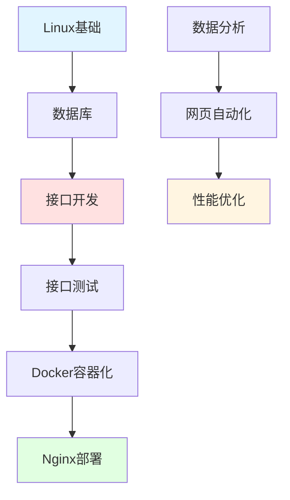

import DocCardList from '@theme/DocCardList';

# 后端通识 - 服务端开发核心技能

后端开发是构建应用程序服务端逻辑的核心技能，涵盖数据库、API开发、系统架构等多个方面。

## 学习路径



## 核心内容

### Linux运维

#### 系统管理
- **文件操作**：ls、cd、cp、mv、rm
- **权限管理**：chmod、chown、用户组
- **进程管理**：ps、top、kill、systemctl
- **网络管理**：netstat、ss、iptables
- **实战**：服务器环境搭建

#### Shell脚本
- **基础语法**：变量、条件、循环
- **文本处理**：grep、sed、awk
- **自动化**：定时任务、日志分析
- **实战**：自动化部署脚本

### 数据库技术

#### 关系型数据库
- **MySQL**：索引优化、事务处理、主从复制
- **PostgreSQL**：高级特性、JSON支持
- **SQL优化**：查询优化、执行计划
- **实战**：高性能数据库设计

#### NoSQL数据库
- **Redis**：缓存、分布式锁、消息队列
- **MongoDB**：文档存储、聚合查询
- **Elasticsearch**：全文搜索、日志分析
- **实战**：缓存架构设计

### 接口开发

#### RESTful API
- **HTTP方法**：GET、POST、PUT、DELETE
- **状态码**：200、404、500等
- **认证授权**：JWT、OAuth2.0
- **版本控制**：URL版本、Header版本
- **实战**：企业级API设计

#### GraphQL
- **查询语言**：Query、Mutation、Subscription
- **Schema设计**：类型定义、解析器
- **性能优化**：DataLoader、缓存
- **实战**：GraphQL服务开发

#### gRPC
- **Protocol Buffers**：数据序列化
- **服务定义**：proto文件编写
- **流式通信**：单向流、双向流
- **实战**：微服务通信

### 接口测试

#### 测试工具
- **Postman**：接口调试、自动化测试
- **cURL**：命令行请求
- **HTTPie**：友好的HTTP客户端
- **实战**：API测试套件

#### 性能测试
- **JMeter**：压力测试、性能分析
- **Locust**：Python压测工具
- **ab**：Apache Bench基准测试
- **实战**：接口性能优化

### 容器化部署

#### Docker
- **镜像管理**：构建、推送、拉取
- **容器操作**：运行、停止、日志
- **网络配置**：bridge、host、overlay
- **数据持久化**：Volume、Bind Mount
- **实战**：应用容器化

#### Docker Compose
- **多容器编排**：服务定义、依赖管理
- **环境配置**：环境变量、配置文件
- **网络通信**：服务发现、负载均衡
- **实战**：微服务部署

### Web服务器

#### Nginx
- **反向代理**：负载均衡、缓存
- **静态资源**：文件服务、压缩
- **HTTPS配置**：SSL证书、安全加固
- **性能优化**：连接池、缓冲区
- **实战**：高可用架构

#### Apache
- **虚拟主机**：多站点配置
- **模块系统**：mod_rewrite、mod_ssl
- **性能调优**：MPM模式、缓存
- **实战**：传统Web服务

### 数据分析

#### Python数据分析
- **NumPy**：数组计算、矩阵运算
- **Pandas**：数据处理、清洗、分析
- **Matplotlib**：数据可视化
- **实战**：业务数据分析

#### 数据处理
- **数据清洗**：缺失值、异常值处理
- **数据转换**：格式转换、特征工程
- **数据聚合**：分组、统计、透视
- **实战**：用户行为分析

### 网页自动化

#### Selenium
- **浏览器控制**：打开、点击、输入
- **元素定位**：ID、CSS、XPath
- **等待机制**：显式等待、隐式等待
- **实战**：自动化测试

#### Playwright
- **多浏览器支持**：Chrome、Firefox、Safari
- **API设计**：简洁、强大
- **截图录屏**：调试辅助
- **实战**：爬虫开发

### 排序算法

#### 基础排序
- **冒泡排序**：O(n²)
- **选择排序**：O(n²)
- **插入排序**：O(n²)
- **实战**：算法实现

#### 高级排序
- **快速排序**：O(n log n)
- **归并排序**：O(n log n)
- **堆排序**：O(n log n)
- **实战**：性能对比

## 学习建议

### 初学者路径（2-3个月）

**第1-2周**：Linux基础
- 学习常用命令
- 理解文件系统
- 练习Shell脚本
- 项目：服务器配置

**第3-4周**：数据库基础
- 学习SQL语法
- 理解索引原理
- 练习查询优化
- 项目：数据库设计

**第5-6周**：接口开发
- 学习HTTP协议
- 掌握RESTful设计
- 实现CRUD接口
- 项目：博客API

**第7-8周**：容器化部署
- 学习Docker基础
- 编写Dockerfile
- 使用Docker Compose
- 项目：应用部署

### 进阶路径（3-4个月）

**阶段1**：性能优化
- 数据库优化
- 缓存策略
- 负载均衡
- 项目：高并发系统

**阶段2**：微服务架构
- 服务拆分
- 服务通信
- 服务治理
- 项目：微服务改造

**阶段3**：DevOps实践
- CI/CD流程
- 自动化测试
- 监控告警
- 项目：自动化部署

## 实用技巧

### Linux常用命令速查

```bash
# 文件操作
ls -lah                    # 查看文件详情
find /path -name "*.log"   # 查找文件
grep "error" app.log       # 搜索内容
tar -czf backup.tar.gz dir # 压缩文件

# 进程管理
ps aux | grep nginx        # 查找进程
top                        # 实时监控
kill -9 PID               # 强制终止
systemctl restart nginx    # 重启服务

# 网络操作
netstat -tuln             # 查看端口
curl http://api.com       # 发送请求
wget http://file.com      # 下载文件
ssh user@host             # 远程连接

# 权限管理
chmod 755 script.sh       # 修改权限
chown user:group file     # 修改所有者
sudo command              # 管理员权限
```

### SQL优化技巧

```sql
-- 使用索引
CREATE INDEX idx_user_email ON users(email);

-- 避免SELECT *
SELECT id, name, email FROM users WHERE id = 1;

-- 使用EXPLAIN分析
EXPLAIN SELECT * FROM orders WHERE user_id = 1;

-- 批量插入
INSERT INTO users (name, email) VALUES 
  ('Alice', 'alice@example.com'),
  ('Bob', 'bob@example.com');

-- 使用JOIN代替子查询
SELECT u.name, o.total 
FROM users u 
JOIN orders o ON u.id = o.user_id;

-- 分页优化
SELECT * FROM users 
WHERE id > 1000 
ORDER BY id 
LIMIT 20;
```

### Docker常用命令

```bash
# 镜像操作
docker images                    # 查看镜像
docker pull nginx:latest         # 拉取镜像
docker build -t myapp:1.0 .     # 构建镜像
docker push myapp:1.0           # 推送镜像

# 容器操作
docker ps                        # 查看运行中的容器
docker ps -a                     # 查看所有容器
docker run -d -p 80:80 nginx    # 运行容器
docker exec -it <id> bash       # 进入容器
docker logs <id>                # 查看日志
docker stop <id>                # 停止容器
docker rm <id>                  # 删除容器

# Docker Compose
docker-compose up -d            # 启动服务
docker-compose down             # 停止服务
docker-compose logs -f          # 查看日志
docker-compose ps               # 查看状态
```

## 实战项目

### 项目1：RESTful API服务

```python
from fastapi import FastAPI, HTTPException
from pydantic import BaseModel
from typing import List, Optional

app = FastAPI()

# 数据模型
class User(BaseModel):
    id: Optional[int] = None
    name: str
    email: str
    age: int

# 模拟数据库
users_db = []
user_id_counter = 1

# 创建用户
@app.post("/users", response_model=User)
async def create_user(user: User):
    global user_id_counter
    user.id = user_id_counter
    user_id_counter += 1
    users_db.append(user)
    return user

# 获取所有用户
@app.get("/users", response_model=List[User])
async def get_users():
    return users_db

# 获取单个用户
@app.get("/users/{user_id}", response_model=User)
async def get_user(user_id: int):
    for user in users_db:
        if user.id == user_id:
            return user
    raise HTTPException(status_code=404, detail="User not found")

# 更新用户
@app.put("/users/{user_id}", response_model=User)
async def update_user(user_id: int, updated_user: User):
    for i, user in enumerate(users_db):
        if user.id == user_id:
            updated_user.id = user_id
            users_db[i] = updated_user
            return updated_user
    raise HTTPException(status_code=404, detail="User not found")

# 删除用户
@app.delete("/users/{user_id}")
async def delete_user(user_id: int):
    for i, user in enumerate(users_db):
        if user.id == user_id:
            users_db.pop(i)
            return {"message": "User deleted"}
    raise HTTPException(status_code=404, detail="User not found")

if __name__ == "__main__":
    import uvicorn
    uvicorn.run(app, host="0.0.0.0", port=8000)
```

### 项目2：Docker部署

```yaml
# docker-compose.yml
version: '3.8'

services:
  # 后端API
  api:
    build: ./backend
    ports:
      - "8000:8000"
    environment:
      - DATABASE_URL=postgresql://user:pass@db:5432/mydb
      - REDIS_URL=redis://redis:6379
    depends_on:
      - db
      - redis
    restart: always

  # 数据库
  db:
    image: postgres:15
    environment:
      - POSTGRES_USER=user
      - POSTGRES_PASSWORD=pass
      - POSTGRES_DB=mydb
    volumes:
      - postgres_data:/var/lib/postgresql/data
    restart: always

  # 缓存
  redis:
    image: redis:7
    volumes:
      - redis_data:/data
    restart: always

  # Nginx反向代理
  nginx:
    image: nginx:latest
    ports:
      - "80:80"
      - "443:443"
    volumes:
      - ./nginx.conf:/etc/nginx/nginx.conf
      - ./ssl:/etc/nginx/ssl
    depends_on:
      - api
    restart: always

volumes:
  postgres_data:
  redis_data:
```

### 项目3：自动化部署脚本

```bash
#!/bin/bash
# deploy.sh - 自动化部署脚本

set -e  # 遇到错误立即退出

echo "开始部署..."

# 1. 拉取最新代码
echo "拉取代码..."
git pull origin main

# 2. 安装依赖
echo "安装依赖..."
pip install -r requirements.txt

# 3. 运行测试
echo "运行测试..."
pytest tests/

# 4. 构建Docker镜像
echo "构建镜像..."
docker build -t myapp:latest .

# 5. 停止旧容器
echo "停止旧容器..."
docker-compose down

# 6. 启动新容器
echo "启动新容器..."
docker-compose up -d

# 7. 健康检查
echo "健康检查..."
sleep 5
curl -f http://localhost:8000/health || exit 1

echo "部署完成！"
```

## 学习资源

### 在线文档
- **Linux命令大全**：https://man.linuxde.net
- **MySQL官方文档**：https://dev.mysql.com/doc
- **Docker官方文档**：https://docs.docker.com
- **FastAPI文档**：https://fastapi.tiangolo.com

### 书籍推荐
- 《鸟哥的Linux私房菜》
- 《高性能MySQL》
- 《Redis设计与实现》
- 《Docker实战》

### 实践平台
- **LeetCode**：算法练习
- **HackerRank**：编程挑战
- **Kaggle**：数据分析竞赛

## 职业发展

### 技能树

```
基础技能
├── Linux操作系统
├── 数据库（SQL/NoSQL）
├── HTTP协议
└── 版本控制（Git）

核心技能
├── 接口开发
├── 数据库设计
├── 缓存策略
└── 容器化部署

进阶技能
├── 微服务架构
├── 分布式系统
├── 性能优化
└── DevOps实践
```

## 开始学习

选择一个章节开始你的后端开发之旅：

<DocCardList />

记住：**后端开发注重稳定性和性能，要多实践、多思考！**
