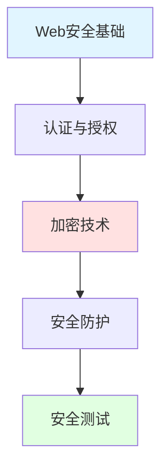

import DocCardList from '@theme/DocCardList';

# 安全与防护

应用安全是系统开发中不可忽视的重要环节，本模块涵盖常见的安全威胁和防护措施。

## 学习路径

## 核心内容

### Web安全威胁
- **XSS**: 跨站脚本攻击
- **CSRF**: 跨站请求伪造
- **SQL注入**: 数据库注入攻击
- **文件上传**: 恶意文件上传
- **DDoS**: 分布式拒绝服务

### 认证与授权
- **JWT**: JSON Web Token
- **OAuth 2.0**: 授权框架
- **SSO**: 单点登录
- **RBAC**: 基于角色的访问控制
- **多因素认证**: MFA

### 加密技术
- **对称加密**: AES、DES
- **非对称加密**: RSA、ECC
- **哈希算法**: SHA-256、bcrypt
- **数字签名**: 验证数据完整性
- **HTTPS**: SSL/TLS协议

### 安全防护
- **输入验证**: 防止注入攻击
- **输出编码**: 防止XSS
- **CSRF Token**: 防止CSRF
- **限流**: 防止暴力破解
- **WAF**: Web应用防火墙

## 开始学习

<DocCardList />

记住：**安全是一个持续的过程，不是一次性的任务！**

