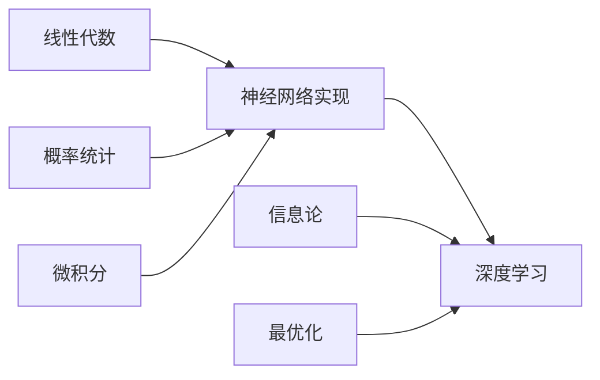

import DocCardList from '@theme/DocCardList';

# 数学基础 - AI工程师的必修课

很多人被"学AI要数学好"这句话吓退了。其实，**你不需要成为数学家，但需要理解数学工具**。

## 为什么要学数学？

想象你要做饭：
- 不懂火候原理，也能按菜谱做菜（调包侠）
- 懂了火候原理，能改良菜谱（调参工程师）
- 精通烹饪科学，能创造新菜（研究员）

数学就是AI的"烹饪科学"。

## 学什么数学？

### 1. 线性代数 - AI的语言

**为什么重要**：神经网络就是矩阵运算。

```python
# 一行代码的背后
output = model(input)

# 实际上是
output = W3 @ (W2 @ (W1 @ input + b1) + b2) + b3
```

**你会学到**：
- 向量和矩阵是什么
- 为什么矩阵乘法这么快
- 神经网络怎么用矩阵计算
- 手写一个简单的神经网络

### 2. 概率统计 - 处理不确定性

**为什么重要**：AI处理的是概率，不是确定性。

```python
# AI的输出是概率分布
predictions = [0.7, 0.2, 0.1]  # [猫, 狗, 鸟]
# 不是说"这是猫"，而是"70%可能是猫"
```

**你会学到**：
- 概率、期望、方差是什么
- 贝叶斯定理怎么用
- 为什么要做数据归一化
- 实现朴素贝叶斯分类器

### 3. 微积分 - 优化的工具

**为什么重要**：训练模型就是求导数。

```python
# 梯度下降的本质
for epoch in range(1000):
    loss = compute_loss(model, data)
    grad = compute_gradient(loss)  # 求导数
    model.params -= learning_rate * grad  # 往导数反方向走
```

**你会学到**：
- 导数是什么，为什么重要
- 梯度下降怎么工作
- 链式法则和反向传播
- 手写自动求导系统

### 4. 信息论 - 衡量信息量

**为什么重要**：损失函数、注意力机制都用到信息论。

```python
# 交叉熵损失
loss = -sum(y_true * log(y_pred))
# 为什么用这个公式？信息论告诉你
```

**你会学到**：
- 熵、交叉熵、KL散度
- 为什么分类用交叉熵损失
- 互信息和注意力机制
- 实现各种损失函数

### 5. 最优化 - 训练的核心

**为什么重要**：训练模型就是优化问题。

```python
# 各种优化器
SGD, Momentum, Adam, AdaGrad...
# 它们有什么区别？数学告诉你
```

**你会学到**：
- 凸优化和非凸优化
- 各种优化算法的原理
- 学习率、动量、自适应学习率
- 实现各种优化器

## 怎么学数学？

### ❌ 错误的学法

1. **从定理开始**：先证明再应用
2. **追求完美**：每个细节都要懂
3. **纯理论**：只看公式不写代码

### ✅ 正确的学法

1. **从问题开始**：为什么需要这个数学工具？
2. **理解核心**：抓住主要思想，细节可以查
3. **边学边用**：每个概念都写代码验证

## 学习路线



### 第一阶段：基础三件套（2-3周）

1. **线性代数**：向量、矩阵、矩阵乘法
2. **概率统计**：概率、期望、方差、贝叶斯
3. **微积分**：导数、梯度、链式法则

**目标**：能看懂神经网络的前向传播和反向传播

### 第二阶段：深入理解（2-3周）

4. **信息论**：熵、交叉熵、KL散度
5. **最优化**：梯度下降、动量、Adam

**目标**：能理解各种损失函数和优化器

### 第三阶段：实战应用（持续）

- 手写神经网络
- 实现各种优化器
- 理解Transformer数学原理
- 阅读论文中的数学推导

## 学习建议

### 1. 不要怕

数学看起来吓人，其实核心思想很简单：

```python
# 梯度下降的数学表达
θ = θ - α∇J(θ)

# 翻译成人话
新参数 = 旧参数 - 学习率 × 梯度
```

### 2. 多动手

每学一个概念，立刻写代码：

```python
# 学了导数？写个梯度下降
def gradient_descent(f, df, x0, lr=0.1, steps=100):
    x = x0
    for _ in range(steps):
        x = x - lr * df(x)
    return x
```

### 3. 可视化

数学不是抽象的，是可以看见的：

```python
import matplotlib.pyplot as plt

# 可视化梯度下降
x = np.linspace(-5, 5, 100)
y = x**2
plt.plot(x, y)
plt.show()
```

### 4. 从应用倒推

不要从定义学，从应用学：

- 为什么神经网络用矩阵？→ 学线性代数
- 为什么用交叉熵损失？→ 学信息论
- 为什么Adam比SGD好？→ 学最优化

## 工具推荐

### Python库

```python
import numpy as np        # 线性代数
import scipy as sp        # 科学计算
import matplotlib.pyplot as plt  # 可视化
import sympy as sym       # 符号计算
```

### 在线资源

- **3Blue1Brown**：最好的数学可视化
- **Khan Academy**：基础数学课程
- **MIT OpenCourseWare**：线性代数、微积分

### 书籍

- 《线性代数的本质》- 3Blue1Brown
- 《概率论与数理统计》- 浙大版
- 《深度学习》- Goodfellow（数学附录）

## 常见问题

### Q: 我数学不好，能学AI吗？

**A**: 能！你需要的是**工程数学**，不是**理论数学**。

- 不需要证明定理
- 不需要手算复杂积分
- 需要理解概念，会用工具

### Q: 要学到什么程度？

**A**: 看你的目标：

- **调包侠**：知道有这些数学工具即可
- **算法工程师**：能看懂论文中的公式
- **研究员**：能推导新算法

### Q: 学数学要多久？

**A**: 

- **基础入门**：1个月（每天2小时）
- **熟练应用**：3个月（边学边做项目）
- **精通**：持续学习

### Q: 先学数学还是先学编程？

**A**: **同时学**！

```python
# 学数学的同时写代码验证
# 学编程的同时理解背后的数学
```

## 开始学习

选择一个章节开始：

<DocCardList />

记住：**数学是工具，不是目的**。学数学是为了更好地理解和使用AI，不是为了成为数学家。

边学边用，遇到不懂的再深入，这样最高效！

