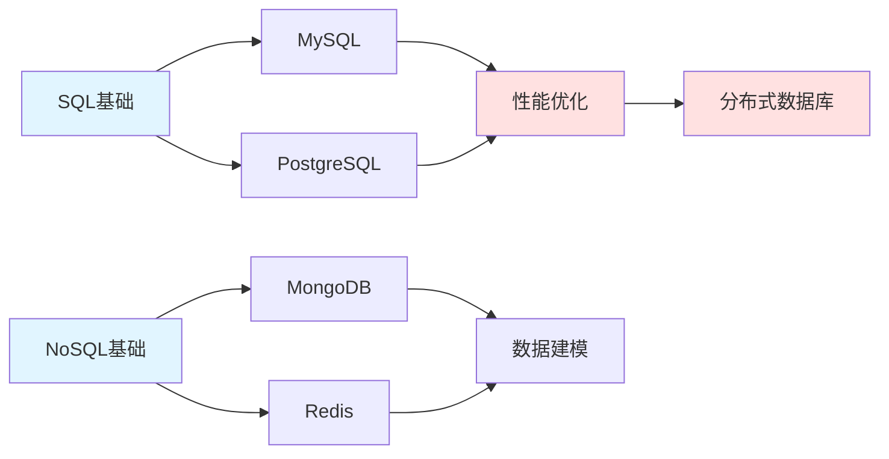

import DocCardList from '@theme/DocCardList';

# 数据库 - 数据存储与管理

数据库是应用程序的核心。这个模块教你**从基础到高级的数据库技术**。

## 🗺️ 学习路径



## 📚 模块内容

### 🔵 关系型数据库

#### MySQL - 最流行的开源数据库
- **基础操作**：CRUD、索引、事务
- **高级特性**：存储过程、触发器、视图
- **性能优化**：查询优化、索引优化
- **实战项目**：电商数据库设计

#### PostgreSQL - 最先进的开源数据库
- **高级特性**：JSON支持、全文搜索
- **扩展功能**：PostGIS、时序数据
- **性能调优**：查询计划、并发控制

#### SQL Server - 企业级数据库
- **T-SQL编程**
- **高可用方案**
- **商业智能**

### 🔴 NoSQL数据库

#### MongoDB - 文档数据库
- **文档模型**：灵活的schema
- **聚合管道**：复杂查询
- **分片集群**：水平扩展
- **实战项目**：内容管理系统

#### Redis - 内存数据库
- **数据结构**：String、Hash、List、Set、ZSet
- **持久化**：RDB、AOF
- **高可用**：主从复制、哨兵、集群
- **实战项目**：缓存系统、排行榜

#### Elasticsearch - 搜索引擎
- **全文搜索**
- **日志分析**
- **实时分析**

### 🟢 NewSQL数据库

#### TiDB - 分布式数据库
- **水平扩展**
- **强一致性**
- **MySQL兼容**

### 🟡 时序数据库

#### InfluxDB - 时序数据存储
- **时序数据模型**
- **高效写入**
- **数据聚合**

## 🎯 学习建议

### 初学者路径（2-3个月）

**第1-2周**：SQL基础
- 学习SQL语法
- 掌握CRUD操作
- 理解表关系

**第3-4周**：MySQL深入
- 索引原理
- 事务ACID
- 查询优化

**第5-6周**：NoSQL入门
- MongoDB文档模型
- Redis数据结构
- 使用场景对比

**第7-8周**：实战项目
- 设计电商数据库
- 实现缓存系统
- 性能优化实践

### 进阶路径（3-6个月）

**数据库设计**：
- 范式理论
- 反范式设计
- 数据建模

**性能优化**：
- 慢查询分析
- 索引优化
- 分库分表

**高可用方案**：
- 主从复制
- 读写分离
- 故障转移

**分布式数据库**：
- 分片策略
- 一致性协议
- CAP理论

## 💡 技术选型

### 关系型 vs NoSQL

| 场景 | 推荐数据库 | 原因 |
|------|-----------|------|
| 电商订单 | MySQL | 强一致性、事务支持 |
| 用户画像 | MongoDB | 灵活schema、快速迭代 |
| 缓存 | Redis | 高性能、丰富数据结构 |
| 日志分析 | Elasticsearch | 全文搜索、实时分析 |
| 时序监控 | InfluxDB | 高效时序存储 |

### 数据库对比

| 特性 | MySQL | MongoDB | Redis | PostgreSQL |
|------|-------|---------|-------|------------|
| 类型 | 关系型 | 文档型 | KV型 | 关系型 |
| 事务 | ✅ | ✅ | ✅ | ✅ |
| 扩展性 | 垂直 | 水平 | 水平 | 垂直 |
| 查询语言 | SQL | MQL | 命令 | SQL |
| 适用场景 | OLTP | 灵活数据 | 缓存 | 复杂查询 |

## 🚀 快速开始

### Docker快速部署

```bash
# MySQL
docker run -d --name mysql \
  -e MYSQL_ROOT_PASSWORD=password \
  -p 3306:3306 \
  mysql:8.0

# MongoDB
docker run -d --name mongodb \
  -p 27017:27017 \
  mongo:latest

# Redis
docker run -d --name redis \
  -p 6379:6379 \
  redis:latest

# PostgreSQL
docker run -d --name postgres \
  -e POSTGRES_PASSWORD=password \
  -p 5432:5432 \
  postgres:latest
```

### 连接数据库

```python
# MySQL
import mysql.connector
conn = mysql.connector.connect(
    host='localhost',
    user='root',
    password='password',
    database='test'
)

# MongoDB
from pymongo import MongoClient
client = MongoClient('mongodb://localhost:27017/')
db = client['test']

# Redis
import redis
r = redis.Redis(host='localhost', port=6379, db=0)

# PostgreSQL
import psycopg2
conn = psycopg2.connect(
    host='localhost',
    user='postgres',
    password='password',
    database='test'
)
```

## 📖 学习资源

### 在线课程
- **MySQL必知必会** - 入门经典
- **MongoDB University** - 官方课程
- **Redis实战** - 实用教程

### 书籍推荐
- 《高性能MySQL》
- 《MongoDB权威指南》
- 《Redis设计与实现》
- 《数据库系统概念》

### 实践平台
- **LeetCode Database** - SQL练习
- **HackerRank SQL** - 在线刷题
- **本地搭建** - Docker环境

## 🎓 认证考试

- **MySQL认证**：MySQL Database Administrator
- **MongoDB认证**：MongoDB Certified Developer
- **Redis认证**：Redis Certified Developer
- **PostgreSQL认证**：PostgreSQL Certified Professional

## 💼 职业发展

### 数据库工程师技能树

```
基础技能
├── SQL语法
├── 数据库原理
├── 索引和事务
└── 备份恢复

核心技能
├── 性能优化
├── 高可用方案
├── 分库分表
└── 监控告警

进阶技能
├── 分布式数据库
├── 数据库内核
├── 架构设计
└── 容量规划
```

### 职业路径

1. **初级**：数据库开发工程师
   - SQL开发
   - 数据库设计
   - 基础运维

2. **中级**：数据库管理员（DBA）
   - 性能优化
   - 高可用部署
   - 故障处理

3. **高级**：数据库架构师
   - 架构设计
   - 技术选型
   - 团队管理

## 🔥 热门技术

### 2024年数据库趋势

1. **云原生数据库**
   - AWS Aurora
   - Google Cloud Spanner
   - 阿里云PolarDB

2. **NewSQL数据库**
   - TiDB
   - CockroachDB
   - YugabyteDB

3. **向量数据库**
   - Milvus
   - Pinecone
   - Weaviate

4. **图数据库**
   - Neo4j
   - ArangoDB
   - JanusGraph

## 开始学习

选择一个章节开始你的数据库之旅：

<DocCardList />

记住：**数据库是应用的基石，打好基础很重要！**

