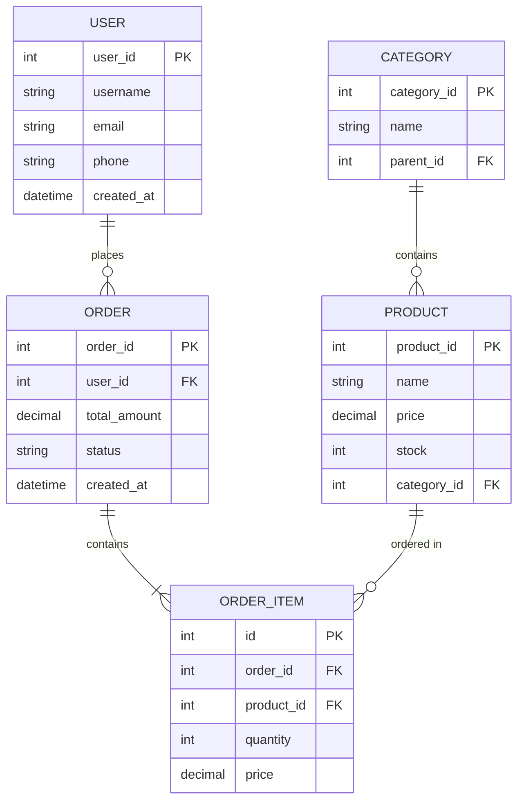

# 数据库设计理论与实践

## 概述

数据库设计是构建高效、可维护系统的基础。本文将介绍数据库设计的理论基础和实践方法。

### 设计目标

- **数据完整性**：保证数据的准确性和一致性
- **高性能**：快速的查询和更新
- **可扩展性**：易于添加新功能
- **可维护性**：清晰的结构和文档

## 数据库设计流程

### 1. 需求分析

```markdown
## 电商系统需求分析

### 功能需求
- 用户管理：注册、登录、个人信息
- 商品管理：商品信息、分类、库存
- 订单管理：下单、支付、发货、退款
- 评价系统：商品评价、评分

### 数据需求
- 用户数据：100万+
- 商品数据：10万+
- 订单数据：1000万+/年
- 并发量：1000 QPS

### 性能需求
- 查询响应时间 < 100ms
- 订单处理时间 < 1s
- 数据一致性要求高
```

### 2. 概念设计（ER模型）



### 3. 逻辑设计（表结构）

```sql
-- 用户表
CREATE TABLE users (
    user_id BIGINT PRIMARY KEY AUTO_INCREMENT,
    username VARCHAR(50) NOT NULL UNIQUE,
    email VARCHAR(100) NOT NULL UNIQUE,
    password_hash VARCHAR(255) NOT NULL,
    phone VARCHAR(20),
    avatar VARCHAR(255),
    status TINYINT DEFAULT 1 COMMENT '1:正常 0:禁用',
    created_at TIMESTAMP DEFAULT CURRENT_TIMESTAMP,
    updated_at TIMESTAMP DEFAULT CURRENT_TIMESTAMP ON UPDATE CURRENT_TIMESTAMP,
    INDEX idx_email (email),
    INDEX idx_phone (phone),
    INDEX idx_created_at (created_at)
) ENGINE=InnoDB DEFAULT CHARSET=utf8mb4 COMMENT='用户表';

-- 商品分类表
CREATE TABLE categories (
    category_id INT PRIMARY KEY AUTO_INCREMENT,
    name VARCHAR(50) NOT NULL,
    parent_id INT DEFAULT 0,
    level TINYINT DEFAULT 1,
    sort_order INT DEFAULT 0,
    icon VARCHAR(255),
    is_show TINYINT DEFAULT 1,
    created_at TIMESTAMP DEFAULT CURRENT_TIMESTAMP,
    INDEX idx_parent_id (parent_id),
    INDEX idx_level (level)
) ENGINE=InnoDB DEFAULT CHARSET=utf8mb4 COMMENT='商品分类表';

-- 商品表
CREATE TABLE products (
    product_id BIGINT PRIMARY KEY AUTO_INCREMENT,
    category_id INT NOT NULL,
    name VARCHAR(200) NOT NULL,
    description TEXT,
    price DECIMAL(10, 2) NOT NULL,
    original_price DECIMAL(10, 2),
    stock INT NOT NULL DEFAULT 0,
    sales INT DEFAULT 0,
    images JSON,
    specs JSON COMMENT '商品规格',
    status TINYINT DEFAULT 1 COMMENT '1:上架 0:下架',
    created_at TIMESTAMP DEFAULT CURRENT_TIMESTAMP,
    updated_at TIMESTAMP DEFAULT CURRENT_TIMESTAMP ON UPDATE CURRENT_TIMESTAMP,
    INDEX idx_category_id (category_id),
    INDEX idx_price (price),
    INDEX idx_sales (sales),
    INDEX idx_status (status),
    FULLTEXT idx_name_desc (name, description)
) ENGINE=InnoDB DEFAULT CHARSET=utf8mb4 COMMENT='商品表';

-- 订单表
CREATE TABLE orders (
    order_id BIGINT PRIMARY KEY AUTO_INCREMENT,
    order_no VARCHAR(32) NOT NULL UNIQUE,
    user_id BIGINT NOT NULL,
    total_amount DECIMAL(10, 2) NOT NULL,
    pay_amount DECIMAL(10, 2) NOT NULL,
    freight DECIMAL(10, 2) DEFAULT 0,
    coupon_amount DECIMAL(10, 2) DEFAULT 0,
    status TINYINT NOT NULL DEFAULT 0 COMMENT '0:待支付 1:已支付 2:已发货 3:已完成 4:已取消',
    pay_type TINYINT COMMENT '1:支付宝 2:微信 3:银行卡',
    pay_time TIMESTAMP NULL,
    ship_time TIMESTAMP NULL,
    finish_time TIMESTAMP NULL,
    receiver_name VARCHAR(50) NOT NULL,
    receiver_phone VARCHAR(20) NOT NULL,
    receiver_address VARCHAR(255) NOT NULL,
    remark VARCHAR(500),
    created_at TIMESTAMP DEFAULT CURRENT_TIMESTAMP,
    updated_at TIMESTAMP DEFAULT CURRENT_TIMESTAMP ON UPDATE CURRENT_TIMESTAMP,
    INDEX idx_order_no (order_no),
    INDEX idx_user_id (user_id),
    INDEX idx_status (status),
    INDEX idx_created_at (created_at)
) ENGINE=InnoDB DEFAULT CHARSET=utf8mb4 COMMENT='订单表';

-- 订单明细表
CREATE TABLE order_items (
    id BIGINT PRIMARY KEY AUTO_INCREMENT,
    order_id BIGINT NOT NULL,
    product_id BIGINT NOT NULL,
    product_name VARCHAR(200) NOT NULL,
    product_image VARCHAR(255),
    price DECIMAL(10, 2) NOT NULL,
    quantity INT NOT NULL,
    total_amount DECIMAL(10, 2) NOT NULL,
    INDEX idx_order_id (order_id),
    INDEX idx_product_id (product_id)
) ENGINE=InnoDB DEFAULT CHARSET=utf8mb4 COMMENT='订单明细表';

-- 商品评价表
CREATE TABLE reviews (
    review_id BIGINT PRIMARY KEY AUTO_INCREMENT,
    order_id BIGINT NOT NULL,
    product_id BIGINT NOT NULL,
    user_id BIGINT NOT NULL,
    rating TINYINT NOT NULL COMMENT '1-5星',
    content TEXT,
    images JSON,
    reply TEXT COMMENT '商家回复',
    is_anonymous TINYINT DEFAULT 0,
    created_at TIMESTAMP DEFAULT CURRENT_TIMESTAMP,
    INDEX idx_product_id (product_id),
    INDEX idx_user_id (user_id),
    INDEX idx_rating (rating)
) ENGINE=InnoDB DEFAULT CHARSET=utf8mb4 COMMENT='商品评价表';
```

## 数据库范式

### 第一范式（1NF）

**定义**：每个字段都是不可分割的原子值。

```sql
-- ❌ 违反1NF
CREATE TABLE users (
    user_id INT PRIMARY KEY,
    name VARCHAR(100),
    contact VARCHAR(200) -- 包含电话和邮箱
);

-- ✅ 符合1NF
CREATE TABLE users (
    user_id INT PRIMARY KEY,
    name VARCHAR(100),
    phone VARCHAR(20),
    email VARCHAR(100)
);
```

### 第二范式（2NF）

**定义**：在1NF基础上，非主键字段完全依赖于主键。

```sql
-- ❌ 违反2NF（订单号+商品ID为联合主键）
CREATE TABLE order_items (
    order_no VARCHAR(32),
    product_id INT,
    product_name VARCHAR(100),  -- 只依赖product_id
    quantity INT,
    order_date DATE,            -- 只依赖order_no
    PRIMARY KEY (order_no, product_id)
);

-- ✅ 符合2NF（拆分表）
CREATE TABLE orders (
    order_no VARCHAR(32) PRIMARY KEY,
    order_date DATE
);

CREATE TABLE order_items (
    order_no VARCHAR(32),
    product_id INT,
    quantity INT,
    PRIMARY KEY (order_no, product_id)
);

CREATE TABLE products (
    product_id INT PRIMARY KEY,
    product_name VARCHAR(100)
);
```

### 第三范式（3NF）

**定义**：在2NF基础上，非主键字段不依赖于其他非主键字段。

```sql
-- ❌ 违反3NF
CREATE TABLE employees (
    emp_id INT PRIMARY KEY,
    name VARCHAR(100),
    dept_id INT,
    dept_name VARCHAR(100),  -- 依赖于dept_id
    dept_location VARCHAR(100) -- 依赖于dept_id
);

-- ✅ 符合3NF
CREATE TABLE employees (
    emp_id INT PRIMARY KEY,
    name VARCHAR(100),
    dept_id INT
);

CREATE TABLE departments (
    dept_id INT PRIMARY KEY,
    dept_name VARCHAR(100),
    dept_location VARCHAR(100)
);
```

### BCNF（Boyce-Codd范式）

**定义**：在3NF基础上，主键字段之间不存在依赖关系。

```sql
-- ❌ 违反BCNF
CREATE TABLE course_teacher (
    student_id INT,
    course_id INT,
    teacher_id INT,  -- 依赖于course_id
    PRIMARY KEY (student_id, course_id)
);

-- ✅ 符合BCNF
CREATE TABLE student_course (
    student_id INT,
    course_id INT,
    PRIMARY KEY (student_id, course_id)
);

CREATE TABLE course_teacher (
    course_id INT PRIMARY KEY,
    teacher_id INT
);
```

## 反范式设计

在某些场景下，为了提高查询性能，可以适当违反范式。

### 1. 冗余字段

```sql
-- 订单表冗余商品信息
CREATE TABLE orders (
    order_id BIGINT PRIMARY KEY,
    product_id BIGINT,
    product_name VARCHAR(200),    -- 冗余
    product_price DECIMAL(10, 2), -- 冗余
    quantity INT
);

-- 优点：查询订单时不需要JOIN商品表
-- 缺点：商品信息变更时需要同步更新
```

### 2. 计算字段

```sql
-- 用户表添加订单统计
CREATE TABLE users (
    user_id BIGINT PRIMARY KEY,
    username VARCHAR(50),
    total_orders INT DEFAULT 0,      -- 冗余
    total_amount DECIMAL(10, 2) DEFAULT 0 -- 冗余
);

-- 通过触发器或定时任务更新
CREATE TRIGGER update_user_stats
AFTER INSERT ON orders
FOR EACH ROW
BEGIN
    UPDATE users 
    SET total_orders = total_orders + 1,
        total_amount = total_amount + NEW.total_amount
    WHERE user_id = NEW.user_id;
END;
```

### 3. 汇总表

```sql
-- 每日订单统计表
CREATE TABLE daily_order_stats (
    stat_date DATE PRIMARY KEY,
    total_orders INT,
    total_amount DECIMAL(10, 2),
    total_users INT,
    created_at TIMESTAMP DEFAULT CURRENT_TIMESTAMP
);

-- 定时任务生成统计数据
INSERT INTO daily_order_stats (stat_date, total_orders, total_amount, total_users)
SELECT 
    DATE(created_at) as stat_date,
    COUNT(*) as total_orders,
    SUM(total_amount) as total_amount,
    COUNT(DISTINCT user_id) as total_users
FROM orders
WHERE DATE(created_at) = CURDATE() - INTERVAL 1 DAY
GROUP BY DATE(created_at);
```

## 索引设计

### 1. 主键索引

```sql
-- 自增主键（推荐）
CREATE TABLE users (
    user_id BIGINT PRIMARY KEY AUTO_INCREMENT,
    username VARCHAR(50)
);

-- UUID主键（分布式场景）
CREATE TABLE users (
    user_id CHAR(36) PRIMARY KEY DEFAULT (UUID()),
    username VARCHAR(50)
);

-- 雪花ID（推荐用于分布式）
CREATE TABLE users (
    user_id BIGINT PRIMARY KEY,  -- 应用层生成
    username VARCHAR(50)
);
```

### 2. 唯一索引

```sql
CREATE TABLE users (
    user_id BIGINT PRIMARY KEY AUTO_INCREMENT,
    username VARCHAR(50) NOT NULL,
    email VARCHAR(100) NOT NULL,
    phone VARCHAR(20),
    UNIQUE KEY uk_username (username),
    UNIQUE KEY uk_email (email),
    UNIQUE KEY uk_phone (phone)
);
```

### 3. 普通索引

```sql
CREATE TABLE orders (
    order_id BIGINT PRIMARY KEY,
    user_id BIGINT NOT NULL,
    status TINYINT NOT NULL,
    created_at TIMESTAMP,
    INDEX idx_user_id (user_id),
    INDEX idx_status (status),
    INDEX idx_created_at (created_at)
);
```

### 4. 联合索引

```sql
-- 最左前缀原则
CREATE TABLE orders (
    order_id BIGINT PRIMARY KEY,
    user_id BIGINT NOT NULL,
    status TINYINT NOT NULL,
    created_at TIMESTAMP,
    -- 联合索引
    INDEX idx_user_status_time (user_id, status, created_at)
);

-- 可以使用的查询
-- ✅ WHERE user_id = 1
-- ✅ WHERE user_id = 1 AND status = 1
-- ✅ WHERE user_id = 1 AND status = 1 AND created_at > '2024-01-01'
-- ❌ WHERE status = 1 (不能使用索引)
-- ❌ WHERE created_at > '2024-01-01' (不能使用索引)
```

### 5. 覆盖索引

```sql
-- 查询只需要索引中的字段
CREATE TABLE users (
    user_id BIGINT PRIMARY KEY,
    username VARCHAR(50),
    email VARCHAR(100),
    phone VARCHAR(20),
    INDEX idx_username_email (username, email)
);

-- ✅ 使用覆盖索引（不需要回表）
SELECT username, email FROM users WHERE username = 'admin';

-- ❌ 不能使用覆盖索引（需要回表查phone）
SELECT username, email, phone FROM users WHERE username = 'admin';
```

## 数据类型选择

### 1. 整数类型

```sql
-- 根据数据范围选择合适的类型
TINYINT    -- 1字节，-128 ~ 127
SMALLINT   -- 2字节，-32768 ~ 32767
MEDIUMINT  -- 3字节，-8388608 ~ 8388607
INT        -- 4字节，-2147483648 ~ 2147483647
BIGINT     -- 8字节，-9223372036854775808 ~ 9223372036854775807

-- 示例
CREATE TABLE users (
    user_id BIGINT,           -- 用户ID，可能很大
    age TINYINT UNSIGNED,     -- 年龄，0-255足够
    status TINYINT,           -- 状态，-128~127足够
    login_count INT UNSIGNED  -- 登录次数
);
```

### 2. 字符串类型

```sql
-- CHAR vs VARCHAR
CHAR(10)    -- 固定长度，适合长度固定的数据（如手机号）
VARCHAR(10) -- 可变长度，适合长度不固定的数据

-- TEXT类型
TINYTEXT   -- 255字节
TEXT       -- 65535字节
MEDIUMTEXT -- 16MB
LONGTEXT   -- 4GB

-- 示例
CREATE TABLE users (
    phone CHAR(11),           -- 手机号固定11位
    username VARCHAR(50),     -- 用户名长度不固定
    bio TEXT,                 -- 个人简介
    content LONGTEXT          -- 文章内容
);
```

### 3. 日期时间类型

```sql
-- DATE vs DATETIME vs TIMESTAMP
DATE      -- 日期，YYYY-MM-DD
DATETIME  -- 日期时间，YYYY-MM-DD HH:MM:SS，不受时区影响
TIMESTAMP -- 时间戳，受时区影响，范围1970-2038

-- 示例
CREATE TABLE events (
    event_id BIGINT PRIMARY KEY,
    event_date DATE,                    -- 活动日期
    start_time DATETIME,                -- 开始时间
    created_at TIMESTAMP DEFAULT CURRENT_TIMESTAMP,
    updated_at TIMESTAMP DEFAULT CURRENT_TIMESTAMP ON UPDATE CURRENT_TIMESTAMP
);
```

### 4. JSON类型

```sql
CREATE TABLE products (
    product_id BIGINT PRIMARY KEY,
    name VARCHAR(200),
    specs JSON,  -- 商品规格
    images JSON  -- 商品图片
);

-- 插入JSON数据
INSERT INTO products (name, specs, images) VALUES (
    'iPhone 15',
    '{"color": "black", "storage": "256GB", "screen": "6.1inch"}',
    '["img1.jpg", "img2.jpg", "img3.jpg"]'
);

-- 查询JSON数据
SELECT 
    name,
    specs->>'$.color' as color,
    specs->>'$.storage' as storage,
    JSON_LENGTH(images) as image_count
FROM products;

-- JSON索引
CREATE INDEX idx_color ON products ((CAST(specs->>'$.color' AS CHAR(20))));
```

## 约束设计

### 1. 主键约束

```sql
CREATE TABLE users (
    user_id BIGINT PRIMARY KEY AUTO_INCREMENT,
    username VARCHAR(50)
);
```

### 2. 外键约束

```sql
CREATE TABLE orders (
    order_id BIGINT PRIMARY KEY,
    user_id BIGINT NOT NULL,
    FOREIGN KEY (user_id) REFERENCES users(user_id)
        ON DELETE CASCADE
        ON UPDATE CASCADE
);

-- 注意：外键会影响性能，大型系统通常在应用层维护关系
```

### 3. 唯一约束

```sql
CREATE TABLE users (
    user_id BIGINT PRIMARY KEY,
    username VARCHAR(50) NOT NULL,
    email VARCHAR(100) NOT NULL,
    UNIQUE KEY uk_username (username),
    UNIQUE KEY uk_email (email)
);
```

### 4. 检查约束

```sql
CREATE TABLE products (
    product_id BIGINT PRIMARY KEY,
    price DECIMAL(10, 2) NOT NULL,
    stock INT NOT NULL,
    CHECK (price > 0),
    CHECK (stock >= 0)
);
```

### 5. 默认值约束

```sql
CREATE TABLE users (
    user_id BIGINT PRIMARY KEY AUTO_INCREMENT,
    username VARCHAR(50) NOT NULL,
    status TINYINT DEFAULT 1,
    created_at TIMESTAMP DEFAULT CURRENT_TIMESTAMP
);
```

## 分区表设计

### 1. RANGE分区

```sql
-- 按日期分区
CREATE TABLE orders (
    order_id BIGINT,
    user_id BIGINT,
    total_amount DECIMAL(10, 2),
    created_at TIMESTAMP
)
PARTITION BY RANGE (YEAR(created_at)) (
    PARTITION p2022 VALUES LESS THAN (2023),
    PARTITION p2023 VALUES LESS THAN (2024),
    PARTITION p2024 VALUES LESS THAN (2025),
    PARTITION p_future VALUES LESS THAN MAXVALUE
);
```

### 2. LIST分区

```sql
-- 按地区分区
CREATE TABLE users (
    user_id BIGINT,
    username VARCHAR(50),
    region VARCHAR(20)
)
PARTITION BY LIST COLUMNS(region) (
    PARTITION p_north VALUES IN ('beijing', 'tianjin', 'hebei'),
    PARTITION p_south VALUES IN ('guangdong', 'guangxi', 'hainan'),
    PARTITION p_east VALUES IN ('shanghai', 'jiangsu', 'zhejiang'),
    PARTITION p_west VALUES IN ('sichuan', 'chongqing', 'yunnan')
);
```

### 3. HASH分区

```sql
-- 按用户ID哈希分区
CREATE TABLE user_logs (
    log_id BIGINT,
    user_id BIGINT,
    action VARCHAR(50),
    created_at TIMESTAMP
)
PARTITION BY HASH(user_id)
PARTITIONS 10;
```

## 最佳实践

### 1. 命名规范

```sql
-- 表名：小写，下划线分隔，复数形式
users, products, order_items

-- 字段名：小写，下划线分隔
user_id, created_at, total_amount

-- 索引名：
-- 主键：pk_表名
-- 唯一索引：uk_字段名
-- 普通索引：idx_字段名
-- 外键：fk_表名_字段名
```

### 2. 字段设计原则

- 使用NOT NULL + DEFAULT，避免NULL值
- 合理选择数据类型，避免浪费空间
- 重要字段添加注释
- 预留扩展字段（ext_info JSON）

### 3. 索引设计原则

- 主键使用自增ID或雪花ID
- 频繁查询的字段添加索引
- 联合索引遵循最左前缀原则
- 避免过多索引（影响写入性能）

### 4. 性能优化

- 合理使用反范式设计
- 大表分区或分表
- 读写分离
- 使用缓存

## 总结

数据库设计需要平衡：

1. **规范性 vs 性能**：范式设计 vs 反范式设计
2. **灵活性 vs 约束**：JSON字段 vs 严格schema
3. **一致性 vs 可用性**：强一致 vs 最终一致

## 延伸阅读

- [数据库系统概念](https://www.db-book.com/)
- [高性能MySQL](https://www.oreilly.com/library/view/high-performance-mysql/9781492080503/)
- [数据库设计规范](https://www.sqlstyle.guide/)

