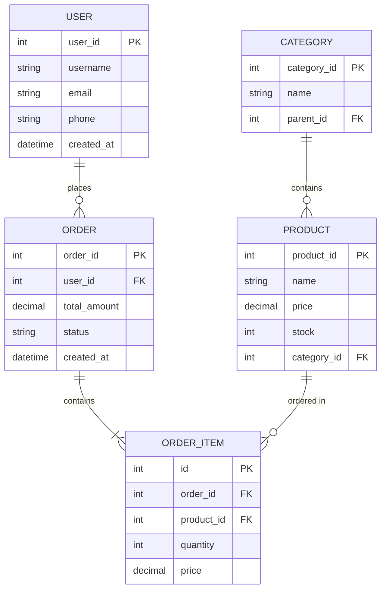

# 

## 


### 

- ****
- ****
- ****
- ****

## 

### 1. 

```markdown
## 

### 
- 
- 
- 
- 

### 
- 100+
- 10+
- 1000+/
- 1000 QPS

### 
-  < 100ms
-  < 1s
- 
```

### 2. ER



### 3. 

```sql
-- 
CREATE TABLE users (
    user_id BIGINT PRIMARY KEY AUTO_INCREMENT,
    username VARCHAR(50) NOT NULL UNIQUE,
    email VARCHAR(100) NOT NULL UNIQUE,
    password_hash VARCHAR(255) NOT NULL,
    phone VARCHAR(20),
    avatar VARCHAR(255),
    status TINYINT DEFAULT 1 COMMENT '1: 0:',
    created_at TIMESTAMP DEFAULT CURRENT_TIMESTAMP,
    updated_at TIMESTAMP DEFAULT CURRENT_TIMESTAMP ON UPDATE CURRENT_TIMESTAMP,
    INDEX idx_email (email),
    INDEX idx_phone (phone),
    INDEX idx_created_at (created_at)
) ENGINE=InnoDB DEFAULT CHARSET=utf8mb4 COMMENT='';

-- 
CREATE TABLE categories (
    category_id INT PRIMARY KEY AUTO_INCREMENT,
    name VARCHAR(50) NOT NULL,
    parent_id INT DEFAULT 0,
    level TINYINT DEFAULT 1,
    sort_order INT DEFAULT 0,
    icon VARCHAR(255),
    is_show TINYINT DEFAULT 1,
    created_at TIMESTAMP DEFAULT CURRENT_TIMESTAMP,
    INDEX idx_parent_id (parent_id),
    INDEX idx_level (level)
) ENGINE=InnoDB DEFAULT CHARSET=utf8mb4 COMMENT='';

-- 
CREATE TABLE products (
    product_id BIGINT PRIMARY KEY AUTO_INCREMENT,
    category_id INT NOT NULL,
    name VARCHAR(200) NOT NULL,
    description TEXT,
    price DECIMAL(10, 2) NOT NULL,
    original_price DECIMAL(10, 2),
    stock INT NOT NULL DEFAULT 0,
    sales INT DEFAULT 0,
    images JSON,
    specs JSON COMMENT '',
    status TINYINT DEFAULT 1 COMMENT '1: 0:',
    created_at TIMESTAMP DEFAULT CURRENT_TIMESTAMP,
    updated_at TIMESTAMP DEFAULT CURRENT_TIMESTAMP ON UPDATE CURRENT_TIMESTAMP,
    INDEX idx_category_id (category_id),
    INDEX idx_price (price),
    INDEX idx_sales (sales),
    INDEX idx_status (status),
    FULLTEXT idx_name_desc (name, description)
) ENGINE=InnoDB DEFAULT CHARSET=utf8mb4 COMMENT='';

-- 
CREATE TABLE orders (
    order_id BIGINT PRIMARY KEY AUTO_INCREMENT,
    order_no VARCHAR(32) NOT NULL UNIQUE,
    user_id BIGINT NOT NULL,
    total_amount DECIMAL(10, 2) NOT NULL,
    pay_amount DECIMAL(10, 2) NOT NULL,
    freight DECIMAL(10, 2) DEFAULT 0,
    coupon_amount DECIMAL(10, 2) DEFAULT 0,
    status TINYINT NOT NULL DEFAULT 0 COMMENT '0: 1: 2: 3: 4:',
    pay_type TINYINT COMMENT '1: 2: 3:',
    pay_time TIMESTAMP NULL,
    ship_time TIMESTAMP NULL,
    finish_time TIMESTAMP NULL,
    receiver_name VARCHAR(50) NOT NULL,
    receiver_phone VARCHAR(20) NOT NULL,
    receiver_address VARCHAR(255) NOT NULL,
    remark VARCHAR(500),
    created_at TIMESTAMP DEFAULT CURRENT_TIMESTAMP,
    updated_at TIMESTAMP DEFAULT CURRENT_TIMESTAMP ON UPDATE CURRENT_TIMESTAMP,
    INDEX idx_order_no (order_no),
    INDEX idx_user_id (user_id),
    INDEX idx_status (status),
    INDEX idx_created_at (created_at)
) ENGINE=InnoDB DEFAULT CHARSET=utf8mb4 COMMENT='';

-- 
CREATE TABLE order_items (
    id BIGINT PRIMARY KEY AUTO_INCREMENT,
    order_id BIGINT NOT NULL,
    product_id BIGINT NOT NULL,
    product_name VARCHAR(200) NOT NULL,
    product_image VARCHAR(255),
    price DECIMAL(10, 2) NOT NULL,
    quantity INT NOT NULL,
    total_amount DECIMAL(10, 2) NOT NULL,
    INDEX idx_order_id (order_id),
    INDEX idx_product_id (product_id)
) ENGINE=InnoDB DEFAULT CHARSET=utf8mb4 COMMENT='';

-- 
CREATE TABLE reviews (
    review_id BIGINT PRIMARY KEY AUTO_INCREMENT,
    order_id BIGINT NOT NULL,
    product_id BIGINT NOT NULL,
    user_id BIGINT NOT NULL,
    rating TINYINT NOT NULL COMMENT '1-5',
    content TEXT,
    images JSON,
    reply TEXT COMMENT '',
    is_anonymous TINYINT DEFAULT 0,
    created_at TIMESTAMP DEFAULT CURRENT_TIMESTAMP,
    INDEX idx_product_id (product_id),
    INDEX idx_user_id (user_id),
    INDEX idx_rating (rating)
) ENGINE=InnoDB DEFAULT CHARSET=utf8mb4 COMMENT='';
```

## 

### 1NF

****

```sql
--  1NF
CREATE TABLE users (
    user_id INT PRIMARY KEY,
    name VARCHAR(100),
    contact VARCHAR(200) -- 
);

--  1NF
CREATE TABLE users (
    user_id INT PRIMARY KEY,
    name VARCHAR(100),
    phone VARCHAR(20),
    email VARCHAR(100)
);
```

### 2NF

****1NF

```sql
--  2NF+ID
CREATE TABLE order_items (
    order_no VARCHAR(32),
    product_id INT,
    product_name VARCHAR(100),  -- product_id
    quantity INT,
    order_date DATE,            -- order_no
    PRIMARY KEY (order_no, product_id)
);

--  2NF
CREATE TABLE orders (
    order_no VARCHAR(32) PRIMARY KEY,
    order_date DATE
);

CREATE TABLE order_items (
    order_no VARCHAR(32),
    product_id INT,
    quantity INT,
    PRIMARY KEY (order_no, product_id)
);

CREATE TABLE products (
    product_id INT PRIMARY KEY,
    product_name VARCHAR(100)
);
```

### 3NF

****2NF

```sql
--  3NF
CREATE TABLE employees (
    emp_id INT PRIMARY KEY,
    name VARCHAR(100),
    dept_id INT,
    dept_name VARCHAR(100),  -- dept_id
    dept_location VARCHAR(100) -- dept_id
);

--  3NF
CREATE TABLE employees (
    emp_id INT PRIMARY KEY,
    name VARCHAR(100),
    dept_id INT
);

CREATE TABLE departments (
    dept_id INT PRIMARY KEY,
    dept_name VARCHAR(100),
    dept_location VARCHAR(100)
);
```

### BCNFBoyce-Codd

****3NF

```sql
--  BCNF
CREATE TABLE course_teacher (
    student_id INT,
    course_id INT,
    teacher_id INT,  -- course_id
    PRIMARY KEY (student_id, course_id)
);

--  BCNF
CREATE TABLE student_course (
    student_id INT,
    course_id INT,
    PRIMARY KEY (student_id, course_id)
);

CREATE TABLE course_teacher (
    course_id INT PRIMARY KEY,
    teacher_id INT
);
```

## 


### 1. 

```sql
-- 
CREATE TABLE orders (
    order_id BIGINT PRIMARY KEY,
    product_id BIGINT,
    product_name VARCHAR(200),    -- 
    product_price DECIMAL(10, 2), -- 
    quantity INT
);

-- JOIN
-- 
```

### 2. 

```sql
-- 
CREATE TABLE users (
    user_id BIGINT PRIMARY KEY,
    username VARCHAR(50),
    total_orders INT DEFAULT 0,      -- 
    total_amount DECIMAL(10, 2) DEFAULT 0 -- 
);

-- 
CREATE TRIGGER update_user_stats
AFTER INSERT ON orders
FOR EACH ROW
BEGIN
    UPDATE users 
    SET total_orders = total_orders + 1,
        total_amount = total_amount + NEW.total_amount
    WHERE user_id = NEW.user_id;
END;
```

### 3. 

```sql
-- 
CREATE TABLE daily_order_stats (
    stat_date DATE PRIMARY KEY,
    total_orders INT,
    total_amount DECIMAL(10, 2),
    total_users INT,
    created_at TIMESTAMP DEFAULT CURRENT_TIMESTAMP
);

-- 
INSERT INTO daily_order_stats (stat_date, total_orders, total_amount, total_users)
SELECT 
    DATE(created_at) as stat_date,
    COUNT(*) as total_orders,
    SUM(total_amount) as total_amount,
    COUNT(DISTINCT user_id) as total_users
FROM orders
WHERE DATE(created_at) = CURDATE() - INTERVAL 1 DAY
GROUP BY DATE(created_at);
```

## 

### 1. 

```sql
-- 
CREATE TABLE users (
    user_id BIGINT PRIMARY KEY AUTO_INCREMENT,
    username VARCHAR(50)
);

-- UUID
CREATE TABLE users (
    user_id CHAR(36) PRIMARY KEY DEFAULT (UUID()),
    username VARCHAR(50)
);

-- ID
CREATE TABLE users (
    user_id BIGINT PRIMARY KEY,  -- 
    username VARCHAR(50)
);
```

### 2. 

```sql
CREATE TABLE users (
    user_id BIGINT PRIMARY KEY AUTO_INCREMENT,
    username VARCHAR(50) NOT NULL,
    email VARCHAR(100) NOT NULL,
    phone VARCHAR(20),
    UNIQUE KEY uk_username (username),
    UNIQUE KEY uk_email (email),
    UNIQUE KEY uk_phone (phone)
);
```

### 3. 

```sql
CREATE TABLE orders (
    order_id BIGINT PRIMARY KEY,
    user_id BIGINT NOT NULL,
    status TINYINT NOT NULL,
    created_at TIMESTAMP,
    INDEX idx_user_id (user_id),
    INDEX idx_status (status),
    INDEX idx_created_at (created_at)
);
```

### 4. 

```sql
-- 
CREATE TABLE orders (
    order_id BIGINT PRIMARY KEY,
    user_id BIGINT NOT NULL,
    status TINYINT NOT NULL,
    created_at TIMESTAMP,
    -- 
    INDEX idx_user_status_time (user_id, status, created_at)
);

-- 
--  WHERE user_id = 1
--  WHERE user_id = 1 AND status = 1
--  WHERE user_id = 1 AND status = 1 AND created_at > '2024-01-01'
--  WHERE status = 1 ()
--  WHERE created_at > '2024-01-01' ()
```

### 5. 

```sql
-- 
CREATE TABLE users (
    user_id BIGINT PRIMARY KEY,
    username VARCHAR(50),
    email VARCHAR(100),
    phone VARCHAR(20),
    INDEX idx_username_email (username, email)
);

--  
SELECT username, email FROM users WHERE username = 'admin';

--  phone
SELECT username, email, phone FROM users WHERE username = 'admin';
```

## 

### 1. 

```sql
-- 
TINYINT    -- 1-128 ~ 127
SMALLINT   -- 2-32768 ~ 32767
MEDIUMINT  -- 3-8388608 ~ 8388607
INT        -- 4-2147483648 ~ 2147483647
BIGINT     -- 8-9223372036854775808 ~ 9223372036854775807

-- 
CREATE TABLE users (
    user_id BIGINT,           -- ID
    age TINYINT UNSIGNED,     -- 0-255
    status TINYINT,           -- -128~127
    login_count INT UNSIGNED  -- 
);
```

### 2. 

```sql
-- CHAR vs VARCHAR
CHAR(10)    -- 
VARCHAR(10) -- 

-- TEXT
TINYTEXT   -- 255
TEXT       -- 65535
MEDIUMTEXT -- 16MB
LONGTEXT   -- 4GB

-- 
CREATE TABLE users (
    phone CHAR(11),           -- 11
    username VARCHAR(50),     -- 
    bio TEXT,                 -- 
    content LONGTEXT          -- 
);
```

### 3. 

```sql
-- DATE vs DATETIME vs TIMESTAMP
DATE      -- YYYY-MM-DD
DATETIME  -- YYYY-MM-DD HH:MM:SS
TIMESTAMP -- 1970-2038

-- 
CREATE TABLE events (
    event_id BIGINT PRIMARY KEY,
    event_date DATE,                    -- 
    start_time DATETIME,                -- 
    created_at TIMESTAMP DEFAULT CURRENT_TIMESTAMP,
    updated_at TIMESTAMP DEFAULT CURRENT_TIMESTAMP ON UPDATE CURRENT_TIMESTAMP
);
```

### 4. JSON

```sql
CREATE TABLE products (
    product_id BIGINT PRIMARY KEY,
    name VARCHAR(200),
    specs JSON,  -- 
    images JSON  -- 
);

-- JSON
INSERT INTO products (name, specs, images) VALUES (
    'iPhone 15',
    '{"color": "black", "storage": "256GB", "screen": "6.1inch"}',
    '["img1.jpg", "img2.jpg", "img3.jpg"]'
);

-- JSON
SELECT 
    name,
    specs->>'$.color' as color,
    specs->>'$.storage' as storage,
    JSON_LENGTH(images) as image_count
FROM products;

-- JSON
CREATE INDEX idx_color ON products ((CAST(specs->>'$.color' AS CHAR(20))));
```

## 

### 1. 

```sql
CREATE TABLE users (
    user_id BIGINT PRIMARY KEY AUTO_INCREMENT,
    username VARCHAR(50)
);
```

### 2. 

```sql
CREATE TABLE orders (
    order_id BIGINT PRIMARY KEY,
    user_id BIGINT NOT NULL,
    FOREIGN KEY (user_id) REFERENCES users(user_id)
        ON DELETE CASCADE
        ON UPDATE CASCADE
);

-- 
```

### 3. 

```sql
CREATE TABLE users (
    user_id BIGINT PRIMARY KEY,
    username VARCHAR(50) NOT NULL,
    email VARCHAR(100) NOT NULL,
    UNIQUE KEY uk_username (username),
    UNIQUE KEY uk_email (email)
);
```

### 4. 

```sql
CREATE TABLE products (
    product_id BIGINT PRIMARY KEY,
    price DECIMAL(10, 2) NOT NULL,
    stock INT NOT NULL,
    CHECK (price > 0),
    CHECK (stock >= 0)
);
```

### 5. 

```sql
CREATE TABLE users (
    user_id BIGINT PRIMARY KEY AUTO_INCREMENT,
    username VARCHAR(50) NOT NULL,
    status TINYINT DEFAULT 1,
    created_at TIMESTAMP DEFAULT CURRENT_TIMESTAMP
);
```

## 

### 1. RANGE

```sql
-- 
CREATE TABLE orders (
    order_id BIGINT,
    user_id BIGINT,
    total_amount DECIMAL(10, 2),
    created_at TIMESTAMP
)
PARTITION BY RANGE (YEAR(created_at)) (
    PARTITION p2022 VALUES LESS THAN (2023),
    PARTITION p2023 VALUES LESS THAN (2024),
    PARTITION p2024 VALUES LESS THAN (2025),
    PARTITION p_future VALUES LESS THAN MAXVALUE
);
```

### 2. LIST

```sql
-- 
CREATE TABLE users (
    user_id BIGINT,
    username VARCHAR(50),
    region VARCHAR(20)
)
PARTITION BY LIST COLUMNS(region) (
    PARTITION p_north VALUES IN ('beijing', 'tianjin', 'hebei'),
    PARTITION p_south VALUES IN ('guangdong', 'guangxi', 'hainan'),
    PARTITION p_east VALUES IN ('shanghai', 'jiangsu', 'zhejiang'),
    PARTITION p_west VALUES IN ('sichuan', 'chongqing', 'yunnan')
);
```

### 3. HASH

```sql
-- ID
CREATE TABLE user_logs (
    log_id BIGINT,
    user_id BIGINT,
    action VARCHAR(50),
    created_at TIMESTAMP
)
PARTITION BY HASH(user_id)
PARTITIONS 10;
```

## 

### 1. 

```sql
-- 
users, products, order_items

-- 
user_id, created_at, total_amount

-- 
-- pk_
-- uk_
-- idx_
-- fk__
```

### 2. 

- NOT NULL + DEFAULTNULL
- 
- 
- ext_info JSON

### 3. 

- IDID
- 
- 
- 

### 4. 

- 
- 
- 
- 

## 


1. ** vs ** vs 
2. ** vs **JSON vs schema
3. ** vs ** vs 

## 

- [](https://www.db-book.com/)
- [MySQL](https://www.oreilly.com/library/view/high-performance-mysql/9781492080503/)
- [](https://www.sqlstyle.guide/)

