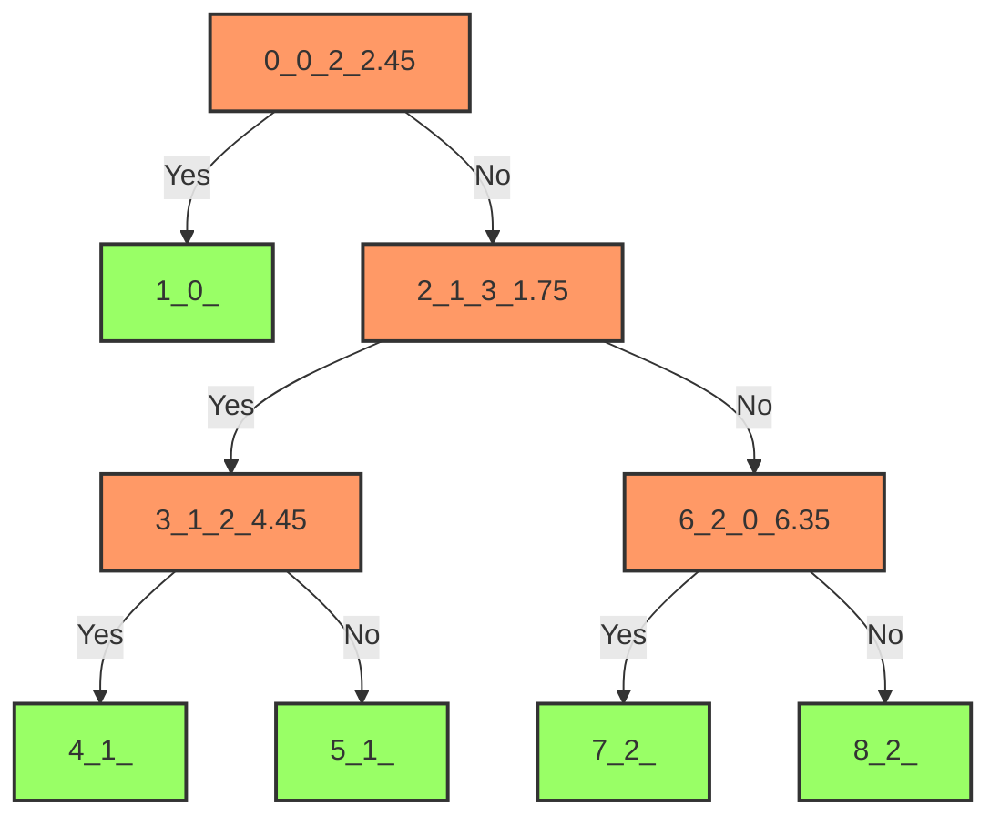

****


:::info
Random Forests20251
:::

## 

**if-else**

```
  > 2.5:
      > 1.7:
         = 
    :
         = 
:
     = 
```

### 


1. ****""
2. ****
3. ****

```python showLineNumbers
from sklearn.datasets import load_iris
from sklearn import tree
import numpy  as np
iris = load_iris()

clf = tree.DecisionTreeClassifier(min_samples_leaf=15)
clf = clf.fit(iris.data, iris.target)
# : 
print("-"+str(clf.tree_.children_left))
print("-"+str(clf.tree_.children_right))
print(""+str(clf.tree_.feature))
print(""+str(np.round(clf.tree_.threshold,2)))
print(""+str(clf.classes_.take( [ np.argmax(i) for i in clf.tree_.value])))
```

|   ****   | **0** | **1** | **2** | **3** | **4** | **5** | **6** | **7** | **8** |
| :----------: | :---: | :---: | :---: | :---: | :---: | :---: | :---: | :---: | :---: |
|  ****  |   1   |  -1   |   3   |   4   |  -1   |  -1   |   7   |  -1   |  -1   |
|  ****  |   2   |  -1   |   6   |   5   |  -1   |  -1   |   8   |  -1   |  -1   |
| **** |   2   |  -2   |   3   |   2   |  -2   |  -2   |   0   |  -2   |  -2   |
| **** | 2.45  |  -2   | 1.75  | 4.45  |  -2   |  -2   | 6.35  |  -2   |  -2   |
| **** |   0   |   0   |   1   |   1   |   1   |   1   |   2   |   2   |   2   |



### 

****""

- 
- 0
- 


$$
I_G(p) = 1 - \sum_{i=1}^{J} p_i^2
$$

10433

$$
I_G(0.4, 0.3, 0.3) = 1 - (0.4^2 + 0.3^2 + 0.3^2) = 0.66
$$

### 

```python showLineNumbers
import matplotlib.pyplot as plt
from sklearn.model_selection import train_test_split
from sklearn.datasets import load_breast_cancer
from sklearn.tree import DecisionTreeClassifier

X, y = load_breast_cancer(return_X_y=True)
X_train, X_test, y_train, y_test = train_test_split(X, y, random_state=0)

clf = DecisionTreeClassifier(random_state=0)
# 
path = clf.cost_complexity_pruning_path(X_train, y_train)
# alpha
#  alpha
# 
# https://blog.csdn.net/ywj_1991/article/details/126846155
ccp_alphas, impurities = path.ccp_alphas, path.impurities

#  DecisionTreeClassifier ccp_alphaccp_alpha
clfs = []
# ccp_alphascost_complexity_pruning_path
for ccp_alpha in ccp_alphas:
    # 
    clf = DecisionTreeClassifier(random_state=0, ccp_alpha=ccp_alpha)
    # 
    clf.fit(X_train, y_train)
    # : 
    print("{} | -{}-{}".format(ccp_alpha,len(clf.tree_.children_right),len(clf.tree_.children_left)))

    # 
    clfs.append(clf)
print("Number of nodes in the last tree is: {} with ccp_alpha: {}".format(
      clfs[-1].tree_.node_count, ccp_alphas[-1]))
#  ccp_alphas 
clfs = clfs[:-1]
# ccp_alphas 
ccp_alphas = ccp_alphas[:-1]
```

### 

```python showLineNumbers
import matplotlib.pyplot as plt
from sklearn.model_selection import train_test_split
from sklearn.datasets import load_breast_cancer
from sklearn.tree import DecisionTreeClassifier

X, y = load_breast_cancer(return_X_y=True)
X_train, X_test, y_train, y_test = train_test_split(X, y, random_state=0)

clf = DecisionTreeClassifier(random_state=0)
# 
path = clf.cost_complexity_pruning_path(X_train, y_train)
# alpha
#  alpha
# 
# https://blog.csdn.net/ywj_1991/article/details/126846155
ccp_alphas, impurities = path.ccp_alphas, path.impurities

#  DecisionTreeClassifier ccp_alphaccp_alpha
clfs = []
# ccp_alphascost_complexity_pruning_path
for ccp_alpha in ccp_alphas:
    # 
    clf = DecisionTreeClassifier(random_state=0, ccp_alpha=ccp_alpha)
    # 
    clf.fit(X_train, y_train)
    # : 
    print("{} | -{}-{}".format(ccp_alpha,len(clf.tree_.children_right),len(clf.tree_.children_left)))

    # 
    clfs.append(clf)
print("Number of nodes in the last tree is: {} with ccp_alpha: {}".format(
      clfs[-1].tree_.node_count, ccp_alphas[-1]))
#  ccp_alphas 
clfs = clfs[:-1]
# ccp_alphas 
ccp_alphas = ccp_alphas[:-1]
# alpha
node_counts = [clf.tree_.node_count for clf in clfs]
# 
depth = [clf.tree_.max_depth for clf in clfs]


# alpha
train_scores = [clf.score(X_train, y_train) for clf in clfs]
# 
test_scores = [clf.score(X_test, y_test) for clf in clfs]

fig, ax = plt.subplots()
ax.plot(ccp_alphas, train_scores, marker='o', label="train",
        drawstyle="steps-post")
ax.plot(ccp_alphas, test_scores, marker='o', label="test",
        drawstyle="steps-post")
ax.legend()
plt.show()
'''
 ccp_alpha 0, DecisionTreeClassifier, 
100%88%
alpha
 ccp_alpha=0.015
'''
```

### 

```python showLineNumbers
import pickle
import os
# 
with open('clf_model_v1.pickle','wb') as f:
 pickle.dump(clf,f)
# 
with open('clf_model_v1.pickle','rb') as f:
 clf2 = pickle.load(f)

# 
os.remove('clf_model_v1.pickle')

import joblib

# 
joblib.dump(clf, 'new_app_model_v1.pkl')

# 
clf3 = joblib.load('new_app_model_v1.pkl')

# 
os.remove('new_app_model_v1.pkl')
```


### torch

/

`torch.save()`

`torch.load()`

:

```python
import torch
import torch.nn as nn

# 
class SimpleNet(nn.Module):
    def __init__(self, input_size, hidden_size, output_size):
        super(SimpleNet, self).__init__()
        self.fc1 = nn.Linear(input_size, hidden_size)
        self.relu = nn.ReLU()
        self.fc2 = nn.Linear(hidden_size, output_size)
  
    def forward(self, x):
        x = self.fc1(x)
        x = self.relu(x)
        x = self.fc2(x)
        return x

# 
model = SimpleNet(input_size=784, hidden_size=128, output_size=10)

# 1
torch.save(model, 'complete_model.pth')

# 2
torch.save(model.state_dict(), 'model_weights.pth')

# 1
loaded_model = torch.load('complete_model.pth')

# 2
model_for_loading = SimpleNet(input_size=784, hidden_size=128, output_size=10)
model_for_loading.load_state_dict(torch.load('model_weights.pth'))

```


## 


10022

### 

**1. Bootstrap**
- 100N
- 

**2. **
- Mmm < M
- 

**3. **
- 

### 

****
- 
- 
- 

****
- 
- 
- 

```python showLineNumbers

from sklearn.ensemble import RandomForestClassifier
import numpy as np

# 
X = np.array([[1, 2], [2, 3], [2, 5], [3, 2], [3, 3], [4, 5]])  # 
y = np.array([0, 0, 1, 0, 1, 1])  # 

# 
'''
,,10100
'''
n_estimators = 100  # 
model = RandomForestClassifier(n_estimators=n_estimators)

# 
model.fit(X, y)

# 
new_data_point = np.array([[3, 4]])  # 
predicted_class = model.predict(new_data_point)

print(":", predicted_class)

```

### 

```python showLineNumbers
import matplotlib.pyplot as plt
import numpy as np
from sklearn.datasets import make_blobs
from sklearn.ensemble import RandomForestClassifier
from sklearn.calibration import CalibratedClassifierCV
from sklearn.metrics import log_loss
# 0
np.random.seed(0)

# 100024
X, y = make_blobs(n_samples=1000, random_state=42, cluster_std=5.0)

# 800800600200
X_train, y_train = X[:600], y[:600]
X_valid, y_valid = X[600:800], y[600:800]

# 800
X_train_valid, y_train_valid = X[:800], y[:800]

# 800+200
X_test, y_test = X[800:], y[800:]

# 25
clf = RandomForestClassifier(n_estimators=25)
# 80%
clf.fit(X_train_valid, y_train_valid)
# 20%
clf_probs = clf.predict_proba(X_test)
```

### 

```python showLineNumbers
# log_loss
score = log_loss(y_test, clf_probs)
print("  %.3f " % score)
# 800,

# 

# 1.3  0.534
```

### 

```python showLineNumbers
# Train random forest classifier, calibrate on validation data and evaluate
# on test data
# 60%20%20%
clf = RandomForestClassifier(n_estimators=25)
clf.fit(X_train, y_train)
clf_probs = clf.predict_proba(X_test)
# 
# method="sigmoid" sigmoid
# cv="prefit" 
sig_clf = CalibratedClassifierCV(clf, method="sigmoid", cv="prefit")
# 20%
sig_clf.fit(X_valid, y_valid)
# .predict_proba(X_test) ()
sig_clf_probs = sig_clf.predict_proba(X_test)
# log_loss
sig_score = log_loss(y_test, sig_clf_probs)

print("%.3f" % sig_score)
# 1.3  0.534


```

### 

```python showLineNumbers
# Plot changes in predicted probabilities via arrows
plt.figure()
# (123)
colors = ["r", "g", "b"]
for i in range(clf_probs.shape[0]):
    plt.arrow(clf_probs[i, 0], clf_probs[i, 1],
              sig_clf_probs[i, 0] - clf_probs[i, 0],
              sig_clf_probs[i, 1] - clf_probs[i, 1],
              color=colors[y_test[i]], head_width=1e-2)

# Plot perfect predictions
plt.plot([1.0], [0.0], 'ro', ms=20, label="Class 1")
plt.plot([0.0], [1.0], 'go', ms=20, label="Class 2")
plt.plot([0.0], [0.0], 'bo', ms=20, label="Class 3")

# Plot boundaries of unit simplex
plt.plot([0.0, 1.0, 0.0, 0.0], [0.0, 0.0, 1.0, 0.0], 'k', label="Simplex")

# Annotate points on the simplex
plt.annotate(r'($\frac{1}{3}$, $\frac{1}{3}$, $\frac{1}{3}$)',
             xy=(1.0/3, 1.0/3), xytext=(1.0/3, .23), xycoords='data',
             arrowprops=dict(facecolor='black', shrink=0.05),
             horizontalalignment='center', verticalalignment='center')
plt.plot([1.0/3], [1.0/3], 'ko', ms=5)
plt.annotate(r'($\frac{1}{2}$, $0$, $\frac{1}{2}$)',
             xy=(.5, .0), xytext=(.5, .1), xycoords='data',
             arrowprops=dict(facecolor='black', shrink=0.05),
             horizontalalignment='center', verticalalignment='center')
plt.annotate(r'($0$, $\frac{1}{2}$, $\frac{1}{2}$)',
             xy=(.0, .5), xytext=(.1, .5), xycoords='data',
             arrowprops=dict(facecolor='black', shrink=0.05),
             horizontalalignment='center', verticalalignment='center')
plt.annotate(r'($\frac{1}{2}$, $\frac{1}{2}$, $0$)',
             xy=(.5, .5), xytext=(.6, .6), xycoords='data',
             arrowprops=dict(facecolor='black', shrink=0.05),
             horizontalalignment='center', verticalalignment='center')
plt.annotate(r'($0$, $0$, $1$)',
             xy=(0, 0), xytext=(.1, .1), xycoords='data',
             arrowprops=dict(facecolor='black', shrink=0.05),
             horizontalalignment='center', verticalalignment='center')
plt.annotate(r'($1$, $0$, $0$)',
             xy=(1, 0), xytext=(1, .1), xycoords='data',
             arrowprops=dict(facecolor='black', shrink=0.05),
             horizontalalignment='center', verticalalignment='center')
plt.annotate(r'($0$, $1$, $0$)',
             xy=(0, 1), xytext=(.1, 1), xycoords='data',
             arrowprops=dict(facecolor='black', shrink=0.05),
             horizontalalignment='center', verticalalignment='center')
# Add grid
plt.grid(False)
for x in [0.0, 0.1, 0.2, 0.3, 0.4, 0.5, 0.6, 0.7, 0.8, 0.9, 1.0]:
    plt.plot([0, x], [x, 0], 'k', alpha=0.2)
    plt.plot([0, 0 + (1-x)/2], [x, x + (1-x)/2], 'k', alpha=0.2)
    plt.plot([x, x + (1-x)/2], [0, 0 + (1-x)/2], 'k', alpha=0.2)

plt.title("Change of predicted probabilities after sigmoid calibration")
plt.xlabel("Probability class 1")
plt.ylabel("Probability class 2")
plt.xlim(-0.05, 1.05)
plt.ylim(-0.05, 1.05)
plt.legend(loc="best")

print("Log-loss of")
print(" * uncalibrated classifier trained on 800 datapoints: %.3f "
      % score)
print(" * classifier trained on 600 datapoints and calibrated on "
      "200 datapoint: %.3f" % sig_score)

# Illustrate calibrator
plt.figure()
# generate grid over 2-simplex
p1d = np.linspace(0, 1, 20)
p0, p1 = np.meshgrid(p1d, p1d)
p2 = 1 - p0 - p1
p = np.c_[p0.ravel(), p1.ravel(), p2.ravel()]
p = p[p[:, 2] >= 0]

calibrated_classifier = sig_clf.calibrated_classifiers_[0]
prediction = np.vstack([calibrator.predict(this_p)
                        for calibrator, this_p in
                        zip(calibrated_classifier.calibrators, p.T)]).T
prediction /= prediction.sum(axis=1)[:, None]

# Plot modifications of calibrator
for i in range(prediction.shape[0]):
    plt.arrow(p[i, 0], p[i, 1],
              prediction[i, 0] - p[i, 0], prediction[i, 1] - p[i, 1],
              head_width=1e-2, color=colors[np.argmax(p[i])])
# Plot boundaries of unit simplex
plt.plot([0.0, 1.0, 0.0, 0.0], [0.0, 0.0, 1.0, 0.0], 'k', label="Simplex")

plt.grid(False)
for x in [0.0, 0.1, 0.2, 0.3, 0.4, 0.5, 0.6, 0.7, 0.8, 0.9, 1.0]:
    plt.plot([0, x], [x, 0], 'k', alpha=0.2)
    plt.plot([0, 0 + (1-x)/2], [x, x + (1-x)/2], 'k', alpha=0.2)
    plt.plot([x, x + (1-x)/2], [0, 0 + (1-x)/2], 'k', alpha=0.2)

 # sigmoid
plt.title("sigmoid ")
plt.xlabel("Probability class 1")
plt.ylabel("Probability class 2")
# .xlimx
plt.xlim(-0.05, 1.05)
# .ylimy
plt.ylim(-0.05, 1.05)

plt.show()
```

## Gradient Boosting


- ****
- ****

### 

****

1. 
2.  - 
3. 
4. 
5. 
6. 

:::info


[10, 20, 30, 40]

[8, 18, 28, 38]
****-****
[2, 2, 2, 2]

[2, 2, 2, 2]

[1.8, 1.8, 1.8, 1.8]

[0.2, 0.2, 0.2, 0.2]

 =  +  = [9.8, 19.8, 29.8, 39.8]


:::

#### 

```python showLineNumbers
from sklearn.ensemble import GradientBoostingClassifier
import numpy as np
from sklearn.datasets import make_classification
from sklearn.model_selection import train_test_split

# 
X, y = make_classification(n_samples=1000, n_features=10, n_informative=5, 
                          n_redundant=2, random_state=42)

# 
X_train, X_test, y_train, y_test = train_test_split(X, y, test_size=0.2, random_state=42)

# 
'''

n_estimators: 
learning_rate: 
max_depth: 
subsample: <1.0
'''
gbm = GradientBoostingClassifier(n_estimators=100, 
                                learning_rate=0.1, 
                                max_depth=3, 
                                subsample=0.8,
                                random_state=42)

# 
gbm.fit(X_train, y_train)

# 
accuracy = gbm.score(X_test, y_test)
print(f": {accuracy:.4f}")

# 
y_pred = gbm.predict(X_test)
y_proba = gbm.predict_proba(X_test)
```

### XGBoost

XGBoosteXtreme Gradient Boosting

- 
- 
- 
- 
- 

```python showLineNumbers
import xgboost as xgb
from sklearn.datasets import make_classification
from sklearn.model_selection import train_test_split

# 
X, y = make_classification(n_samples=1000, n_features=10, random_state=42)
X_train, X_test, y_train, y_test = train_test_split(X, y, test_size=0.2, random_state=42)

# DMatrixXGBoost
dtrain = xgb.DMatrix(X_train, label=y_train)
dtest = xgb.DMatrix(X_test, label=y_test)

# 
params = {
    'objective': 'binary:logistic',  # 
    'max_depth': 3,                  # 
    'eta': 0.1,                      # 
    'subsample': 0.8,                # 
    'colsample_bytree': 0.8,         # 
    'eval_metric': 'logloss'         # 
}

# 
num_rounds = 100
model = xgb.train(params, dtrain, num_rounds)

# 
preds = model.predict(dtest)
pred_labels = [1 if p > 0.5 else 0 for p in preds]
accuracy = sum(pred_labels == y_test) / len(y_test)
print(f"XGBoost: {accuracy:.4f}")
```

### LightGBM

LightGBM

- 
- 
- 
- 

```python showLineNumbers
import lightgbm as lgb
from sklearn.datasets import make_classification
from sklearn.model_selection import train_test_split
from sklearn.metrics import accuracy_score

# 
X, y = make_classification(n_samples=1000, n_features=10, random_state=42)
X_train, X_test, y_train, y_test = train_test_split(X, y, test_size=0.2, random_state=42)

# 
train_data = lgb.Dataset(X_train, label=y_train)

# 
params = {
    'objective': 'binary',         # 
    'metric': 'binary_logloss',    # 
    'max_depth': 3,                # 
    'learning_rate': 0.1,          # 
    'feature_fraction': 0.8,       # 
    'bagging_fraction': 0.8,       # 
    'bagging_freq': 5              # 
}

# 
num_rounds = 100
model = lgb.train(params, train_data, num_rounds)

# 
y_pred_proba = model.predict(X_test)
y_pred = [1 if p > 0.5 else 0 for p in y_pred_proba]
accuracy = accuracy_score(y_test, y_pred)
print(f"LightGBM: {accuracy:.4f}")
```

###  vs 

|  |  |  |
|------|----------|----------|
|  |  |  |
|  |  |  |
|  |  |  |
|  |  |  |
|  |  |  |
|  |  |  |
|  |  |  |
