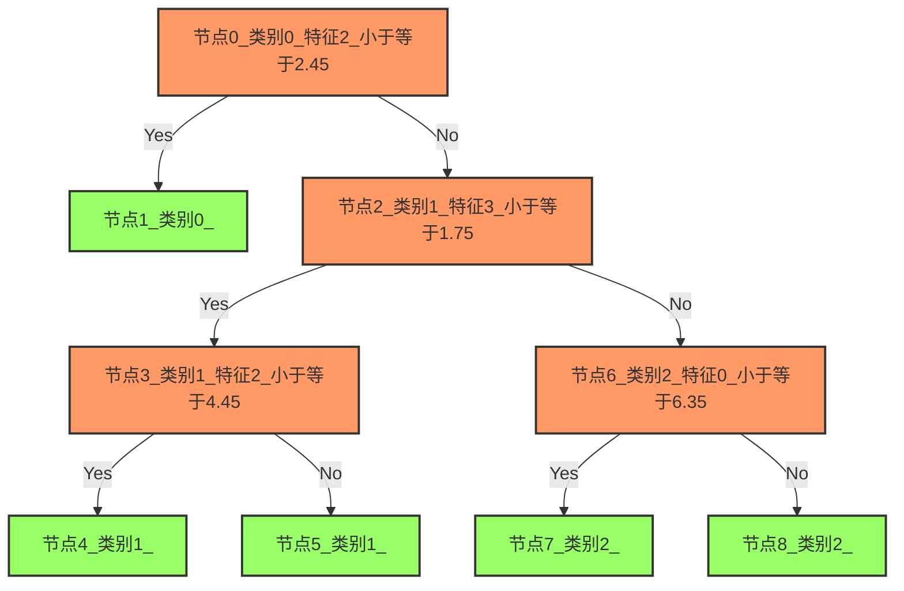

随机森林：**一堆决策树投票决定结果**。

核心思想：三个臭皮匠，顶个诸葛亮。单个决策树容易过拟合，但一群决策树一起投票，结果就稳定多了。

:::info
《Random Forests》这篇论文牛逼到什么程度？截止2025年，在机器学习领域的谷歌学术引用次数排名第1。
:::

## 决策树

决策树就是一堆**if-else规则**的组合，像这样：

```
如果 花瓣长度 > 2.5:
    如果 花瓣宽度 > 1.7:
        类别 = 山鸢尾
    否则:
        类别 = 变色鸢尾
否则:
    类别 = 刚毛鸢尾
```

### 怎么构建决策树

三个步骤：
1. **特征选择**：选哪个特征来分类（选让数据最"纯"的那个）
2. **生成树**：不断分裂，直到数据够纯或者达到停止条件
3. **剪枝**：把过拟合的枝叶剪掉

```python showLineNumbers
from sklearn.datasets import load_iris
from sklearn import tree
import numpy  as np
iris = load_iris()

clf = tree.DecisionTreeClassifier(min_samples_leaf=15)
clf = clf.fit(iris.data, iris.target)
# 决策树模型为:先左后右，先上后下 负数表示没有
print("树结构-左节点："+str(clf.tree_.children_left))
print("树结构-右节点："+str(clf.tree_.children_right))
print("节点分裂特征："+str(clf.tree_.feature))
print("节点分裂阈值："+str(np.round(clf.tree_.threshold,2)))
print("节点类别："+str(clf.classes_.take( [ np.argmax(i) for i in clf.tree_.value])))
```

|   **索引**   | **0** | **1** | **2** | **3** | **4** | **5** | **6** | **7** | **8** |
| :----------: | :---: | :---: | :---: | :---: | :---: | :---: | :---: | :---: | :---: |
|  **左节点**  |   1   |  -1   |   3   |   4   |  -1   |  -1   |   7   |  -1   |  -1   |
|  **右节点**  |   2   |  -1   |   6   |   5   |  -1   |  -1   |   8   |  -1   |  -1   |
| **分类特征** |   2   |  -2   |   3   |   2   |  -2   |  -2   |   0   |  -2   |  -2   |
| **分裂阈值** | 2.45  |  -2   | 1.75  | 4.45  |  -2   |  -2   | 6.35  |  -2   |  -2   |
| **节点类别** |   0   |   0   |   1   |   1   |   1   |   1   |   2   |   2   |   2   |



### 怎么选特征？看基尼不纯度

**基尼不纯度**：衡量数据有多"杂"。

- 值越小，数据越纯（都是同一类）
- 值为0，完美纯净（所有样本都是一个类别）
- 值越大，数据越杂（各种类别混在一起）


$$
I_G(p) = 1 - \sum_{i=1}^{J} p_i^2
$$

假设有10个水果，其中4个香蕉、3个苹果、3个梨子，则基尼不纯度为：

$$
I_G(0.4, 0.3, 0.3) = 1 - (0.4^2 + 0.3^2 + 0.3^2) = 0.66
$$

### 简单示例

```python showLineNumbers
import matplotlib.pyplot as plt
from sklearn.model_selection import train_test_split
from sklearn.datasets import load_breast_cancer
from sklearn.tree import DecisionTreeClassifier

X, y = load_breast_cancer(return_X_y=True)
X_train, X_test, y_train, y_test = train_test_split(X, y, random_state=0)

clf = DecisionTreeClassifier(random_state=0)
# 计算最小成本复杂性修剪期间的修剪路径
path = clf.cost_complexity_pruning_path(X_train, y_train)
# 从路径中提取alpha值和相应的决策树
# 剪枝期间子树的有效 alpha
# 代价复杂度剪枝法，实质就是在树的复杂度与准确性之间取得一个平衡点。
# 原理参考：https://blog.csdn.net/ywj_1991/article/details/126846155
ccp_alphas, impurities = path.ccp_alphas, path.impurities

# 在 DecisionTreeClassifier中， 这种剪枝技术是通过成本复杂度参数ccp_alpha来参数化的。更大的ccp_alpha值增加被剪枝的节点数。
clfs = []
# ccp_alphas的值是通过cost_complexity_pruning_path获得的
for ccp_alpha in ccp_alphas:
    # 每个循环创建一个决策树并将其添加到列表中
    clf = DecisionTreeClassifier(random_state=0, ccp_alpha=ccp_alpha)
    # 拟合决策树
    clf.fit(X_train, y_train)
    # 决策树模型为:先左后右，先上后下 负数表示没有
    print("{} | 树结构-左节点长度：{}，树结构-右节点长度：{}".format(ccp_alpha,len(clf.tree_.children_right),len(clf.tree_.children_left)))

    # 将决策树添加到列表中
    clfs.append(clf)
print("Number of nodes in the last tree is: {} with ccp_alpha: {}".format(
      clfs[-1].tree_.node_count, ccp_alphas[-1]))
# 删除 ccp_alphas的最后一个值， 因为它对应于完全未剪枝的树
clfs = clfs[:-1]
# ccp_alphas也需要删除最后一个值， 因为它是完全未剪枝的树对应的值
ccp_alphas = ccp_alphas[:-1]
```

### 效果评估

```python showLineNumbers
import matplotlib.pyplot as plt
from sklearn.model_selection import train_test_split
from sklearn.datasets import load_breast_cancer
from sklearn.tree import DecisionTreeClassifier

X, y = load_breast_cancer(return_X_y=True)
X_train, X_test, y_train, y_test = train_test_split(X, y, random_state=0)

clf = DecisionTreeClassifier(random_state=0)
# 计算最小成本复杂性修剪期间的修剪路径
path = clf.cost_complexity_pruning_path(X_train, y_train)
# 从路径中提取alpha值和相应的决策树
# 剪枝期间子树的有效 alpha
# 代价复杂度剪枝法，实质就是在树的复杂度与准确性之间取得一个平衡点。
# 原理参考：https://blog.csdn.net/ywj_1991/article/details/126846155
ccp_alphas, impurities = path.ccp_alphas, path.impurities

# 在 DecisionTreeClassifier中， 这种剪枝技术是通过成本复杂度参数ccp_alpha来参数化的。更大的ccp_alpha值增加被剪枝的节点数。
clfs = []
# ccp_alphas的值是通过cost_complexity_pruning_path获得的
for ccp_alpha in ccp_alphas:
    # 每个循环创建一个决策树并将其添加到列表中
    clf = DecisionTreeClassifier(random_state=0, ccp_alpha=ccp_alpha)
    # 拟合决策树
    clf.fit(X_train, y_train)
    # 决策树模型为:先左后右，先上后下 负数表示没有
    print("{} | 树结构-左节点长度：{}，树结构-右节点长度：{}".format(ccp_alpha,len(clf.tree_.children_right),len(clf.tree_.children_left)))

    # 将决策树添加到列表中
    clfs.append(clf)
print("Number of nodes in the last tree is: {} with ccp_alpha: {}".format(
      clfs[-1].tree_.node_count, ccp_alphas[-1]))
# 删除 ccp_alphas的最后一个值， 因为它对应于完全未剪枝的树
clfs = clfs[:-1]
# ccp_alphas也需要删除最后一个值， 因为它是完全未剪枝的树对应的值
ccp_alphas = ccp_alphas[:-1]
# 绘制每个alpha值的树的测试集精度和训练集精度
node_counts = [clf.tree_.node_count for clf in clfs]
# 计算每个树的测试集精度和训练集精度
depth = [clf.tree_.max_depth for clf in clfs]


# 绘制精度与alpha的关系
train_scores = [clf.score(X_train, y_train) for clf in clfs]
# 绘制测试集精度
test_scores = [clf.score(X_test, y_test) for clf in clfs]

fig, ax = plt.subplots()
ax.plot(ccp_alphas, train_scores, marker='o', label="train",
        drawstyle="steps-post")
ax.plot(ccp_alphas, test_scores, marker='o', label="test",
        drawstyle="steps-post")
ax.legend()
plt.show()
'''
当 ccp_alpha 设置为0, 并保留DecisionTreeClassifier的其他默认参数时, 树就过拟合了，
使训练的准确率达到100%，测试的准确率达到88%。
随着alpha的增加，更多的树被剪枝，从而创建了一个泛化更好的决策树。
在本例中，设置 ccp_alpha=0.015可以最大限度地提高测试的准确率。
'''
```

### 模型保存

```python showLineNumbers
import pickle
import os
# 保存模型
with open('clf_model_v1.pickle','wb') as f:
 pickle.dump(clf,f)
# 加载模型
with open('clf_model_v1.pickle','rb') as f:
 clf2 = pickle.load(f)

# 删除模型
os.remove('clf_model_v1.pickle')

import joblib

# 保存模型
joblib.dump(clf, 'new_app_model_v1.pkl')

# 加载模型
clf3 = joblib.load('new_app_model_v1.pkl')

# 删除模型
os.remove('new_app_model_v1.pkl')
```


### torch模型的保存与加载

可选择保存整个模型或仅参数，原生支持分布式/大模型。

保存函数签名：`torch.save()`

加载函数签名：`torch.load()`

示例代码:

```python
import torch
import torch.nn as nn

# 定义一个简单的模型
class SimpleNet(nn.Module):
    def __init__(self, input_size, hidden_size, output_size):
        super(SimpleNet, self).__init__()
        self.fc1 = nn.Linear(input_size, hidden_size)
        self.relu = nn.ReLU()
        self.fc2 = nn.Linear(hidden_size, output_size)
  
    def forward(self, x):
        x = self.fc1(x)
        x = self.relu(x)
        x = self.fc2(x)
        return x

# 创建模型实例
model = SimpleNet(input_size=784, hidden_size=128, output_size=10)

# 方法1：保存整个模型（包括结构和参数）
torch.save(model, 'complete_model.pth')

# 方法2：只保存模型参数（推荐）
torch.save(model.state_dict(), 'model_weights.pth')

# 方法1对应的加载：加载整个模型
loaded_model = torch.load('complete_model.pth')

# 方法2对应的加载：加载模型参数
model_for_loading = SimpleNet(input_size=784, hidden_size=128, output_size=10)
model_for_loading.load_state_dict(torch.load('model_weights.pth'))

```


## 随机森林

一棵树容易被异常数据带偏，那就种一片森林。

假设有100条数据，其中2条是异常的。单棵决策树可能被这2条异常数据影响，做出错误判断。

### 怎么种森林

**1. 随机抽样（Bootstrap）**
- 从100条数据中随机抽N条（可以重复抽）
- 每棵树用不同的样本训练

**2. 随机选特征**
- 假设有M个特征，每次分裂只随机选m个特征（m < M）
- 这样每棵树看到的特征都不一样

**3. 让树长到最大**
- 不剪枝，让每棵树充分拟合数据

### 怎么做预测

**分类问题**：投票
- 每棵树给出一个类别
- 哪个类别票数多，就选哪个
- 异常数据影响的树是少数，会被多数正常树压制

**回归问题**：取平均
- 每棵树给出一个数值
- 把所有树的结果平均
- 异常数据的影响被稀释了

```python showLineNumbers

from sklearn.ensemble import RandomForestClassifier
import numpy as np

# 创建一些示例数据
X = np.array([[1, 2], [2, 3], [2, 5], [3, 2], [3, 3], [4, 5]])  # 特征
y = np.array([0, 0, 1, 0, 1, 1])  # 目标标签

# 创建随机森林分类器
'''
一般来说，深度越大，拟合效果越好,速度越慢,常用的可以取值10到100之间。
'''
n_estimators = 100  # 设置随机森林中的树的数量
model = RandomForestClassifier(n_estimators=n_estimators)

# 拟合模型
model.fit(X, y)

# 预测新数据点
new_data_point = np.array([[3, 4]])  # 要预测的新数据点
predicted_class = model.predict(new_data_point)

print("预测类别:", predicted_class)

```

### 简单示例

```python showLineNumbers
import matplotlib.pyplot as plt
import numpy as np
from sklearn.datasets import make_blobs
from sklearn.ensemble import RandomForestClassifier
from sklearn.calibration import CalibratedClassifierCV
from sklearn.metrics import log_loss
# 随机数种子设为0，前面有讲过，这样可以保证每次运行结果都一样
np.random.seed(0)

# 随机生成1000个样本，每个样本包含2个特征，共4个簇
X, y = make_blobs(n_samples=1000, random_state=42, cluster_std=5.0)

# 用前800个样本作为训练集，并且这800个样本中，前600个样本作为训练集，后200个样本用来矫正
X_train, y_train = X[:600], y[:600]
X_valid, y_valid = X[600:800], y[600:800]

# 直接选取前800个样本作为训练集
X_train_valid, y_train_valid = X[:800], y[:800]

# 用前800个样本作为训练+验证集，剩下的200个样本作为测试集
X_test, y_test = X[800:], y[800:]

# 树的数量为25
clf = RandomForestClassifier(n_estimators=25)
# 直接使用前80%的数据训练模型
clf.fit(X_train_valid, y_train_valid)
# 后20%的数据测试，
clf_probs = clf.predict_proba(X_test)
```

### 效果评估

```python showLineNumbers
# 用log_loss来评估模型
score = log_loss(y_test, clf_probs)
print("  %.3f " % score)
# 这个分类器对所有800个训练数据点都进行了训练，那么它对它的预测过于自信,导致了过拟合

# 接下来需要矫正这个分类器，让它对自己的预测不那么自信

# 修正前的误差达到了1.3 修正后的数据误差降到了 0.534
```

### 使用模型校准器

```python showLineNumbers
# Train random forest classifier, calibrate on validation data and evaluate
# on test data
# 使用前60%的数据训练，中20%的数据校准，后20%的数据测试
clf = RandomForestClassifier(n_estimators=25)
clf.fit(X_train, y_train)
clf_probs = clf.predict_proba(X_test)
# 获取原本的模型
# method="sigmoid" 代表使用sigmoid函数来进行校准
# cv="prefit" 代表使用预先训练好的模型来进行校准
sig_clf = CalibratedClassifierCV(clf, method="sigmoid", cv="prefit")
# 对中间的20%预测后进行概率调试（模型优化）
sig_clf.fit(X_valid, y_valid)
# .predict_proba(X_test) 进行预测(优化后的模型使用方法不变)
sig_clf_probs = sig_clf.predict_proba(X_test)
# 用log_loss来评估模型
sig_score = log_loss(y_test, sig_clf_probs)

print("%.3f" % sig_score)
# 修正前的误差达到了1.3 修正后的数据误差降到了 0.534


```

### 模型校准器工作原理

```python showLineNumbers
# Plot changes in predicted probabilities via arrows
plt.figure()
# 颜色表示实例的真正类(红色：1类，绿色：2类，蓝色：3类)
colors = ["r", "g", "b"]
for i in range(clf_probs.shape[0]):
    plt.arrow(clf_probs[i, 0], clf_probs[i, 1],
              sig_clf_probs[i, 0] - clf_probs[i, 0],
              sig_clf_probs[i, 1] - clf_probs[i, 1],
              color=colors[y_test[i]], head_width=1e-2)

# Plot perfect predictions
plt.plot([1.0], [0.0], 'ro', ms=20, label="Class 1")
plt.plot([0.0], [1.0], 'go', ms=20, label="Class 2")
plt.plot([0.0], [0.0], 'bo', ms=20, label="Class 3")

# Plot boundaries of unit simplex
plt.plot([0.0, 1.0, 0.0, 0.0], [0.0, 0.0, 1.0, 0.0], 'k', label="Simplex")

# Annotate points on the simplex
plt.annotate(r'($\frac{1}{3}$, $\frac{1}{3}$, $\frac{1}{3}$)',
             xy=(1.0/3, 1.0/3), xytext=(1.0/3, .23), xycoords='data',
             arrowprops=dict(facecolor='black', shrink=0.05),
             horizontalalignment='center', verticalalignment='center')
plt.plot([1.0/3], [1.0/3], 'ko', ms=5)
plt.annotate(r'($\frac{1}{2}$, $0$, $\frac{1}{2}$)',
             xy=(.5, .0), xytext=(.5, .1), xycoords='data',
             arrowprops=dict(facecolor='black', shrink=0.05),
             horizontalalignment='center', verticalalignment='center')
plt.annotate(r'($0$, $\frac{1}{2}$, $\frac{1}{2}$)',
             xy=(.0, .5), xytext=(.1, .5), xycoords='data',
             arrowprops=dict(facecolor='black', shrink=0.05),
             horizontalalignment='center', verticalalignment='center')
plt.annotate(r'($\frac{1}{2}$, $\frac{1}{2}$, $0$)',
             xy=(.5, .5), xytext=(.6, .6), xycoords='data',
             arrowprops=dict(facecolor='black', shrink=0.05),
             horizontalalignment='center', verticalalignment='center')
plt.annotate(r'($0$, $0$, $1$)',
             xy=(0, 0), xytext=(.1, .1), xycoords='data',
             arrowprops=dict(facecolor='black', shrink=0.05),
             horizontalalignment='center', verticalalignment='center')
plt.annotate(r'($1$, $0$, $0$)',
             xy=(1, 0), xytext=(1, .1), xycoords='data',
             arrowprops=dict(facecolor='black', shrink=0.05),
             horizontalalignment='center', verticalalignment='center')
plt.annotate(r'($0$, $1$, $0$)',
             xy=(0, 1), xytext=(.1, 1), xycoords='data',
             arrowprops=dict(facecolor='black', shrink=0.05),
             horizontalalignment='center', verticalalignment='center')
# Add grid
plt.grid(False)
for x in [0.0, 0.1, 0.2, 0.3, 0.4, 0.5, 0.6, 0.7, 0.8, 0.9, 1.0]:
    plt.plot([0, x], [x, 0], 'k', alpha=0.2)
    plt.plot([0, 0 + (1-x)/2], [x, x + (1-x)/2], 'k', alpha=0.2)
    plt.plot([x, x + (1-x)/2], [0, 0 + (1-x)/2], 'k', alpha=0.2)

plt.title("Change of predicted probabilities after sigmoid calibration")
plt.xlabel("Probability class 1")
plt.ylabel("Probability class 2")
plt.xlim(-0.05, 1.05)
plt.ylim(-0.05, 1.05)
plt.legend(loc="best")

print("Log-loss of")
print(" * uncalibrated classifier trained on 800 datapoints: %.3f "
      % score)
print(" * classifier trained on 600 datapoints and calibrated on "
      "200 datapoint: %.3f" % sig_score)

# Illustrate calibrator
plt.figure()
# generate grid over 2-simplex
p1d = np.linspace(0, 1, 20)
p0, p1 = np.meshgrid(p1d, p1d)
p2 = 1 - p0 - p1
p = np.c_[p0.ravel(), p1.ravel(), p2.ravel()]
p = p[p[:, 2] >= 0]

calibrated_classifier = sig_clf.calibrated_classifiers_[0]
prediction = np.vstack([calibrator.predict(this_p)
                        for calibrator, this_p in
                        zip(calibrated_classifier.calibrators, p.T)]).T
prediction /= prediction.sum(axis=1)[:, None]

# Plot modifications of calibrator
for i in range(prediction.shape[0]):
    plt.arrow(p[i, 0], p[i, 1],
              prediction[i, 0] - p[i, 0], prediction[i, 1] - p[i, 1],
              head_width=1e-2, color=colors[np.argmax(p[i])])
# Plot boundaries of unit simplex
plt.plot([0.0, 1.0, 0.0, 0.0], [0.0, 0.0, 1.0, 0.0], 'k', label="Simplex")

plt.grid(False)
for x in [0.0, 0.1, 0.2, 0.3, 0.4, 0.5, 0.6, 0.7, 0.8, 0.9, 1.0]:
    plt.plot([0, x], [x, 0], 'k', alpha=0.2)
    plt.plot([0, 0 + (1-x)/2], [x, x + (1-x)/2], 'k', alpha=0.2)
    plt.plot([x, x + (1-x)/2], [0, 0 + (1-x)/2], 'k', alpha=0.2)

 # sigmoid校准器图示
plt.title("sigmoid ")
plt.xlabel("Probability class 1")
plt.ylabel("Probability class 2")
# .xlim是设置x轴的范围
plt.xlim(-0.05, 1.05)
# .ylim是设置y轴的范围
plt.ylim(-0.05, 1.05)

plt.show()
```

## Gradient Boosting（梯度提升）

梯度提升和随机森林都是用一堆树，但思路完全不同：

- **随机森林**：一群树各自独立预测，最后投票或取平均（并行）
- **梯度提升**：一棵树接一棵树，后面的树专门修正前面树的错误（串行）

### 工作原理

**核心思想**：不断修正错误

1. 先训练一棵简单的树
2. 看看哪些数据预测错了，算出残差（真实值 - 预测值）
3. 训练第二棵树，专门预测这些残差
4. 把第二棵树的预测加到第一棵树上
5. 继续训练第三棵树，修正前两棵树的错误
6. 重复，直到误差足够小或达到树的数量上限

:::info

什么是残差？

假设我们有一个简单的回归问题：
真实值：[10, 20, 30, 40]

第一棵树预测结果：[8, 18, 28, 38]
则残差为**真实值**-**第一棵树预测结果**
[2, 2, 2, 2]

第二棵树会尝试预测这个残差[2, 2, 2, 2]

如果第二棵树预测结果为[1.8, 1.8, 1.8, 1.8]

则新的残差为：[0.2, 0.2, 0.2, 0.2]

最终预测 = 第一棵树预测 + 第二棵树预测 = [9.8, 19.8, 29.8, 39.8]

最终预测更加接近真实值，损失更小。
:::

#### 简单代码示例

```python showLineNumbers
from sklearn.ensemble import GradientBoostingClassifier
import numpy as np
from sklearn.datasets import make_classification
from sklearn.model_selection import train_test_split

# 创建数据集
X, y = make_classification(n_samples=1000, n_features=10, n_informative=5, 
                          n_redundant=2, random_state=42)

# 分割数据集
X_train, X_test, y_train, y_test = train_test_split(X, y, test_size=0.2, random_state=42)

# 创建梯度提升模型
'''
主要参数说明：
n_estimators: 弱学习器的数量
learning_rate: 学习率，控制每个弱学习器的贡献
max_depth: 决策树的最大深度
subsample: 用于拟合基学习器的样本比例，<1.0表示采用随机梯度提升
'''
gbm = GradientBoostingClassifier(n_estimators=100, 
                                learning_rate=0.1, 
                                max_depth=3, 
                                subsample=0.8,
                                random_state=42)

# 训练模型
gbm.fit(X_train, y_train)

# 评估模型
accuracy = gbm.score(X_test, y_test)
print(f"模型准确率: {accuracy:.4f}")

# 进行预测
y_pred = gbm.predict(X_test)
y_proba = gbm.predict_proba(X_test)
```

### XGBoost

XGBoost（eXtreme Gradient Boosting）是梯度提升的高效实现，具有以下优势：

- 加入了正则化项防止过拟合
- 支持并行计算
- 可以处理缺失值
- 内置交叉验证
- 提供树剪枝机制

```python showLineNumbers
import xgboost as xgb
from sklearn.datasets import make_classification
from sklearn.model_selection import train_test_split

# 创建数据集
X, y = make_classification(n_samples=1000, n_features=10, random_state=42)
X_train, X_test, y_train, y_test = train_test_split(X, y, test_size=0.2, random_state=42)

# 创建DMatrix对象（XGBoost的数据格式）
dtrain = xgb.DMatrix(X_train, label=y_train)
dtest = xgb.DMatrix(X_test, label=y_test)

# 设置参数
params = {
    'objective': 'binary:logistic',  # 目标函数
    'max_depth': 3,                  # 树的最大深度
    'eta': 0.1,                      # 学习率
    'subsample': 0.8,                # 样本采样比例
    'colsample_bytree': 0.8,         # 特征采样比例
    'eval_metric': 'logloss'         # 评估指标
}

# 训练模型
num_rounds = 100
model = xgb.train(params, dtrain, num_rounds)

# 预测
preds = model.predict(dtest)
pred_labels = [1 if p > 0.5 else 0 for p in preds]
accuracy = sum(pred_labels == y_test) / len(y_test)
print(f"XGBoost模型准确率: {accuracy:.4f}")
```

### LightGBM

LightGBM是另一种高效的梯度提升实现，专注于提高训练速度和内存效率：

- 使用基于直方图的算法加速训练
- 采用叶子优先的生长策略
- 支持类别特征的直接处理
- 对大规模数据和高维特征友好

```python showLineNumbers
import lightgbm as lgb
from sklearn.datasets import make_classification
from sklearn.model_selection import train_test_split
from sklearn.metrics import accuracy_score

# 创建数据集
X, y = make_classification(n_samples=1000, n_features=10, random_state=42)
X_train, X_test, y_train, y_test = train_test_split(X, y, test_size=0.2, random_state=42)

# 创建数据集格式
train_data = lgb.Dataset(X_train, label=y_train)

# 设置参数
params = {
    'objective': 'binary',         # 目标函数
    'metric': 'binary_logloss',    # 评估指标
    'max_depth': 3,                # 树的最大深度
    'learning_rate': 0.1,          # 学习率
    'feature_fraction': 0.8,       # 特征采样比例
    'bagging_fraction': 0.8,       # 样本采样比例
    'bagging_freq': 5              # 样本采样频率
}

# 训练模型
num_rounds = 100
model = lgb.train(params, train_data, num_rounds)

# 预测
y_pred_proba = model.predict(X_test)
y_pred = [1 if p > 0.5 else 0 for p in y_pred_proba]
accuracy = accuracy_score(y_test, y_pred)
print(f"LightGBM模型准确率: {accuracy:.4f}")
```

### 梯度提升 vs 随机森林

| 特性 | 梯度提升 | 随机森林 |
|------|----------|----------|
| 训练方式 | 串行（一棵接一棵） | 并行（同时训练） |
| 容易过拟合吗 | 容易（要小心调参） | 不太容易 |
| 调参难度 | 难（参数多） | 简单 |
| 训练速度 | 慢（不能并行） | 快（可以并行） |
| 预测准确度 | 通常更高 | 也不错，但一般略低 |
| 对异常值敏感吗 | 敏感 | 不太敏感 |
| 适用场景 | 追求极致准确度的比赛 | 工业界稳定可靠的方案 |
