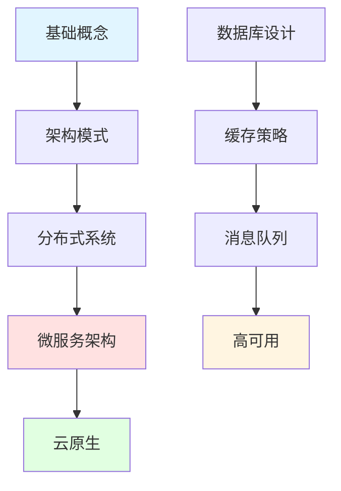

import DocCardList from '@theme/DocCardList';

# 系统设计 - 架构师必备技能

系统设计是软件工程师进阶的关键能力，涵盖架构设计、性能优化、可扩展性等核心技能。

## 学习路径



## 核心内容

### 架构基础

#### 架构模式
- **单体架构**：简单直接，适合小型应用
- **分层架构**：MVC、三层架构
- **微服务架构**：服务拆分、独立部署
- **事件驱动架构**：异步处理、解耦
- **CQRS**：读写分离
- **实战**：电商系统架构设计

#### 设计原则
- **SOLID原则**：面向对象设计
- **DRY原则**：不要重复自己
- **KISS原则**：保持简单
- **YAGNI原则**：你不会需要它
- **实战**：代码重构实践

### 分布式系统

#### 核心概念
- **CAP定理**：一致性、可用性、分区容错
- **BASE理论**：基本可用、软状态、最终一致性
- **分布式事务**：2PC、3PC、TCC、Saga
- **分布式锁**：Redis、Zookeeper
- **实战**：分布式订单系统

#### 一致性协议
- **Raft**：领导者选举、日志复制
- **Paxos**：分布式共识
- **Gossip**：最终一致性
- **实战**：实现简单的Raft

### 数据存储

#### 数据库设计
- **关系型数据库**：MySQL、PostgreSQL
- **NoSQL数据库**：MongoDB、Redis、Cassandra
- **数据库分片**：水平分片、垂直分片
- **读写分离**：主从复制、负载均衡
- **实战**：亿级数据表设计

#### 缓存策略
- **缓存模式**：Cache-Aside、Read-Through、Write-Through
- **缓存淘汰**：LRU、LFU、FIFO
- **缓存穿透**：布隆过滤器
- **缓存雪崩**：过期时间随机化
- **实战**：高并发缓存系统

### 消息队列

#### 消息中间件
- **Kafka**：高吞吐量、持久化
- **RabbitMQ**：可靠性、灵活路由
- **RocketMQ**：事务消息、顺序消息
- **实战**：异步处理系统

#### 消息模式
- **点对点**：队列模式
- **发布订阅**：主题模式
- **请求响应**：RPC模式
- **实战**：订单处理流程

### 性能优化

#### 系统性能
- **负载均衡**：Nginx、LVS、HAProxy
- **CDN加速**：静态资源分发
- **数据库优化**：索引、查询优化
- **代码优化**：算法、数据结构
- **实战**：秒杀系统设计

#### 监控告警
- **性能监控**：Prometheus、Grafana
- **日志分析**：ELK、Loki
- **链路追踪**：Jaeger、Zipkin
- **实战**：监控系统搭建

### 云原生

#### 容器化
- **Docker**：镜像、容器、网络
- **Kubernetes**：Pod、Service、Deployment
- **服务网格**：Istio、Linkerd
- **实战**：微服务容器化部署

#### DevOps
- **CI/CD**：Jenkins、GitLab CI、GitHub Actions
- **基础设施即代码**：Terraform、Ansible
- **自动化测试**：单元测试、集成测试
- **实战**：自动化部署流程

## 经典面试题

### 设计短链接服务

**需求**：
- 将长URL转换为短URL
- 支持自定义短链接
- 统计访问次数
- QPS: 10000

**设计要点**：
```
1. URL映射算法
   - Hash算法（MD5、MurmurHash）
   - Base62编码
   - 自增ID

2. 数据存储
   - MySQL存储映射关系
   - Redis缓存热点数据
   - 分库分表

3. 高可用
   - 主从复制
   - 负载均衡
   - 限流降级

4. 系统架构
   [客户端] -> [Nginx] -> [应用服务器] -> [Redis] -> [MySQL]
```

### 设计秒杀系统

**需求**：
- 10万人同时抢购100件商品
- 防止超卖
- 防止恶意刷单

**设计要点**：
```
1. 前端优化
   - 按钮置灰
   - 验证码
   - 静态资源CDN

2. 后端优化
   - Redis预减库存
   - 消息队列异步处理
   - 数据库乐观锁

3. 防刷策略
   - IP限流
   - 用户限流
   - 验证码

4. 系统架构
   [CDN] -> [Nginx限流] -> [应用服务器] -> [Redis] -> [MQ] -> [MySQL]
```

### 设计分布式ID生成器

**需求**：
- 全局唯一
- 趋势递增
- 高性能（10万/秒）

**方案对比**：
```
1. UUID
   优点：简单、本地生成
   缺点：无序、占用空间大

2. 数据库自增ID
   优点：简单、有序
   缺点：性能瓶颈、单点故障

3. Redis INCR
   优点：性能高、有序
   缺点：依赖Redis

4. Snowflake算法（推荐）
   结构：1位符号 + 41位时间戳 + 10位机器ID + 12位序列号
   优点：高性能、趋势递增、分布式
   缺点：时钟回拨问题
```

## 设计模式

### 创建型模式

```python
# 单例模式
class Singleton:
    _instance = None
    
    def __new__(cls):
        if cls._instance is None:
            cls._instance = super().__new__(cls)
        return cls._instance

# 工厂模式
class ShapeFactory:
    @staticmethod
    def create_shape(shape_type):
        if shape_type == "circle":
            return Circle()
        elif shape_type == "square":
            return Square()
```

### 结构型模式

```python
# 装饰器模式
def cache_decorator(func):
    cache = {}
    def wrapper(*args):
        if args not in cache:
            cache[args] = func(*args)
        return cache[args]
    return wrapper

# 代理模式
class ImageProxy:
    def __init__(self, filename):
        self.filename = filename
        self.image = None
    
    def display(self):
        if self.image is None:
            self.image = RealImage(self.filename)
        self.image.display()
```

### 行为型模式

```python
# 观察者模式
class Subject:
    def __init__(self):
        self.observers = []
    
    def attach(self, observer):
        self.observers.append(observer)
    
    def notify(self, data):
        for observer in self.observers:
            observer.update(data)

# 策略模式
class PaymentStrategy:
    def pay(self, amount):
        pass

class CreditCardPayment(PaymentStrategy):
    def pay(self, amount):
        print(f"Paying {amount} with credit card")

class AlipayPayment(PaymentStrategy):
    def pay(self, amount):
        print(f"Paying {amount} with Alipay")
```

## 实战案例

### 案例1：设计微博系统

**功能需求**：
- 发布微博
- 关注用户
- 查看时间线
- 点赞评论

**非功能需求**：
- 日活1亿
- 读写比100:1
- 可用性99.9%

**架构设计**：
```
1. 服务拆分
   - 用户服务
   - 微博服务
   - 关系服务
   - 时间线服务

2. 数据存储
   - MySQL：用户信息、微博内容
   - Redis：时间线缓存、计数器
   - MongoDB：评论数据

3. 推拉结合
   - 推模式：关注少的用户
   - 拉模式：关注多的用户
   - 混合模式：大V用户

4. 技术栈
   - 后端：Java Spring Boot
   - 缓存：Redis Cluster
   - 消息队列：Kafka
   - 搜索：Elasticsearch
```

### 案例2：设计视频网站

**功能需求**：
- 视频上传
- 视频播放
- 弹幕评论
- 推荐算法

**技术方案**：
```
1. 视频处理
   - 转码：FFmpeg
   - 存储：对象存储（OSS）
   - CDN：加速分发

2. 弹幕系统
   - WebSocket实时推送
   - Redis存储弹幕
   - 限流防刷

3. 推荐系统
   - 协同过滤
   - 内容推荐
   - 实时计算

4. 架构
   [上传] -> [转码服务] -> [OSS] -> [CDN]
   [播放] -> [CDN] -> [用户]
   [弹幕] -> [WebSocket] -> [Redis]
```

## 学习资源

### 书籍推荐
- 《设计数据密集型应用》
- 《微服务架构设计模式》
- 《凤凰架构》
- 《大型网站技术架构》

### 在线资源
- **System Design Primer**：系统设计入门
- **ByteByteGo**：系统设计视频
- **Grokking System Design**：面试准备

## 职业发展

### 技能树

```
基础能力
├── 数据结构与算法
├── 操作系统
├── 计算机网络
└── 数据库原理

架构能力
├── 架构模式
├── 分布式系统
├── 微服务架构
└── 云原生技术

软技能
├── 技术选型
├── 团队协作
├── 文档编写
└── 技术分享
```

## 开始学习

<DocCardList />

记住：**好的系统设计没有银弹，要根据实际业务场景选择合适的方案！**

