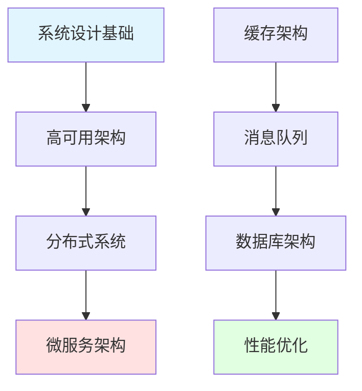

import DocCardList from '@theme/DocCardList';

# 系统设计 - 构建可扩展的分布式系统

系统设计是软件工程师必备的核心技能，涵盖架构设计、性能优化、高可用性等多个方面。

## 学习路径

## 核心内容

### 系统设计基础
- 设计原则：SOLID、CAP、BASE
- 架构模式：单体、分层、微服务、事件驱动
- 设计权衡：性能 vs 一致性

### 高可用架构
- 负载均衡：轮询、加权、最少连接、IP哈希
- 故障转移：主备模式、主主模式
- 容灾备份：全量、增量、异地容灾

### 分布式系统
- 一致性协议：2PC、3PC、Paxos、Raft
- 分布式事务：XA、TCC、Saga
- 服务发现：Consul、Eureka、Kubernetes

### 微服务架构
- 服务拆分：DDD领域驱动设计
- API网关：Kong、Zuul、Spring Cloud Gateway
- 服务网格：Istio、Linkerd

### 缓存架构
- 缓存策略：Cache-Aside、Read-Through、Write-Through
- 缓存问题：穿透、击穿、雪崩
- Redis集群：主从、哨兵、Cluster

## 开始学习

<DocCardList />

记住：**系统设计没有标准答案，重要的是权衡和取舍！**
