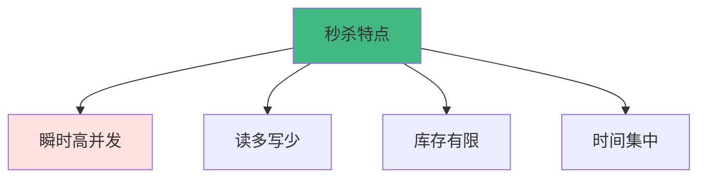

# 秒杀系统设计

秒杀系统是典型的高并发场景，本文将详细讲解如何设计一个能够承受百万级并发的秒杀系统。

## 业务场景

### 秒杀特点



**核心挑战**:
- 🔥 **瞬时流量**: 平时QPS 1000，秒杀时QPS 100万+
- 📊 **读写比例**: 读写比可达1000:1
- ⏰ **时间集中**: 流量集中在开始的几秒内
- 🎯 **超卖问题**: 必须保证库存准确性
- 🚫 **恶意请求**: 防止刷单、黄牛

## 需求分析

### 功能需求

```javascript
// 核心功能
const requirements = {
  // 1. 秒杀前
  preStart: {
    showCountdown: true,      // 显示倒计时
    showProductInfo: true,    // 展示商品信息
    allowReminder: true       // 允许设置提醒
  },
  
  // 2. 秒杀中
  during: {
    placeOrder: true,         // 下单
    checkInventory: true,     // 检查库存
    preventOversell: true,    // 防止超卖
    limitPerUser: true        // 限制每人购买数量
  },
  
  // 3. 秒杀后
  postEnd: {
    showResult: true,         // 显示结果
    processPayment: true,     // 处理支付
    handleTimeout: true       // 处理超时订单
  }
};
```

### 非功能需求

```javascript
const nonFunctionalRequirements = {
  // 性能要求
  performance: {
    qps: 1_000_000,           // 100万QPS
    latency: 100,             // 100ms内响应
    concurrency: 10_000_000   // 1000万并发用户
  },
  
  // 可用性要求
  availability: {
    uptime: 99.99,            // 99.99%可用性
    failover: true,           // 故障转移
    degradation: true         // 服务降级
  },
  
  // 一致性要求
  consistency: {
    inventory: 'strong',      // 库存强一致性
    order: 'eventual'         // 订单最终一致性
  }
};
```

## 容量估算

### 流量估算

```python
# 秒杀场景估算
参与用户数 = 10_000_000      # 1000万用户
秒杀时长 = 10                # 10秒
商品数量 = 10_000            # 1万件商品

# QPS计算
总请求数 = 参与用户数 * 3    # 每人平均3次请求（刷新+下单+查询）
QPS_峰值 = 总请求数 / 秒杀时长

print(f"峰值QPS: {QPS_峰值:,}")  # 3,000,000 QPS

# 成功率
成功订单数 = 商品数量
成功率 = 成功订单数 / 参与用户数 * 100

print(f"成功率: {成功率:.2f}%")  # 0.1%

# 带宽估算
每次请求大小 = 1024          # 1KB
每次响应大小 = 2048          # 2KB

入带宽_Gbps = (QPS_峰值 * 每次请求大小 * 8) / (1024 ** 3)
出带宽_Gbps = (QPS_峰值 * 每次响应大小 * 8) / (1024 ** 3)

print(f"入带宽: {入带宽_Gbps:.2f} Gbps")
print(f"出带宽: {出带宽_Gbps:.2f} Gbps")
```

## 架构设计

### 整体架构

```
                    ┌─────────────┐
                    │   用户端     │
                    └──────┬──────┘
                           │
                    ┌──────▼──────┐
                    │     CDN     │
                    └──────┬──────┘
                           │
                    ┌──────▼──────┐
                    │  负载均衡器  │
                    └──────┬──────┘
                           │
        ┌──────────────────┼──────────────────┐
        │                  │                  │
   ┌────▼────┐       ┌────▼────┐       ┌────▼────┐
   │ 接入层   │       │ 接入层   │       │ 接入层   │
   └────┬────┘       └────┬────┘       └────┬────┘
        │                  │                  │
        └──────────────────┼──────────────────┘
                           │
                    ┌──────▼──────┐
                    │  业务层      │
                    └──────┬──────┘
                           │
        ┌──────────────────┼──────────────────┐
        │                  │                  │
   ┌────▼────┐       ┌────▼────┐       ┌────▼────┐
   │  Redis  │       │  MQ     │       │  MySQL  │
   │  缓存   │       │ 消息队列 │       │ 数据库  │
   └─────────┘       └─────────┘       └─────────┘
```

### 分层设计

```javascript
// 1. 接入层 - 流量控制
class AccessLayer {
  async handleRequest(request) {
    // 1.1 限流
    if (!await this.rateLimiter.allow(request.userId)) {
      return { code: 429, message: '请求过于频繁' };
    }
    
    // 1.2 验证
    if (!await this.validator.check(request)) {
      return { code: 400, message: '请求参数错误' };
    }
    
    // 1.3 防刷
    if (await this.antiBot.isBot(request)) {
      return { code: 403, message: '检测到异常行为' };
    }
    
    // 转发到业务层
    return await this.businessLayer.process(request);
  }
}

// 2. 业务层 - 核心逻辑
class BusinessLayer {
  async process(request) {
    const { userId, productId, quantity } = request;
    
    // 2.1 检查秒杀是否开始
    if (!await this.checkSeckillTime(productId)) {
      return { code: 400, message: '秒杀未开始或已结束' };
    }
    
    // 2.2 检查用户资格
    if (!await this.checkUserEligibility(userId, productId)) {
      return { code: 403, message: '您不符合参与条件' };
    }
    
    // 2.3 预扣库存
    const success = await this.deductInventory(productId, quantity);
    if (!success) {
      return { code: 400, message: '商品已售罄' };
    }
    
    // 2.4 创建订单（异步）
    await this.createOrderAsync(userId, productId, quantity);
    
    return { code: 200, message: '抢购成功，请尽快支付' };
  }
}

// 3. 数据层 - 存储
class DataLayer {
  // Redis缓存库存
  async getInventory(productId) {
    return await this.redis.get(`inventory:${productId}`);
  }
  
  // 原子扣减库存
  async deductInventory(productId, quantity) {
    const script = `
      local key = KEYS[1]
      local quantity = tonumber(ARGV[1])
      local inventory = tonumber(redis.call('get', key))
      
      if inventory >= quantity then
        redis.call('decrby', key, quantity)
        return 1
      else
        return 0
      end
    `;
    
    return await this.redis.eval(script, 1, `inventory:${productId}`, quantity);
  }
}
```

## 核心优化

### 1. 前端优化

```javascript
// 1.1 静态资源CDN
const config = {
  cdn: {
    images: 'https://cdn.example.com/images',
    scripts: 'https://cdn.example.com/js',
    styles: 'https://cdn.example.com/css'
  }
};

// 1.2 页面静态化
// 秒杀页面提前生成静态HTML，部署到CDN
function generateStaticPage(product) {
  return `
    <!DOCTYPE html>
    <html>
    <head>
      <title>${product.name} - 秒杀</title>
      <link rel="stylesheet" href="${config.cdn.styles}/seckill.css">
    </head>
    <body>
      <div id="product" data-id="${product.id}">
        
        <h1>${product.name}</h1>
        <p class="price">¥${product.price}</p>
        <button id="seckill-btn">立即抢购</button>
      </div>
      <script src="${config.cdn.scripts}/seckill.js"></script>
    </body>
    </html>
  `;
}

// 1.3 按钮控制
class SeckillButton {
  constructor(startTime) {
    this.startTime = startTime;
    this.button = document.getElementById('seckill-btn');
    this.init();
  }
  
  init() {
    // 倒计时
    this.countdown();
    
    // 防止重复点击
    this.button.addEventListener('click', this.debounce(this.handleClick, 1000));
  }
  
  countdown() {
    const now = Date.now();
    const diff = this.startTime - now;
    
    if (diff > 0) {
      this.button.disabled = true;
      this.button.textContent = `${Math.ceil(diff / 1000)}秒后开始`;
      setTimeout(() => this.countdown(), 1000);
    } else {
      this.button.disabled = false;
      this.button.textContent = '立即抢购';
    }
  }
  
  debounce(fn, delay) {
    let timer = null;
    return function(...args) {
      if (timer) return;
      timer = setTimeout(() => {
        fn.apply(this, args);
        timer = null;
      }, delay);
    };
  }
  
  async handleClick() {
    this.button.disabled = true;
    this.button.textContent = '抢购中...';
    
    try {
      const result = await this.seckill();
      if (result.success) {
        alert('抢购成功！');
        window.location.href = '/order/' + result.orderId;
      } else {
        alert(result.message);
        this.button.disabled = false;
        this.button.textContent = '立即抢购';
      }
    } catch (error) {
      alert('网络错误，请重试');
      this.button.disabled = false;
      this.button.textContent = '立即抢购';
    }
  }
}
```

### 2. 接入层优化

```javascript
// 2.1 多级限流
class RateLimiter {
  // IP限流
  async checkIPLimit(ip) {
    const key = `rate:ip:${ip}`;
    const count = await redis.incr(key);
    
    if (count === 1) {
      await redis.expire(key, 1); // 1秒窗口
    }
    
    return count <= 10; // 每秒最多10次
  }
  
  // 用户限流
  async checkUserLimit(userId) {
    const key = `rate:user:${userId}`;
    const count = await redis.incr(key);
    
    if (count === 1) {
      await redis.expire(key, 1);
    }
    
    return count <= 5; // 每秒最多5次
  }
  
  // 全局限流（令牌桶）
  async checkGlobalLimit() {
    const script = `
      local key = KEYS[1]
      local capacity = tonumber(ARGV[1])
      local rate = tonumber(ARGV[2])
      local now = tonumber(ARGV[3])
      
      local tokens = tonumber(redis.call('get', key) or capacity)
      local last_time = tonumber(redis.call('get', key .. ':time') or now)
      
      local delta = math.max(0, now - last_time)
      local new_tokens = math.min(capacity, tokens + delta * rate)
      
      if new_tokens >= 1 then
        redis.call('set', key, new_tokens - 1)
        redis.call('set', key .. ':time', now)
        return 1
      else
        return 0
      end
    `;
    
    return await redis.eval(
      script,
      1,
      'rate:global',
      1000000,  // 容量100万
      10000,    // 每秒补充1万个令牌
      Date.now()
    );
  }
}

// 2.2 验证码
class CaptchaValidator {
  // 滑动验证
  async validateSlide(token, distance) {
    const expected = await redis.get(`captcha:${token}`);
    return Math.abs(distance - expected) < 5;
  }
  
  // 点击验证
  async validateClick(token, positions) {
    const expected = await redis.get(`captcha:${token}`);
    return this.comparePositions(positions, expected);
  }
}

// 2.3 防刷机制
class AntiBotSystem {
  async isBot(request) {
    const score = await this.calculateRiskScore(request);
    return score > 80; // 风险分数超过80认为是机器人
  }
  
  async calculateRiskScore(request) {
    let score = 0;
    
    // 检查User-Agent
    if (!request.headers['user-agent']) {
      score += 30;
    }
    
    // 检查请求频率
    const frequency = await this.getRequestFrequency(request.ip);
    if (frequency > 100) {
      score += 40;
    }
    
    // 检查行为模式
    const pattern = await this.analyzePattern(request.userId);
    if (pattern.suspicious) {
      score += 30;
    }
    
    return score;
  }
}
```

### 3. 业务层优化

```javascript
// 3.1 库存预热
class InventoryWarmer {
  async warmup(productId, quantity) {
    // 将库存加载到Redis
    await redis.set(`inventory:${productId}`, quantity);
    
    // 设置过期时间
    await redis.expire(`inventory:${productId}`, 3600);
    
    // 预热到本地缓存
    localCache.set(`inventory:${productId}`, quantity);
  }
}

// 3.2 库存扣减
class InventoryManager {
  // Lua脚本保证原子性
  async deduct(productId, quantity) {
    const script = `
      local key = KEYS[1]
      local quantity = tonumber(ARGV[1])
      local inventory = tonumber(redis.call('get', key) or 0)
      
      if inventory >= quantity then
        redis.call('decrby', key, quantity)
        return 1
      else
        return 0
      end
    `;
    
    const result = await redis.eval(
      script,
      1,
      `inventory:${productId}`,
      quantity
    );
    
    return result === 1;
  }
  
  // 分段锁减少竞争
  async deductWithSharding(productId, quantity) {
    const shardCount = 10;
    const shard = Math.floor(Math.random() * shardCount);
    const key = `inventory:${productId}:${shard}`;
    
    return await this.deduct(key, quantity);
  }
}

// 3.3 订单创建（异步）
class OrderCreator {
  async createAsync(userId, productId, quantity) {
    // 发送到消息队列
    await messageQueue.publish('order.create', {
      userId,
      productId,
      quantity,
      timestamp: Date.now()
    });
  }
  
  // 消费者处理
  async processOrder(message) {
    const { userId, productId, quantity } = message;
    
    try {
      // 创建订单
      const order = await db.orders.create({
        userId,
        productId,
        quantity,
        status: 'PENDING',
        createdAt: new Date()
      });
      
      // 设置超时任务
      await this.scheduleTimeout(order.id, 15 * 60 * 1000); // 15分钟
      
      // 发送通知
      await this.notifyUser(userId, order.id);
      
    } catch (error) {
      // 回滚库存
      await this.rollbackInventory(productId, quantity);
      throw error;
    }
  }
}
```

### 4. 数据层优化

```javascript
// 4.1 Redis集群
class RedisCluster {
  constructor(nodes) {
    this.nodes = nodes;
    this.hashSlots = 16384;
  }
  
  getNode(key) {
    const slot = this.crc16(key) % this.hashSlots;
    return this.nodes.find(node => 
      slot >= node.slotStart && slot <= node.slotEnd
    );
  }
  
  async get(key) {
    const node = this.getNode(key);
    return await node.get(key);
  }
  
  async set(key, value) {
    const node = this.getNode(key);
    return await node.set(key, value);
  }
}

// 4.2 数据库分库分表
class DatabaseSharding {
  // 按用户ID分库
  getDatabase(userId) {
    const dbIndex = userId % this.dbCount;
    return this.databases[dbIndex];
  }
  
  // 按订单ID分表
  getTable(orderId) {
    const tableIndex = orderId % this.tableCount;
    return `orders_${tableIndex}`;
  }
  
  async createOrder(order) {
    const db = this.getDatabase(order.userId);
    const table = this.getTable(order.id);
    
    return await db.query(
      `INSERT INTO ${table} (id, user_id, product_id, quantity, status) 
       VALUES (?, ?, ?, ?, ?)`,
      [order.id, order.userId, order.productId, order.quantity, order.status]
    );
  }
}

// 4.3 读写分离
class MasterSlaveDB {
  async write(query, params) {
    return await this.master.query(query, params);
  }
  
  async read(query, params) {
    // 随机选择一个从库
    const slave = this.slaves[Math.floor(Math.random() * this.slaves.length)];
    return await slave.query(query, params);
  }
}
```

## 防超卖方案

### 方案对比

```javascript
// 方案1：数据库悲观锁
async function seckillWithPessimisticLock(productId, quantity) {
  const conn = await db.getConnection();
  
  try {
    await conn.beginTransaction();
    
    // SELECT FOR UPDATE 加锁
    const [product] = await conn.query(
      'SELECT inventory FROM products WHERE id = ? FOR UPDATE',
      [productId]
    );
    
    if (product.inventory >= quantity) {
      await conn.query(
        'UPDATE products SET inventory = inventory - ? WHERE id = ?',
        [quantity, productId]
      );
      await conn.commit();
      return true;
    } else {
      await conn.rollback();
      return false;
    }
  } catch (error) {
    await conn.rollback();
    throw error;
  } finally {
    conn.release();
  }
}

// 方案2：数据库乐观锁
async function seckillWithOptimisticLock(productId, quantity) {
  const maxRetries = 3;
  
  for (let i = 0; i < maxRetries; i++) {
    const [product] = await db.query(
      'SELECT inventory, version FROM products WHERE id = ?',
      [productId]
    );
    
    if (product.inventory >= quantity) {
      const result = await db.query(
        `UPDATE products 
         SET inventory = inventory - ?, version = version + 1 
         WHERE id = ? AND version = ?`,
        [quantity, productId, product.version]
      );
      
      if (result.affectedRows > 0) {
        return true;
      }
      // 版本冲突，重试
    } else {
      return false;
    }
  }
  
  return false;
}

// 方案3：Redis原子操作（推荐）
async function seckillWithRedis(productId, quantity) {
  const script = `
    local key = KEYS[1]
    local quantity = tonumber(ARGV[1])
    local inventory = tonumber(redis.call('get', key) or 0)
    
    if inventory >= quantity then
      redis.call('decrby', key, quantity)
      return 1
    else
      return 0
    end
  `;
  
  const result = await redis.eval(
    script,
    1,
    `inventory:${productId}`,
    quantity
  );
  
  return result === 1;
}
```

## 降级方案

```javascript
class DegradationManager {
  // 服务降级
  async handleOverload() {
    // 1. 关闭非核心功能
    await this.disableFeature('recommendation');
    await this.disableFeature('analytics');
    
    // 2. 返回静态页面
    return this.staticPage;
  }
  
  // 熔断器
  async callWithCircuitBreaker(fn) {
    if (this.circuitBreaker.isOpen()) {
      return this.fallback();
    }
    
    try {
      const result = await fn();
      this.circuitBreaker.recordSuccess();
      return result;
    } catch (error) {
      this.circuitBreaker.recordFailure();
      return this.fallback();
    }
  }
  
  // 限流降级
  async handleRateLimit(request) {
    if (await this.rateLimiter.isExceeded(request)) {
      // 返回排队页面
      return {
        code: 429,
        message: '当前人数过多，请稍后再试',
        queuePosition: await this.getQueuePosition(request.userId)
      };
    }
  }
}
```

## 监控告警

```javascript
class MonitoringSystem {
  // 实时监控
  async monitor() {
    // 1. QPS监控
    const qps = await this.getQPS();
    if (qps > this.threshold.qps) {
      await this.alert('QPS过高', { qps });
    }
    
    // 2. 库存监控
    const inventory = await this.getInventory();
    if (inventory < 100) {
      await this.alert('库存不足', { inventory });
    }
    
    // 3. 错误率监控
    const errorRate = await this.getErrorRate();
    if (errorRate > 0.01) {
      await this.alert('错误率过高', { errorRate });
    }
    
    // 4. 响应时间监控
    const latency = await this.getLatency();
    if (latency > 100) {
      await this.alert('响应时间过长', { latency });
    }
  }
  
  // 告警
  async alert(message, data) {
    // 发送到告警系统
    await alertSystem.send({
      level: 'critical',
      message,
      data,
      timestamp: Date.now()
    });
  }
}
```

## 总结

秒杀系统设计的核心：
- ⚡ **前端优化**：静态化、CDN、防重复点击
- 🚪 **接入层**：限流、验证码、防刷
- 💼 **业务层**：库存预热、异步处理、消息队列
- 💾 **数据层**：Redis缓存、分库分表、读写分离
- 🛡️ **防超卖**：Redis原子操作、Lua脚本
- 📉 **降级方案**：服务降级、熔断、限流
- 📊 **监控告警**：实时监控、及时告警

记住：**秒杀系统的本质是削峰填谷，将瞬时流量平滑处理！**

