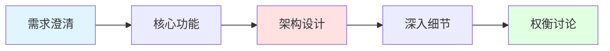

# 系统设计面试指南

系统设计面试是高级工程师面试的重要环节，本文将系统讲解如何准备和应对系统设计面试。

## 面试流程

### 典型面试结构



**时间分配**（45-60分钟）:
- 需求澄清：5-10分钟
- 核心功能：5-10分钟
- 架构设计：15-20分钟
- 深入细节：10-15分钟
- 权衡讨论：5-10分钟

## 解题框架

### SNAKE原则

**S - Scenario（场景）**
- 明确需求和约束
- 确定核心功能
- 估算规模

**N - Necessary（必要）**
- 识别关键组件
- 确定技术栈
- 定义接口

**A - Application（应用）**
- 设计架构图
- 数据流设计
- API设计

**K - Kilobit（千位）**
- 容量估算
- 性能优化
- 扩展性设计

**E - Evolve（演进）**
- 讨论权衡
- 优化方案
- 未来扩展

## 需求澄清

### 关键问题清单

```markdown
## 功能性需求
- 核心功能是什么？
- 用户规模有多大？
- 需要支持哪些平台？
- 是否需要实时性？
- 数据一致性要求？

## 非功能性需求
- QPS/TPS是多少？
- 延迟要求是什么？
- 可用性要求（几个9）？
- 数据量有多大？
- 是否需要国际化？

## 约束条件
- 技术栈限制？
- 预算限制？
- 时间限制？
- 团队规模？
```

### 示例对话

```
面试官：设计一个短链接服务

候选人：好的，让我先澄清一些需求：

1. 功能需求：
   - 用户可以输入长URL生成短链接？
   - 短链接可以重定向到原始URL？
   - 是否需要自定义短链接？
   - 是否需要统计点击数据？
   - 短链接是否有过期时间？

2. 规模估算：
   - 预计每天生成多少短链接？
   - 预计每天多少次重定向？
   - 读写比例大概是多少？

3. 非功能需求：
   - 延迟要求是多少？
   - 可用性要求是几个9？
   - 是否需要全球部署？

面试官：很好的问题！每天100万次生成，1亿次重定向，读写比100:1，
        延迟要求100ms内，可用性99.9%。
```

## 容量估算

### 估算模板

```python
# 1. 流量估算
DAU = 100_000_000  # 日活用户
每用户日均请求 = 10
QPS_平均 = (DAU * 每用户日均请求) / 86400
QPS_峰值 = QPS_平均 * 3  # 峰值是平均的3倍

print(f"平均QPS: {QPS_平均:,.0f}")
print(f"峰值QPS: {QPS_峰值:,.0f}")

# 2. 存储估算
每条记录大小 = 1024  # 1KB
每日新增记录 = 1_000_000
保存时长_天 = 365 * 5  # 5年

总存储 = 每条记录大小 * 每日新增记录 * 保存时长_天
总存储_TB = 总存储 / (1024 ** 4)

print(f"总存储需求: {总存储_TB:.2f} TB")

# 3. 带宽估算
每次请求大小 = 100  # 100字节
每次响应大小 = 500  # 500字节

入带宽 = QPS_峰值 * 每次请求大小 * 8 / (1024 ** 2)  # Mbps
出带宽 = QPS_峰值 * 每次响应大小 * 8 / (1024 ** 2)  # Mbps

print(f"入带宽: {入带宽:.2f} Mbps")
print(f"出带宽: {出带宽:.2f} Mbps")

# 4. 缓存估算
热点数据比例 = 0.2  # 20%的数据占80%的访问
缓存命中率 = 0.8

缓存大小 = 总存储 * 热点数据比例
缓存大小_GB = 缓存大小 / (1024 ** 3)

print(f"缓存需求: {缓存大小_GB:.2f} GB")
```

### 常用数字

```
延迟数字（近似值）：
- L1缓存访问：0.5 ns
- L2缓存访问：7 ns
- 内存访问：100 ns
- SSD随机读：150 μs
- HDD磁盘寻道：10 ms
- 网络往返（同机房）：0.5 ms
- 网络往返（跨地区）：150 ms

容量数字：
- 1 KB = 1,024 字节
- 1 MB = 1,024 KB
- 1 GB = 1,024 MB
- 1 TB = 1,024 GB

可用性：
- 99% = 3.65天/年
- 99.9% = 8.76小时/年
- 99.99% = 52.56分钟/年
- 99.999% = 5.26分钟/年
```

## 架构设计

### 高层架构

```
┌─────────┐
│  客户端  │
└────┬────┘
     │
     ▼
┌─────────────┐
│  负载均衡器  │
└──────┬──────┘
       │
   ┌───┴───┐
   ▼       ▼
┌─────┐ ┌─────┐
│ API │ │ API │
│服务器│ │服务器│
└──┬──┘ └──┬──┘
   │       │
   └───┬───┘
       │
   ┌───┴────┐
   ▼        ▼
┌──────┐ ┌──────┐
│ 缓存  │ │ 数据库│
└──────┘ └──────┘
```

### 组件设计

```javascript
// API层设计
class URLShortenerAPI {
  // 生成短链接
  async createShortURL(longURL, customAlias = null, expireTime = null) {
    // 1. 验证URL
    if (!this.isValidURL(longURL)) {
      throw new Error('Invalid URL');
    }
    
    // 2. 检查是否已存在
    const existing = await this.cache.get(longURL);
    if (existing) {
      return existing;
    }
    
    // 3. 生成短码
    const shortCode = customAlias || this.generateShortCode();
    
    // 4. 检查冲突
    if (await this.db.exists(shortCode)) {
      return this.createShortURL(longURL, null, expireTime);
    }
    
    // 5. 存储映射
    await this.db.save({
      shortCode,
      longURL,
      createdAt: Date.now(),
      expireTime
    });
    
    // 6. 缓存
    await this.cache.set(shortCode, longURL, expireTime);
    
    return `https://short.url/${shortCode}`;
  }
  
  // 重定向
  async redirect(shortCode) {
    // 1. 查缓存
    let longURL = await this.cache.get(shortCode);
    
    // 2. 缓存未命中，查数据库
    if (!longURL) {
      const record = await this.db.get(shortCode);
      if (!record) {
        throw new Error('URL not found');
      }
      
      // 检查过期
      if (record.expireTime && Date.now() > record.expireTime) {
        throw new Error('URL expired');
      }
      
      longURL = record.longURL;
      
      // 写入缓存
      await this.cache.set(shortCode, longURL);
    }
    
    // 3. 异步记录统计
    this.analytics.track(shortCode);
    
    return longURL;
  }
  
  // 生成短码
  generateShortCode() {
    // Base62编码
    const chars = '0123456789abcdefghijklmnopqrstuvwxyzABCDEFGHIJKLMNOPQRSTUVWXYZ';
    const id = this.getNextID();
    let shortCode = '';
    
    while (id > 0) {
      shortCode = chars[id % 62] + shortCode;
      id = Math.floor(id / 62);
    }
    
    return shortCode.padStart(7, '0');
  }
}
```

## 数据库设计

### Schema设计

```sql
-- URL映射表
CREATE TABLE url_mappings (
    id BIGINT PRIMARY KEY AUTO_INCREMENT,
    short_code VARCHAR(10) UNIQUE NOT NULL,
    long_url TEXT NOT NULL,
    user_id BIGINT,
    created_at TIMESTAMP DEFAULT CURRENT_TIMESTAMP,
    expire_at TIMESTAMP,
    INDEX idx_short_code (short_code),
    INDEX idx_user_id (user_id),
    INDEX idx_created_at (created_at)
);

-- 统计表
CREATE TABLE url_analytics (
    id BIGINT PRIMARY KEY AUTO_INCREMENT,
    short_code VARCHAR(10) NOT NULL,
    clicked_at TIMESTAMP DEFAULT CURRENT_TIMESTAMP,
    ip_address VARCHAR(45),
    user_agent TEXT,
    referer TEXT,
    INDEX idx_short_code (short_code),
    INDEX idx_clicked_at (clicked_at)
);

-- 用户表
CREATE TABLE users (
    id BIGINT PRIMARY KEY AUTO_INCREMENT,
    email VARCHAR(255) UNIQUE NOT NULL,
    created_at TIMESTAMP DEFAULT CURRENT_TIMESTAMP
);
```

### 分库分表

```javascript
// 分片策略
class ShardingStrategy {
  // 根据短码分片
  getShardByShortCode(shortCode) {
    const hash = this.hashCode(shortCode);
    return hash % this.shardCount;
  }
  
  // 根据用户ID分片
  getShardByUserID(userID) {
    return userID % this.shardCount;
  }
  
  // 一致性哈希
  getShardByConsistentHash(key) {
    const hash = this.hashCode(key);
    // 找到顺时针最近的节点
    for (const node of this.ring) {
      if (hash <= node.hash) {
        return node.shard;
      }
    }
    return this.ring[0].shard;
  }
}
```

## 缓存策略

### 多级缓存

```javascript
class CacheManager {
  constructor() {
    this.l1Cache = new LRUCache(10000);  // 本地缓存
    this.l2Cache = new RedisCache();      // 分布式缓存
  }
  
  async get(key) {
    // 1. 查L1缓存
    let value = this.l1Cache.get(key);
    if (value) {
      return value;
    }
    
    // 2. 查L2缓存
    value = await this.l2Cache.get(key);
    if (value) {
      this.l1Cache.set(key, value);
      return value;
    }
    
    // 3. 查数据库
    value = await this.db.get(key);
    if (value) {
      this.l1Cache.set(key, value);
      await this.l2Cache.set(key, value, 3600);
    }
    
    return value;
  }
  
  async set(key, value, ttl) {
    // 同时写入L1和L2
    this.l1Cache.set(key, value);
    await this.l2Cache.set(key, value, ttl);
  }
}
```

### 缓存更新策略

```javascript
// Cache-Aside模式
async function getURL(shortCode) {
  // 读：先查缓存，未命中查数据库
  let url = await cache.get(shortCode);
  if (!url) {
    url = await db.get(shortCode);
    if (url) {
      await cache.set(shortCode, url);
    }
  }
  return url;
}

async function updateURL(shortCode, newURL) {
  // 写：先更新数据库，再删除缓存
  await db.update(shortCode, newURL);
  await cache.delete(shortCode);
}

// Write-Through模式
async function updateURLWriteThrough(shortCode, newURL) {
  // 同时更新缓存和数据库
  await Promise.all([
    cache.set(shortCode, newURL),
    db.update(shortCode, newURL)
  ]);
}
```

## 性能优化

### 读优化

```javascript
// 1. 预热热点数据
async function warmupCache() {
  const hotURLs = await db.getTopURLs(1000);
  await Promise.all(
    hotURLs.map(url => cache.set(url.shortCode, url.longURL))
  );
}

// 2. 布隆过滤器防止缓存穿透
class BloomFilter {
  async exists(shortCode) {
    // 快速判断是否可能存在
    return this.bloomFilter.contains(shortCode);
  }
}

async function getURLWithBloomFilter(shortCode) {
  // 先用布隆过滤器判断
  if (!await bloomFilter.exists(shortCode)) {
    return null;  // 一定不存在
  }
  
  // 可能存在，继续查询
  return await getURL(shortCode);
}

// 3. 缓存空值防止缓存穿透
async function getURLWithNullCache(shortCode) {
  let url = await cache.get(shortCode);
  
  if (url === null) {
    return null;  // 缓存的空值
  }
  
  if (!url) {
    url = await db.get(shortCode);
    // 缓存空值，设置较短的TTL
    await cache.set(shortCode, url || null, url ? 3600 : 60);
  }
  
  return url;
}
```

### 写优化

```javascript
// 1. 批量写入
class BatchWriter {
  constructor() {
    this.buffer = [];
    this.batchSize = 1000;
    this.flushInterval = 5000;
    
    setInterval(() => this.flush(), this.flushInterval);
  }
  
  async write(data) {
    this.buffer.push(data);
    
    if (this.buffer.length >= this.batchSize) {
      await this.flush();
    }
  }
  
  async flush() {
    if (this.buffer.length === 0) return;
    
    const batch = this.buffer.splice(0, this.batchSize);
    await db.batchInsert(batch);
  }
}

// 2. 异步写入
async function trackClick(shortCode) {
  // 不等待写入完成
  analytics.track(shortCode).catch(err => {
    logger.error('Failed to track click', err);
  });
}

// 3. 消息队列解耦
async function trackClickWithQueue(shortCode) {
  await messageQueue.publish('analytics', {
    shortCode,
    timestamp: Date.now(),
    ip: request.ip
  });
}
```

## 扩展性设计

### 水平扩展

```javascript
// 无状态服务
class StatelessAPIServer {
  // 不存储任何会话状态
  // 所有状态都在缓存或数据库中
  
  async handleRequest(request) {
    // 从请求中获取所有需要的信息
    const token = request.headers.authorization;
    const user = await this.auth.verify(token);
    
    // 处理请求
    return this.processRequest(request, user);
  }
}

// 数据库分片
class DatabaseSharding {
  constructor(shards) {
    this.shards = shards;
  }
  
  getShard(key) {
    const hash = this.hash(key);
    return this.shards[hash % this.shards.length];
  }
  
  async get(key) {
    const shard = this.getShard(key);
    return await shard.get(key);
  }
  
  async set(key, value) {
    const shard = this.getShard(key);
    return await shard.set(key, value);
  }
}
```

## 常见问题

### Q1: 如何保证短码唯一性？

```javascript
// 方案1：数据库自增ID + Base62编码
function generateShortCode(id) {
  const chars = '0123456789abcdefghijklmnopqrstuvwxyzABCDEFGHIJKLMNOPQRSTUVWXYZ';
  let code = '';
  while (id > 0) {
    code = chars[id % 62] + code;
    id = Math.floor(id / 62);
  }
  return code;
}

// 方案2：分布式ID生成器（Snowflake）
class SnowflakeIDGenerator {
  generate() {
    // 41位时间戳 + 10位机器ID + 12位序列号
    const timestamp = Date.now() - this.epoch;
    const id = (timestamp << 22) | (this.workerId << 12) | this.sequence;
    this.sequence = (this.sequence + 1) & 0xFFF;
    return id;
  }
}

// 方案3：哈希 + 冲突检测
async function generateUniqueShortCode(longURL) {
  let shortCode = hash(longURL).substring(0, 7);
  let attempts = 0;
  
  while (await db.exists(shortCode) && attempts < 10) {
    shortCode = hash(longURL + attempts).substring(0, 7);
    attempts++;
  }
  
  if (attempts >= 10) {
    throw new Error('Failed to generate unique short code');
  }
  
  return shortCode;
}
```

### Q2: 如何处理热点数据？

```javascript
// 1. 本地缓存
const localCache = new LRUCache(1000);

// 2. 多级缓存
async function getHotURL(shortCode) {
  // L1: 本地缓存
  let url = localCache.get(shortCode);
  if (url) return url;
  
  // L2: Redis缓存
  url = await redis.get(shortCode);
  if (url) {
    localCache.set(shortCode, url);
    return url;
  }
  
  // L3: 数据库
  url = await db.get(shortCode);
  if (url) {
    localCache.set(shortCode, url);
    await redis.set(shortCode, url, 3600);
  }
  
  return url;
}

// 3. CDN缓存
// 在CDN层缓存热点短链接的重定向
```

### Q3: 如何保证高可用？

```javascript
// 1. 多副本
const replicas = [db1, db2, db3];

async function writeWithReplication(key, value) {
  // 写入主库
  await replicas[0].write(key, value);
  
  // 异步复制到从库
  Promise.all(
    replicas.slice(1).map(replica => replica.write(key, value))
  ).catch(err => logger.error('Replication failed', err));
}

// 2. 故障转移
async function readWithFailover(key) {
  for (const replica of replicas) {
    try {
      return await replica.read(key);
    } catch (err) {
      logger.warn(`Replica ${replica.id} failed`, err);
      continue;
    }
  }
  throw new Error('All replicas failed');
}

// 3. 熔断器
class CircuitBreaker {
  async call(fn) {
    if (this.state === 'OPEN') {
      throw new Error('Circuit breaker is open');
    }
    
    try {
      const result = await fn();
      this.onSuccess();
      return result;
    } catch (err) {
      this.onFailure();
      throw err;
    }
  }
}
```

## 面试技巧

### DO（应该做的）
- ✅ 主动澄清需求
- ✅ 先画高层架构
- ✅ 估算容量和性能
- ✅ 讨论权衡和优化
- ✅ 考虑边界情况
- ✅ 保持沟通和互动

### DON'T（不应该做的）
- ❌ 直接开始编码
- ❌ 过早优化细节
- ❌ 忽略非功能需求
- ❌ 不讨论权衡
- ❌ 沉默不语
- ❌ 固执己见

### 沟通技巧
```
1. 思考过程可视化
   "让我画个图来说明..."
   "我们可以这样设计..."

2. 主动寻求反馈
   "这个方案您觉得怎么样？"
   "您有什么建议吗？"

3. 讨论权衡
   "方案A的优点是...，但缺点是..."
   "我们可以用X来优化Y，但会牺牲Z"

4. 承认不足
   "这个领域我不太熟悉，但我会这样思考..."
   "我需要了解更多关于X的信息"
```

## 总结

系统设计面试的核心：
- ✅ **需求澄清**：明确功能和非功能需求
- ✅ **容量估算**：计算QPS、存储、带宽
- ✅ **架构设计**：高层设计和组件设计
- ✅ **深入细节**：数据库、缓存、API设计
- ✅ **权衡讨论**：讨论不同方案的优劣
- ✅ **持续沟通**：保持与面试官的互动

记住：**没有完美的设计，只有合适的权衡！**

