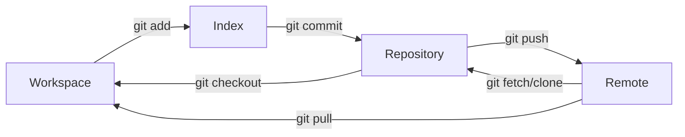

Git 

Git 

1. **Workspace**WorkspaceGittrackedGit

2. **Index**stageRepository`git add`Index`git commit`IndexRepository

3. **Repository**GitcommitGit

4. **Remote**GitHubGitLabBitbucket`git push`RepositoryRemote`git pull``git fetch`Remote

 Git 

- `git pull` 
- `git fetch origin --prune` 

 AI  Git  Git Git 

[Interactive Git Courses](https://ooloo.io/project/github-flow/mindset)  GitHub  GitGitHub  Git 

import MarkmapHooks from '@site/src/components/MarkmapHooks';

## Git 

<MarkmapHooks initialMarkdown={`

# Git 

## 

### 

- git init
- git clone <repo_url>

### 

- git config --global user.name ""
- git config --global user.email "@example.com"

## 

### 

- git status
- git log

### 

- git add <file_name>
- git add .
- git commit -m ""

## 

### 

- git pull
- git fetch
- git fetch origin --prune

### 

- git push
- git push origin HEAD --force

### 

- git diff origin/main..main
- git merge origin/feature-branch

## 

### 

- git branch
- git branch -a
- git checkout branchName

### 

- git branch newBranch
- git checkout -b newBranch
- git merge <branch_name>

## 

### 

- git reset --hard HEAD^
- git reset --hard commit_id

## 

### 

- git tag
- git tag -l v1.*
- git ls-remote --tags origin

### 

- git tag [tag]
- git tag -a [tag]
- git push origin --tags
- git push origin [tag]

### 

- git tag -d [tag]
- git push origin :refs/tags/[tag]
- git show [tag]
- git branch -a --contains [tag]

`} />

## Git commit 

Git commit 

 commit message  AI  commit 

 Gitmoji

> Gitmoji  Git emojiGitmoji 

> Gitmoji  VS Code 

## GitHub Actions

GitHub Actions  CI/CD 

- CI/CD/

 YAML 

 `.github/workflows` 

[GitHub Actions documentation](https://docs.github.com/en/actions)

