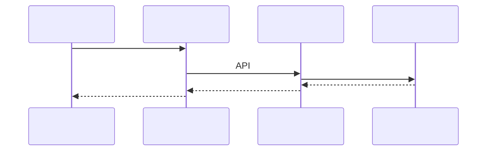
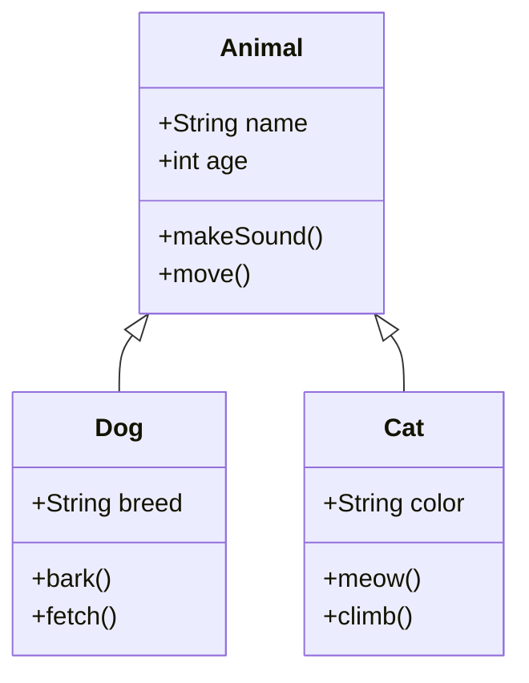
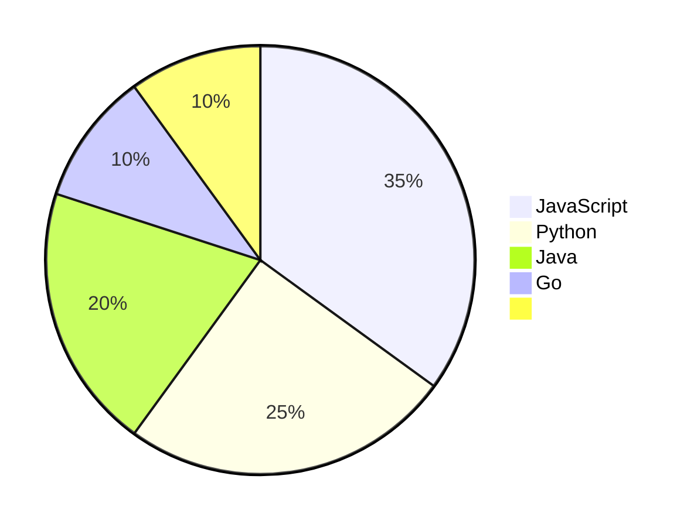

# Markdown 

 Docusaurus  Markdown 

##  Markdown 

### 

Docusaurus  Markdown 

- ****: `# ## ### #### ##### ######`
- ****: `**`  `****`
- ****: 
- ****: `[](URL)`
- ****: ``
- ****: `` `` `` 

### 

#### 

```javascript
// JavaScript 
function greet(name) {
    console.log(`Hello, ${name}!`);
}
```

```python
# Python 
def greet(name):
    print(f"Hello, {name}!")
```

```rust
// Rust 
fn greet(name: &str) {
    println!("Hello, {}!", name);
}
```

#### 

```js title="utils.js"
export function formatDate(date) {
    return date.toLocaleDateString();
}
```

#### 

```js showLineNumbers
function fibonacci(n) {
    if (n <= 1) return n;
    return fibonacci(n - 1) + fibonacci(n - 2);
}
```

#### 

```js {1,3-5}
function example() {
    const a = 1; // 
    const b = 2;
    const c = 3; // 
    const d = 4; // 
    return a + b + c + d;
}
```

## MDX 

Docusaurus  MDX Markdown  React 

### 

```mdx
import Tabs from '@theme/Tabs';
import TabItem from '@theme/TabItem';

<Tabs>
  <TabItem value="apple" label="" default>
     
  </TabItem>
  <TabItem value="orange" label="">
     
  </TabItem>
</Tabs>
```

###  JSX

```mdx
export const Highlight = ({children, color}) => (
  <span
    style={{
      backgroundColor: color,
      borderRadius: '2px',
      color: '#fff',
      padding: '0.2rem',
    }}>
    {children}
  </span>
);

<Highlight color="#25c2a0">Docusaurus green</Highlight>  <Highlight color="#1877F2">Facebook blue</Highlight> 
```

##  (Admonitions)

Docusaurus 

:::note

:::

:::tip

:::

:::info

:::

:::caution

:::

:::danger

:::

### 

:::tip 

:::

:::danger 

:::

##  (Tabs)


```mdx
import Tabs from '@theme/Tabs';
import TabItem from '@theme/TabItem';

<Tabs>
  <TabItem value="js" label="JavaScript">
     JavaScript 
  </TabItem>
  <TabItem value="py" label="Python">
     Python 
  </TabItem>
  <TabItem value="rs" label="Rust">
     Rust 
  </TabItem>
</Tabs>
```

## 

### 

 `$` $E = mc^2$

### 

 `$$` 

$$
E = mc^2
$$

$$
a^2 + b^2 = c^2
$$

### 

```markdown
$$
\int_{-\infty}^{\infty} e^{-x^2} dx = \sqrt{\pi}
$$

$$
\sum_{i=1}^{n} i = \frac{n(n+1)}{2}
$$

$$
\begin{pmatrix}
a & b \\
c & d
\end{pmatrix}
$$

$$
\begin{align}
\nabla \times \vec{\mathbf{B}} -\, \frac1c\, \frac{\partial\vec{\mathbf{E}}}{\partial t} &= \frac{4\pi}{c}\vec{\mathbf{j}} \\
\nabla \cdot \vec{\mathbf{E}} &= 4 \pi \rho \\
\nabla \times \vec{\mathbf{E}}\, +\, \frac1c\, \frac{\partial\vec{\mathbf{B}}}{\partial t} &= \vec{\mathbf{0}} \\
\nabla \cdot \vec{\mathbf{B}} &= 0
\end{align}
$$
```

## 

### Mermaid 
Docusaurus  Mermaid 

#### 
```mermaid
graph TD;
    A[] --> B{};
    B -->|| C[A];
    B -->|| D[B];
    C --> E[];
    D --> E;
```

#### 


#### 
```mermaid
gantt
    title 
    dateFormat  YYYY-MM-DD
    section 
               :done,    des1, 2024-01-01,2024-01-05
    UI            :done,    des2, 2024-01-06, 10d
    section 
              :active,  dev1, 2024-01-16, 20d
              :         dev2, 2024-01-20, 15d
    section 
              :         test1, after dev1, 5d
              :         test2, after dev2, 3d
```

#### 


#### 
```mermaid
stateDiagram-v2
    [*] --> 
     -->  : 
     -->  : 
     -->  : 
     --> [*]
     --> [*]
```

#### 


### 

```mermaid
flowchart LR
    A[] --> B{?}
    B -->|| C[]
    B -->|| D[]
    D --> E[]
    E --> F{?}
    F -->|| C
    F -->|| G[]
    G --> D
```

## 

### 

|  |  |  |
|------|------|------|
|  |  |  |
|  |  |  LaTeX  |
|  |  |  Mermaid |
| MDX |  |  React  |

### 

|  |  |  |
|:-------|:--------:|-------:|
| 1  |   2   |  3 |
|  |      |    |

## 

### 

- [](./index.mdx)
- [Git ](./Git.mdx)
- [](./.mdx)

### 

- [Docusaurus ](https://docusaurus.io/)
- [Markdown ](https://www.markdownguide.org/)
- [MDX ](https://mdxjs.com/)

### 

- [](#)
- [](#)

## 

### 


### 

<figure>
  
  <figcaption>Docusaurus - </figcaption>
</figure>

### 

```html
<iframe 
  width="560" 
  height="315" 
  src="https://www.youtube.com/embed/dQw4w9WgXcQ" 
  title="YouTube video player" 
  frameBorder="0" 
  allow="accelerometer; autoplay; clipboard-write; encrypted-media; gyroscope; picture-in-picture" 
  allowFullScreen>
</iframe>
```

## 

### 

<details>
  <summary></summary>
  
   Markdown 
  
  -  1
  -  2
  -  3
  
  ```js
  console.log('Hello, World!');
  ```
</details>

### 

 <kbd>Ctrl</kbd> + <kbd>C</kbd> 

 <kbd>Ctrl</kbd> + <kbd>V</kbd> 

## 

### 

 `docusaurus.config.js` 

```js
module.exports = {
  presets: [
    [
      'classic',
      {
        docs: {
          remarkPlugins: [
            [require('@docusaurus/remark-plugin-npm2yarn'), {sync: true}],
          ],
          rehypePlugins: [],
        },
      },
    ],
  ],
  plugins: [
    'docusaurus-plugin-sass',
    [
      '@docusaurus/plugin-ideal-image',
      {
        quality: 70,
        max: 1030,
        min: 640,
        steps: 2,
        disableInDev: false,
      },
    ],
  ],
};
```

### 

```js
module.exports = {
  themeConfig: {
    prism: {
      theme: lightCodeTheme,
      darkTheme: darkCodeTheme,
      additionalLanguages: ['rust', 'toml', 'bash'],
      magicComments: [
        {
          className: 'theme-code-block-highlighted-line',
          line: 'highlight-next-line',
          block: {start: 'highlight-start', end: 'highlight-end'},
        },
      ],
    },
  },
};
```

## 

### 

1. **** `#`  `######`
2. ****
3. ****
4. ** alt **

### 

1. ****
2. ****
3. ****

### 

1. **** HTML 
2. ****
3. ****

## GitHub Flavored Markdown (GFM) 

### 
```markdown
- [x] 
- [ ] 
- [x] 
```

### 
```markdown
~~~~
```

### 
```markdown
|  |  |  |
|:-------|:--------:|-------:|
| 1  |   2  |  3 |
|  |    |    |
```

### 
```markdown
https://github.com/facebook/docusaurus
user@example.com
```

## npm2yarn 

### 
```bash
npm install @docusaurus/core
```

 npmyarn  pnpm 

### 
- `npm install`
- `npm run build`
- `npm install -g`
- `npm install --save-dev`

## 

### 


- ****JavaScript, TypeScript, JSX, TSX, HTML, CSS, SCSS
- ****Python, Java, Go, Rust, PHP, Ruby, C#, C++, C
- ****JSON, YAML, TOML, Docker, Nginx, Apache
- ****SQL, GraphQL
- ****Bash, PowerShell, Vim, LaTeX, Markdown

### 
```javascript title=".js" {2,4-6} showLineNumbers
function greet(name) {
  // 
  console.log('Hello, ' + name);
  // 
  return {
    message: `Hello, ${name}!`
  };
}
```

## 

### 

- `@docusaurus/plugin-ideal-image`: 
- `@docusaurus/plugin-pwa`: PWA 
- `@docusaurus/plugin-google-analytics`: Google Analytics
- `@docusaurus/plugin-google-gtag`: Google Tag Manager

### 

#### 
- **remark-math** + **rehype-katex** LaTeX 
  - 
  - 
  -  LaTeX 

#### 
- **@docusaurus/theme-mermaid** Mermaid 
  - 
  - 
  - 

#### Markdown 
- **remark-gfm**GitHub Flavored Markdown 
  - 
  - 
  -  Markdown 
- **@docusaurus/remark-plugin-npm2yarn**
  -  npmyarnpnpm 
  - 
  - 

#### 
- **prism-react-renderer**
  -  30+ 
  - 
  - 
- ****
  - 
  - 
  - 
  - 

#### 
- **docusaurus-plugin-sass**Sass 
  -  SCSS 
  - 
  - 

## 

### 

1. **MDX ** JSX 
2. ****
3. ****
4. ****

### 

1. ****`npm start` 
2. ****
3. ****
4. ****

## 

- [Docusaurus ](https://docusaurus.io/docs)
- [MDX ](https://mdxjs.com/docs/)
- [Markdown ](https://www.markdownguide.org/)
- [Mermaid ](https://mermaid-js.github.io/mermaid/)
- [KaTeX ](https://katex.org/docs/supported.html)

---

 Markdown 