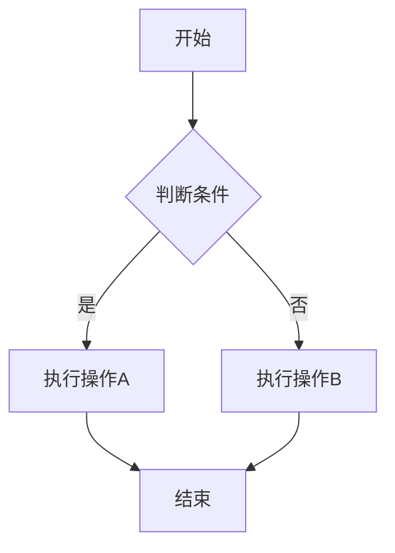
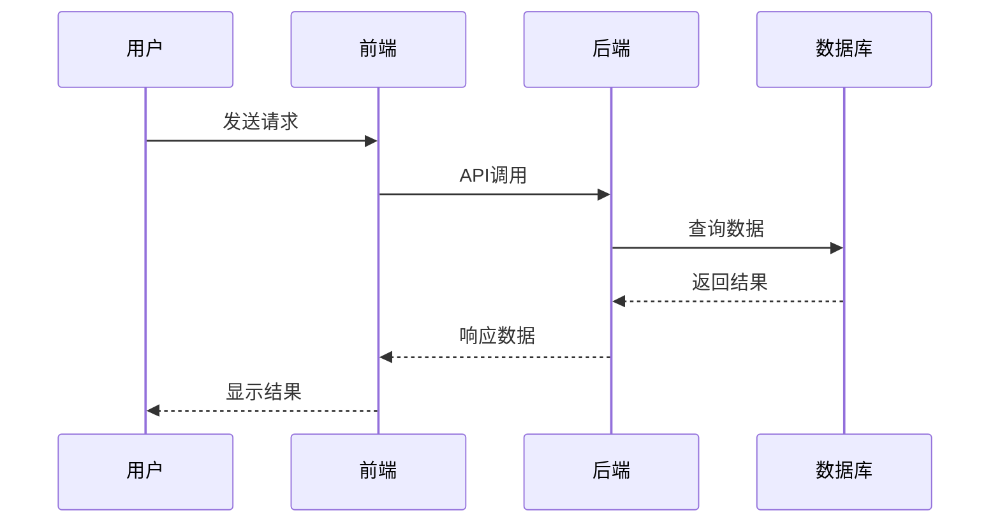
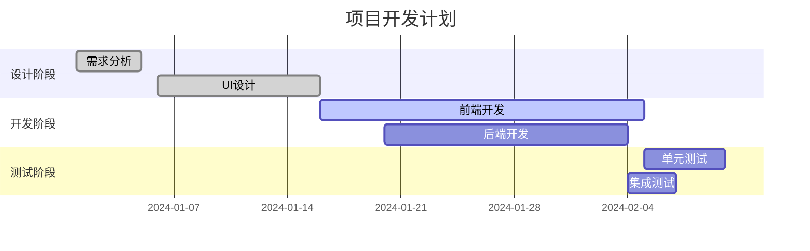
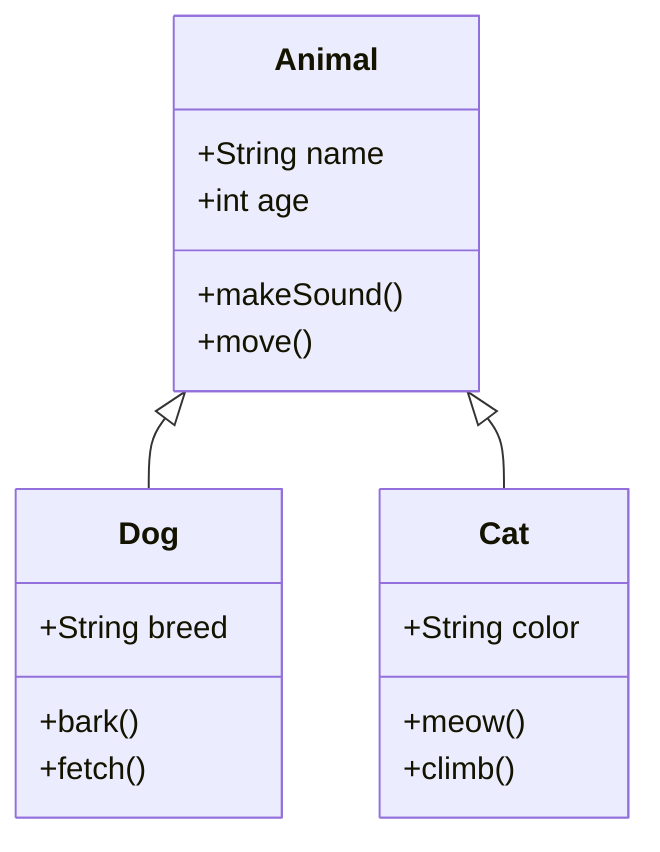
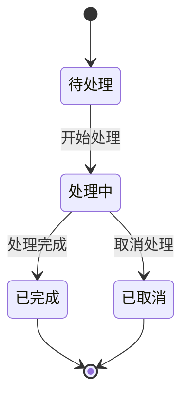
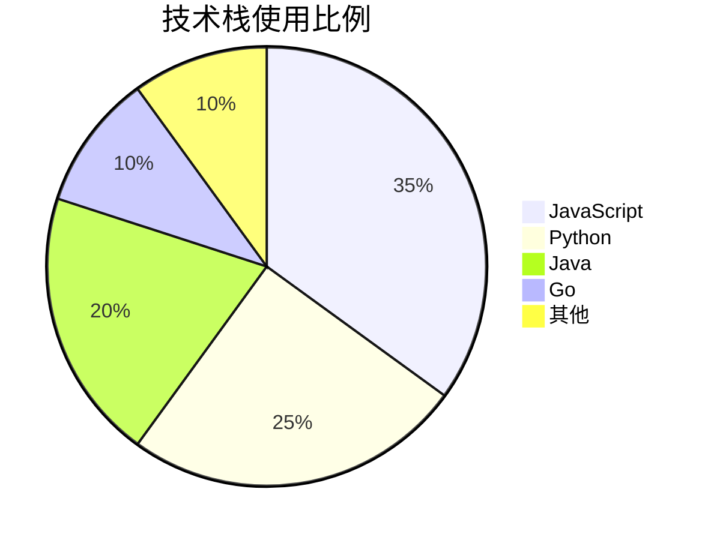
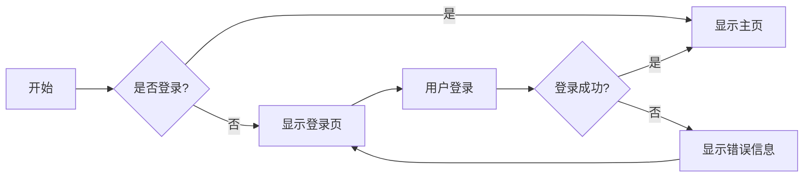

# Markdown 插件

本文档介绍 Docusaurus 中可用的 Markdown 插件和扩展功能，帮助您更好地编写和展示文档内容。

## 内置 Markdown 功能

### 基础语法

Docusaurus 支持标准的 Markdown 语法，包括：

- **标题**: `# ## ### #### ##### ######`
- **强调**: `*斜体*` 和 `**粗体**`
- **列表**: 有序列表和无序列表
- **链接**: `[文本](URL)`
- **图片**: ``
- **代码**: `` `内联代码` `` 和代码块

### 代码块增强

#### 语法高亮

```javascript
// JavaScript 代码示例
function greet(name) {
    console.log(`Hello, ${name}!`);
}
```

```python
# Python 代码示例
def greet(name):
    print(f"Hello, {name}!")
```

```rust
// Rust 代码示例
fn greet(name: &str) {
    println!("Hello, {}!", name);
}
```

#### 代码块标题

```js title="utils.js"
export function formatDate(date) {
    return date.toLocaleDateString();
}
```

#### 行号显示

```js showLineNumbers
function fibonacci(n) {
    if (n <= 1) return n;
    return fibonacci(n - 1) + fibonacci(n - 2);
}
```

#### 行高亮

```js {1,3-5}
function example() {
    const a = 1; // 高亮行
    const b = 2;
    const c = 3; // 高亮行
    const d = 4; // 高亮行
    return a + b + c + d;
}
```

## MDX 支持

Docusaurus 支持 MDX，允许在 Markdown 中使用 React 组件。

### 导入组件

```mdx
import Tabs from '@theme/Tabs';
import TabItem from '@theme/TabItem';

<Tabs>
  <TabItem value="apple" label="苹果" default>
    这是一个苹果 🍎
  </TabItem>
  <TabItem value="orange" label="橙子">
    这是一个橙子 🍊
  </TabItem>
</Tabs>
```

### 内联 JSX

```mdx
export const Highlight = ({children, color}) => (
  <span
    style={{
      backgroundColor: color,
      borderRadius: '2px',
      color: '#fff',
      padding: '0.2rem',
    }}>
    {children}
  </span>
);

<Highlight color="#25c2a0">Docusaurus green</Highlight> 和 <Highlight color="#1877F2">Facebook blue</Highlight> 是我最喜欢的颜色。
```

## 告示框 (Admonitions)

Docusaurus 提供了多种告示框类型：

:::note
这是一个注释框。
:::

:::tip
这是一个提示框。
:::

:::info
这是一个信息框。
:::

:::caution
这是一个警告框。
:::

:::danger
这是一个危险提示框。
:::

### 自定义标题

:::tip 专业提示
您可以为告示框指定自定义标题。
:::

:::danger 小心！
这里有重要的安全信息。
:::

## 选项卡 (Tabs)

使用选项卡组织相关内容：

```mdx
import Tabs from '@theme/Tabs';
import TabItem from '@theme/TabItem';

<Tabs>
  <TabItem value="js" label="JavaScript">
    这里放 JavaScript 代码
  </TabItem>
  <TabItem value="py" label="Python">
    这里放 Python 代码
  </TabItem>
  <TabItem value="rs" label="Rust">
    这里放 Rust 代码
  </TabItem>
</Tabs>
```

## 数学公式

### 内联公式

使用 `$` 包围内联数学公式：$E = mc^2$

### 块级公式

使用 `$$` 包围块级数学公式：

$$
E = mc^2
$$

$$
a^2 + b^2 = c^2
$$

### 复杂数学公式示例

```markdown
$$
\int_{-\infty}^{\infty} e^{-x^2} dx = \sqrt{\pi}
$$

$$
\sum_{i=1}^{n} i = \frac{n(n+1)}{2}
$$

$$
\begin{pmatrix}
a & b \\
c & d
\end{pmatrix}
$$

$$
\begin{align}
\nabla \times \vec{\mathbf{B}} -\, \frac1c\, \frac{\partial\vec{\mathbf{E}}}{\partial t} &= \frac{4\pi}{c}\vec{\mathbf{j}} \\
\nabla \cdot \vec{\mathbf{E}} &= 4 \pi \rho \\
\nabla \times \vec{\mathbf{E}}\, +\, \frac1c\, \frac{\partial\vec{\mathbf{B}}}{\partial t} &= \vec{\mathbf{0}} \\
\nabla \cdot \vec{\mathbf{B}} &= 0
\end{align}
$$
```

## 图表支持

### Mermaid 图表
Docusaurus 支持多种 Mermaid 图表类型：

#### 流程图


#### 序列图


#### 甘特图


#### 类图


#### 状态图


#### 饼图


### 业务流程图



## 表格增强

### 基础表格

| 功能 | 支持 | 说明 |
|------|------|------|
| 语法高亮 | ✅ | 支持多种编程语言 |
| 数学公式 | ✅ | 支持 LaTeX 语法 |
| 图表 | ✅ | 支持 Mermaid |
| MDX | ✅ | 支持 React 组件 |

### 表格对齐

| 左对齐 | 居中对齐 | 右对齐 |
|:-------|:--------:|-------:|
| 内容1  |   内容2   |  内容3 |
| 较长的内容 |   内容   |   内容 |

## 链接和引用

### 内部链接

- [首页](./index.mdx)
- [Git 文档](./Git.mdx)
- [设计模式](./设计模式.mdx)

### 外部链接

- [Docusaurus 官网](https://docusaurus.io/)
- [Markdown 指南](https://www.markdownguide.org/)
- [MDX 文档](https://mdxjs.com/)

### 锚点链接

- [跳转到数学公式](#数学公式)
- [跳转到图表支持](#图表支持)

## 媒体嵌入

### 图片


### 带标题的图片

<figure>
  
  <figcaption>Docusaurus - 现代静态网站生成器</figcaption>
</figure>

### 视频嵌入

```html
<iframe 
  width="560" 
  height="315" 
  src="https://www.youtube.com/embed/dQw4w9WgXcQ" 
  title="YouTube video player" 
  frameBorder="0" 
  allow="accelerometer; autoplay; clipboard-write; encrypted-media; gyroscope; picture-in-picture" 
  allowFullScreen>
</iframe>
```

## 自定义组件

### 详情折叠

<details>
  <summary>点击展开详细信息</summary>
  
  这里是折叠的内容。您可以在这里放置任何 Markdown 内容：
  
  - 列表项 1
  - 列表项 2
  - 列表项 3
  
  ```js
  console.log('Hello, World!');
  ```
</details>

### 键盘按键

按 <kbd>Ctrl</kbd> + <kbd>C</kbd> 复制内容。

按 <kbd>Ctrl</kbd> + <kbd>V</kbd> 粘贴内容。

## 插件配置

### 数学公式插件

在 `docusaurus.config.js` 中配置数学公式支持：

```js
module.exports = {
  presets: [
    [
      'classic',
      {
        docs: {
          remarkPlugins: [
            [require('@docusaurus/remark-plugin-npm2yarn'), {sync: true}],
          ],
          rehypePlugins: [],
        },
      },
    ],
  ],
  plugins: [
    'docusaurus-plugin-sass',
    [
      '@docusaurus/plugin-ideal-image',
      {
        quality: 70,
        max: 1030,
        min: 640,
        steps: 2,
        disableInDev: false,
      },
    ],
  ],
};
```

### 代码块插件

```js
module.exports = {
  themeConfig: {
    prism: {
      theme: lightCodeTheme,
      darkTheme: darkCodeTheme,
      additionalLanguages: ['rust', 'toml', 'bash'],
      magicComments: [
        {
          className: 'theme-code-block-highlighted-line',
          line: 'highlight-next-line',
          block: {start: 'highlight-start', end: 'highlight-end'},
        },
      ],
    },
  },
};
```

## 最佳实践

### 文档结构

1. **使用清晰的标题层级**：从 `#` 到 `######`
2. **合理使用告示框**：突出重要信息
3. **代码示例要完整**：包含必要的上下文
4. **图片要有 alt 文本**：提高可访问性

### 性能优化

1. **图片优化**：使用适当的格式和大小
2. **懒加载**：对大型媒体内容使用懒加载
3. **代码分割**：将大型文档拆分为多个文件

### 可访问性

1. **语义化标记**：使用正确的 HTML 标签
2. **键盘导航**：确保所有交互元素可通过键盘访问
3. **颜色对比**：确保足够的颜色对比度

## GitHub Flavored Markdown (GFM) 支持

### 任务列表
```markdown
- [x] 已完成的任务
- [ ] 未完成的任务
- [x] 另一个已完成的任务
```

### 删除线
```markdown
~~这段文字被删除了~~
```

### 表格增强
```markdown
| 左对齐 | 居中对齐 | 右对齐 |
|:-------|:--------:|-------:|
| 内容1  |   内容2  |  内容3 |
| 长内容 |   短内容 |  中等  |
```

### 自动链接
```markdown
https://github.com/facebook/docusaurus
user@example.com
```

## npm2yarn 插件支持

### 自动转换包管理器命令
```bash
npm install @docusaurus/core
```

上述命令会自动显示 npm、yarn 和 pnpm 的对应版本。

### 支持的命令类型
- 安装依赖：`npm install`
- 运行脚本：`npm run build`
- 全局安装：`npm install -g`
- 开发依赖：`npm install --save-dev`

## 扩展语法高亮

### 支持的编程语言
项目现已支持以下编程语言的语法高亮：

- **前端技术**：JavaScript, TypeScript, JSX, TSX, HTML, CSS, SCSS
- **后端语言**：Python, Java, Go, Rust, PHP, Ruby, C#, C++, C
- **配置文件**：JSON, YAML, TOML, Docker, Nginx, Apache
- **数据库**：SQL, GraphQL
- **其他**：Bash, PowerShell, Vim, LaTeX, Markdown

### 代码块增强功能
```javascript title="示例文件.js" {2,4-6} showLineNumbers
function greet(name) {
  // 高亮这一行
  console.log('Hello, ' + name);
  // 高亮这个代码块
  return {
    message: `Hello, ${name}!`
  };
}
```

## 常用插件推荐

### 官方插件

- `@docusaurus/plugin-ideal-image`: 图片优化
- `@docusaurus/plugin-pwa`: PWA 支持
- `@docusaurus/plugin-google-analytics`: Google Analytics
- `@docusaurus/plugin-google-gtag`: Google Tag Manager

### 社区插件

#### 数学公式插件
- **remark-math** + **rehype-katex**：支持 LaTeX 数学公式
  - 配置简单，渲染效果好
  - 支持内联和块级公式
  - 兼容标准 LaTeX 语法

#### 图表插件
- **@docusaurus/theme-mermaid**：支持 Mermaid 图表
  - 多种图表类型，语法简洁
  - 支持流程图、序列图、甘特图、类图、状态图、饼图
  - 主题自适应（明暗模式）

#### Markdown 增强插件
- **remark-gfm**：GitHub Flavored Markdown 支持
  - 任务列表、删除线、表格增强
  - 自动链接识别
  - 更好的 Markdown 兼容性
- **@docusaurus/remark-plugin-npm2yarn**：包管理器命令转换
  - 自动显示 npm、yarn、pnpm 命令
  - 提升开发者体验
  - 支持多种包管理器

#### 代码增强插件
- **prism-react-renderer**：语法高亮
  - 支持 30+ 编程语言
  - 主题自定义
  - 行号显示、代码高亮
- **代码块增强功能**：
  - 文件标题显示
  - 特定行高亮
  - 行号显示
  - 代码复制功能

#### 样式和主题插件
- **docusaurus-plugin-sass**：Sass 支持
  - 支持 SCSS 语法
  - 变量和混入功能
  - 更灵活的样式定制

## 故障排除

### 常见问题

1. **MDX 语法错误**：检查 JSX 标签是否正确闭合
2. **图片不显示**：检查路径是否正确
3. **数学公式不渲染**：确保插件正确安装和配置
4. **代码高亮失效**：检查语言标识符是否正确

### 调试技巧

1. **使用开发模式**：`npm start` 查看实时错误
2. **检查控制台**：查看浏览器控制台错误信息
3. **逐步排查**：注释掉可能有问题的部分
4. **查看文档**：参考官方文档和示例

## 相关资源

- [Docusaurus 官方文档](https://docusaurus.io/docs)
- [MDX 官方文档](https://mdxjs.com/docs/)
- [Markdown 语法指南](https://www.markdownguide.org/)
- [Mermaid 图表文档](https://mermaid-js.github.io/mermaid/)
- [KaTeX 数学公式文档](https://katex.org/docs/supported.html)

---

通过合理使用这些 Markdown 插件和功能，您可以创建出功能丰富、视觉美观的技术文档。记住要保持内容的可读性和可访问性，为读者提供最佳的阅读体验。