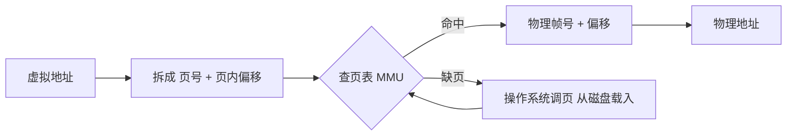

# 内存管理

操作系统如何在有限的物理内存上，让多个程序都觉得自己独占全部内存？答案是**虚拟内存**。

## 学习目标

学完本章，你应该能够：

- 区分物理地址与虚拟地址，说清为什么需要虚拟内存。
- 解释分页（paging）如何把虚拟页映射到物理帧，以及页表的作用。
- 对比分段与分页，理解现代系统多用分页的原因。
- 说清页面置换（如 LRU）的目标，以及抖动（thrashing）为何会让系统变慢。

## 前置知识

在阅读下面的内容前，建议先掌握：

- 理解二进制与地址概念——可参考 [C 语言指针与内存](/docs/编程语言/C/0基础语法) 中的地址部分。
- 已了解 [进程与线程](/docs/计算机科学基础/操作系统/进程线程与调度) 中进程隔离的基本动机。
- 知道「内存」是一类有限、易失的存储资源。

## 核心概念

虚拟内存做了一件关键的事：让每个进程都以为自己独占一整块从 0 开始的大内存。内核通过页表在「进程看到的虚拟地址」和「真实的物理地址」之间做翻译。好处是隔离（一个进程崩了不会踩到另一个）、灵活（内存不够时把不常用的页换到磁盘），以及能运行比物理内存更大的程序。代价是每次访问都要查表，于是有了 TLB 缓存；当换页太频繁、CPU 大多时间花在搬运页面而不是干活时，就出现了抖动。

本章主线：
- 从「为什么需要虚拟内存」切入隔离与扩展需求
- 用分页把连续虚拟空间拆成固定大小的页
- 通过置换算法与抖动理解性能拐点

虚拟地址到物理地址的翻译是分页的核心，MMU 借助页表完成「页号→帧号」的映射，缺页时退回操作系统调页：



## 1. 为什么需要虚拟内存

- 每个进程看到的是独立的**虚拟地址空间**，与物理内存解耦；
- 进程互不影响，一个崩了不拖垮其他；
- 物理内存不够时可用磁盘（交换区）兜底。

## 2. 分页（Paging）

内存被切成固定大小的**页（page，通常 4KB）**，物理内存对应**页框**：

```text
虚拟地址 ──→ [页号 | 页内偏移]
                ↓ 查页表
            物理页框号 + 偏移 = 物理地址
```

- **页表**记录虚拟页→物理页框的映射；
- 缺页（page fault）时，从磁盘调入所需页。

## 3. 分段 vs 分页

- 分段：按逻辑意义（代码/数据/栈）划分，长度可变；
- 分页：物理均匀切分，现代系统多用**段页式**（段内再分页）。

## 4. 页面置换

物理内存满、又要新页时，需换出旧页。算法：

| 算法 | 思路 | 缺点 |
|------|------|------|
| FIFO | 换最早进的 | 可能换掉常用页（Belady 异常） |
| LRU | 换最久未用 | 近似实现，效果好 |
| 时钟(Clock) | 环形扫描 | 近似 LRU，开销小 |

## 5. 抖动（Thrashing）

若内存太小、换页太频繁，CPU 大量时间花在"等页"而非"算"，系统几乎停滞。解决：增加内存或减少并发进程。

## 6. 与开发的关系

- 理解"堆/栈"来自虚拟地址空间的不同段；
- 大对象、缓存命中率直接影响性能；
- 内存泄漏 = 虚拟页始终被占用、无法回收。

## 示例

**地址翻译**：页大小 4KB（0x1000 = 4096 字节），虚拟地址 `0x1234`：
- `0x1234 = 4660`，页号 `4660 // 4096 = 1`，页内偏移 `4660 % 4096 = 564 = 0x234`。
- 故虚拟地址 `0x1234` → 第 1 号页、页内偏移 `0x234`；查页表得物理页框号后加上偏移即得物理地址。

**LRU 置换仿真**（用 Python 复现"最久未用"的直觉）：

```python
from collections import OrderedDict

class LRU:
    def __init__(self, cap):
        self.cap = cap
        self.cache = OrderedDict()
    def get(self, k):
        if k not in self.cache: return -1
        self.cache.move_to_end(k)        # 访问即刷新"最近使用"
        return self.cache[k]
    def put(self, k, v):
        if k in self.cache: self.cache.move_to_end(k)
        self.cache[k] = v
        if len(self.cache) > self.cap:   # 超出容量，淘汰最久未用
            self.cache.popitem(last=False)

l = LRU(2)
for op in [("put",1,1),("put",2,2),("get",1),("put",3,3)]:
    if op[0] == "put": l.put(op[1], op[2])
    else: print("get", op[1], "->", l.get(op[1]))
# 此时容量 2，put(3,3) 会淘汰最久未用的 key=2
```

## 小结

虚拟内存用"地址翻译 + 分页 + 置换"让有限物理内存服务无限需求。它是现代多任务系统的基石，也是性能调优的底层抓手。

## 易错点

- **虚拟地址 ≠ 物理地址**：程序里看到的地址都要经页表翻译，两个进程"相同"的指针往往指向不同物理页。
- **内存泄漏与换页抖动是两回事**：泄漏是虚拟页一直被占用不释放；抖动是物理内存不足导致频繁换页、CPU 空转。
- **LRU 多为"近似"实现**：精确 LRU 开销大，系统常用时钟(Clock)等近似算法。

## 练习

1. 给定虚拟地址 `0x1234`、页大小 4KB，页号与页内偏移各是多少？
2. 为什么"局部性好的程序"缓存/分页命中率高？举一个违反局部性的反例。

## 延伸阅读

- 上一篇：[进程、线程与调度](../进程线程与调度)
- 回到分支总览：[计算机科学基础](../../)
- 相关：[数字逻辑与冯诺依曼](../../组成原理/数字逻辑与冯诺依曼)（地址空间源自冯诺依曼"存储程序"）
- 硬件落点：[嵌入式系统概览](../../../嵌入式开发/嵌入式系统概览)
- 跨主题关联：[指针与数组（C）](../../../编程语言/C/8数组和指针)（虚拟地址/指针在编程语言层的落地：指针就是虚拟地址的句柄）

### 外部权威资料
- 《深入理解计算机系统》（CSAPP，Randal E. Bryant 等）第 3 版 — 第 8 章（异常控制流/进程）、第 9 章（虚拟内存）、第 10 章（文件系统）的权威、可动手的实现视角。
- 《操作系统概念》（Abraham Silberschatz 等，『恐龙书』）第 10 版 — 操作系统导论经典教材，体系完整、习题丰富。
- 《现代操作系统》（Andrew S. Tanenbaum）第 4 版 — 从宏观到微观覆盖进程、内存、文件系统与分布式。
