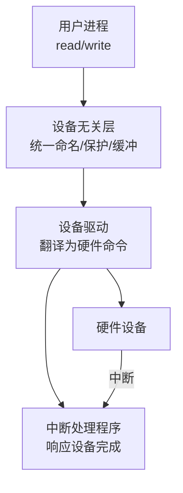

# 设备管理

CPU、内存、文件系统之外，操作系统还要管住鼠标、磁盘、打印机、网卡这些「脾气各异」的设备。本篇讲清 OS 如何用一套分层抽象，把硬件差异关进驱动里，对上只暴露统一接口。

## 学习目标

学完本章，你应该能够：

- 区分块设备、字符设备、网络设备，并理解为何分类管理。
- 描述 I/O 软件的四个层次：中断处理 → 设备驱动 → 设备无关 → 用户空间。
- 解释缓冲（单/双缓冲）与 SPOOLing 如何降低阻塞、提升并行度。
- 说清「设备即文件」（如 `/dev/sda`）这一 Unix 抽象及其边界。

## 前置知识

- 进程如何被调度与阻塞：[进程、线程与调度](../进程线程与调度)
- I/O 的硬件机制（中断/DMA）：[输入输出系统](../../组成原理/输入输出系统)
- 持久化存储的另一面：[文件系统](../文件系统)

## 核心概念

设备的共同难点是**速度悬殊且接口各异**：键盘慢、磁盘中、网卡突发、打印机极慢。OS 的对策是「分层 + 抽象」——把差异塞进最底层的**设备驱动**，对上只暴露少数统一原语，让应用程序用同一套方式打开/读写/关闭，不必关心背后是磁盘还是串口。

本章主线：
- 先按访问特征给设备分类
- 再看 I/O 软件如何一层层隔离差异
- 然后用缓冲与 SPOOLing 抹平速度差
- 最后落到「设备即文件」的统一视图

## 1. 设备分类

| 类型 | 特征 | 例子 |
| :--- | :--- | :--- |
| 块设备 | 以固定大小块随机读写，可寻址 | 磁盘、SSD |
| 字符设备 | 以字节流顺序收发，不可随机寻址 | 键盘、鼠标、串口 |
| 网络设备 | 以报文为单位，经协议栈收发 | 网卡 |

块设备有「块」概念、可被缓存；字符设备无结构、通常不可缓存；网络设备往往绕过传统文件接口，经套接字走协议栈。

## 2. I/O 软件层次

- **设备驱动**：内核里最贴近硬件的模块，把「读第 N 块」翻译成具体寄存器操作；每个设备一类驱动。
- **设备无关层**：负责统一命名（`/dev/...`）、权限保护、缓冲管理与错误归一化，让上层不必懂硬件。
- **中断处理**：硬件完成后触发中断，由 [输入输出系统](../../组成原理/输入输出系统) 所述的机制唤醒等待的进程。

## 3. 缓冲与 SPOOLing

- **缓冲**：在快慢双方之间放一块内存。单缓冲只能交替、双缓冲可重叠（一边填一边取），显著减少进程因等 I/O 而阻塞的时间。
- **SPOOLing（假脱机）**：把「独占的慢设备」变「共享的快队列」。典型是打印机：进程把打印任务写进磁盘队列，后台守护进程慢慢吐给打印机，进程立刻返回，不必干等。

## 4. 设备即文件

Unix 哲学「一切皆文件」：`/dev/sda` 是磁盘、`/dev/tty` 是终端。应用程序用同样的 `open/read/write/close` 操作设备，差异由驱动吸收。**边界**：并非所有设备都真有文件语义（如网卡走套接字），且某些设备文件只是控制句柄而非数据载体。

## 示例

**SPOOLing 把阻塞变异步**：没有假脱机时，程序调用打印要等打印机机械走完（可能几十秒），期间进程被阻塞；有了打印守护进程，程序只把任务追加到 `/var/spool/...` 磁盘文件就立刻返回，守护进程按队列慢速打印。多个程序「同时」打印的错觉，正是队列 + 磁盘缓冲带来的。

**设备即文件**：`ls -l /dev/sda` 看到的块设备文件，应用程序对它 `open()` 后 `read(扇区)` 就像读普通文件——但底层是驱动把请求转为磁盘控制器命令，再经 DMA 搬进内存（衔接 [输入输出系统](../../组成原理/输入输出系统)）。

## 小结

设备管理用「分层 + 抽象」驯服了硬件的杂乱：设备按块/字符/网络分类，I/O 软件从驱动到设备无关层逐层隔离差异，缓冲与 SPOOLing 抹平速度悬殊、降低阻塞，最终以「设备即文件」对上暴露统一接口。它向下承接 [组成原理的输入输出系统](/docs/计算机科学基础/组成原理/输入输出系统)（中断/DMA 的硬件机制），向上与 [进程、线程与调度](/docs/计算机科学基础/操作系统/进程线程与调度)（I/O 阻塞与唤醒）、[文件系统](/docs/计算机科学基础/操作系统/文件系统)（块设备上的持久结构）紧密咬合——是四大 OS 支柱中把「硬件」接进「系统」的那一根。

## 易错点

- **设备驱动跑在内核态**：写错驱动会拖垮整个系统，这正是它需签名/授权、与普通应用隔离的原因。
- **缓冲不是为了「更快」**：它主要减少进程因等 I/O 阻塞、以及拷贝次数；慢设备本身速度不变。
- **块设备 ≠ 可被缓存一切**：只有可寻址的块设备适合页缓存，字符流（键盘）通常不入缓存。
- **「设备即文件」有边界**：网卡等走套接字而非 `/dev`，别把这句 Unix 口号当成对所有设备的硬性保证。

## 练习

1. 为什么键盘是字符设备、磁盘是块设备？这种分类对「能否缓存/随机访问」意味着什么？
2. 双缓冲相比单缓冲，在什么场景下能真正提升吞吐？画出生产者-消费者重叠的时间线直觉。
3. SPOOLing 是如何让多个进程「看起来同时」使用一台独占打印机的？它依赖哪一层（磁盘队列/守护进程）？

## 延伸阅读

- 回到分支总览：[计算机科学基础](../../)
- 配套硬件：[输入输出系统](../../组成原理/输入输出系统)
- 进程视角：[进程、线程与调度](../进程线程与调度)
- 持久结构：[文件系统](../文件系统)

### 外部权威资料
- 《操作系统概念》（Silberschatz 等）第 13 章——I/O 系统、设备驱动、缓冲与 SPOOLing 的标准讲法。
- 《深入理解计算机系统》（CSAPP）第 10 章——Unix I/O、文件描述符与「一切皆文件」的编程视角。
- 《Operating Systems: Three Easy Pieces》— I/O 设备与驱动模型的免费开源教材。
