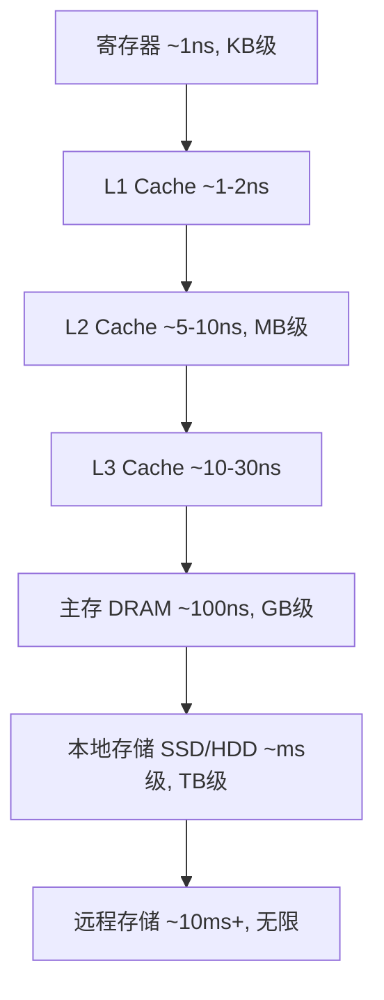

# 存储层次与 Cache

「内存为什么比硬盘快」「Cache 命中率为何重要」——这些问题的答案都在存储层次里。本篇用「局部性」一条主线，串起从寄存器到远程存储的全部速度差异。

## 学习目标

学完本章，你应该能够：

- 描述存储层次金字塔及各层的速度/容量/成本权衡。
- 解释时间局部性与空间局部性，并说明它为何是 Cache 有效的根基。
- 区分直接映射、全相联、组相联三种 Cache 组织方式及其冲突缺失差异。
- 说清写直达/写回、写分配/写不分配，以及 LRU 等替换策略。

## 前置知识

- CPU 如何取指执行：[指令与 CPU](../指令与CPU)
- 数据如何在底层编码：[数据表示与运算器](../数据表示与运算器)

## 核心概念

存储系统设计的核心矛盾是：**快的内存太小太贵，大内存太慢**。解决之道是层次化——把少量极快存储放在靠近 CPU 处，用「程序大多只反复访问一小块数据」的规律（局部性）让它「看起来」又快又大。

本章主线：
- 先建立存储层次的金字塔与局部性原理
- 再看 Cache 如何把局部性变成命中率
- 然后比较三种映射方式
- 最后落到写策略和替换算法

## 1. 存储层次与局部性

- **时间局部性**：刚访问过的数据很可能再被访问（循环变量、栈帧）。
- **空间局部性**：访问某地址后，其邻近地址很可能被访问（数组遍历、指令顺序执行）。

只要这两类局部性成立，把最近/邻近数据塞进上层高速存储，绝大多数访问就能在上层命中，平均访问时间趋近于最快那层。

## 2. Cache 映射方式

主存被切成固定大小的**块（block/cache line，常见 64 字节）**，Cache 由若干**行（line）**组成。地址被划分为「标记 | 组索引 | 块内偏移」三段。三种映射：

| 方式 | 主存块可放位置 | 优点 | 缺点 |
| :--- | :--- | :--- | :--- |
| 直接映射 | 唯一固定行 | 查找最快、电路简单 | 冲突缺失多（多个块争同一行） |
| 全相联 | 任意行 | 冲突缺失最少 | 查找需比对所有行，硬件贵 |
| 组相联 | 所属组内的任意行 | 冲突与成本折中（如 8 路组相联） | 最常用 |

## 3. 写策略与替换策略

- **写命中**：写直达（write-through，同时写 Cache 和主存，简单但带宽高）vs 写回（write-back，只写 Cache，换出脏行时才写主存，省带宽但需脏位）。
- **写分配**：写缺失时先把块调入 Cache 再写（利于空间局部性）；写不分配则直接写主存。
- **替换**（仅相联映射需要）：LRU（最近最少使用，最贴近局部性但需维护访问序）、随机、FIFO。

平均访存时间 `AMAT = 命中时间 + 缺失率 × 缺失代价`。提升任一项（更快命中、更低缺失率、更小缺失代价）都能加速。

## 示例

**直接映射地址划分**（假设 Cache 共 1KB、4 字节/行 ⇒ 256 行；主存按 4 字节块）：
- 块内偏移：2 位（4 字节）
- 组索引：8 位（256 行 ⇒ `log2(256)=8`）
- 标记：剩余高位

地址 `0x1234`（二进制 `... 0001 0010 0011 0100`）取出低 10 位 `00 0011 0100`：偏移 `00`、索引 `00001101`（即 13 行）、其余为标记。该主存块只能放进第 13 行——若另一个标记不同的块也映射到 13 行，就会**冲突缺失**。

**命中率影响 AMAT**：命中时间 1ns、缺失代价 100ns。命中率 95% 时 `AMAT = 1 + 0.05×100 = 6ns`；命中率 99% 时 `AMAT = 1 + 0.01×100 = 2ns`——命中率涨 4 个百分点，平均访存快 3 倍。

## 小结

存储层次用「金字塔 + 局部性」把速度、容量、成本三者调和：上层用最快最小的存储承接绝大多数访问，下层作容量兜底。Cache 的有效性完全依赖时间/空间局部性；组相联与写回/写分配等设计，都是在「命中率、硬件成本、带宽」之间做工程折中。它是 [指令与 CPU](/docs/计算机科学基础/组成原理/指令与CPU) 中「访存成为瓶颈」时的关键加速器，也直接决定了程序实际跑多快。

## 易错点

- **Cache 容量远小于主存**：它是主存的子集与副本，不是独立存储；断电/失效时数据以主存为准。
- **直接映射的冲突缺失**：不是 Cache 满了才缺失——多个主存块映射到同一行就会互相挤掉，循环访问交替地址时尤其明显。
- **写回法的脏位**：只改 Cache 不写主存，若忘记在换出时回写脏行，数据就丢了；这是一致性 bug 的高发点。
- **命中率提升的非线性**：从 90% 提到 95% 与从 99% 提到 99.9%，对 AMAT 的边际改善量级不同，优化要先看瓶颈在哪一层。

## 练习

1. 给定 8KB Cache、64 字节/行、直接映射，主存地址 `0xABCD` 会映射到哪一行？标记、索引、偏移各几位？
2. 写直达和写回在「多核共享内存」场景下分别会带来什么一致性挑战？
3. 为什么数组按行优先遍历（C 语言）比按列遍历快？用空间局部性解释。

## 延伸阅读

- 下一篇：[总线](../总线)
- 回到分支总览：[计算机科学基础](../../)
- 与之互补：[指令与 CPU](../指令与CPU)（流水线如何被 Cache 缺失拖慢）
- 硬件落点：[嵌入式系统概览](../../../嵌入式开发/嵌入式系统概览)

### 外部权威资料
- 《计算机组成与设计：硬件/软件接口》（Patterson & Hennessy）第 5 章——Cache、存储层次与 AMAT 的量化分析（经典「CPI 含访存」讲法）。
- 《深入理解计算机系统》（CSAPP）第 6 章——存储器层次结构，含矩阵遍历的局部性实测实验。
- 《Computer Architecture: A Quantitative Approach》（Hennessy & Patterson）— 组相联、替换策略与缺失分类（强制/容量/冲突）的权威基准。
