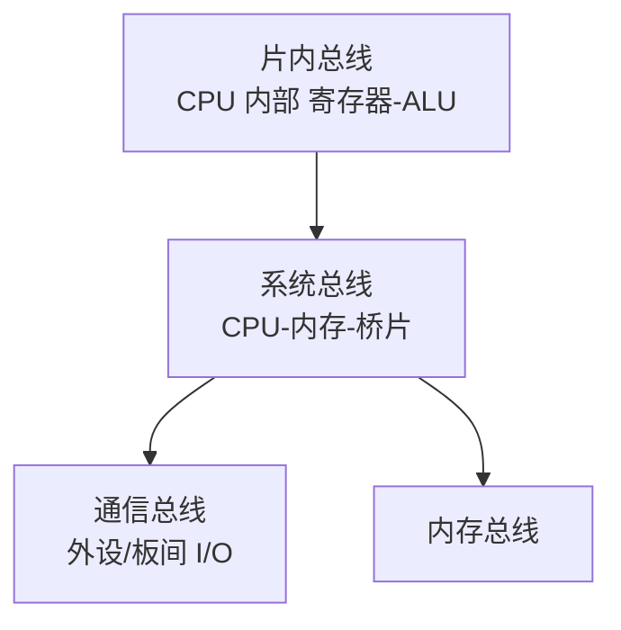

# 总线

CPU、内存、外设不能各自拉一堆私线互连——那样线数爆炸、无法扩展。总线就是一条**被多个部件分时共享的通信通路**。本篇讲清它如何分类、如何仲裁、如何传数。

## 学习目标

学完本章，你应该能够：

- 区分片内总线、系统总线、通信总线，并说清系统总线的数据/地址/控制三组信号。
- 解释同步总线与异步总线的差异及各自适用场景。
- 描述集中式仲裁（链式、计数器、独立请求）与分布式仲裁的思路。
- 用「频率 × 数据宽度 × 通道数」计算总线带宽，并理解它和吞吐量的区别。

## 前置知识

- 数据如何在底层流动：[数据表示与运算器](../数据表示与运算器)
- 与之配合的访存层：[存储层次与 Cache](../存储层次与Cache)

## 核心概念

总线的本质是**用「共享 + 分时」换「可扩展 + 低成本」**：任何时刻只允许一对设备通信（总线主权归属当前主设备），其余设备监听或等待。代价是带宽被所有设备瓜分，且需要仲裁机制决定「谁先用」。

本章主线：
- 先按作用域给总线分类
- 再看系统总线的三组信号怎么配合
- 然后讲同步/异步两种握手
- 最后落到仲裁与带宽计算

## 1. 总线的分类



- **片内总线**：CPU 内部各部件之间（如寄存器堆到 ALU）。
- **系统总线**：连接 CPU、内存、桥片，进一步分**数据总线**（传数据，双向）、**地址总线**（传地址，单向，宽度决定可寻址空间）、**控制总线**（读/写/中断/时钟等）。
- **通信总线（I/O 总线）**：连接外部设备，如 PCIe、USB、SATA。

## 2. 同步与异步

- **同步总线**：用统一时钟节拍推动事务，所有信号在时钟边沿采样。简单、速度快，但线路长时**时钟偏移**会让远端点采错，故适合板内短距。
- **异步总线**：用「请求/应答」握手信号协同，不依赖全局时钟，适应不同速度设备混接，但协议开销更大。

## 3. 总线仲裁

当多个主设备同时想用总线，需仲裁选出唯一得主：

| 方式 | 思路 | 优点 | 缺点 |
| :--- | :--- | :--- | :--- |
| 链式查询 | 许可信号沿设备串行走，近者优先 | 线少、易扩展 | 优先级固定、故障敏感 |
| 计数器定时 | 轮询计数器轮流授权 | 优先级可公平轮转 | 稍复杂 |
| 独立请求 | 每个设备一条请求/授权线，集中判优 | 响应快、可灵活设优先级 | 线数随设备数线性增长 |

## 4. 总线事务与带宽

一次总线事务通常分四步：**仲裁获得主权 → 主设备发地址与命令 → 数据传输（可能多拍）→ 结束释放总线**。带宽估算：

```text
总线带宽 = 工作频率 × 每周期传输字节数 × 通道数
例：PCIe 4.0 x16，每通道 16 GT/s、128b/130b 编码、每符号 1 字节有效：
  单向 ≈ 16 GT/s × (128/130) × 16 ≈ 31.5 GB/s，双向翻倍
```

## 示例

**地址总线决定寻址空间**：32 位地址总线可寻址 `2^32 = 4 GB` 内存空间；若扩展到 36 位（PAE），则可寻址 64 GB。这就是为什么「地址线宽度」直接限制「最多能装多少内存」。

**带宽 vs 吞吐量**：一条 8 GB/s 的总线，因仲裁开销、间隙与协议头，实际有效吞吐量可能只有 6 GB/s。带宽是「理论管道截面」，吞吐量是「实际流过的水」——瓶颈常在协议与竞争，而非线速。

## 小结

总线用「共享 + 仲裁 + 分时」解决了多部件互连的扩展性问题：系统总线靠数据/地址/控制三组信号协同完成一次次事务，同步/异步握手适配不同速度与距离，仲裁机制在多个争用者中分配主权。它是 [存储层次与 Cache](/docs/计算机科学基础/组成原理/存储层次与Cache) 与 CPU 之间、以及 [输入输出系统](/docs/计算机科学基础/组成原理/输入输出系统) 与外设之间的物理通道——理解它的带宽与竞争，才能理解系统整体为什么会被「某个部件卡住」。

## 易错点

- **带宽 ≠ 吞吐量**：理论带宽常被仲裁间隙、协议开销、竞争等待吃掉一截，实测有效带宽更低。
- **地址总线宽度限制可寻址空间**：不是「内存插槽多大就能认多大」，还受地址线位数与芯片组限制。
- **同步总线的时钟偏移**：板内短距才稳，长距离必须用异步握手或重定时器，否则采样错位。
- **仲裁优先级固化**：链式查询里靠前的设备永远优先，若它长期霸占总线，后端设备会饿死——需要公平策略或上限。

## 练习

1. 32 位地址总线的最大可寻址空间是多少？若想支持 8 GB 内存但只有 32 位地址，有什么补救机制（提示：PAE）？
2. 同步总线与异步总线各适合什么场景？为什么片间长距离多用异步或重定时？
3. 链式查询仲裁为什么会让远端设备「饿死」？给出两种改进思路。

## 延伸阅读

- 下一篇：[输入输出系统](../输入输出系统)
- 回到分支总览：[计算机科学基础](../../)
- 访存通道：[存储层次与 Cache](../存储层次与Cache)
- 硬件落点：[嵌入式系统概览](../../../嵌入式开发/嵌入式系统概览)

### 外部权威资料
- 《计算机组成与设计：硬件/软件接口》（Patterson & Hennessy）第 6 章——I/O 与总线、中断、DMA 的系统级视角。
- 《深入理解计算机系统》（CSAPP）第 6.2 节与第 8 章——存储器层次与异常/中断控制流的硬件基础。
- PCI-SIG 发布的 PCI Express 规范——现代高速串行总线（GT/s、通道、编码）的权威来源。
