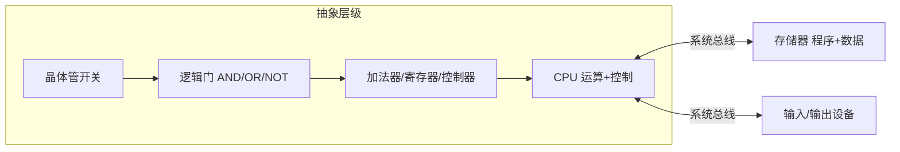

# 数字逻辑与冯·诺依曼体系

计算机底层是用电信号表示 0/1，再层层抽象成我们能用的机器。本篇从门电路讲到冯·诺依曼架构。

## 学习目标

学完本章，你应该能够：

- 说清与/或/非/异或门的真值，以及它们如何由晶体管构成。
- 理解二进制如何编码整数、字符与定点小数。
- 描述冯诺依曼体系五大部件与「存储程序」思想。
- 建立从门电路到 CPU 的抽象层级观念。

## 前置知识

在阅读下面的内容前，建议先掌握：

- 高中数学的逻辑基础（与、或、非）即可。
- 知道计算机用电信号表示信息。
- 若有 [C 语言基础](/docs/编程语言/C/0基础语法) 经验，更能体会「高级代码如何落到 0/1」。

## 核心概念

整个计算机的硬件底座可以一路向下拆：程序和数据最终都是 0/1；0/1 由高低电平表示；高低电平由晶体管开关控制；把晶体管按规则连成与/或/非门，就能做逻辑判断；再把门电路组合成加法器、寄存器、控制器，就堆出了 CPU。冯诺依曼体系的关键洞察是「指令也是数据」——把程序也存进内存，机器就能自己一条条取出来执行，这才有了「通用计算机」。

本章主线：
- 从晶体管到逻辑门，看清「计算」的物理基础
- 再用二进制编码统一表示一切信息
- 最后用冯诺依曼体系串起五大部件

冯诺依曼体系用一条系统总线把「运算+控制（CPU）」「存储器」「输入/输出」连成整体；而 CPU 本身又是从晶体管一路抽象上来的：



## 1. 从晶体管到逻辑门

- 晶体管像电子开关，构成**与（AND）、或（OR）、非（NOT）**等基本逻辑门。
- 组合这些门可实现任意布尔函数，例如异或、加法器。

半加器（一位加法）：

| A | B | 和 S | 进位 C |
|---|---|------|--------|
| 0 | 0 | 0 | 0 |
| 0 | 1 | 1 | 0 |
| 1 | 0 | 1 | 0 |
| 1 | 1 | 0 | 1 |

## 2. 二进制与编码

- 一切数据最终是二进制位（bit）。
- 整数用补码表示（统一加减法、零只有一种表示）；
- 字符用 ASCII / UTF-8 编码；
- 浮点用 IEEE 754。

## 3. 冯·诺依曼体系

现代计算机几乎都遵循冯·诺依曼结构：

```text
        +--------+       +---------+
        |  存储器 | <---> |   CPU   |
        +--------+       +---------+
            ^                |
            |                v
        +--------+       +---------+
        |  输入   |       |  输出   |
        +--------+       +---------+
```

- **存储程序**：指令和数据放在同一内存，CPU 取指令执行。
- 五大部件：运算器、控制器、存储器、输入、输出。

## 4. 抽象层

理解计算机关键是"分层隐藏复杂度"：

```text
高级语言 → 汇编 → 机器码 → 微指令 → 逻辑门 → 晶体管 → 硅
```

每一层只关心相邻层接口，不用知道下层如何实现。

## 5. 为什么重要

- 懂"补码"才能理解整数溢出；
- 懂"存储程序"才明白为什么指令也是数据、可被修改；
- 懂"抽象层"才不会在写业务代码时试图脑补到电路。

> 下一站：[指令与 CPU](../指令与CPU)。

## 示例

**补码编码**（8 位，理解整数溢出）：`-5` 的表示 = `2^8 - 5 = 251 = 0xFB`，`0xFB` 最高位为 1 表示负数。验证：`0xFB + 5 = 0x100 = 256`，截断 8 位得 `0x00`，即 `-5 + 5 = 0`。两个正数相加若溢出到第 8 位（符号位翻转），结果符号突变——这就是整数溢出。

**半加器**（与页中真值表对应，用代码复现一位加法）：

```python
def half_adder(a, b):
    s = a ^ b          # 和：异或
    c = a & b          # 进位：与
    return s, c

for a in (0, 1):
    for b in (0, 1):
        print(f"{a}+{b} -> S={half_adder(a,b)[0]} C={half_adder(a,b)[1]}")
```

把多个半加器/全加器级联，就得到 CPU 里的加法器——门电路到运算器的桥梁。

## 小结

数字逻辑把物理世界的高低电平变成确定性的 0/1 运算，二进制编码让数字、字符、指令共用同一套表示，冯诺依曼体系则把「程序存进内存、自动取指执行」落为现实。它是 [指令与 CPU](/docs/计算机科学基础/组成原理/指令与CPU) 的前置底座，也是一切软件最终要落脚的硬件事实。

## 易错点

- **补码不是"取反加一"那么简单**：理解它是为了让加减法统一用同一套电路，且零只有一种表示。
- **存储程序 ≠ 数据/程序分离**：指令也在内存里，所以代码可被修改（自修改代码、JIT 都基于此）。
- **抽象层是单向依赖**：写业务代码不必脑补到电路，但排错时要知道边界在哪。

## 练习

1. 用半加器/全加器思路，画出两位二进制加法 `10 + 01` 的进位链。
2. 为什么浮点数 `0.1 + 0.2 != 0.3`？从 IEEE 754 编码角度解释。

## 延伸阅读

- 下一篇：[指令与 CPU](../指令与CPU)
- 回到分支总览：[计算机科学基础](../../)
- 动手贴近硬件：[C 语言入门](../../../编程语言/C/0基础语法)
- 硬件落点：[嵌入式系统概览](../../../嵌入式开发/嵌入式系统概览)

### 外部权威资料
- 《计算机组成与设计：硬件/软件接口》（Patterson & Hennessy）第 5 版 — MIPS 流水线、Cache 与存储层次的权威教材（量化方法）。
- 《深入理解计算机系统》（CSAPP）第 1 章（信息表示/二进制）与第 4 章（处理器体系结构：流水线）。
- 《Code：隐匿在计算机软硬件背后的语言》（Charles Petzold）— 从继电器、逻辑门一路讲到 CPU 的直觉启蒙书。
