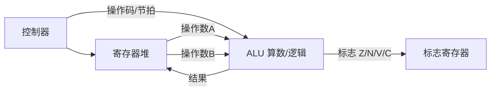

# 数据表示与运算器

程序里的每一个数字，最终都要落到寄存器里的 0/1；每一次加减乘除，都是运算器里电信号的翻转。本篇先把「数怎么编码」讲清，再串起「运算器怎么算」。

## 学习目标

学完本章，你应该能够：

- 说清原码、反码、补码、移码的表示与用途，尤其是补码为何成为整数运算的事实标准。
- 用补码完成带符号加减，并用双符号位或进位规则判断溢出。
- 看懂 IEEE 754 单/双精度浮点的「符号-阶码-尾数」三段结构，理解精度损失从何而来。
- 描述运算器基本数据通路：ALU、寄存器堆、标志位、内外总线如何配合完成一条运算指令。

## 前置知识

- 二进制与逻辑门基础：[数字逻辑与冯·诺依曼体系](../数字逻辑与冯诺依曼)
- 后续会用到本篇的编码知识：[指令与 CPU](../指令与CPU)

## 核心概念

任何数据表示都要在「表示范围」「硬件成本」「运算是否简单」之间权衡。现代机器统一选择**补码表示整数、IEEE 754 表示浮点**，就是因为这套方案让加减法电路最统一、溢出最易检测。

本章主线：
- 先用四种编码统一整数表示，重点落在补码
- 再用补码把加减法归一成「加法 + 溢出判断」
- 然后跳出整数，看浮点如何兼顾大动态范围
- 最后把「数」接到「算」——运算器的数据通路

## 1. 整数的四种编码

设机器字长 n 位，最高位为符号位（0 正 1 负）：

| 编码 | 正数 | 负数（以 +5 / −5，n=8 为例） | 特点 |
| :--- | :--- | :--- | :--- |
| 原码 | `00000101` | `10000101` | 直观，但零有 `+0`/`−0` 两种，加减要判符号 |
| 反码 | `00000101` | `11111010` | 负数 = 正数按位取反；零仍有两种 |
| 补码 | `00000101` | `11111011` | 负数 = 反码 + 1；零唯一，加减统一 |
| 移码 | `10000101` | `01111011` | 给真值加偏置 `2^(n-1)`，用于浮点阶码比较 |

补码的关键性质：**`[−x]补` 可由 `[x]补` 连同符号位一起取反加一得到**；补码表示范围是 `[−2^(n-1), 2^(n-1)−1]`，比正数多表示一个最小负数（如 8 位能表示 −128 但不能表示 +128）。

## 2. 补码加减与溢出

补码下，`A − B` 直接变成 `A + (−B补)`，无需减法器。难点在**溢出**：结果超出了字长能表示的范围，符号位被"挤"错。

两种等价判法：
- **双符号位法**：用两位符号位参与运算，结果 `01` 为正溢、`10` 为负溢、`11`/`00` 正常（最高符号位为真正符号）。
- **进位法**：若「最高数值位进位」与「符号位进位」**不同**，则溢出。

```text
  0111 (+7)
+ 0011 (+3)
--------
  1010 (−6)  ← 两个正数相加得负数，正溢！符号位进位=0，数值位进位=1，相异 ⇒ 溢出
```

## 3. IEEE 754 浮点数

浮点用「科学计数法」表示：`V = (−1)^S × (1 + 尾数) × 2^(阶码−偏置)`。单精度（32 位）布局：

| 段 | 符号 S | 阶码 E（8 位） | 尾数 M（23 位） |
| :--- | :--- | :--- | :--- |
| 位 | 31 | 30..23 | 22..0 |

- 阶码用**移码**（偏置 127），真正指数 `e = E − 127`。
- 尾数隐含最高位 `1.`（规格化数），故实际精度 24 位。
- 特殊值：阶码全 0 且尾数 0 ⇒ ±0；阶码全 1 且尾数 0 ⇒ ±∞；阶码全 1 且尾数非 0 ⇒ NaN。

精度损失的根因：十进制小数（如 0.1）在二进制下是无限循环小数，只能截断存储——这就是 `0.1 + 0.2 != 0.3` 的硬件真相。

## 4. 运算器数据通路

运算器的核心是 **ALU（算术逻辑单元）**：它接收两个操作数和一个「操作码」，输出结果和一组**标志位**（零标志 Z、符号标志 N、溢出标志 V、进位标志 C）。寄存器堆暂存操作数与中间结果，内部总线在节拍控制下把数据在寄存器、ALU、存储器之间搬移。



加法器是 ALU 的底座：n 位**行波进位加法器**由 n 个全加器串联，进位从低位一级级传到高位（慢）；**超前进位加法器**用逻辑并行算进位，速度更快但电路更复杂。

## 示例

**IEEE 754 单精度编码** `13.25`：
1. 拆整数与小数：`13 = 1101b`，`0.25 = 0.01b` ⇒ `13.25 = 1101.01b`。
2. 规格化：`1101.01 = 1.10101 × 2^3`，故尾数小数部分 = `10101000000000000000000`（补满 23 位），符号 S = 0。
3. 阶码：`E = 3 + 127 = 130 = 10000010b`。
4. 拼装：`0 | 10000010 | 10101000000000000000000`。验证：阶码 130 − 127 = 3，尾数 `1.10101b = 1.65625`，`1.65625 × 8 = 13.25` ✓。

**补码加减溢出判断**：`−5 + (−4)`（8 位）
`[−5]补 = 11111011`，`[−4]补 = 11111100`，相加得 `11110111`（忽略进位）= `[−9]补`，正确。符号位进位与数值位进位同为 1，无溢出。

## 小结

补码用「取反加一 + 统一加减」换来了最简单的运算电路，并让零唯一、溢出易判；IEEE 754 用「符号-阶码-尾数」三段在有限位宽内兼顾巨大动态范围，代价是二进制有限小数被截断带来的精度误差。运算器把这些被编码的数，通过 ALU、寄存器堆与标志位组成的数据通路真正算出来——它是 [指令与 CPU](/docs/计算机科学基础/组成原理/指令与CPU) 里每条算术指令落地的硬件场所。

## 易错点

- **补码范围不对称**：n 位补码能表示 `−2^(n-1)` 但不能表示 `+2^(n-1)`，多出来的那个负数（最小负）没有对应正数，别想当然写成对称区间。
- **溢出 ≠ 进位**：无符号加法看进位（Carry），有符号补码加法看溢出（Overflow）；两个正数相加也可能溢出成负数，两个负数相加也可能溢出成正数。
- **浮点 `==` 比较危险**：`0.1 + 0.2 == 0.3` 在绝大多数语言里为假，业务里应比较「差值绝对值小于 eps」而非直接相等。
- **阶码下溢/上溢**：指数太小会刷新为 0（非规格化/下溢到 0），太大变 ∞，这都是「表示范围有限」的边界，不是 bug。

## 练习

1. 用 8 位补码分别计算 `+5 + (+7)` 与 `−5 + (−4)`，并分别判断是否有溢出。
2. 把 `−0.75` 按 IEEE 754 单精度编码（写出三段二进制）。
3. 为什么补码的零只有一种表示，而原码/反码有两种？这给加减法电路带来了什么简化？

## 延伸阅读

- 下一篇：[指令与 CPU](../指令与CPU)
- 回到分支总览：[计算机科学基础](../../)
- 编码底座：[数字逻辑与冯·诺依曼体系](../数字逻辑与冯诺依曼)
- 硬件落点：[嵌入式系统概览](../../../嵌入式开发/嵌入式系统概览)

### 外部权威资料
- 《计算机组成与设计：硬件/软件接口》（Patterson & Hennessy）第 2–3 章——补码、ALU、数据通路与流水线的量化讲法。
- 《深入理解计算机系统》（CSAPP）第 2 章——信息表示、补码与 IEEE 754 的位级细节，含大量可动手验证的习题。
- IEEE 754-2019 标准——浮点表示的权威规范（符号/阶码/尾数、舍入模式、NaN 语义）。
