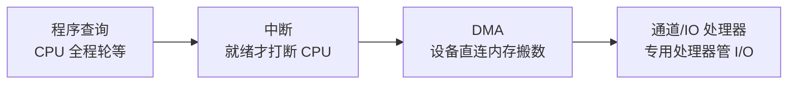

# 输入输出系统

CPU 算得再快，数据进不来出不去也毫无意义。本篇讲清 I/O 的四种控制方式，重点区分**中断**与 **DMA**——它们决定了 CPU 在外设慢速世界里的「等待成本」。

## 学习目标

学完本章，你应该能够：

- 对比程序查询（轮询）、中断、DMA、通道四种 I/O 控制方式的 CPU 占用差异。
- 描述一次中断的完整流程：请求 → 响应 → 判优 → 处理 → 返回，以及向量中断与嵌套。
- 解释 DMA 如何「接管总线」直接在设备与内存间搬数，仅在结束时用一次中断通知 CPU。
- 说清中断优先级、嵌套与关中断对响应延迟的影响。

## 前置知识

- 部件间如何传数：[总线](../总线)
- 数据通路基础：[数据表示与运算器](../数据表示与运算器)

## 核心概念

外设速度比 CPU 慢几个数量级。若让 CPU 亲自等外设，算力被白白浪费。I/O 控制方式的演进，本质就是**把「等」和「搬」这两件事逐步从 CPU 身上剥离**：



本章主线：
- 先给出四种方式的对比框架
- 再展开中断全流程（最易考也最实用）
- 然后讲 DMA 如何解放 CPU
- 最后落到优先级与嵌套等工程细节

## 1. 四种 I/O 控制方式

| 方式 | CPU 角色 | 优点 | 缺点 | 适用 |
| :--- | :--- | :--- | :--- | :--- |
| 程序查询 | 不停轮询状态位 | 最简单 | CPU 全被占用、浪费 | 极慢/简单设备 |
| 中断 | 先干别的，就绪被「打断」 | 不空等，CPU 利用率高 | 有上下文切换开销 | 中低速、偶发 |
| DMA | 设备经 DMA 控制器直接搬内存 | CPU 几乎不参搬数 | 需额外硬件、占总线 | 高速大块（磁盘/网卡） |
| 通道 | 专用 I/O 处理器执行通道程序 | I/O 完全独立 | 硬件最复杂 | 大型机/多设备 |

## 2. 中断全流程

1. **请求**：设备置「中断请求」信号。
2. **响应**：CPU 在一条指令执行完的「中断点」检查请求（若未关中断且优先级够）。
3. **判优**：多个请求同时到达，按优先级硬件仲裁。
4. **处理**：保存现场（PC、寄存器）→ 查**中断向量表**得服务程序入口 → 执行 ISR → 恢复现场 → `IRET` 返回。
5. **嵌套**：高优先级中断可打断低优先级 ISR（需正确开关中断级）。

## 3. DMA 的工作

DMA 控制器（DMAC）从 CPU 处**借走总线主权**，按设定在设备与内存间成块搬运，全程不劳 CPU 逐字节参与；搬完一批才发**一次中断**通知 CPU「活干完了」。这把「每字节一次中断」降为「每批一次中断」。

```text
普通中断 I/O： 设备→CPU(读)→内存  每字节一次上下文切换
DMA：          设备⇄内存（DMAC 直搬）  仅整批结束一次中断通知 CPU
```

## 示例

**中断 vs DMA 的 CPU 占用对比**：从磁盘读 4 KB 数据，假设每字节中断方式需 1 µs 上下文开销：
- 中断方式（按字节）：`4096 × 1µs ≈ 4.1 ms` 全耗在 I/O 上下文上。
- DMA 方式：DMAC 后台搬完 4 KB，仅结束时 1 次中断 ≈ 1 µs 开销；CPU 期间可并行算别的。
差距近千倍——这正是磁盘/网卡必须用 DMA 的原因。

**中断向量**：假设键盘中断向量号 `0x21`，向量表该槽存 `ISR 入口地址 0x80001234`，CPU 响应时 `PC ← 0x80001234`，直接跳进键盘服务程序，无需软件去猜「是谁中断的」。

## 小结

I/O 系统的演进主线是**不断把等待与搬运从 CPU 卸载**：轮询让 CPU 空转，中断用「被打断」换利用率，DMA 用专用控制器在设备与内存间直搬、仅在结束时报一声，通道则把 I/O 管理彻底交给专用处理器。它与 [总线](/docs/计算机科学基础/组成原理/总线) 共同构成 CPU 通往外部世界的通道，也和 [操作系统](/docs/计算机科学基础/操作系统/) 的设备管理模块紧密咬合——中断与 DMA 正是操作系统实现「并发与外设重叠」的硬件基石。

## 易错点

- **DMA 不是「完全不用中断」**：DMA 只免去「每字节中断」，搬完一批仍需一次中断通知 CPU；说「DMA 零中断」是错的。
- **中断响应有延迟**：关中断、更高优先级正占用、指令未执行到中断点，都会推迟响应；实时系统要算清最坏响应时间。
- **优先级反转**：低优先级持锁、中优先级抢占、高优先级等锁，结果高优先级被中优先级卡住——需用优先级继承等协议化解。
- **DMA 与 Cache 一致性**：DMA 直接改内存，若 CPU 的 Cache 还留着旧副本，就会读到脏数据；需要刷 Cache 或用一致性 DMA 缓冲区。

## 练习

1. 为什么高速大块传输（磁盘、网卡）几乎都用 DMA 而非逐字节中断？用 CPU 占用量化说明。
2. 一次完整中断包含哪五个阶段？向量中断相比「软件轮询是谁中断」好在哪？
3. DMA 直写内存后，CPU 的 Cache 可能读到旧值，给出两种解决一致性问题的思路。

## 延伸阅读

- 回到分支总览：[计算机科学基础](../../)
- 配套硬件：[总线](../总线)
- 系统级承接：[操作系统](/docs/计算机科学基础/操作系统/)
- 硬件落点：[嵌入式系统概览](../../../嵌入式开发/嵌入式系统概览)

### 外部权威资料
- 《计算机组成与设计：硬件/软件接口》（Patterson & Hennessy）第 6 章——I/O 性能、中断与 DMA 的量化对比。
- 《深入理解计算机系统》（CSAPP）第 8 章——异常控制流与中断，从硬件信号到操作系统处理的完整链路。
- 《Operating Systems: Three Easy Pieces》— I/O 设备与中断驱动/轮询的工程权衡。
