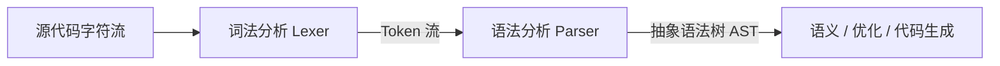

# 词法分析与语法分析

编译器把源代码变成机器码，前两步是**词法分析**与**语法分析**。本篇揭开"代码如何被理解"。

## 学习目标

学完本章，你应该能够：

- 区分词法分析（正则/自动机）与语法分析（文法/推导）。
- 说清 token、终结符、非终结符的含义。
- 理解 AST 为什么比源码更适合后续处理。
- 能用手写递归下降的方式体会语法分析的思路。

## 前置知识

在阅读下面的内容前，建议先掌握：

- 已了解 [编译原理概览](/docs/计算机科学基础/编译原理/编译原理概览) 的整体阶段。
- 用过正则或写过 if/for 等结构化的代码。
- 知道「树」这种数据结构——可参考 [树与二叉树](/docs/计算机科学基础/数据结构与算法/树与二叉树)。

## 核心概念

词法分析是「分词」：把连续字符按规则切成有意义的最小单元 token（如标识符、数字、关键字），通常用正则和有限自动机实现。语法分析是「组句」：根据文法规则把 token 序列组织成一棵抽象语法树（AST），确保结构合法（括号配对、语句完整）。AST 去掉了空格、注释等无关细节，只保留「程序在做什么」的结构，是后续语义检查和代码生成都依赖的骨架。

本章主线：
- 先用词法分析把字符切成 token
- 再用语法分析把 token 拼成 AST
- 最后看 AST 如何支撑后续阶段

词法分析把字符流切成 token，语法分析把 token 拼成 AST，后续阶段都建立在 AST 之上：



## 1. 编译总览

```text
源代码 → 词法 → 语法 → 语义 → 中间代码 → 优化 → 目标代码
```

## 2. 词法分析（Lexer）

把字符流切成一个个**记号（token）**：

```text
输入:  if (x > 0) { ... }
输出:  IF  LPAREN  ID(x)  GT  NUM(0)  RPAREN  LBRACE ...
```

- 用正则/有限自动机识别关键字、标识符、数字、运算符；
- 去掉空白与注释。

## 3. 语法分析（Parser）

根据**文法**把 token 序列构造成**抽象语法树（AST）**：

```text
        if
       /  \
  条件(x>0)  语句块
```

- 文法常用**上下文无关文法（CFG）**描述，如 `Expr → Expr + Term`；
- 自顶向下（LL、递归下降）或自底向上（LR、LALR）构造。

## 4. 文法示例

```text
Stmt  → "if" "(" Expr ")" Stmt
Expr  → Expr ">" Term | Term
Term  → ID | NUM
```

若输入不符合文法 → **语法错误**（如少括号）。

## 5. AST 的价值

语法树去掉了括号、分号等"标点噪音"，只保留结构，是后续语义分析、优化的基础。例如：

```json
{ "type": "If",
  "cond": { "type": "Gt", "left": "x", "right": 0 },
  "body": [ ... ] }
```

## 6. 与开发的关系

- 编辑器高亮/补全 = 在解析 AST；
- 代码格式化（Prettier）= 解析后重新打印 AST；
- 你写的每一行代码，都被编译器这样"读懂"。

> 下一站：[中间代码与优化](../中间代码与优化)。

## 小结

前端第一步把字符流切成 token（词法，靠正则与自动机），第二步把 token 拼成 AST（语法，靠文法与推导），AST 去掉噪音、保留结构，成为语义分析与 [中间代码生成](/docs/计算机科学基础/编译原理/中间代码与优化) 的共同输入。它与 [编译原理概览](/docs/计算机科学基础/编译原理/编译原理概览) 衔接，向下服务于 [指令与 CPU](/docs/计算机科学基础/组成原理/指令与CPU)。

## 易错点

- **词法错误 ≠ 语法错误**：拼错关键字是词法层，少括号是语法层；报错位置与层级不同。
- **AST 丢掉的是"标点噪音"而非语义**：括号、分号不在树里，但结构与优先级都保留了。
- **文法描述能力有限**：正则（词法）无法匹配"成对括号"这类需要计数的结构，必须靠 CFG（语法层）。

## 练习

1. 写出 `while (i < 10) i = i + 1;` 的词法 token 序列。
2. 用给出的 CFG 推导 `if (x > 0) y = x * 2;`，画出其 AST。

## 延伸阅读

- 下一篇：[中间代码与优化](../中间代码与优化)
- 回到分支总览：[计算机科学基础](../../)
- 相关：[数据结构与算法：二叉树与 BST](../../数据结构与算法/树与二叉树)（AST 本质是树）
- 动手：[Python 入门](../../../编程语言/Python/0基础语法)

### 外部权威资料
- 《编译原理》（Alfred V. Aho 等，『龙书』）第 2 版 — 词法/语法/语义分析、中间代码与代码生成的权威。
- 《现代编译原理》（Andrew W. Appel 等，『虎书』）— 实践导向，配套 MiniJava 与现代 IR 设计。
- 《Engineering a Compiler》（Keith D. Cooper & Linda Torczon）— 侧重现代优化技术与数据流分析。
