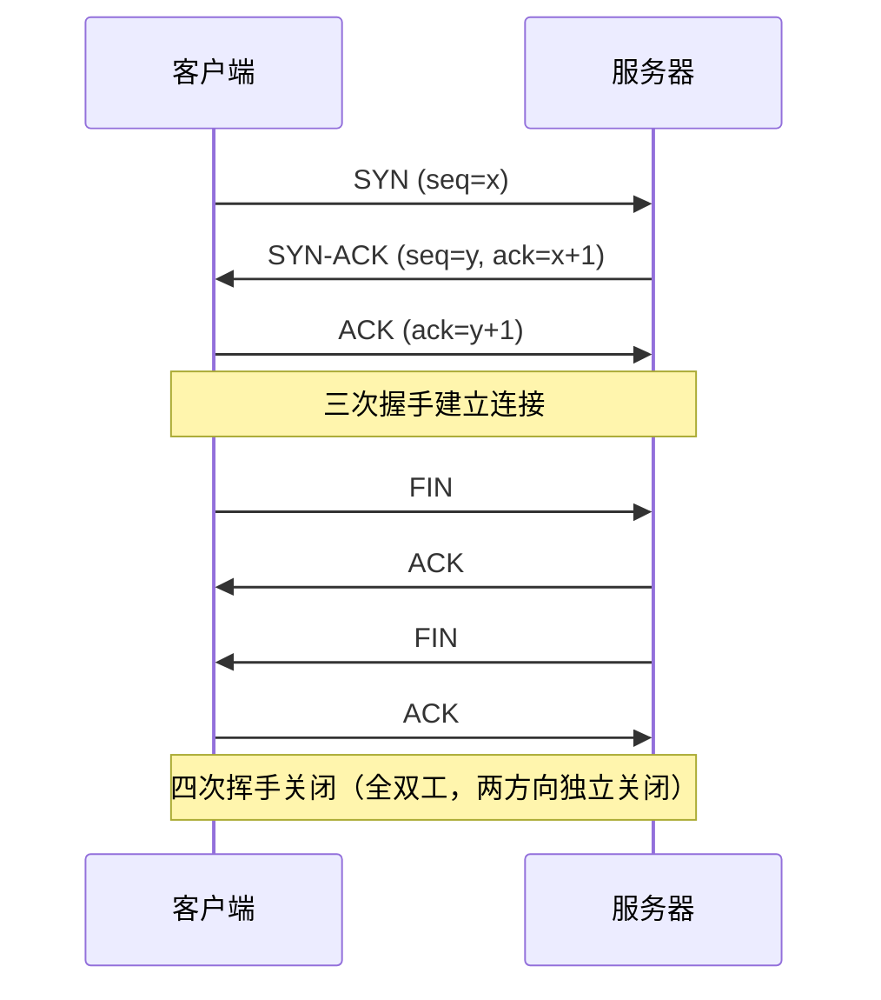

# 传输层与拥塞控制

网络层只把包送到「主机」，传输层才把它送到「主机里的某个进程」（靠端口），并决定「要不要用 TCP 把数据保证送达」。本篇聚焦 TCP 的可靠与拥塞机制——这是网络最容易考深、也最影响真实性能的地方。

## 学习目标

学完本章，你应该能够：

- 对比 UDP 与 TCP 的设计取舍，并说出各自适合什么场景。
- 描述 TCP 可靠传输的基石：序号、确认、超时重传、滑动窗口。
- 画出三次握手与四次挥手，并解释为什么握手是三次、挥手是四次。
- 区分**流量控制**（接收方能力）与**拥塞控制**（网络容量），说清慢启动、拥塞避免与 AIMD。

## 前置知识

- 主机到主机交付：[网络层与路由](../网络层与路由)
- 分层与套接字总览：[网络分层与 TCP/IP](../网络分层与TCP与IP)

## 核心概念

传输层在「不可靠的网络层」之上，按应用需要选择**不可靠但极快（UDP）**或**可靠但复杂（TCP）**。TCP 的可靠性不是网络层给的，而是靠「确认 + 重传 + 窗口」在端到端自己织出来的；拥塞控制则是为了避免一股脑发数据把网络冲垮。

本章主线：
- 先对比 UDP/TCP 两个端点
- 再看 TCP 如何用序号/确认实现可靠
- 然后展开连接管理（握手/挥手）
- 最后区分流量控制与拥塞控制

## 1. UDP 与 TCP 的取舍

| | UDP | TCP |
| :--- | :--- | :--- |
| 连接 | 无连接 | 面向连接（三次握手建连） |
| 可靠 | 尽力交付，不保证 | 序号/确认/重传保证 |
| 顺序 | 不保证 | 按序号重组 |
| 首部 | 8 字节，极小 | 20+ 字节 |
| 适用 | 实时音视频、DNS、游戏 | 网页、文件、数据库 |

## 2. 可靠传输机制

TCP 把字节流编号，接收方对「连续收到的最大序号」发**累计确认**，发送方维护**滑动窗口**只重传窗口内未确认段。ARQ 演进：停等（信道利用率低）→ 回退 N 帧 GBN（出错重传其后全部）→ 选择重传 SR（只重传出错的）。TCP 实际是 GBN 与 SR 的混合。

## 3. 连接管理

- **三次握手**：防「旧连接请求报文」让服务器空开连接；双方各确认一次对方的收发能力。
- **四次挥手**：TCP 全双工，关闭要两个方向各自 FIN/ACK；被动方可能还有数据要发，故 ACK 与 FIN 分开。

## 4. 流量控制 vs 拥塞控制

- **流量控制**：用**接收窗口（rwnd）**告诉发送方「我还能收多少」，防止压垮接收方。
- **拥塞控制**：用**拥塞窗口（cwnd）**探测「网络还能扛多少」，防止压垮网络。实际发送窗口 = `min(rwnd, cwnd)`。

拥塞控制四步：
1. **慢启动**：cwnd 从 1 个 MSS 起，每收到一个 ACK 翻倍（指数增长），直到阈值（ssthresh）。
2. **拥塞避免**：超过 ssthresh 后每 RTT 线性 +1（加法增大）。
3. **快重传**：收到 3 个重复 ACK 立即重传，不等超时。
4. **快恢复**：ssthresh 降为 cwnd 一半，cwnd 从该值线性增长（AIMD：加性增、乘性减）。

## 示例

**慢启动的指数增长**：初始 `cwnd=1 MSS`，第 1 个 RTT 后变 2，第 2 个变 4，第 3 个变 8……10 个 RTT 后已达 1024 MSS。若 ssthresh=16，则前 4 个 RTT 指数涨到 16，之后转入拥塞避免线性涨。这解释了「TCP 连接刚建立时吞吐爬升慢」——正是慢启动在起作用。

**累计确认下的重传**：发送方窗口内有段 5、6、7，若只丢了 6，接收方持续对 5 回确认「期望 6」，收到 3 个重复 ACK 触发快重传只补 6，7 不受影响——这就是选择重传思想带来的效率。

## 小结

传输层用端口把数据送到正确进程，并用 UDP/TCP 两套范式覆盖「快」与「可靠」两端。TCP 的可靠来自序号、确认与滑动窗口，连接靠三次握手/四次挥手管理，性能与安全来自**流量控制（rwnd）**与**拥塞控制（cwnd，慢启动+AIMD）**的协同——它既不让接收方被压垮，也不让网络被冲垮。它向下立在 [网络层与路由](/docs/计算机科学基础/计算机网络/网络层与路由) 之上，向上支撑 [应用层协议](/docs/计算机科学基础/计算机网络/应用层协议) 与 [HTTP 与网络安全](/docs/计算机科学基础/计算机网络/HTTP与网络安全) 的端到端会话。

## 易错点

- **流量控制 ≠ 拥塞控制**：前者防接收方溢出（rwnd），后者防网络过载（cwnd）；两者取小才是实际发送窗口。
- **握手三次、挥手四次**：握手双方各确认一次即可合并；挥手因全双工、被动方可能还有数据，ACK 与 FIN 不能合并。
- **TIME_WAIT 必要**：主动关闭方保留 2MSL，确保最后 ACK 到达且旧报文消散，不宜为省资源强行跳过。
- **UDP 也有校验和**：虽默认可选，但开了能检错；它「不可靠」指不重传、不保序，而非「必然出错」。

## 练习

1. 为什么视频通话多用 UDP 而不是 TCP？如果用 TCP 会带来什么具体体验问题？
2. 三次握手如果不防「旧 SYN」，可能造成什么后果？四次挥手中为什么 ACK 和 FIN 通常不能合并？
3. 拥塞控制的慢启动阶段 cwnd 从第 1 个 RTT 的 1 MSS 起，经过 5 个 RTT 后是多少？ssthresh 的作用是什么？

## 延伸阅读

- 下一篇：[应用层协议](../应用层协议)
- 底座：[网络层与路由](../网络层与路由)
- 安全收尾：[HTTP 与网络安全](../HTTP与网络安全)
- 总览：[网络分层与 TCP/IP](../网络分层与TCP与IP)

### 外部权威资料
- 《计算机网络：自顶向下方法》（Kurose & Ross）第 3 章——传输层、UDP/TCP、可靠传输、拥塞控制的经典讲法。
- 《TCP/IP 详解 卷 1》（Stevens）第 17–21 章——TCP 序号、窗口、握手/挥手、拥塞控制的协议级细节。
- RFC 9293（TCP 规范）、RFC 5681（拥塞控制）——权威标准。
