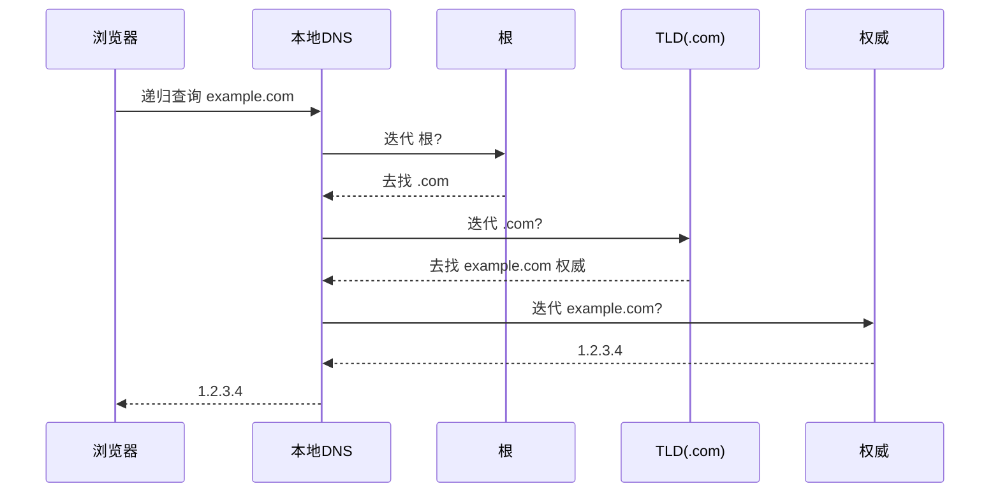

# 应用层协议

应用层是用户真正「摸得到」的一层：浏览器、邮件、文件传输背后都是一套套约定好的协议。本篇走一遍最常用的几个，HTTP/HTTPS 因涉及安全单独成篇，这里只做衔接。

## 学习目标

学完本章，你应该能够：

- 描述 DNS 如何把域名解析成 IP，区分递归查询与迭代查询，以及缓存的作用。
- 说清 DHCP 四步（Discover/Offer/Request/ACK）如何动态分配 IP。
- 对比 SMTP（发）/POP3·IMAP（收）的职责划分，以及它们为何分开。
- 解释 FTP 主动模式与被动模式的端口差异，以及为何被动模式更常见于有防火墙的场景。

## 前置知识

- 端口与端到端会话：[传输层与拥塞控制](../传输层与拥塞控制)
- 寻址底座：[网络层与路由](../网络层与路由)

## 核心概念

应用层协议本质是「进程间对话的规则」：消息格式、时序、语义。它们大多建立在 UDP 或 TCP 之上，采用**客户端/服务器**或 **P2P** 架构。理解它们的关键，是看清「一次用户操作背后，走了哪几跳协议交互」。

本章主线：
- 先解决「名字怎么变成地址」：DNS
- 再看「设备怎么拿到地址」：DHCP
- 然后讲「邮件怎么收发」：SMTP/POP3/IMAP
- 最后看「文件怎么传」：FTP 的两种模式

## 1. DNS：域名系统

DNS 把人类友好的域名（`example.com`）翻译成 IP 地址。查询通常分两段：
- **递归查询**：客户端 → 本地 DNS，本地 DNS 负责替你问到底。
- **迭代查询**：本地 DNS → 根 → TLD（.com）→ 权威服务器，每级只给「下一步去哪」，由本地 DNS 自己追。

各级结果会被**缓存**一段时间（TTL），大幅减轻根/TLD 压力。记录类型：A（IPv4）、AAAA（IPv6）、CNAME（别名）、MX（邮件服务器）。

## 2. DHCP：动态主机配置

主机入网时通过广播完成四步：
1. **Discover**：「谁是 DHCP 服务器？」
2. **Offer**：服务器回「我可以给你 192.168.1.50」
3. **Request**：客户端「我要这个地址」
4. **ACK**：服务器确认，并附带子网掩码、网关、DNS 等

租期到期前需续租，设备离职后地址回收复用。

## 3. 邮件：SMTP / POP3 / IMAP

- **SMTP**：负责「把邮件从发件方推到收件方邮件服务器」（只管投递，端口 25/587）。
- **POP3**：把邮件**下载到本地**并从服务器删除（适合单设备）。
- **IMAP**：邮件**留在服务器**，多设备同步状态（适合手机+电脑）。

发与收职责分离：SMTP 是「推送管道」，POP3/IMAP 是「取件箱」。

## 4. FTP：文件传输

FTP 用**两条连接**：控制连接（命令，端口 21）始终在线，数据连接按需建立。

| 模式 | 数据连接由谁发起 | 端口特点 | 防火墙友好度 |
| :--- | :--- | :--- | :--- |
| 主动（PORT） | 服务器连客户端 | 服务器从 20 连客户端随机端口 | 差（客户端防火墙挡入站） |
| 被动（PASV） | 客户端连服务器 | 服务器开随机端口等客户端 | 好（客户端主动出） |

现代多在 NAT/防火墙后，故**被动模式**更常用。

## 示例

**DNS 解析一次完整链路**：你在浏览器输入 `shop.example.com` → 查本地缓存未命中 → 本地 DNS 递归替你问根（返回 `.com` 服务器）→ 问 TLD（返回 `example.com` 权威）→ 问权威（返回 A 记录 `93.184.216.34`）→ 本地缓存后把 IP 交给浏览器。此后建 TCP 连 `93.184.216.34:443`（见 [HTTP 与网络安全](/docs/计算机科学基础/计算机网络/HTTP与网络安全)）。

**FTP 被动模式握手**：客户端连 `21` 发 `PASV` → 服务器回「请用端口 5021」→ 客户端主动连服务器 `5021` 传数据。全程客户端只「向外发起」，不被服务器反向连，故能穿过绝大多数家庭/企业防火墙。

## 小结

应用层把下层提供的「进程到进程通道」编排成具体服务：DNS 把名字解析成 IP（递归/迭代 + 缓存），DHCP 自动下发地址，SMTP/POP3/IMAP 分工完成邮件推送与收取，FTP 用双连接（主动/被动）传文件。它们都建筑在 [传输层与拥塞控制](/docs/计算机科学基础/计算机网络/传输层与拥塞控制) 的 UDP/TCP 之上，而最显眼的 HTTP/HTTPS 则因安全议题在 [HTTP 与网络安全](/docs/计算机科学基础/计算机网络/HTTP与网络安全) 单独展开——理解这组协议，就看懂了「上网」这件事的每一跳。

## 易错点

- **递归 vs 迭代**：客户端通常只做「递归问本地」，本地 DNS 再「迭代问各级」；说「浏览器直接问根」是错误的。
- **DNS 缓存是把双刃剑**：加速但带来生效延迟（改解析要等 TTL 过期），排障时记得清缓存/看 TTL。
- **SMTP 不负责收件**：它只推邮件到服务器；用户取件靠 POP3/IMAP，二者不能混为一谈。
- **FTP 被动模式不是「更安全」**：它只是「更绕得过防火墙」，数据仍明文（除非 FTPS/SFTP），别把「能连通」当成「安全」。

## 练习

1. 浏览器输入一个域名到拿到 IP，最少经过哪几类 DNS 服务器？递归查询和迭代查询分别发生在哪两段？
2. DHCP 四步中，如果客户端收到多个 Offer，应该怎么办？租期的作用是什么？
3. 为什么 FTP 被动模式在 NAT/防火墙后更常见？主动模式会被什么挡住？

## 延伸阅读

- 安全收尾：[HTTP 与网络安全](../HTTP与网络安全)
- 底座：[传输层与拥塞控制](../传输层与拥塞控制)
- 寻址：[网络层与路由](../网络层与路由)
- 总览：[网络分层与 TCP/IP](../网络分层与TCP与IP)

### 外部权威资料
- 《计算机网络：自顶向下方法》（Kurose & Ross）第 2 章——应用层、DNS、HTTP、SMTP、 FTP 的标准教材。
- RFC 1034/1035（DNS）、RFC 2131（DHCP）、RFC 5321（SMTP）、RFC 959（FTP）——各协议权威规范。
- 《TCP/IP 详解 卷 1》（Stevens）第 14 章——DNS 解析流程与报文结构的协议级细节。
