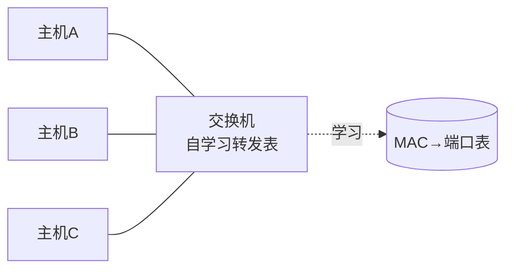

# 数据链路层

网络层关心「从哪台主机到哪台主机」，而数据链路层关心「这段线缆上，相邻的两个节点怎么把一串比特变成可信的帧」。本篇从帧开始，一路到交换机如何自动学会转发。

## 学习目标

学完本章，你应该能够：

- 解释数据链路层的三大职责：成帧、差错检测、介质访问控制。
- 说清 CRC 为何能检错（以及它不纠错），并与校验和区分。
- 描述 48 位 MAC 地址与以太网帧结构，理解 MAC（平面）与 IP（层次）的分工。
- 讲清交换机自学习建立转发表的过程，以及它分割冲突域但不分割广播域。

## 前置知识

- 分层与 TCP/IP 总览：[网络分层与 TCP/IP](../网络分层与TCP与IP)
- 上层如何使用地址：[网络层与路由](../网络层与路由)

## 核心概念

数据链路层把不可靠的物理比特流，封装成「有明确边界、可检错」的**帧**，并在共享介质上决定「谁此刻能发」。它只在**相邻两节点**之间工作——跨网络的寻址交给网络层，端到端可靠交给传输层。

本章主线：
- 先看成帧：比特流如何切成一帧帧
- 再看差错检测：CRC 如何抓传输误码
- 然后落到以太网与 MAC 地址
- 最后看交换机如何用自学习把帧准确送达

## 1. 成帧与差错检测

**成帧**是把比特流切出帧边界，常见办法有首尾定界符、位填充等。**差错检测**则是给帧附加校验信息：

| 机制 | 能力 | 典型用途 |
| :--- | :--- | :--- |
| 奇偶校验 | 检 1 位错 | 简单串行 |
| 校验和 | 检相邻多位错 | TCP/UDP、IP 头部 |
| **CRC（循环冗余）** | 强检多位突发错 | 以太网、磁盘 |

CRC 把数据当作多项式，除以一个约定的生成多项式，余数作为帧检验序列（FCS）附加在帧尾；接收方用同样除法，余数非零即判定出错。**注意：CRC 只检错不纠错**，出错通常靠重传。

## 2. MAC 地址与以太网

MAC 地址是烧在网卡上的 48 位**平面地址**（如 `3a:1b:2c:4d:5e:6f`），全球唯一、不分层。以太网帧结构：

```text
| 前导 | 目的MAC(6) | 源MAC(6) | 类型(2) | 数据(46-1500) | FCS(4) |
```

IP 地址负责「跨网络找到目标主机」，MAC 地址负责「在同一链路上把帧交给下一跳设备」——二者分工，靠 **ARP** 互译（IP → MAC）。

## 3. 交换机与自学习

交换机工作在数据链路层，端口收到帧时**自学习**：记下「源 MAC 来自哪个端口」，据此建立转发表；转发时查目的 MAC 所在端口，未知则洪泛。



- 交换机**分割冲突域**（每端口独立冲突域），但默认**不分割广播域**（广播帧仍洪泛到所有端口）。
- 要分割广播域需 **VLAN**（逻辑划分广播范围）。

## 示例

**CRC 直觉**（简化多项式 `G=1011`，即 x³+x+1）：
把数据 `1001` 左移 3 位得 `1001000`，除以 `1011`（模 2 除法，异或即减）：余数 `010` 作 FCS。接收方用 `1001010`（数据+FCS）再除以 `1011`，余 0 即通过。一位翻转会让余数非零 ⇒ 检出错误。

**交换机自学习**：主机 A（`MAC-A`）从端口 1 发帧给 B，交换机记 `MAC-A → 端口1`；若 B 的端口未知则洪泛，B 回复时交换机又记 `MAC-B → 端口3`，此后 A→B 的帧精准从端口 3 出，不再打扰 C。

## 小结

数据链路层在相邻节点间把比特流变成「有边界、可检错」的帧：CRC 抓传输误码，MAC 地址标识链路上的设备，交换机用自学习把帧精准送达而不必每帧广播。它向上承接 [网络层与路由](/docs/计算机科学基础/计算机网络/网络层与路由) 的 IP 寻址（靠 ARP 把 IP 翻译成 MAC），向下依赖 [网络分层与 TCP/IP](/docs/计算机科学基础/计算机网络/网络分层与TCP与IP) 的总览框架——是「主机到主机」之前最关键的一段「节点到节点」。

## 易错点

- **MAC 与 IP 分工不同**：MAC 是平面、链路局部、用于下一跳；IP 是层次、端到端、用于跨网寻址。说「MAC 用于上网定位」是混淆二者。
- **交换机不分割广播域**：它只分割冲突域；想限制广播范围要用 VLAN 或路由器。
- **CRC 不纠错**：检出错误后靠上层重传恢复，本身不能「修好」数据。
- **ARP 是广播、有安全风险**：ARP 欺骗可劫持链路流量，这正是 [HTTP 与网络安全](/docs/计算机科学基础/计算机网络/HTTP与网络安全) 中链路层攻击的入口。

## 练习

1. 为什么 CRC 比简单奇偶校验更适合以太网？它在「检错」与「纠错」上的能力边界是什么？
2. 一台 24 口交换机会产生多少个冲突域、多少个广播域？若想把它拆成 3 个广播域该怎么做？
3. 主机 A 要给跨网段的主机 B 发数据，链路层的目的 MAC 填 A 的下一跳路由器还是 B？为什么？

## 延伸阅读

- 下一篇：[网络层与路由](../网络层与路由)
- 总览：[网络分层与 TCP/IP](../网络分层与TCP与IP)
- 安全收尾：[HTTP 与网络安全](../HTTP与网络安全)
- 跨分支关联：[总线](../../组成原理/总线)（设备间物理通路的另一视角）

### 外部权威资料
- 《计算机网络：自顶向下方法》（Kurose & Ross）第 5 章——链路层、ARP、以太网与交换机自学习的标准讲法。
- 《TCP/IP 详解 卷 1》（Stevens）第 2–4 章——以太网帧、ARP、CRC 的协议级细节。
- IEEE 802.3（以太网）与 IEEE 802.1Q（VLAN）规范——MAC 帧格式与广播域划分的权威来源。
