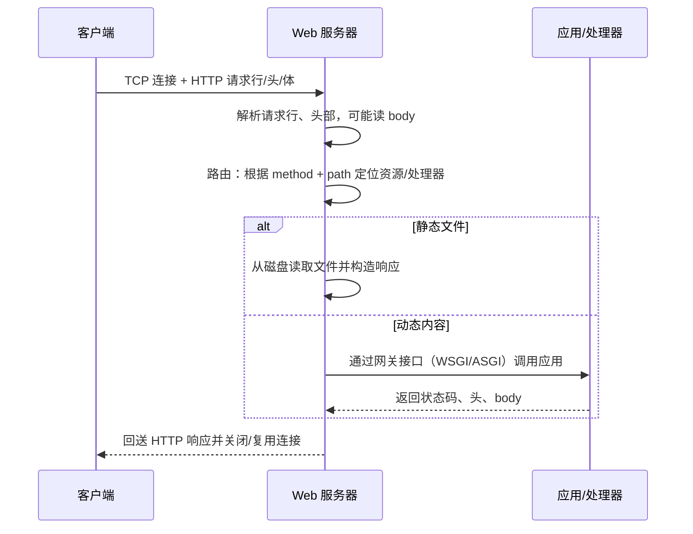

## 学习目标

学完本章，你应该能够：

- 说清楚一个 HTTP 请求从网卡到应用代码再回到客户端经历了哪几步
- 对比 prefork、多线程、事件驱动三种并发模型的取舍
- 区分「静态资源服务」与「动态内容生成」，理解 WSGI / ASGI 这类网关接口存在的意义
- 理解反向代理与负载均衡要解决什么问题，为后续学习 Nginx 打基础

## 前置知识

在阅读下面的内容前，建议先掌握：

- 协议基础：[HTTP 与网络安全](../../../计算机科学基础/计算机网络/HTTP与网络安全)
- 命令行操作：[Terminal](../../../软件工程/开发工具链/Terminal)

## 核心概念

Web 服务器的本质是一段「**监听 TCP 端口、按 HTTP 协议读懂请求、找到对应资源或交给应用、再按 HTTP 协议回送响应**」的程序。它把操作系统提供的裸 socket 抽象成「一次 GET /index.html 应该返回什么」这样的语义，让上层开发者不必关心字节流怎么切分、连接怎么复用。理解这条主线，再看 Nginx、Apache、各种应用服务器（uWSGI、Gunicorn）就都是在同一个链条上做不同的取舍。

本章主线：
- 请求处理生命周期：连接 → 解析 → 路由 → 响应
- 并发模型：prefork / 多线程 / 事件驱动
- 静态内容 vs 动态内容
- 网关接口：CGI → WSGI → ASGI
- 反向代理与负载均衡的前置概念

## 请求处理生命周期

一个典型的请求在服务器内部大致走完以下步骤：



其中「路由」是关键分水岭：静态服务器直接把 path 映射到文件路径；动态服务器则把 path 交给一段代码（处理函数、控制器）去生成内容。

## 并发模型

Web 服务器在高并发下的表现，取决于它怎么处理「同时有很多连接」这件事。三种主流模型：

| 模型 | 代表 | 思路 | 优点 | 缺点 |
| :--- | :--- | :--- | :--- | :--- |
| prefork（多进程） | Apache prefork | 预先 fork 多个 worker 进程，每进程处理一个连接 | 隔离好，一个崩了不影响其他；模型简单 | 内存占用高，进程切换开销大 |
| 多线程 | Tomcat 默认、旧版 Apache worker | 每连接一个线程，线程比进程轻 | 内存比多进程省，共享内存方便 | 线程数爆炸时上下文切换贵；受限于 GIL（Python 线程） |
| 事件驱动（异步非阻塞） | Nginx、Node.js | 少量 worker + 事件循环（epoll/kqueue），单线程应付海量连接 | 内存极低、并发极高 | 单核瓶颈；长耗时同步操作会阻塞整个循环 |

:::tip 为什么 Nginx 能用几个进程扛上万连接
传统「一连接一线程/进程」模型里，10 万连接就要 10 万个执行单元，内存与调度都扛不住。事件驱动模型用「一个 worker 盯一堆连接，谁就绪就处理谁」的方式，把连接数从执行单元数里解耦出来——连接再多，只要大多时间在等网络，少量 worker 就够转。代价是应用逻辑必须是非阻塞的，否则一个慢请求会卡住整个循环。
:::

## 静态内容 vs 动态内容

- **静态内容**：文件本身就是要返回的内容（HTML、图片、JS、CSS）。服务器只要找到文件、设置正确的 `Content-Type` 和缓存头，直接发回去即可，几乎不消耗 CPU。
- **动态内容**：内容需要现算。比如「根据当前用户 ID 查数据库再拼出页面」。这时服务器不能自己生成，而是把请求交给应用代码，再由网关接口拿回结果。

绝大多数生产架构是「**反向代理（如 Nginx）负责静态资源与转发，后端应用服务器负责动态内容**」的组合：静态请求在边缘就被拦下，只有真正需要计算的请求才打到应用。

## 网关接口：从 CGI 到 ASGI

动态内容需要一套「服务器如何调用应用、应用如何回传响应」的约定，这就是网关接口：

- **CGI**：每来一个请求 fork 一个进程、跑完即销毁，简单但极慢，早已淘汰。
- **WSGI**（Python）：服务器把 `environ` 字典和 `start_response` 回调交给应用，应用返回可迭代的 body。它是同步模型，一个请求占用一个 worker 直到完成。
- **ASGI**（Python）：在 WSGI 之上增加了对异步（`async/await`）和 WebSocket 的支持，配合 `uvicorn`/`hypercorn` 这类事件循环服务器，能用少量 worker 处理大量并发连接。

:::info 为什么需要网关接口
没有它，应用代码就得自己解析 socket 字节流、自己管连接生命周期，换个服务器就要重写一遍。网关接口把「传输」和「业务逻辑」解耦：同一份 Flask/FastAPI 代码，既能在 `gunicorn` 下跑，也能在 `uvicorn` 下跑。
:::

## 反向代理与负载均衡（前置）

前面提到「反向代理负责转发」，这里先建立直觉，细节在 [Nginx](../Nginx) 一章展开：

- **正向代理**是客户端的代言人（客户端知道要连代理）；**反向代理**是服务端的代言人（客户端以为连的就是那个服务器，实际后面可能是一堆应用）。
- 反向代理的价值：统一入口、TLS  termination（只在这层做加解密）、静态资源卸载、把请求按策略分发给多台后端（即负载均衡）、做限流与缓存。

## 示例

下面两个最小例子用于建立直觉。第一个用 Python 标准库起一个静态文件服务器，第二个用裸 socket 手工解析一次 HTTP 请求，帮助你看清「解析」到底做了什么。

```python title="最小静态服务器（标准库）"
# 在任意目录运行：python -m http.server 8000
# 然后浏览器访问 http://127.0.0.1:8000/ 即可看到目录列表与文件
from http.server import SimpleHTTPRequestHandler, ThreadingHTTPServer

if __name__ == "__main__":
    # ThreadingHTTPServer 是多线程模型：每连接一个线程
    with ThreadingHTTPServer(("127.0.0.1", 8000), SimpleHTTPRequestHandler) as httpd:
        print("serving on 8000")
        httpd.serve_forever()
```

```python title="手工解析一次 HTTP 请求（教学用，不用于生产）"
import socket

def handle(conn: socket.socket) -> None:
    data = conn.recv(1024).decode("utf-8", "replace")
    # HTTP 请求行形如： GET /hello HTTP/1.1
    first_line = data.splitlines()[0]
    method, path, _version = first_line.split(" ", 2)
    print("method =", method, "path =", path)

    body = b"Hello from a hand-rolled server"
    resp = (
        "HTTP/1.1 200 OK\r\n"
        "Content-Type: text/plain\r\n"
        f"Content-Length: {len(body)}\r\n"
        "Connection: close\r\n"
        "\r\n"
    ).encode("utf-8") + body
    conn.sendall(resp)

with socket.socket(socket.AF_INET, socket.SOCK_STREAM) as s:
    s.setsockopt(socket.SOL_SOCKET, socket.SO_REUSEADDR, 1)
    s.bind(("127.0.0.1", 9000))
    s.listen(1)
    conn, _addr = s.accept()
    with conn:
        handle(conn)
```

这段代码手动拼出了 `HTTP/1.1 200 OK`、头部和空行分隔的 body——真实服务器做的正是这件事，只是还要处理Keep-Alive、分块传输、管线化、错误状态码等大量细节。

## 小结

Web 服务器 = 「监听端口 + 解析 HTTP + 路由 + 回响应」的程序。并发模型决定了它能扛多少连接；静态/动态之分决定了请求是自己读文件还是交给应用；网关接口（WSGI/ASGI）定义了服务器与应用之间的契约；反向代理与负载均衡则是把单台服务器扩展成服务集群的关键一环。

## 易错点

- 把「反向代理」和「正向代理」搞反：记住反向代理是服务端侧的，客户端无感知。
- 以为事件驱动模型「单线程」就等于慢：它慢在「同步阻塞操作」，而非并发能力本身；一旦在事件循环里写阻塞代码，整池连接都会被拖住。
- 在应用里自己解析 socket 字节流：生产环境应交给成熟服务器/网关，手工解析极易在处理分块、长连接、边界时出 bug。
- 忽略 `Content-Length` / `Transfer-Encoding`：响应头缺失会让客户端不知道 body 何时结束，表现为连接挂起或内容被截断。
- 把静态资源也打到应用服务器：静态请求应在边缘（Nginx）就被拦截，否则白白占用昂贵的动态计算资源。

## 练习

1. 用 `python -m http.server` 起一个静态服务器，分别用浏览器和 `curl -i` 看响应头，说明 `Content-Type` 与 `Content-Length` 是怎么来的。
2. 上文的裸 socket 例子只处理了一次请求且未循环 `accept`，请改造它：让服务器持续 `accept` 并为每个连接起一个线程处理，体会「多线程模型」的写法。
3. 为什么说 WSGI 是「同步」的？如果你的应用里有 `await` 异步操作，用 WSGI 服务器（如 gunicorn 的 sync worker）会发生什么？应该换成哪种服务器/接口？

## 延伸阅读

- 上一篇：[网页自动化](../网页自动化)
- 下一篇：[认证授权](../认证授权)
- 具体落地：[Nginx](../Nginx)（反向代理、负载均衡、静态资源服务）
- 返回 [后端通识总览](../)
- 相关领域：[工程实践](../../工程实践/)
- 跨主题关联：[HTTP 与网络安全](../../../计算机科学基础/计算机网络/HTTP与网络安全)（请求/响应结构、状态码、Keep-Alive 与 TLS 的协议依据）
