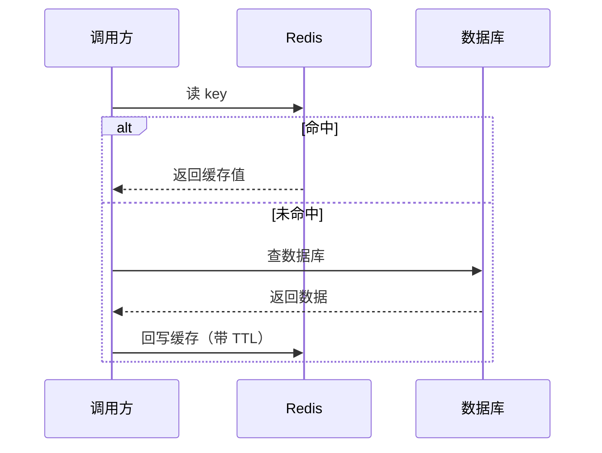

## 学习目标

学完本章，你应该能够：

- 说清楚缓存解决的是「读多写少、热点集中」场景下的延迟与数据库压力问题
- 对比 Cache-Aside、Read-Through、Write-Through、Write-Behind 等读写模式
- 用 Redis 的字符串、哈希、有序集合等结构支撑计数、排行榜、限流等典型需求
- 识别并应对缓存穿透、击穿、雪崩，理解缓存与数据库一致性的难点

## 前置知识

在阅读下面的内容前，建议先掌握：

- 数据存储：[数据库](../数据库)
- 接口基础：[接口开发](../接口开发)
- 服务基础：[Web 服务器原理](../Web服务器原理)

## 核心概念

缓存的核心动机只有一句话：**把「慢且贵的存储」（通常是数据库）的结果，临时放在「快且便宜的存储」（内存）里，下次直接取**。它天然契合「二八定律」——少数热点数据被反复访问，把它们放进内存能把整体延迟压低一个数量级，同时替数据库挡掉绝大部分读流量。

但要警惕：引入缓存就引入了「两份数据」，随之而来的是一致性、失效、击穿等一系列新问题。缓存不是银弹，而是用复杂度换性能的典型权衡。

本章主线：
- 为什么需要缓存
- Redis 数据结构速览
- 缓存读写模式（Cache-Aside 为主）
- 过期、淘汰与三大坑
- 与数据库的一致性

## 为什么需要缓存

典型收益场景：

- **降延迟**：内存访问是微秒级，数据库磁盘/网络是毫秒级，差上千倍。
- **抗热点**：某条爆款商品/热门帖子被海量并发读，缓存挡在前面，数据库不会被打挂。
- **护数据库**：把重复计算（聚合、排序）的结果缓存起来，减少昂贵查询。

:::warning 缓存不适用的场景
写多读少、数据强一致要求极高（如账户余额实时扣减）、数据量远超内存成本——这些场景上缓存反而增加复杂度和不一致风险。
:::

## Redis 数据结构速览

Redis 不止是「key-value 字符串库」，它提供多种结构，选对结构能少写很多代码：

| 结构 | 典型用途 | 例子 |
| :--- | :--- | :--- |
| String | 计数器、简单缓存、分布式锁 | 文章阅读量 `INCR` |
| Hash | 对象字段缓存 | 用户信息 `HSET user:1 name age` |
| List | 队列、最新列表 | 最新 10 条评论 |
| Set | 去重、标签、共同好友 | 点赞用户集合 |
| Sorted Set（ZSet） | 排行榜、延迟队列 | 积分榜 `ZADD` / `ZRANGE` |
| Bitmap / HyperLogLog | 签到、UV 估算 | 日活去重计数 |

## 缓存读写模式

最常用的是 **Cache-Aside（旁路缓存）**：



其他模式：
- **Read-Through**：缓存层自己负责未命中时回源，调用方无感知。
- **Write-Through**：写时同时写缓存和数据库，读一致性好但写路径变重。
- **Write-Behind**：先写缓存，异步批量刷盘，写性能极高但丢数据风险大。

:::tip Cache-Aside 的写策略
Cache-Aside 下写操作通常「先更新数据库，再删除缓存（而不是更新缓存）」。删缓存让下次读自动回填最新值；若先更新缓存再更数据库，两者间若失败会留下脏缓存。删除也比更新简单——避免并发写导致的缓存旧值覆盖。
:::

## 过期、淘汰与三大坑

**过期（TTL）** 防止缓存无限膨胀；**淘汰策略**（如 `allkeys-lru`）在内存满时决定踢掉谁。即便如此，仍有三类经典事故：

| 坑 | 现象 | 解法 |
| :--- | :--- | :--- |
| 穿透 | 查不存在的 key，缓存与数据库都没有，请求每次都打到库 | 缓存空值（短 TTL）、布隆过滤器前置拦截 |
| 击穿 | 某个热点 key 失效瞬间，海量并发同时回源 | 互斥锁/单飞（singleflight）只放一个回源、其余等待 |
| 雪崩 | 大量 key 同一时刻过期或 Redis 宕机，数据库被冲垮 | 过期时间加随机抖动、多级缓存、Redis 高可用（哨兵/集群） |

## 与数据库的一致性

缓存与数据库「最终一致」是常态，强一致极难且昂贵。常见取舍：

- 接受短暂不一致（如缓存 60 秒），多数读场景够用；
- 写路径用「先更库、再删缓存 + 重试/订阅 binlog（如 Canal）补偿」降低窗口；
- 对一致性要求高的字段，直接读库或加版本号校验。

:::warning 不要迷信「先删缓存再更库」
两步之间若有读请求，可能把旧值重新写回缓存（读写并发导致的脏数据）。实际多用「先更库、再删缓存」，并配合延迟双删或 binlog 订阅兜底。
:::

## 示例

下面用 `redis-py` 演示 Cache-Aside 读路径，以及一个用 ZSet 做的实时排行榜。

```python title="Cache-Aside 读路径（redis-py）"
import json
import redis

r = redis.Redis(host="127.0.0.1", port=6379, decode_responses=True)

def get_user(user_id: int) -> dict:
    key = f"user:{user_id}"
    cached = r.get(key)
    if cached is not None:
        return json.loads(cached)          # 命中：直接返回

    row = db_query_user(user_id)            # 未命中：回源数据库
    if row is not None:
        # 写回缓存，带随机 TTL 防止集体过期（雪崩）
        r.set(key, json.dumps(row), ex=300 + random.randint(0, 60))
    return row

def update_user(user_id: int, **fields) -> None:
    db_update_user(user_id, **fields)       # 1) 先更新数据库
    r.delete(f"user:{user_id}")             # 2) 再删除缓存，下次读自动回填
```

```python title="用 ZSet 做积分排行榜"
# 加分
r.zadd("leaderboard", {"alice": 120, "bob": 95})
# 取前 3 名（分数从高到低）
top3 = r.zrevrange("leaderboard", 0, 2, withscores=True)
print(top3)   # [('alice', 120.0), ('bob', 95.0)]
# 查询某人排名（从 0 开始）
rank = r.zrevrank("leaderboard", "alice")
```

## 小结

缓存用「内存换性能」，专治读多写少与热点。Cache-Aside 是默认首选：读未命中回源并回填、写时先更库再删缓存。Redis 的多种数据结构让它既能做简单 KV，也能做计数、排行榜、限流。代价是引入了过期、淘汰与三大坑（穿透/击穿/雪崩），以及缓存与数据库的一致性权衡——这些复杂度必须正视，否则缓存反而成为事故源。

## 易错点

- 把缓存当「第二数据库」永久存：必须设 TTL，否则内存无限增长且数据永远不更新。
- 缓存与数据库双写顺序搞错：优先「先更库、再删缓存」，避免脏缓存长期留存。
- 热点 key 集中过期引发雪崩：TTL 加随机抖动、做多级缓存、Redis 上高可用。
- 缓存穿透不打防护：对「查不到」的 key 也缓存短时空值或前置布隆过滤器。
- 误把需要强一致的数据放进缓存：账户余额这类应直接读库或加校验，不能靠缓存兜底。

## 练习

1. 用 `redis-py` 写一个带「互斥锁回源」的读函数，确保热点 key 失效时只有一个请求去查库，其余等待结果（防止击穿）。
2. 上面 `update_user` 如果在「删缓存」之前进程崩溃，会留下什么状态？这种窗口下读请求会拿到旧值还是新值？
3. 如何用 Redis 的 `SETNX`（或 `SET key val NX`）实现一个简单的分布式锁？它有什么局限（如无法自动续期、主从切换丢锁）？

## 延伸阅读

- 上一篇：[数据库](../数据库)
- 同系列：[消息队列](../消息队列)
- 服务基础：[Web 服务器原理](../Web服务器原理)
- 返回 [后端通识总览](../)
- 相关领域：[工程实践](../../工程实践/)
- 跨主题关联：[数据库](../数据库)（缓存与关系型存储的分工）、[HTTP 与网络安全](../../../计算机科学基础/计算机网络/HTTP与网络安全)（CDN 本质上也是缓存）
