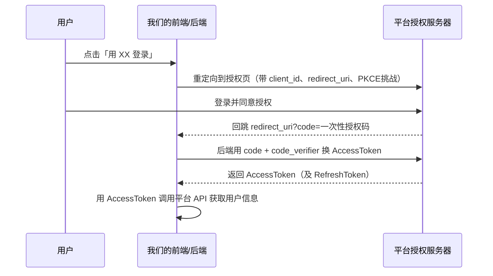

## 学习目标

学完本章，你应该能够：

- 区分「认证（Authentication）」和「授权（Authorization）」
- 讲清楚基于会话（Session/Cookie）与基于令牌（Token）两套体系的差异
- 拆解 JWT 的三段结构，理解签名为什么能防篡改、又为什么不能存敏感信息
- 理解 OAuth2 授权码模式（含 PKCE）解决了什么问题，以及令牌该如何安全存储与撤销

## 前置知识

在阅读下面的内容前，建议先掌握：

- 接口基础：[接口开发](../接口开发)
- 协议与安全：[HTTP 与网络安全](../../../计算机科学基础/计算机网络/HTTP与网络安全)
- 数据存储：[数据库](../数据库)

## 核心概念

**认证（AuthN）回答「你是谁」**，例如用户名+密码、手机验证码、指纹；**授权（AuthZ）回答「你能做什么」**，例如这个用户能不能删别人的文章、能不能访问后台。先认证出身份，再依据身份做授权——顺序不能乱。现实中常把两者混着叫「鉴权」，但系统设计时必须拆开：一个合法的登录态（已认证）不代表它拥有某个资源的访问权（已授权）。

本章主线：
- 认证 vs 授权
- 基于会话 vs 基于令牌
- JWT 解剖与签名验证
- 刷新令牌与撤销
- OAuth2 授权模式
- 常见攻击面

## 认证与授权

举个生活化的例子：`AuthN` 像门禁刷卡确认你是员工；`AuthZ` 像你的工牌权限——即便你是员工，也不一定能进机房。在 HTTP 层，认证信息通常放在 `Authorization` 头，授权结果则体现在后端对该请求「放行还是 403」。

## 基于会话 vs 基于令牌

| 维度 | 基于会话（Session/Cookie） | 基于令牌（Token/JWT） |
| :--- | :--- | :--- |
| 状态存放 | 服务端保存 session（内存/Redis），客户端只持 `session_id` | 令牌本身自包含声明，服务端可不存状态（无状态） |
| 跨域/多端 | 依赖 Cookie，移动端、第三方服务不友好 | 令牌可随请求头走，适合 SPA、移动端、微服务 |
| 撤销难度 | 删掉服务端 session 即可立即失效 | 无状态令牌在过期前难即时撤销，需配合黑名单/短时效 |
| 扩展性 | 多实例需共享 session 存储 | 天然适合水平扩展 |

:::tip 选哪个
单体、同源 Web 应用用 Session+Cookie 足够且易撤销；跨域 SPA、移动端、微服务之间互相调用，更适合令牌体系。很多系统两者结合：用令牌换短期 session，或 JWT 短期有效 + 服务端可查的撤销列表。
:::

## JWT 解剖

JWT（JSON Web Token）由三段 base64url 字符串用 `.` 连接：`header.payload.signature`。

- **header**：声明签名算法，如 `{"alg":"HS256","typ":"JWT"}`。
- **payload**：业务声明，如 `{"sub":"uid-123","exp":1700000000,"role":"admin"}`。注意 `exp` 是过期时间戳。
- **signature**：对「前两段 base64url 拼接」用密钥（对称 HS256）或私钥（非对称 RS256/ES256）签名。

服务器验证时，用同样算法重新算一遍签名并比对；不一致就说明被篡改。因为 payload 只是 base64 编码、**不是加密**，任何人都能解码看到内容，所以绝不能往里放密码、身份证号等敏感数据。

```python title="用 PyJWT 签发与校验（HS256 示例）"
import jwt
from datetime import datetime, timedelta, timezone

SECRET = "请换成环境变量里的随机密钥"  # 生产绝不能硬编码

def issue_token(uid: str, role: str) -> str:
    now = datetime.now(timezone.utc)
    payload = {
        "sub": uid,
        "role": role,
        "iat": int(now.timestamp()),                       # 签发时间
        "exp": int((now + timedelta(minutes=15)).timestamp()),  # 15 分钟过期
    }
    return jwt.encode(payload, SECRET, algorithm="HS256")

def verify_token(token: str) -> dict:
    # 签名不对 / 过期都会抛异常，调用方据此拒绝请求
    return jwt.decode(token, SECRET, algorithms=["HS256"])

# 签发后把 token 发给客户端；客户端之后每次请求带在 Authorization: Bearer <token>
```

:::warning 关于算法与密钥
- HS256 用同一把密钥签名和验签，密钥一旦泄露任何人都能伪造令牌——务必用足够随机的密钥且只存服务端。
- RS256/ES256 用私钥签名、公钥验签，更适合把验签能力开放给多个服务而不暴露私钥。
- 必须显式指定 `algorithms=["HS256"]`，否则历史上出现过「攻击者把 alg 改成 none 绕过签名」的漏洞。
:::

## 刷新令牌与撤销

AccessToken 为了安全通常很短（几分钟到几十分钟），过期后用 **RefreshToken** 换新的 AccessToken，避免频繁重新登录。RefreshToken 长期有效，因此必须：

- 存服务端可查（数据库/Redis），支持主动吊销（用户登出、改密码、发现盗用）；
- 绑定设备/IP 或至少绑定用户，挂失时精准作废；
- 走 `HttpOnly` + `Secure` + `SameSite` 的 Cookie 而非前端 localStorage，降低 XSS 盗走的风险。

## OAuth2 授权模式

OAuth2 解决的是「**第三方应用如何在用户授权下访问用户在某平台的资源，而不拿到用户密码**」。常见模式：

| 模式 | 适用场景 | 要点 |
| :--- | :--- | :--- |
| 授权码（Authorization Code） | 有后端的 Web 应用 | 先拿一次性 code，再经后端换 token，code 不暴露给浏览器 |
| 授权码 + PKCE | 公开客户端（SPA、移动端） | 无 client_secret，用 code_verifier 防截获 |
| 客户端凭证（Client Credentials） | 服务到服务 | 没有用户，直接用应用身份拿 token |
| 密码模式（Resource Owner Password） | 高度可信的一方可信应用 | 已不推荐，等于把密码交给第三方 |



:::tip 为什么公开客户端要用 PKCE
SPA/移动端无法安全保存 `client_secret`（会被反编译/抓包拿到），PKCE 让每次授权都带一个一次性的 `code_verifier`，即使授权码被中间人截获，没有 `code_verifier` 也换不到令牌。
:::

## 常见攻击面

- **XSS 盗令牌**：令牌存 `localStorage` 时，页面任意脚本都能读走；优先 `HttpOnly` Cookie。
- **CSRF**：浏览器自动带 Cookie 的机制被利用，让用户在已登录态下执行非本意请求；用 `SameSite` Cookie、CSRF Token 防御。
- **令牌泄露**：日志里打印 `Authorization` 头、前端把 token 拼进 URL（会出现在 referer/日志）都会泄露。
- **弱密钥/算法降级**：JWT 用弱密钥或允许 `none` 算法，等于门户洞开。

## 示例

一个最小「用 RefreshToken 换新的 AccessToken」的服务端逻辑骨架：

```python title="刷新令牌（伪代码，示意流程）"
def refresh(refresh_token: str) -> str:
    record = db.refresh_tokens.find(refresh_token)
    if record is None:
        raise Forbidden("令牌不存在或已吊销")
    if record.revoked:
        raise Forbidden("令牌已被吊销")
    if record.expires_at < now():
        raise Forbidden("刷新令牌已过期，请重新登录")
    # 可选：校验绑定设备/IP 是否一致
    return issue_token(record.user_id, record.role)  # 签发新的短期 AccessToken
```

这里的关键不在「怎么签发」，而在「RefreshToken 在服务端有记录、可吊销」——这才是无状态 JWT 缺失的那块拼图。

## 小结

认证解决身份、授权解决权限，二者必须先 AuthN 后 AuthZ。Session 适合同源单体、易撤销；Token 适合跨域与微服务、需配合短时效与撤销机制。JWT 用签名保证不可篡改但 payload 不加密，敏感信息别往里放；OAuth2 授权码+PKCE 是公开客户端的安全基线。无论如何，令牌的存储与传输安全（HttpOnly、HTTPS、不进日志）比算法本身更常被攻破。

## 易错点

- 把「认证」和「授权」当成一回事：拿到登录态不等于拥有某项操作权限，后端每一处敏感操作都要再查权限。
- JWT 当加密用：payload 只是 base64，任何人可解码；密码、令牌本身绝不能塞进去。
- AccessToken 设很长有效期「图省事」：一旦泄露窗口期极长，应短时效 + RefreshToken 可吊销。
- RefreshToken 不落库、不可吊销：用户改密码后旧令牌仍能换票，等于没登出。
- 令牌进 URL 或写进日志：会经由 referer、代理日志永久泄露，应只走 `Authorization` 头 + `HttpOnly` Cookie。

## 练习

1. 用 PyJWT 签发一个 5 秒过期的 token，分别在其过期前和过期后调用 `jwt.decode`，观察抛出的异常类型，说明为什么短时效能降低泄露风险。
2. 为什么 PKCE 对移动端/SPA 是必须的？如果这类客户端仍用「授权码 + 静态 client_secret」会暴露什么？
3. 设计一个「用户改密码后立刻让所有旧登录态失效」的方案，需要考虑 AccessToken 和 RefreshToken 分别怎么处理？

## 延伸阅读

- 上一篇：[Web 服务器原理](../Web服务器原理)
- 下一篇：[Nginx](../Nginx)
- 接口落地：[接口开发](../接口开发)
- 返回 [后端通识总览](../)
- 相关领域：[工程实践](../../工程实践/)
- 跨主题关联：[HTTP 与网络安全](../../../计算机科学基础/计算机网络/HTTP与网络安全)（Cookie/SameSite、HTTPS/TLS、CORS 与攻击面）
