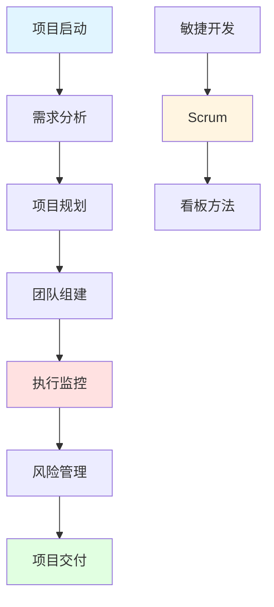

import DocCardList from '@theme/DocCardList';

# 项目管理 - 从技术到管理

随着开发经验的不断积累，程序员通常会面临两种主要的职业发展方向：

**1. 继续深耕技术方向**：  
- 拓宽知识面，成为全栈开发工程师
- 深入底层技术，成为某一领域的专家
- 向上抽象，成长为系统架构师
- 借助 AI 工具，提升效率，成为"超级个体"

**2. 转型项目管理或领导岗位**：  
- 成为兼具技术与管理能力的研发经理
- 专职担任项目经理（PM）
- 选择创业，担任 CTO 或 CEO，带领团队开拓业务

本章节内容讲述如何成为一名合格的项目经理和技术管理者。

## 项目管理知识体系



## 核心内容

### 项目管理基础

#### 项目生命周期
- **启动阶段**：项目立项、可行性分析
- **规划阶段**：需求分析、资源规划、进度安排
- **执行阶段**：任务分配、进度跟踪、质量控制
- **监控阶段**：风险管理、变更管理、沟通协调
- **收尾阶段**：项目验收、经验总结、文档归档

#### 项目管理三角形
```
        范围
       /    \
      /      \
     /        \
   时间 ------ 成本
   
平衡三者关系：
- 范围增加 → 时间/成本增加
- 时间压缩 → 成本增加/范围减少
- 成本降低 → 时间延长/范围减少
```

### 需求管理

#### 需求收集
- **用户访谈**：深入了解用户需求
- **问卷调查**：大规模需求收集
- **竞品分析**：学习行业最佳实践
- **头脑风暴**：团队创新思维
- **原型设计**：可视化需求

#### 需求分析
- **功能需求**：系统应该做什么
- **非功能需求**：性能、安全、可用性
- **业务需求**：商业目标和价值
- **用户需求**：用户体验和期望

#### 需求优先级
```
MoSCoW方法：
- Must have（必须有）：核心功能
- Should have（应该有）：重要但非必需
- Could have（可以有）：锦上添花
- Won't have（不会有）：明确排除
```

### 项目规划

#### WBS（工作分解结构）
```
项目：电商网站开发
├── 前端开发
│   ├── 首页
│   ├── 商品列表
│   ├── 购物车
│   └── 订单管理
├── 后端开发
│   ├── 用户服务
│   ├── 商品服务
│   ├── 订单服务
│   └── 支付服务
├── 测试
│   ├── 单元测试
│   ├── 集成测试
│   └── 性能测试
└── 部署上线
    ├── 环境配置
    ├── 数据迁移
    └── 监控告警
```

#### 甘特图
```
任务          周1  周2  周3  周4  周5
需求分析      ████
UI设计            ████
前端开发              ████████
后端开发          ████████████
测试                      ████████
部署                          ████
```

#### 里程碑
- **M1**：需求评审完成（第1周）
- **M2**：设计评审完成（第2周）
- **M3**：开发完成（第4周）
- **M4**：测试完成（第5周）
- **M5**：上线发布（第6周）

### 团队管理

#### 团队组建
- **技能互补**：前端、后端、测试、运维
- **经验搭配**：资深+中级+初级
- **角色明确**：技术负责人、开发、测试、产品
- **规模适中**：5-9人最佳（两个披萨原则）

#### 团队协作
- **每日站会**：15分钟同步进度
- **代码评审**：保证代码质量
- **结对编程**：知识共享、减少bug
- **技术分享**：提升团队能力

#### 激励机制
- **目标激励**：设定清晰的目标
- **成长激励**：提供学习机会
- **认可激励**：及时表扬和奖励
- **参与激励**：让团队参与决策

### 敏捷开发

#### Scrum框架
```
角色：
- Product Owner（产品负责人）
- Scrum Master（敏捷教练）
- Development Team（开发团队）

活动：
- Sprint Planning（迭代规划）
- Daily Standup（每日站会）
- Sprint Review（迭代评审）
- Sprint Retrospective（迭代回顾）

产物：
- Product Backlog（产品待办列表）
- Sprint Backlog（迭代待办列表）
- Increment（可交付增量）
```

#### 看板方法
```
待办 | 进行中 | 测试中 | 已完成
-----|--------|--------|--------
任务1 | 任务2  | 任务3  | 任务4
任务5 | 任务6  |        | 任务7
任务8 |        |        |

WIP限制：每列最多3个任务
```

#### 用户故事
```
格式：
作为<角色>，我想要<功能>，以便<价值>

示例：
作为用户，我想要搜索商品，以便快速找到想要的商品

验收标准：
- 支持关键词搜索
- 支持分类筛选
- 支持价格排序
- 响应时间<1秒
```

### 风险管理

#### 风险识别
- **技术风险**：技术难度、技术债务
- **进度风险**：需求变更、资源不足
- **质量风险**：测试不充分、bug过多
- **人员风险**：人员流失、技能不足
- **外部风险**：第三方依赖、政策变化

#### 风险评估
```
风险矩阵：

高 |  中风险  |  高风险
   |----------|----------
概 |          |
率 |  低风险  |  中风险
   |----------|----------
低 |    低    |    高
      影响程度
```

#### 风险应对
- **规避**：改变计划避免风险
- **转移**：外包、保险
- **减轻**：降低概率或影响
- **接受**：制定应急预案

### 项目监控

#### 关键指标
- **进度偏差**：实际进度 vs 计划进度
- **成本偏差**：实际成本 vs 预算成本
- **质量指标**：bug数量、测试覆盖率
- **团队效率**：速度、燃尽图

#### 燃尽图
```
剩余工作量
  ^
  |
100|●
  |  ●
  |    ●
 50|      ●
  |        ●
  |          ●
  0|____________●
    1  2  3  4  5  天数
    
理想线 vs 实际线
```

#### 状态报告
```
项目状态报告（周报）

项目名称：电商网站开发
报告日期：2024-02-08
项目经理：张三

一、本周完成
✅ 完成用户登录功能
✅ 完成商品列表页面
✅ 完成购物车功能

二、下周计划
📋 开发订单管理功能
📋 集成支付接口
📋 进行性能测试

三、风险和问题
⚠️ 支付接口对接延迟
⚠️ 前端人员请假

四、需要支持
🆘 需要产品确认订单流程
🆘 需要运维配置测试环境
```

### 沟通管理

#### 沟通计划
```
干系人      沟通内容      频率      方式
------      --------      ----      ----
客户        项目进展      每周      邮件
团队        任务分配      每天      站会
领导        风险问题      每周      会议
测试        需求澄清      随时      即时通讯
```

#### 会议管理
- **会前准备**：明确议题、准备材料
- **会中控制**：控制时间、聚焦主题
- **会后跟进**：会议纪要、行动项

#### 冲突解决
- **倾听**：理解各方观点
- **分析**：找出问题根源
- **协商**：寻求双赢方案
- **决策**：必要时做出决定

## 实用工具

### 项目管理工具

#### Jira
```
功能：
- 需求管理
- 任务跟踪
- 缺陷管理
- 敏捷看板
- 报表统计

适用场景：
- 大中型团队
- 敏捷开发
- 复杂项目
```

#### Trello
```
功能：
- 看板管理
- 任务卡片
- 团队协作
- 简单直观

适用场景：
- 小型团队
- 简单项目
- 个人任务管理
```

#### 禅道
```
功能：
- 项目管理
- 产品管理
- 测试管理
- 文档管理

适用场景：
- 国内团队
- 全流程管理
- 中文界面
```

### 协作工具

#### 文档协作
- **Confluence**：知识库、文档管理
- **语雀**：在线文档、团队协作
- **Notion**：笔记、数据库、项目管理

#### 即时通讯
- **Slack**：团队沟通、集成丰富
- **钉钉**：企业通讯、审批流程
- **飞书**：文档协作、视频会议

#### 代码协作
- **GitHub**：代码托管、PR、Issues
- **GitLab**：私有部署、CI/CD
- **Gitee**：国内代码托管

## 实战案例

### 案例1：电商网站项目

**项目背景**：
- 开发一个B2C电商网站
- 团队规模：8人
- 开发周期：3个月
- 预算：50万

**项目规划**：
```
第一阶段（1个月）：MVP版本
- 用户注册登录
- 商品浏览
- 购物车
- 订单管理

第二阶段（1个月）：功能完善
- 支付集成
- 物流跟踪
- 评价系统
- 优惠券

第三阶段（1个月）：优化上线
- 性能优化
- 安全加固
- 压力测试
- 正式上线
```

**风险管理**：
```
风险1：支付接口对接延迟
应对：提前联系支付公司，准备备选方案

风险2：性能不达标
应对：提前进行性能测试，预留优化时间

风险3：人员流失
应对：关键岗位双人配置，做好知识传递
```

### 案例2：敏捷开发实践

**Sprint规划**：
```
Sprint 1（2周）：
目标：完成用户模块
- 用户注册（3天）
- 用户登录（2天）
- 个人中心（3天）
- 测试（2天）

每日站会：
- 昨天完成了什么？
- 今天计划做什么？
- 遇到什么问题？

Sprint回顾：
- 做得好的：代码评审提高了质量
- 需要改进：测试时间不够充分
- 行动项：下个Sprint提前开始测试
```

### 案例3：远程团队管理

**挑战**：
- 团队分布在不同城市
- 时区差异
- 沟通成本高

**解决方案**：
```
1. 异步沟通
   - 使用文档记录决策
   - 减少实时会议
   - 明确响应时间

2. 工具支持
   - Slack：日常沟通
   - Zoom：视频会议
   - Notion：文档协作
   - GitHub：代码协作

3. 团队建设
   - 定期线上聚会
   - 虚拟咖啡时间
   - 年度线下团建
```

## 学习资源

### 书籍推荐
- 《人月神话》：软件工程经典
- 《敏捷软件开发》：敏捷方法论
- 《凤凰项目》：DevOps实践
- 《团队协作的五大障碍》：团队管理

### 认证考试
- **PMP**：项目管理专业人士
- **CSM**：认证Scrum Master
- **ACP**：敏捷认证从业者

### 在线课程
- **Coursera**：项目管理课程
- **极客时间**：技术管理课程
- **LinkedIn Learning**：领导力课程

## 职业发展

### 技能树

```
技术能力
├── 编程能力
├── 架构设计
├── 技术选型
└── 问题解决

管理能力
├── 项目规划
├── 团队管理
├── 风险管理
└── 沟通协调

领导力
├── 愿景规划
├── 决策能力
├── 激励团队
└── 变革管理
```

### 职业路径

```
技术路线：
初级工程师 → 中级工程师 → 高级工程师 → 架构师 → 技术专家

管理路线：
工程师 → Team Leader → 项目经理 → 研发经理 → 技术总监 → CTO

混合路线：
技术专家 + 管理能力 = 技术管理者
```

## 关键要点

### 项目成功的关键
1. **明确的目标**：清晰的项目目标和验收标准
2. **合理的计划**：现实可行的时间和资源规划
3. **有效的沟通**：及时透明的信息传递
4. **风险管理**：提前识别和应对风险
5. **团队协作**：高效的团队配合

### 常见失败原因
1. **需求不清**：频繁变更，范围蔓延
2. **计划不足**：时间估算不准确
3. **沟通不畅**：信息不对称，理解偏差
4. **资源不足**：人员、时间、预算不够
5. **质量问题**：测试不充分，技术债务

### 管理者的自我修养
1. **持续学习**：技术和管理都要学
2. **以身作则**：做团队的榜样
3. **授权信任**：给团队成长空间
4. **关注人**：技术问题背后是人的问题
5. **保持热情**：传递正能量

## 开始学习

<DocCardList />

记住：**好的项目管理不是控制，而是服务和赋能！**
